# 🌾🗺️ `web/` — Kansas Frontier Matrix Web Viewer  
**Explore Mode · Story Mode · Focus Mode · (Optional) 3D Story Mode**

<p align="left">
  
  
  
  
  
  
  
  
  
</p>

A browser-based **interactive map + timeline + evidence viewer** for the Kansas Frontier Matrix (KFM).  
This is where users **explore spatiotemporal layers**, **step through eras**, **open linked documents**, and **inspect provenance** — without breaking KFM’s governance pipeline. 🧭✨

> [!IMPORTANT]
> **KFM pipeline invariant (the UI is downstream):**  
> **ETL → Catalogs (STAC/DCAT/PROV) → Graph/Index → API (contracts + redaction) → UI → Story Nodes → Focus Mode**[^pipeline]  
> If the viewer ever “short-circuits” governance (e.g., raw bucket scraping, direct graph queries), it’s a regression. 🧱🚫

> [!TIP]
> **Rule of thumb:** *No story without evidence.*  
> Story Nodes + Focus Mode must be **citation-backed** and **bounded by cataloged sources** (no free-narration).[^gates][^focus-mode]

---

## ⚡ Quick links

| Action | Where |
|---|---|
| 🏠 Back to repo root | `../README.md` |
| 🤝 Collaboration rules | `../.github/README.md` |
| 🔐 Security policy | `../.github/SECURITY.md` *(add if missing)* |
| 📚 Canonical KFM docs | `../docs/specs/` |
| 📘 KFM master technical doc | `../docs/specs/Kansas Frontier Matrix (KFM) – Comprehensive Technical Documentation.docx` |
| 🌟 Future proposals / roadmap ideas | `../docs/specs/🌟 Kansas Frontier Matrix – Latest Ideas & Future Proposals.docx` |
| 🧭 v13 Markdown + workflow invariants | `../docs/specs/MARKDOWN_GUIDE_v13.md.gdoc` |
| 🎨 Static assets rules | `./assets/README.md` |
| 🗺️ Frontend data rules | `./data/README.md` |
| 🎬 Story Node packages (web) | `./story_nodes/` |
| 🧾 Report an issue | `https://github.com/bartytime4life/Kansas-Frontier-Matrix/issues/new/choose` |
| 🧪 CI runs | `https://github.com/bartytime4life/Kansas-Frontier-Matrix/actions` |

---

<details>
<summary><strong>🧭 Table of contents</strong></summary>

- [🎯 Goals](#-goals)
- [🚫 Non-goals](#-non-goals)
- [🧠 Where the UI fits in KFM](#-where-the-ui-fits-in-kfm)
- [🧰 Viewer modes](#-viewer-modes)
- [🚀 Quickstart](#-quickstart)
- [⚙️ Configuration](#️-configuration)
- [🗂️ Folder responsibilities](#️-folder-responsibilities)
- [🗺️ Data contracts & schemas](#️-data-contracts--schemas)
  - [1) Layer manifest (STAC-first, UI-view friendly)](#1-layer-manifest-stac-first-ui-view-friendly)
  - [2) Timeline config](#2-timeline-config)
  - [3) Document index](#3-document-index)
  - [4) Evidence bundle (Focus Mode friendly)](#4-evidence-bundle-focus-mode-friendly)
  - [5) Story Nodes (web package)](#5-story-nodes-web-package)
  - [Validation](#validation)
- [🧭 Cartography & visual integrity](#-cartography--visual-integrity)
- [🧊 3D Story Mode (Cesium + MapLibre hybrid)](#-3d-story-mode-cesium--maplibre-hybrid)
- [⚡ Performance budgets](#-performance-budgets)
- [♿ Accessibility](#-accessibility-non-negotiable)
- [🛡️ Security & privacy](#️-security--privacy)
- [🧪 Testing & validation](#-testing--validation)
- [🚢 Deployment](#-deployment)
- [✅ Roadmap](#-roadmap)
- [📚 Project file influence map](#-project-file-influence-map)
- [🔙 Back to root](#-back-to-root)
- [📎 Notes & citations](#-notes--citations)

</details>

---

## 🎯 Goals

What this viewer should feel like:

- 🗺️ **Exploration-first:** the map is primary; evidence is always one click away  
- ⏳ **Time-aware:** slider/stepping/playback drive what is visible (no “time is optional”)  
- 🔎 **Findable:** search places/themes/eras, jump-to results, sensible defaults  
- 🧾 **Traceable by default:** every layer shows provenance + license + “how derived” 
- 🎬 **Story-ready:** Story Nodes are step-based, map/time aware, and citation-backed[^story-nodes]  
- 🧠 **Evidence-first assistance:** Focus Mode is advisory-only and bounded by sources[^focus-mode]  
- ♿ **Accessible + responsive:** mobile-first flows and keyboard navigation are non-negotiable  
- 🧊 **Static-first deployable:** works on GitHub Pages without a server (API = progressive enhancement)[^gh-pages]  

> [!NOTE]
> The KFM master technical documentation explicitly frames the web UI as the “storytelling and exploration hub,” but with **provenance surfaced at every step**.[^ui-hub]

---

## 🚫 Non-goals

- 🧠 Heavy analytics in-browser (big compute stays upstream / server-side / precomputed)
- 🛰️ Storing giant raw imagery under `web/` (serve COGs/tiles from stable storage + reference via catalogs)
- 🔓 Treating IDs as security (real access control is enforced by governance + API policies, not obscurity)
- 🧾 “Narrative by vibes” (Story Nodes and Focus Mode are not free-form blogging)

---

## 🧠 Where the UI fits in KFM

KFM enforces a trust pipeline. The UI is **downstream** — it renders what upstream governance has made publishable.

```mermaid
flowchart LR
  DATA["🧰 ETL + Pipelines<br/>(raw → work → processed)"] --> CAT["🗂️ Catalogs<br/>(STAC/DCAT/PROV)"]
  CAT --> GRAPH["🕸️ Graph/Index<br/>(entities • events • citations)"]
  GRAPH --> API["🛡️ Governed API<br/>(contracts • redaction)"]
  CAT --> UI["🌐 Web Viewer<br/>(map • timeline • evidence)"]
  API --> UI
  UI --> STORY["🎬 Story Nodes<br/>(governed narrative)"]
  STORY --> FOCUS["🧠 Focus Mode<br/>(evidence-backed summaries)"]
```



> [!IMPORTANT]
> KFM v13 docs describe this ordering as a **hard invariant** and expect CI validation gates to reject uncited story content or missing provenance artifacts.[^pipeline][^gates]

### What the UI must do ✅
- render layers from **catalog artifacts** (STAC-first; thin UI manifests allowed as derived “views”)
- surface provenance/license/caveats **next to the layer** (not buried)
- respect governance sensitivity flags (hide/lock/generalize/redact)
- keep time semantics consistent across map + charts + docs

### What the UI must NOT do 🚫
- bypass governed services (direct graph/DB queries, raw bucket scraping, hidden endpoints)
- treat uncited text as evidence
- ship secrets (frontend config is public by definition)

---

## 🧰 Viewer modes

These modes can coexist and “progressively enhance” one another:

| Mode | What it feels like | What it’s for |
|---|---|---|
| 🗺️ Explore Mode | Layers + legend + map + timeline | Browse datasets, inspect features |
| 🎬 Story Mode | Guided steps + citations | Teaching, curated tours[^story-nodes] |
| 🧠 Focus Mode | Evidence panel + citations | “Explain this place/layer/event” — advisory-only[^focus-mode] |
| 🧊 3D Story Mode | Smooth 2D→3D camera beats | Terrain context, corridors, uncertainty volumes[^story-nodes] |
| 📊 Analysis Mode | Charts + downloads + uncertainty | Model outputs as evidence artifacts |

> [!NOTE]
> The KFM technical blueprint and future proposals both emphasize a **hybrid** strategy: 2D remains primary, 3D is activated for specific Story Nodes, and Focus Mode stays provenance-first.[^story-nodes][^offline]

---

## 🚀 Quickstart

> [!CAUTION]
> Don’t open `index.html` by double-clicking (CORS/file issues). Always run a local server.

### Option A — Static viewer (no build step) ✅
```bash
cd web
python -m http.server 8000
# or:
npx serve -l 8000
```

Open:
- `http://localhost:8000`

### Option B — React dev server ⚛️
```bash
cd web
npm install
npm run dev   # or: npm start
```

### Option C — Docker preview 🐳
```bash
docker run --rm -p 8000:80 \
  -v "$(pwd)/web:/usr/share/nginx/html:ro" nginx:alpine
```

---

## ⚙️ Configuration

Frontends need **public** configuration (style URL, tile endpoints, API base URL).  
Prefer **static JSON config** for GitHub Pages friendliness.

### ✅ Preferred: JSON config (static-first)
- ✅ `web/data/ui_config.json` — committed defaults  
- 🚫 `web/data/ui_config.local.json` — gitignored overrides

Example `ui_config.json`:
```json
{
  "app": { "title": "Kansas Frontier Matrix", "defaultMode": "explore" },
  "map": {
    "engine": "maplibre",
    "styleUrl": "./data/styles/kfm-style.json",
    "tileBaseUrl": "./data/tiles",
    "defaultView": { "center": [-98.0, 38.5], "zoom": 5, "bearing": 0, "pitch": 0 }
  },
  "timeline": { "enabled": true, "configUrl": "./data/timeline.json" },
  "catalog": { "manifestUrl": "./data/manifest.json" },
  "api": { "enabled": false, "baseUrl": "http://localhost:8000/api/v1" },
  "features": {
    "storyNodes": true,
    "focusMode": true,
    "cesium3D": "story-only",
    "offlinePacks": "dev-only"
  }
}
```

### Optional: `.env` (Vite-style)
```bash
VITE_API_BASE_URL=http://localhost:8000/api/v1
VITE_MAP_STYLE_URL=./data/styles/kfm-style.json
VITE_TILE_BASE_URL=./data/tiles
VITE_MAPTILER_KEY=YOUR_PUBLIC_KEY
```

> [!IMPORTANT]
> Frontend tokens are **public enough** by definition.  
> If it’s a secret, it must **not** ship in the bundle.

---

## 🗂️ Folder responsibilities

Keep boundaries crisp. “Presentation ≠ data authority ≠ policy.”

| Folder | What it is | What it is **not** |
|---|---|---|
| 🎨 `web/assets/` | static presentation assets (icons, sprites, ramps, textures) | not a data backdoor, not secrets |
| 🗺️ `web/data/` | small UI-facing fixtures, demo bundles, catalog pointers | not the production lake |
| 🎬 `web/story_nodes/` | Story Node packages for the web runtime | not uncited narrative content |
| 🧩 `web/src/` | UI logic (React, state, renderers, validators) | not a dumping ground for data blobs |

> [!TIP]
> Read the folder contracts first:
> - `web/assets/README.md` (licensing, sprite/glyph rules, visual integrity)  
> - `web/data/README.md` (fixtures, offline bundles, provenance pointers)

---

## 🗺️ Data contracts & schemas

KFM’s web viewer lives or dies on **contracts**:
- contracts make reviews possible
- contracts prevent silent drift
- contracts enforce provenance + governance at UI boundaries[^gates]

> [!NOTE]
> KFM technical docs describe the front-end as a SPA that keeps map/timeline/UI state in sync and can integrate 2D and 3D modes with shared state.[^ui-hub]

### 1) Layer manifest (STAC-first, UI-view friendly)

The UI should prefer **STAC** (Collections/Items/assets), but may also use a thin “UI manifest” as a derived view.

**Minimum recommended UI fields**
- `id`, `title`, `description`
- `bbox` (WGS84 lon/lat), `crs`
- `time`: `static | range | steps`
- `assets`: `vector_tiles | raster_tiles | geojson | pmtiles | cog`
- `render`: opacity/minzoom/maxzoom + legend pointer
- `governance`: `public | internal | restricted` + redaction notes
- `links`: back to STAC/DCAT/PROV (source of truth)

> [!TIP]
> KFM docs recommend normalizing data for web display to **WGS84 (EPSG:4326)** and documenting reprojection in provenance.[^crs-naming]

Example UI manifest:
```json
{
  "id": "kfm.ks.air.pm25_fusion.monthly.v1",
  "title": "Kansas PM2.5 Fusion (Monthly)",
  "description": "Fused PM2.5 surface (stations + satellite proxy). Includes uncertainty notes.",
  "crs": "EPSG:4326",
  "bbox": [-102.05, 36.99, -94.59, 40.00],
  "time": { "type": "steps", "step": "1M", "available": ["2019-01-01","2019-02-01"] },
  "assets": {
    "raster_tiles": { "type": "xyz", "url": "./data/tiles/air/pm25/{time}/{z}/{x}/{y}.png" },
    "legend": { "type": "ramp", "units": "µg/m³", "min": 0, "max": 35, "rampId": "kfm_sequential_air_v1" }
  },
  "render": { "opacity": 0.8, "minzoom": 5, "maxzoom": 12 },
  "governance": { "classification": "public", "redactions": [] },
  "links": {
    "stac_collection": "../data/stac/collections/air_pm25.json",
    "dcat_dataset": "../data/catalog/dcat/air_pm25.jsonld",
    "prov_run": "../data/prov/runs/air_pm25_fusion_2019_02.jsonld"
  }
}
```

---

### 2) Timeline config

The timeline defines eras + ticks + snapping so time is predictable.

Example:
```json
{
  "default_date": "1870-01-01",
  "eras": [
    { "id": "frontier", "label": "Frontier", "start": "1820-01-01", "end": "1870-12-31" },
    { "id": "rail", "label": "Rail & Settlement", "start": "1871-01-01", "end": "1915-12-31" }
  ],
  "ticks": { "major": "10y", "minor": "1y" },
  "playback": { "enabled": true, "step": "1y" }
}
```

> [!NOTE]
> “Dynamic timeline & 4D mapping” is a core direction in the future proposals (timeline slider MVP + time travel on the map).[^offline]

---

### 3) Document index

Documents become evidence when they are searchable and place/time-linked.

Example:
```json
{
  "id": "doc_1847_fort_leavenworth_letter",
  "title": "Letter from Fort Leavenworth",
  "date": "1847-05-12",
  "tags": ["trade", "military", "transport"],
  "places": ["Fort Leavenworth", "Kansas River"],
  "geometry": { "type": "Point", "coordinates": [-94.922, 39.368] },
  "excerpt": "…",
  "citation": "Archive Ref XYZ",
  "assets": { "pdf": "./data/docs/letters/1847_fort_leavenworth.pdf" }
}
```

> [!CAUTION]
> Treat excerpts as untrusted input. If you render HTML, sanitize it.

---

### 4) Evidence bundle (Focus Mode friendly)

**Evidence bundles** are “Focus Mode fuel”: a single payload the UI can show as *evidence-only* for a place/layer/time.

Example:
```json
{
  "id": "bundle_ks_railroads_1880__bbox_-98_38",
  "time": "1880-01-01",
  "layer_id": "kfm.ks.transport.railroads.1870_1910.v1",
  "bbox": [-98.5, 37.8, -98.1, 38.2],
  "supports": [
    {
      "type": "citation",
      "label": "KHS map sheet (1880)",
      "ref": "KHS:<id>",
      "asset": "./data/processed/railroads_1880_sheet_12.tif"
    }
  ],
  "uncertainty": { "notes": "Georeferencing RMS ~ 18m; linework generalized." }
}
```

> [!IMPORTANT]
> KFM defines Focus Mode as an evidence-backed assistant that **cites underlying data/docs**, avoids speculation, and stays bounded by what KFM contains.[^focus-mode]

---

### 5) Story Nodes (web package)

Story Nodes are step-based narrative artifacts that orchestrate:
- camera moves
- layer fades/toggles
- time stepping
- (optional) 2D → 3D engine switch[^story-nodes]

#### Folder shape
```text
web/story_nodes/
└─ kansas_from_above/
   ├─ config.json         # camera steps, layer fades, timings
   ├─ narrative.md        # human-readable story (with citations)
   ├─ cesium_scene.js     # optional: node-specific 3D scene bootstrap
   └─ assets/             # optional local media (small + licensed)
```

#### Minimal `config.json` concept
```json
{
  "id": "kansas_from_above",
  "title": "Kansas From Above",
  "mode": "hybrid-2d-3d",
  "steps": [
    {
      "engine": "maplibre",
      "time": "2020-01-01",
      "camera": { "center": [-98.0, 38.5], "zoom": 5, "bearing": 0, "pitch": 0 },
      "layers": ["kfm_base", "kfm_counties_demo"]
    },
    {
      "engine": "cesium",
      "camera": { "flyTo": { "lon": -98.0, "lat": 38.5, "height": 250000 } },
      "effects": { "terrainExaggeration": 1.5 },
      "layers": ["kfm_terrain", "kfm_corridor_overlay"]
    }
  ]
}
```

> [!NOTE]
> v13 guidance anticipates a stronger Story Node lifecycle: **draft → review → published**, with automated provenance/citation checks at publish time.[^story-workflow]

---

### Validation

**Target:** a validator that runs in CI and locally.

Suggested commands (choose one stack and standardize):
```bash
npm run validate:data
npm run validate:story-nodes
```

Minimum checks:
- JSON parses ✅
- required fields present ✅
- referenced assets exist (or return 200 in deployment) ✅
- time schemas are consistent ✅
- links back to STAC/DCAT/PROV are not broken ✅

> [!IMPORTANT]
> v13 docs explicitly call out CI gates that fail on missing provenance, broken links, or missing citations for Story Nodes.[^gates]

---

## 🧭 Cartography & visual integrity

Maps persuade. Charts persuade. Legends persuade. 🎯 
That means style changes are reviewable “truth changes,” not mere cosmetics.

**Viewer expectations**
- ✅ clear legend with units + ranges  
- ✅ visual hierarchy (context recedes, subject pops)  
- ✅ color ramps match semantics (sequential vs diverging vs categorical)  
- ✅ uncertainty has a visual grammar (bands, hatching, opacity rules)  
- ✅ attribution is visible when required  

> [!TIP]
> Keep style JSON diffs reviewable: avoid giant monolithic style edits; version styles and keep layer IDs stable.

---

## 🧊 3D Story Mode (Cesium + MapLibre hybrid)

KFM’s fastest, safest path to real 3D is hybrid:

- **MapLibre GL JS** = primary 2D exploration (vector layers, labels, time slider)
- **CesiumJS** = Story Node “3D context mode” (terrain, globe, 3D Tiles)
- **Story Nodes orchestrate** camera locks, fades, and engine switch[^story-nodes]

### 3D flow (engine switch)

```mermaid
flowchart TB
  A["🗺️ Explore (MapLibre)"] --> B["🎬 Story Node trigger"]
  B --> C["🧊 3D Context (Cesium)"]
  C --> D["↩️ Return to 2D (MapLibre)"]
  D --> E["✅ Resume timeline + layers state"]
```


**3D hygiene (required)**
- document units + axes + origin (avoid silent coordinate bugs)
- prefer glTF/GLB for models, 3D Tiles for streaming
- keep demo 3D assets small (no giant meshes under `web/`)

---

## ⚡ Performance budgets

Geospatial web apps can melt laptops 🔥💻 — keep it smooth.

### “Move less data” principle
- tiles over raw rasters/vectors  
- bbox/time-window queries over “download everything” 
- index-friendly request patterns (bbox + time)  

> [!NOTE]
> System-scale references emphasize selectivity, indexing, and avoiding unnecessary scanning — those principles apply directly to the viewer’s data-loading strategy.[^scalable]

### Practical tactics ✅
- 🧊 prefer vector tiles / raster tiles for large layers
- 🧬 simplify geometry at small zooms (build-time or server-side)
- 🧰 lazy-load heavy layers (toggle-load, not boot-load)
- 🧠 cache aggressively (manifests, tiles, decoded GeoJSON)
- 🧵 use Web Workers for heavy parsing/joins
- 🗜️ compress JSON (gzip/brotli) and consider NDJSON streams for logs/events

**Budget heuristics**
- demo GeoJSON layer: aim for **< 2–5 MB** uncompressed
- thumbnail: **< 200 KB**
- offline tile pack: **small enough to clone** (prefer tens of MB)

> [!NOTE]
> “Offline packs” are explicitly discussed as a future direction (downloadable bundles for regions with limited connectivity).[^offline]

---

## ♿ Accessibility non-negotiable

- ⌨️ keyboard navigation (map focus, panel focus, timeline controls)
- 🏷️ ARIA labels for sliders/toggles/dialogs
- 🎨 color is not the only signal (patterns + labels + tooltips)
- 📱 responsive layouts (map always reachable; no trapped scroll)
- 🧾 captions/alt text for media used in Story Nodes

---

## 🛡️ Security & privacy

The web viewer is a **public surface area**.

### Frontend safety rules ✅
- treat frontend keys as public
- never embed secrets in build output
- sanitize document excerpts (never trust remote HTML)
- avoid leaking sensitive geographies (generalize, jitter, aggregate, or gate)
- prefer strict Content Security Policy (especially on Pages)

> [!IMPORTANT]
> The KFM blueprint explicitly frames Focus Mode and narrative features as provenance-first and bounded (no speculation, always cite evidence).[^focus-mode]

---

## 🧪 Testing & validation

KFM’s technical blueprint expects quality gates spanning:
- unit tests
- integration tests (API/DB/pipelines)
- end-to-end tests that simulate critical user journeys[^testing]

For the web viewer specifically:
- unit: timeline snapping + layer resolver + manifest parsing
- component: legend/layer toggles + timeline + evidence panel
- e2e: load layer → scrub time → inspect → open evidence

> [!TIP]
> Broken links are a **data bug**, not a UI bug. Missing provenance is a **ship blocker**.[^gates]

---

## 🚢 Deployment

### GitHub Pages (static-first)
This folder is designed to be the publish root:
- keep paths relative (`./data/...`, `./assets/...`)
- avoid absolute `/` paths unless you control the domain root
- ensure fonts/sprites referenced by the style are reachable

> [!NOTE]
> If you publish via GitHub Pages with a static-site generator, front-matter rules may apply to docs pages.[^gh-pages]

### Vite base path (if React/Vite)
```js
// vite.config.js
export default {
  base: "/Kansas-Frontier-Matrix/"
}
```

---

## ✅ Roadmap

### P0 — Make the viewer real ✅
- [ ] finalize `web/data/manifest.json` schema + validator
- [ ] timeline MVP: ticks + play/pause tied to layer visibility[^offline]
- [ ] layer resolver: `static | range | steps`
- [ ] ship a “demo dataset” bundle for instant onboarding 📦
- [ ] ship Story Node demo: **“Kansas From Above”** (2D→3D→2D)[^story-nodes]

### P1 — Make it useful 🧰
- [ ] “documents near view” panel (bbox + time)
- [ ] search: place name + tags/themes + date range
- [ ] robust error UI: missing tiles, slow network, stale manifests
- [ ] transparency badges: provenance links + caveats visible in legend

### P2 — Make it stronger (science + culture) ❤️🧭
- [ ] mobile-first polish + offline pack workflow (downloadable region bundles)[^offline]
- [ ] simple analytical widgets (time-series charts for selected region)[^offline]
- [ ] Focus Mode: deeper graph context + dataset/story suggestions (still advisory-only)[^offline]

---

## 📚 Project file influence map

KFM is backed by a multidisciplinary library pack. These files influence **how we design the viewer**, not just what we show.

> [!WARNING]
> Reference files may have different licenses than repo code. Respect upstream terms and avoid redistributing third‑party works without permission.

<details>
<summary><strong>📦 Expand: Project files → what they influence in <code>web/</code></strong></summary>

### 🧱 KFM canonical docs
- `Kansas Frontier Matrix (KFM) – Comprehensive Technical Documentation.docx` — UI roles, Focus Mode posture, Story Nodes + hybrid 3D strategy, testing expectations.[^ui-hub][^focus-mode][^story-nodes][^testing]
- `🌟 Kansas Frontier Matrix – Latest Ideas & Future Proposals.docx` — timeline MVP, offline packs, mini-dashboards, Focus Mode enhancements (still provenance-first).[^offline]
- `MARKDOWN_GUIDE_v13.md.gdoc` — pipeline invariant, CI validation gates, Story Node lifecycle, catalog staging layout.[^pipeline][^gates][^story-workflow][^catalog-layout]
- `Comprehensive Markdown Guide_ Syntax, Extensions, and Best Practices.docx` — Markdown patterns for docs/Pages and contribution hygiene (checklists, references).[^gh-pages]

### 🌐 Web UI + rendering + media discipline
- `responsive-web-design-with-html5-and-css3.pdf` — mobile-first layout, breakpoints, progressive enhancement.
- `webgl-programming-guide-interactive-3d-graphics-programming-with-webgl.pdf` — WebGL performance instincts (shader cost, buffers, textures), safe rendering patterns.
- `compressed-image-file-formats-jpeg-png-gif-xbm-bmp.pdf` — image/sprite format tradeoffs; keep assets optimized.
- `Mobile Mapping_ Space, Cartography and the Digital - 9789048535217.pdf` — mobile/offline realities; situated mapping concerns; sensitivity mindset.

### 🗺️ GIS + cartography + remote sensing
- `making-maps-a-visual-guide-to-map-design-for-gis.pdf` — visual hierarchy, legend integrity, “maps persuade” discipline.
- `python-geospatial-analysis-cookbook.pdf` — practical GIS IO, CRS pitfalls, PostGIS↔GeoJSON patterns.
- `Cloud-Based Remote Sensing with Google Earth Engine-Fundamentals and Applications.pdf` — time-series visualization patterns, indices/composites conventions, export/repro expectations.

### 🗄️ Data systems, performance, interoperability
- `PostgreSQL Notes for Professionals - PostgreSQLNotesForProfessionals.pdf` — query mindset (paging/filter), schema discipline, stable IDs.
- `Scalable Data Management for Future Hardware.pdf` — selectivity, caching, pipelines, throughput mindset (why we avoid megablobs in-browser).[^scalable]
- `Data Spaces.pdf` — pointer-over-payload philosophy; catalogs as interfaces.

### 📈 Modeling, statistics, experiments, uncertainty (viewer honesty)
- `Understanding Statistics & Experimental Design.pdf` — avoid misleading comparisons; surface sampling/coverage; honest legends.
- `graphical-data-analysis-with-r.pdf` — EDA-first visuals; make distributions/outliers readable.
- `regression-analysis-with-python.pdf` + `Regression analysis using Python - slides-linear-regression.pdf` — diagnostics-first expectations; don’t style “trendlines as truth.”
- `think-bayes-bayesian-statistics-in-python.pdf` — credible intervals, uncertainty bands, posterior thinking in UI.
- `Scientific Modeling and Simulation_ A Comprehensive NASA-Grade Guide.pdf` — V&V posture; scenario metadata; avoid untraceable simulation claims.

### 🤖 ML + AI governance (Focus Mode & Analysis Mode UI)
- `Deep Learning for Coders with fastai and PyTorch - Deep.Learning.for.Coders.with.fastai.and.PyTorchpdf` *(if present)* — model cards, evaluation artifacts, bounded claims.
- `On the path to AI Law’s prophecies and the conceptual foundations of the machine learning age.pdf` — label AI outputs; accountability + auditability framing.
- `Understanding Machine Learning: From Theory to Algorithms (2014)` — generalization mindset; don’t present model outputs without limits/assumptions (especially in Focus Mode).

### 🧩 Software design + change tolerance
- `Flexible Software Design: Systems Development for Changing Requirements (2005)` — stable identifiers + change-tolerant contracts; design for evolving requirements without breaking trust.

### 🔒 Security + concurrency + hostile-input posture
- `ethical-hacking-and-countermeasures-secure-network-infrastructures.pdf` — threat modeling posture; don’t leak info; defense-in-depth.
- `Gray Hat Python - Python Programming for Hackers and Reverse Engineers (2009).pdf` — hostile-input awareness; treat parsers and file formats cautiously (defensive posture only).
- `concurrent-real-time-and-distributed-programming-in-java-threads-rtsj-and-rmi.pdf` — bounded work; avoid unbounded parsing/processing in-browser.

### 🧮 Graph/math/optimization (future overlays and graph views)
- `Spectral Geometry of Graphs.pdf` — careful interpretation of graph metrics and network visuals.
- `Generalized Topology Optimization for Structural Design.pdf` — scenario/constraint thinking; parameter sensitivity; show assumptions clearly.

### ❤️ Ethics & human-centered governance
- `Introduction to Digital Humanism.pdf` — transparency, dignity, human accountability in AI-assisted systems.
- `Principles of Biological Autonomy - book_9780262381833.pdf` — systems/feedback framing; autonomy-supporting UX.

### 📚 General programming shelf (bundles)
- `A programming Books.pdf`
- `B-C programming Books.pdf`
- `D-E programming Books.pdf`
- `F-H programming Books.pdf`
- `I-L programming Books.pdf`
- `M-N programming Books.pdf`
- `O-R programming Books.pdf`
- `S-T programming Books.pdf`
- `U-X programming Books.pdf`

These bundles are used as “depth references” across UI engineering, GIS querying patterns, performance tradeoffs, and analysis toolchains (but the viewer remains contract-first and evidence-first).

</details>

---

## 🔙 Back to root
- Back to project root: `../README.md`

---

## 📎 Notes & citations

[^pipeline]: Canonical pipeline ordering and UI position are specified in the v13 guide’s pipeline diagram and narrative description.:contentReference[oaicite:0]{index=0}  
[^gates]: CI validation gates (e.g., Story Nodes require citations; missing provenance fails CI) are described in v13 guidance.:contentReference[oaicite:1]{index=1}  
[^story-workflow]: Story Node lifecycle and publication checks are called out in the v13 workflow guidance.:contentReference[oaicite:2]{index=2}  
[^catalog-layout]: Required staging layout and catalog outputs (raw/work/processed → STAC/DCAT/PROV) are described in v13 documentation.:contentReference[oaicite:3]{index=3}  
[^focus-mode]: Focus Mode is described as an evidence-backed AI assistant that cites underlying records and avoids speculation beyond KFM content.:contentReference[oaicite:4]{index=4}  
[^story-nodes]: Story Nodes and hybrid 2D→3D integration (Cesium + MapLibre) are described as core KFM UI features.:contentReference[oaicite:5]{index=5}  
[^ui-hub]: The technical doc describes the front-end as the exploration/storytelling hub, surfacing provenance and integrating standard UI elements (layers/search/legends/panels).:contentReference[oaicite:6]{index=6}  
[^testing]: Testing & QA expectations across unit/integration/E2E and CI are described in the technical documentation.:contentReference[oaicite:7]{index=7}  
[^crs-naming]: CRS normalization guidance and dataset ID naming conventions are described in the technical documentation (EPSG:4326 for web; stable dataset IDs).:contentReference[oaicite:8]{index=8}  
[^offline]: Future proposals include Focus Mode enhancements, analytical widgets, mobile-friendly UI, offline packs, and a timeline slider MVP.:contentReference[oaicite:9]{index=9}  
[^gh-pages]: Markdown/GitHub Pages considerations (front-matter and doc publishing conventions) are discussed in the project’s Markdown best-practices doc.:contentReference[oaicite:10]{index=10}  
[^scalable]: Performance mindset informed by scalable data systems reference (selectivity, pipelines, and avoiding unnecessary scanning/processing).:contentReference[oaicite:11]{index=11}  

