<!--
📌 This README defines the executable UI boundary for KFM’s Web Viewer source code.
🗓️ Last updated: 2026-01-26
🔁 Review cycle: 90 days (or anytime UI contracts / Story Node rules / Focus Mode rules / map engines change)
-->

<div align="center">

# 🧩🌾 `web/src/` — KFM Web Viewer Source  
`web/src/README.md`

**Explore Mode · Story Mode · Focus Mode · Optional 3D Story Mode**  
_The governed frontend runtime for Kansas Frontier Matrix (KFM) — contract-first, evidence-first, and redaction-aware._

<p align="center">
  
  
  
  
  
  
  
  
  
</p>

</div>

> **TL;DR 🧠**  
> `web/src/` is where the viewer becomes **real software**: it loads **cataloged layers**, runs the **timeline**, renders **2D/3D**, and enforces **UI-side governance guardrails** (redaction, safe defaults, evidence hooks).  
> If a layer/story/answer can’t point to **STAC/DCAT/PROV** (or an API response that includes those pointers), it **doesn’t belong here**. ✅🧾

> [!IMPORTANT]
> **KFM invariant: the UI is downstream (never upstream).**  
> **ETL → Catalogs (STAC/DCAT/PROV) → Graph + Geo DB → Governed API → UI Web Viewer → Story Nodes → Focus Mode**[^pipeline-order]  
> **API boundary rule:** the UI must **never** query Neo4j / PostGIS / search indexes directly — **all access goes through governed APIs**.[^api-boundary]

---

## 🔗 Quick links 🧭

| What | Where |
|---|---|
| 🗺️ Web root README (modes, high-level data contracts) | `../README.md` |
| 🎬 Story Node packages (web runtime bundle) | `../story_nodes/` |
| 🧾 Web fixtures + manifests | `../data/` |
| 🎨 Visual assets (sprites/fonts/licensing) | `../assets/` |
| 🧬 Canonical pipeline boundary | `../../pipelines/README.md` |
| 🚪 Governed API boundary | `../../api/README.md` |
| ✅ Repo-wide tests/QA gates | `../../tests/README.md` *(if present)* |
| 🧰 Validators / tooling | `../../tools/README.md` *(if present)* |

---

## 🧾 Doc metadata

| Field | Value |
|---|---|
| Doc | `web/src/README.md` |
| Status | Active ✅ |
| Last updated | **2026-01-26** |
| Review cycle | 90 days 🔁 |
| Audience | Frontend contributors, cartography maintainers, Story Node authors integrating UI behaviors |
| Prime directive | **No evidence → no UI claim** |
| Default stance | sanitize-by-default 🧼 · redact-by-default 🔒 · pointer-over-payload 🔗 |

---

## 🧭 Table of contents

- [⭐ North stars](#-north-stars)
- [🚧 UI boundary contracts](#-ui-boundary-contracts)
- [🧭 Modes and responsibilities](#-modes-and-responsibilities)
- [🧱 Frontend architecture](#-frontend-architecture)
- [📁 Source layout target](#-source-layout-target)
- [🧬 Core data flow](#-core-data-flow)
- [🗂️ Contracts and runtime validation](#️-contracts-and-runtime-validation)
- [🗺️ Layer system and provenance UX](#️-layer-system-and-provenance-ux)
- [⏳ Timeline engine](#-timeline-engine)
- [🎬 Story Nodes runtime](#-story-nodes-runtime)
- [🎯 Focus Mode runtime](#-focus-mode-runtime)
- [🤖 AI integration notes](#-ai-integration-notes)
- [📣 Telemetry and audit-friendly events](#-telemetry-and-audit-friendly-events)
- [⚡ Performance guardrails](#-performance-guardrails)
- [🛡️ Security and privacy](#️-security-and-privacy)
- [♿ Accessibility](#-accessibility)
- [🧪 Testing and QA gates](#-testing-and-qa-gates)
- [🧰 Dev workflow](#-dev-workflow)
- [✅ Definition of done](#-definition-of-done)
- [📚 Project file influence map](#-project-file-influence-map)
- [🕰️ Version history](#️-version-history)
- [📎 Notes](#-notes)

---

## ⭐ North stars

Frontend decisions must preserve **trust** — not just “make it work.” 🧭🧾

- 🗂️ **Catalog-first UI:** layers and docs are loaded by **IDs + pointers** to catalogs (STAC/DCAT/PROV), not mystery payloads.[^catalog-policy]
- 🔐 **No leakage:** UI must never become a side channel; it must **respect redaction + sovereignty rules** and surface the “why.”[^ui-contract-artifacts]
- 📜 **Contract-first rendering:** manifests/configs are validated before use; broken contracts **fail closed** (and fail in CI).[^ci-gates]
- 🎬 **Story Nodes are scripted + citeable:** narrative text is paired with a **JSON storyboard/script** that drives map/time/UI actions, and every claim is citeable.[^story-nodes-contract]
- 🎯 **Focus Mode is evidence-bounded:** Focus Mode is **advisory**, **citation-driven**, and “ask how you know” is a first-class affordance.[^focus-mode-contract]
- ♿ **Accessibility is non-negotiable:** keyboard flows + ARIA + responsive layout are part of the UI contract.[^ui-contract-artifacts]

---

## 🚧 UI boundary contracts

This is the “executable boundary” for `web/src/`. If you’re about to break one, stop. 🛑

### ✅ Allowed inputs

| Input | Source | Notes |
|---|---|---|
| Layer registry / manifests | `web/data/*` or governed API | Must include provenance pointers |
| Catalog pointers | STAC/DCAT/PROV links/IDs | Pointer-over-payload; no opaque blobs |
| Story Node packages | `docs/.../story_nodes/*` (source) → `web/story_nodes/*` (runtime) | Markdown narrative + JSON storyboard/script |
| Evidence bundles | governed API | Focus Mode consumes only evidence-bounded shapes |

### ❌ Forbidden inputs

- Direct DB access (Neo4j / PostGIS / “just run a query”) ❌[^api-boundary]
- Secrets in the bundle (API keys, tokens, internal URLs) ❌
- Uncited narrative presented as fact ❌[^ci-gates]
- Raw sensitive coordinates when policy says generalize/omit ❌[^ui-layer-provenance]

### ✅ Allowed outputs

- Rendered map state (2D/3D), story playback, focus panels
- Deep links / bookmarkable URLs for state restoration (where supported)[^ui-ux-contract]
- Telemetry events that are **privacy-safe** and governance-friendly[^telemetry-gov]

### ❌ Forbidden outputs

- Logging raw document text, private coordinates, or hidden evidence bundle fields ❌
- “AI says…” text without citations and labeling ❌[^focus-mode-contract]

---

## 🧭 Modes and responsibilities

KFM’s Web Viewer is designed as a **multi-mode** frontend that stays contract-first and provenance story-driven. 🧠🗺️

| Mode | What users do | What `web/src/` must guarantee |
|---|---|---|
| 🧭 Explore | Browse layers, time, search/filter | Provenance always visible; timeline deterministic |
| 🎬 Story | Step through scripted narratives | Script actions are safe + validated; citations always clickable |
| 🎯 Focus | Ask evidence-bounded questions | Evidence-only rendering; AI is advisory + governed |
| 🧊 3D Story | Optional: 3D scenes on story steps | 3D is policy-gated; assumptions are explicit |

> [!NOTE]
> Platform docs describe the UI as a “living atlas” with an **interactive timeline slider** and narrative/storytelling capabilities that can drive how layers + time are presented.[^platform-ui-timeline]

---

## 🧱 Frontend architecture

Think “clean boundaries”: data sources and map engines are **adapters**, not the core. 🧼🏛️  
Architecture guidance emphasizes modular components + clean separation of concerns so the platform stays explainable and governable.[^ui-architecture-principles]

### ✅ Recommended layering

```mermaid
flowchart TB
  subgraph Core["🧠 Core (pure + testable)"]
    Contracts["📜 Contracts + Validators"]
    Timeline["⏳ Timeline math + snapping"]
    LayerModel["🗺️ Layer model + resolver"]
    Evidence["🧾 Evidence pointers + policy UI gates"]
    StoryRuntime["🎬 Story runtime (steps, citations, entities)"]
    FocusRuntime["🎯 Focus runtime (evidence bundle, opt-in AI controls)"]
    GovUI["🔐 Governance UI (redaction notices, classification chips)"]
  end

  subgraph Adapters["🔌 Adapters (replaceable)"]
    MapLibre["🗺️ MapLibre adapter"]
    Leaflet["🍃 Leaflet adapter (optional)"]
    Cesium["🧊 Cesium adapter (optional)"]
    CatalogIO["🗂️ STAC/DCAT/PROV loaders"]
    ApiClient["🚪 API client (governed)"]
    Telemetry["📣 Telemetry sinks"]
  end

  subgraph UI["🌐 UI (React)"]
    App["🧩 App shell + routing"]
    Features["🧰 Explore/Story/Focus"]
    Components["🧱 Shared components"]
  end

  Contracts --> UI
  Timeline --> Features
  LayerModel --> Features
  Evidence --> Features
  StoryRuntime --> Features
  FocusRuntime --> Features
  GovUI --> Features

  Features --> MapLibre
  Features --> Leaflet
  Features --> Cesium
  Features --> CatalogIO
  Features --> ApiClient
  Features --> Telemetry
```



---

## 📁 Source layout target

> 📌 Treat this as the **target** layout. If the repo differs today, update this README when structure changes.

```text
web/src/
├─ 🧩 app/                      # bootstrapping: providers, routing, app shell
├─ 🧠 core/                     # pure logic: timeline, resolvers, policy UI gates
│  ├─ 📜 contracts/             # Zod/JSON schema wrappers for runtime validation
│  ├─ 🗺️ layers/                # layer registry types + resolution
│  ├─ ⏳ timeline/              # snapping, eras, steps, playback logic
│  ├─ 🧾 evidence/              # evidence pointers + link builders
│  ├─ 🎬 story/                 # story node parser + runtime
│  ├─ 🎯 focus/                 # focus mode bundle + opt-in AI controls
│  └─ 🔐 governance/            # classification + redaction UI rules (client-side)
├─ 🔌 adapters/                 # replaceable IO + engines
│  ├─ 🗺️ maplibre/
│  ├─ 🍃 leaflet/               # optional
│  ├─ 🧊 cesium/                # optional
│  ├─ 🗂️ catalog/               # STAC/DCAT/PROV loaders + link resolution
│  ├─ 🚪 api/                   # governed API client (no graph/db direct)
│  └─ 📣 telemetry/             # event sinks (local/remote)
├─ 🧰 features/                 # Explore / Story / Focus (UI+state glue)
├─ 🎛️ state/                    # store(s), selectors, event log
├─ 🧱 ui/                       # shared components (panels, dialogs, legend, etc.)
├─ 🧵 workers/                  # web workers for heavy parsing/joins
├─ 🧪 tests/                    # UI-scoped unit/integration tests
└─ 🧷 utils/                    # small helpers (dates, ids, fetch, memoization)
```

---

## 🧬 Core data flow

The viewer should support **two** primary ingestion paths:

### 1) 🧱 Static-first
- `web/data/*` contains small, validated “views” (manifests, demo bundles, story runtimes)
- those views **link back** to STAC/DCAT/PROV artifacts (source of truth)

### 2) ⚡ API-enabled progressive enhancement
- the UI calls the **governed API** for search, evidence bundles, and policy-safe slices
- API responses include **evidence pointers** (catalog IDs/links), not opaque dumps

> [!IMPORTANT]
> Evidence-first publishing expects catalogs and evidence artifacts to be created before data is considered “published.”[^evidence-first-publishing]  
> UI must treat catalogs as the authoritative provenance surface.

---

## 🗂️ Contracts and runtime validation

Docs explicitly expect CI gates that validate docs, links, and schemas — **fail fast, fail closed**.[^ci-gates]

### ✅ What `web/src/` should validate at runtime

| Artifact | Validate with | Why |
|---|---|---|
| UI config | Zod schema | predictable boot + safe defaults |
| Layer registry / manifest | Zod + fixture snapshots | no silent drift |
| Timeline config | Zod | time semantics must be deterministic |
| Story Node script | Zod | step playback must be safe |
| Evidence bundle | Zod | Focus Mode must be evidence-only |
| Provenance links | link checker (dev/CI) | no broken evidence |

### Zod validator wrapper pattern

```ts
// core/contracts/validate.ts
import { ZodSchema } from "zod";

export function validateOrThrow<T>(schema: ZodSchema<T>, data: unknown, label: string): T {
  const parsed = schema.safeParse(data);
  if (!parsed.success) {
    // IMPORTANT: do not log sensitive payloads in prod
    throw new Error(`[contract] ${label} failed validation: ${parsed.error.message}`);
  }
  return parsed.data;
}
```

> [!TIP]
> Treat contract failures like “bad data bugs,” not “UI bugs.” 
> **Fail closed** ✅ — don’t render half-truth.

---

## 🗺️ Layer system and provenance UX

New UI layers/features must tie back to provenance (STAC/DCAT/PROV) and respect CARE-inspired sensitivity rules (e.g., hide precise coordinates when needed).[^ui-layer-provenance]

### ✅ Minimum provenance surfaces per layer

- 🗂️ **Catalog pointers:** STAC + DCAT links/IDs (always reachable)
- 🧬 **Run receipt:** PROV link if available
- 📜 **License and restrictions:** visible in-layer info panel
- 🔐 **Classification / sensitivity:** visible chips + redaction notices when applied

### Evidence pointer UI pattern

- Place **evidence chips** beside the layer name:
  - 🗂️ STAC
  - 🏷️ DCAT
  - 🧬 PROV
  - 🔐 classification
  - 📜 license

---

## ⏳ Timeline engine

Time is not decoration in KFM — it’s a primary axis. ⏳🗺️  
Platform docs explicitly call out the interactive timeline slider as a core UI element.[^platform-ui-timeline]

### Requirements
- deterministic snapping (eras, steps, tick intervals)
- consistent “time drives visibility” rules
- shared time state across Explore/Story/Focus

### Recommended pattern
- **single** canonical time value in global state
- derived selectors produce layer visibility windows
- Story steps may override time per-step, but must restore state on exit

---

## 🎬 Story Nodes runtime

Story Nodes are a governed, machine-ingestible narrative format: **Markdown narrative + JSON storyboard/script** that drives map/time/UI actions.[^story-nodes-contract]  
Docs describe Story Nodes as a storytelling layer that can control map actions like enabling layers, moving the camera, changing the time slider, and highlighting features.[^platform-ui-timeline]

### ✅ Responsibilities in `web/src/`

- 📦 Load Story Node packages (`web/story_nodes/<id>/...`)
- 🧾 Render citations as clickable evidence pointers (no citation → no claim)
- 🧭 Resolve entity references (stable IDs) into:
  - evidence links
  - map highlights (policy-gated)
  - related layers/documents (via API)
- 🔒 Enforce publish gates:
  - missing/invalid citations → block publish UI
  - policy redactions → show “what changed and why”

### Suggested Story runtime state

```ts
type StoryState = {
  storyId: string;
  status: "draft" | "published";
  stepIndex: number;
  citations: Array<{ id: string; label: string; href: string }>;
  entities: Array<{ id: string; type: "place"|"event"|"doc"|"dataset" }>;
  gates: {
    citationsOk: boolean;
    linksOk: boolean;
    policyOk: boolean;
  };
};
```

---

## 🎯 Focus Mode runtime

Focus Mode is a **hard-gated** experience and must remain evidence-bounded.  
UI system docs frame Focus Mode as an **advisory assistant**: it presents answers with citations + provenance, and allows users to ask “how do you know” and click sources.[^focus-mode-contract]

### ✅ Responsibilities in `web/src/`

- 📦 Render “evidence bundles” (the **only** allowed payload shape)
- 🧾 Always provide “trace back” clicks:
  - STAC/DCAT/PROV links always reachable
- 🔒 Apply redaction/generalization hints from:
  - evidence bundle fields
  - layer governance metadata
  - API-provided policy decisions
- 🤖 If AI summaries exist:
  - show only after user action (opt-in)
  - label as AI-generated + show uncertainty
  - never invent facts beyond the evidence bundle[^focus-mode-contract]

### Focus Mode UI checklist ✅
- [ ] “Evidence” tab always visible
- [ ] “What is this based on?” never hidden
- [ ] Redaction notices explicit (what changed + why)
- [ ] Sensitive coordinates generalized/omitted when required[^ui-layer-provenance]

---

## 🤖 AI integration notes

KFM’s architecture keeps AI **behind governed APIs** and policy checks.  
The UI should behave like a **thin client**: render structured outputs + citations, never call models directly.[^focus-mode-contract]

### 🔌 Ollama integration context

Project docs describe integrating **Ollama** as the local LLM runtime while preserving KFM’s governance model (Prompt Gate input filtering, sandboxing, and OPA output filtering).[^ollama-governance]

**Key implications for `web/src/`:**
- UI calls **Focus Mode API endpoints**, not the LLM service.
- AI content must be labeled and citation-backed.
- If policy blocks the output, UI shows a safe fallback + explanation.

### Suggested client-side “AI affordance contract”

> 📌 This is the UI contract, not the backend implementation.

- “AI Summary” button is **opt-in** and clearly labeled
- UI shows:
  - model label (if returned)
  - policy status (allowed/blocked/redacted)
  - citations list (required)

---

## 📣 Telemetry and audit-friendly events

Docs discuss strengthening telemetry signals to monitor sensitive access, redactions, and policy blocks.[^telemetry-gov]

### ✅ Emit privacy-safe events like

- `layer.added`, `layer.removed`
- `evidence.opened`, `prov.opened`
- `story.step.changed`, `story.citation.clicked`
- `focus.ai.requested` *(opt-in action)*
- `governance.redaction.notice_shown`
- `governance.policy_blocked` *(if returned by API)*

> [!CAUTION]
> Telemetry must **not** become a privacy leak.  
> Never log raw document text, private coordinates, or secrets. Aggregate/summarize where possible.

---

## ⚡ Performance guardrails

The viewer should feel fast on average laptops and mobile devices 📱💻

### Defaults
- tiles/COGs over huge vectors
- lazy-load heavy layers
- web workers for heavy parsing
- cap GeoJSON size in-client (warn/block)

### Checklist ✅
- [ ] no unbounded loops over features on every render
- [ ] memoize derived selectors
- [ ] cache manifest/catalog fetches
- [ ] debounce expensive operations (search, hover queries)
- [ ] avoid synchronous parsing of large payloads on the main thread

---

## 🛡️ Security and privacy

This is a public surface. Assume hostile inputs. 🧯  
AI governance docs emphasize prompt sanitization, sandboxing, and OPA output filtering to prevent leaks and unsafe behavior.[^ollama-governance]

### Non-negotiables ✅
- sanitize any rendered markdown/HTML from docs
- never expose secrets in config (frontend is public)
- apply CSP mindset (defense-in-depth)[^csp-mindset]
- treat “IDs” as navigation, not access control (policy lives upstream)
- coordinate generalization / omission when policy requires[^ui-layer-provenance]

### Privacy pattern inspirations
Privacy/security literature highlights techniques like **query auditing** and **k-anonymity** as ways systems can reduce disclosure risk; KFM applies the spirit of these ideas via redaction, policy gating, and audit-friendly telemetry (implemented upstream + surfaced in UI).[^privacy-patterns]

---

## ♿ Accessibility

Accessibility is part of the UI contract.[^ui-contract-artifacts]

✅ Minimum bar:
- keyboard navigation across map + panels
- ARIA labels for toggles, sliders, dialogs
- color is not the only signal (labels/tooltips/patterns)
- responsive layouts (mobile-first)

---

## 🧪 Testing and QA gates

Docs call for CI validation of markdown protocol, link integrity, and schema validation for structured artifacts.[^ci-gates]

### Suggested test rings
- 🧱 Unit: timeline snapping, layer resolver, evidence pointer builder
- 🧩 Component: legend + evidence chips, story stepper, focus panel
- 🧪 E2E: load manifest → scrub time → open story → click citations → open provenance

### Suggested scripts
```bash
npm run dev
npm run build
npm run test
npm run test:e2e
npm run lint
npm run validate:data
npm run validate:story-nodes
```

---

## 🧰 Dev workflow

### Local dev
```bash
cd web
npm install
npm run dev
```

### Adding a new UI layer
1) Add layer entry to registry/manifest  
2) Ensure it links to STAC/DCAT/PROV  
3) Add legend + evidence chips  
4) Run validators + tests  
5) Confirm governance behavior (classification/redaction)  

> [!IMPORTANT]
> New layers must cite their source via catalogs and respect sensitivity controls (e.g., hide precise coordinates).[^ui-layer-provenance]

---

## ✅ Definition of done

A `web/src` change is “done” when:

- ✅ Preserves pipeline invariant + API boundary[^pipeline-order][^api-boundary]
- ✅ Contracts validated (Zod/Schema); broken contracts fail closed[^ci-gates]
- ✅ Evidence/provenance surfaced (STAC/DCAT/PROV links always reachable)
- ✅ No sensitive location leakage; redaction UX explicit[^ui-layer-provenance]
- ✅ A11y checks pass (keyboard + ARIA + responsive)
- ✅ Tests updated (unit + feature path)
- ✅ Telemetry events (if relevant) don’t leak sensitive content

---

## 📚 Project file influence map

> [!WARNING]
> Reference files can have different licenses than repo code. Respect upstream terms and avoid redistributing third‑party works without permission.

<details>
<summary><strong>📦 Expand: Project docs & reference bundles → how they influence <code>web/src</code></strong></summary>

### 🧭 KFM core system docs
| Project file | How it influences `web/src/` |
|---|---|
| **Kansas Frontier Matrix (KFM) – Comprehensive Platform Overview and Roadmap.pdf** | Defines the platform UI as a “living atlas” with timeline + narrative/story capabilities; informs Explore/Story UX priorities and the federation mindset. |
| **Kansas Frontier Matrix (KFM) – Comprehensive UI System Overview (Technical Architecture Guide).pdf** | Provenance-first UI principles, modular UI architecture, state sync, bookmarkable URLs; Focus Mode behavior expectations. |
| **Kansas Frontier Matrix (KFM) – Comprehensive Architecture, Features, and Design.pdf** | System boundaries (FastAPI + GraphQL; layered architecture); motivates UI adapter boundaries and contracts. |
| **Kansas Frontier Matrix (KFM) – Comprehensive Technical Documentation.pdf** | End-to-end data stores + indexing + API roles; informs client request design (paging, bbox/time filters). |
| **📚 Kansas Frontier Matrix (KFM) – Expanded Technical & Design Guide.pdf** | Data immutability + reproducibility posture; reinforces “fail closed” when provenance is missing. |

### 🤖 AI + governance docs
| Project file | How it influences `web/src/` |
|---|---|
| **Kansas Frontier Matrix (KFM) – AI System Overview 🧭🤖.pdf** | Focus Mode is advisory; policy gating via OPA; Prompt Gate; UI as thin renderer for structured, citation-backed answers. |
| **KFM AI Infrastructure – Ollama Integration Overview.pdf** | Preserves Prompt Gate + sandbox + OPA output filtering; UI must not call Ollama directly; AI is opt-in + citeable. |

### 📜 Documentation protocol
| Project file | How it influences `web/src/` |
|---|---|
| **MARKDOWN_GUIDE_v13.md.gdoc** | Pipeline ordering, evidence-first publishing rules, UI contract artifacts (layer registry, a11y audits, usage analytics hooks), CI gate expectations. |
| **Comprehensive Markdown Guide_ Syntax, Extensions, and Best Practices.docx** | Adds front-matter expectations and doc structure discipline; helps keep `web/src/README.md` and Story Node docs consistent. |
| **Scientific Method _ Research _ Master Coder Protocol Documentation.pdf** | Encourages modular documentation across domains (datasets, models, architecture); informs contributor workflow expectations. |

### 🧰 Reference bundles and portfolios
> Many of these are PDF portfolios containing multiple texts; treat them as a **reading shelf** that informs implementation decisions.

| Project file | How it influences `web/src/` |
|---|---|
| **AI Concepts & more.pdf** | Background for AI labeling, uncertainty UX, and governance mental models. |
| **Maps-GoogleMaps-VirtualWorlds-Archaeological-Computer Graphics-Geospatial-webgl.pdf** | Reference shelf for map UX, 3D interpretability caution, and WebGL performance instincts. |
| **Various programming langurages & resources 1.pdf** | Implementation shelf for web tooling patterns. |
| **Data Managment-Theories-Architures-Data Science-Baysian Methods-Some Programming Ideas.pdf** | Data/uncertainty thinking that informs honest UI presentation. |
| **Mapping-Modeling-Python-Git-HTTP-CSS-Docker-GraphQL-Data Compression-Linux-Security.pdf** | Practical engineering shelf for network, caching, build/release habits, and security posture. |
| **Geographic Information-Security-Git-R coding-SciPy-MATLAB-ArcGIS-Apache Spark-Type Script-Web Applications.pdf** | GIS + software engineering shelf; reinforces CRS hygiene and web app best practices. |

</details>

---

## 🕰️ Version history

| Version | Date | Summary | Author |
|---:|---|---|---|
| v0.2.0 | 2026-01-26 | Upgraded `web/src/README.md`: clearer UI contract boundary, added mode responsibilities, strengthened Focus Mode + AI governance guidance, aligned doc metadata with front-matter best practices, expanded influence map to include all project docs/bundles. | KFM Engineering |
| v0.1.0 | 2026-01-13 | Initial `web/src/README.md` created. | KFM Engineering |

---

## 📎 Notes

[^pipeline-order]: Pipeline ordering is defined as **ETL → Catalogs → Graph/Geo → Governed API → UI → Story Nodes → Focus Mode**. <!--  -->
[^api-boundary]: The UI must never query Neo4j/PostGIS directly; all access goes through governed APIs. <!--  -->
[^catalog-policy]: Catalog pointers (STAC/DCAT/PROV) are required policy surfaces; catalogs are stored and served as part of the publishing contract. <!--  [oai_citation:0‡MARKDOWN_GUIDE_v13.md.gdoc](file-service://file-UYVruFXfueR8veHMUKeugU) -->
[^evidence-first-publishing]: Evidence-first publishing expects catalog artifacts (STAC/DCAT/PROV) and metadata to exist before UI consumption. <!--  [oai_citation:1‡Kansas Frontier Matrix (KFM) – AI System Overview 🧭🤖.pdf](file-service://file-P4zHoJicw1HG6bXmqFygG8) -->
[^ci-gates]: CI gates include markdown protocol/required sections, link validation, and JSON/schema validation for structured artifacts. <!--  [oai_citation:2‡MARKDOWN_GUIDE_v13.md.gdoc](file-service://file-UYVruFXfueR8veHMUKeugU) -->
[^ui-layer-provenance]: New UI layers/features must tie back to provenance; sensitive coordinates should be hidden/generalized as needed. <!--  [oai_citation:3‡MARKDOWN_GUIDE_v13.md.gdoc](file-service://file-UYVruFXfueR8veHMUKeugU) -->
[^ui-contract-artifacts]: UI contract artifacts include items like layer registry config, accessibility audits, and usage analytics hooks. <!--  [oai_citation:4‡MARKDOWN_GUIDE_v13.md.gdoc](file-service://file-UYVruFXfueR8veHMUKeugU) -->
[^story-nodes-contract]: Story Nodes use a Markdown narrative plus JSON storyboard/script that can drive map/time/UI actions; narrative must be citeable and structured. <!--  [oai_citation:5‡Kansas Frontier Matrix (KFM) – Comprehensive Architecture, Features, and Design.pdf](file-service://file-Qj23Z329hf1Q1WD86hXYfL) -->
[^focus-mode-contract]: Focus Mode is advisory and returns structured, citation-backed answers; UI is a thin client that renders the answer and citations and supports “how do you know?” flows. <!--  -->
[^telemetry-gov]: Platform docs discuss telemetry-driven governance signals (e.g., sensitive access/redaction events). <!--  -->
[^platform-ui-timeline]: Platform overview describes an interactive timeline slider and narrative scripting capabilities in the UI. <!--  -->
[^ui-architecture-principles]: UI system docs emphasize provenance-first UI design and modular UI architecture to keep behavior explainable and maintainable. <!--  -->
[^ui-ux-contract]: UI system docs mention global state sync and bookmarkable URLs as part of the frontend architecture. <!--  -->
[^ollama-governance]: Ollama integration retains Prompt Gate sanitization, sandboxing, and OPA output filtering; AI must not leak unauthorized info. <!--  [oai_citation:6‡KFM AI Infrastructure – Ollama Integration Overview.pdf](file-service://file-HCn72HddNvaaXqpJL4svTv) -->
[^csp-mindset]: Security posture includes CSP-style defenses to reduce XSS risk and protect the public UI surface. <!--  [oai_citation:7‡Kansas Frontier Matrix (KFM) – AI System Overview 🧭🤖.pdf](file-service://file-P4zHoJicw1HG6bXmqFygG8) -->
[^privacy-patterns]: Privacy/security literature highlights query auditing and k-anonymity as disclosure-reduction techniques; KFM applies the spirit of these via governance + audit-friendly UX. <!--  -->