# web/src — KFM Web UI Source 🗺️🧾


-informational)


This folder contains **the web UI implementation** for the Kansas Frontier Matrix (KFM). It is the **presentation layer** that renders maps, timelines, Story Nodes, and the **Focus Mode evidence UX**.

> [!IMPORTANT]
> **This folder is governed.**
> If UI code **surfaces data** (map layers, popups, Story Nodes, AI answers), it **MUST** preserve:
> - **Trust membrane** (API-only access)
> - **Provenance-first UX** (citations, resolvable evidence)
> - **CARE/sensitivity constraints** (generalize/redact when required)

---

## Quick links

- Repo-level architecture & invariants: `../../docs/MASTER_GUIDE_v13.md` (or latest)
- Standards & profiles: `../../docs/standards/`
- Templates (Story Nodes, governed docs): `../../docs/templates/`
- Web app root docs (if present): `../README.md`

---

## What lives in `src/`

`web/src/` is expected to contain:

- **App shell & composition** (providers, routing, layout, global UI state)
- **Map visualization** (MapLibre GL JS; optional Cesium where enabled)
- **Timeline UI** (time filtering + synchronized map/story state)
- **Story Node reader** (governed narrative + citations + entity links)
- **Focus Mode UI** (chat panel + citations + audit/explain affordances)
- **Provenance UX** (timeline + “how do we know?” drawers)

---

## Non-negotiable invariants (must not regress)

### 1) Pipeline ordering is inviolable
The UI **must not** present anything as “truth” unless it comes through the governed lifecycle:

**ETL → STAC/DCAT/PROV → Graph → API → UI → Story Nodes → Focus Mode**

If a UI feature needs something earlier than this chain provides, **the feature is premature**.

### 2) Trust membrane: API-only access
The UI **never** queries Neo4j/DBs directly and never bypasses the policy boundary.
All reads flow through the **governed API** (versioned endpoints + policy + redaction + audit refs).

### 3) Evidence-first narrative
No unsourced narrative is allowed:
- Story Nodes must cite evidence for claims
- Focus Mode must **cite or abstain**
- Any AI-assisted text must be clearly distinguished from primary evidence

### 4) Focus Mode is a thin client (server-side logic)
Focus Mode UI:
- sends `{question, context, user_role}` to the API
- renders `{answer, citations[], audit_ref}` (or a refusal)
- provides citation click-through to evidence views/snippets

The web client does **not** run an LLM or call an LLM provider directly.

---

## Dataflow (UI perspective)

```mermaid
flowchart LR
  User((User)) --> UI[React UI: Map • Timeline • Story • Focus]
  UI -->|GET/POST /api/v1/*| API[Governed API Boundary]
  API -->|policy + redaction + audit refs| UI

  subgraph Data_Lifecycle["Lifecycle (enforced)"]
    ETL[ETL / Pipelines] --> CATS[STAC • DCAT • PROV]
    CATS --> GRAPH[Neo4j / Graph]
    GRAPH --> API
  end

  UI -->|evidence resolve| EV[/Evidence Resolver/]
  EV --> API
```



---

## Suggested directory layout (safe defaults)

> [!NOTE]
> This is a **recommended** layout. If the repo already has a different structure, keep the *principles*
> (separation, provenance-first UI) and update this README to match the actual tree.

```text
web/src/
├─ app/                               # App shell: providers, routing, layout, global wiring (no feature logic)
│
├─ features/                          # Vertical slices (preferred: each owns UI + state + contracts for its domain)
│  ├─ map/                            # Map adapters (MapLibre/Cesium), layer registry, legend, popups, inspect tools
│  ├─ timeline/                       # Time slider/playback + temporal filters (shared time state boundaries)
│  ├─ story/                          # Story Node reader/index + story↔map choreography
│  ├─ focus/                          # Focus Mode panel: Q&A + citations + audit/explain surfaces
│  └─ provenance/                     # Provenance views: “how do we know?” drawers + lineage timelines
│
├─ shared/                            # Cross-feature UI primitives (pure + reusable)
│  ├─ components/                     # Design-system-ish components (buttons, panels, drawers, tables, toasts)
│  ├─ hooks/                          # Reusable hooks (useDebounce, useHotkeys, etc.)
│  ├─ types/                          # Shared TS types (EvidenceRef, DatasetRef, ViewState, etc.)
│  └─ utils/                          # Pure utilities (formatters, guards, normalizers)
│
├─ services/                          # ✅ Network boundary (trust membrane in code)
│  ├─ api/                            # API clients: fetch wrappers, typed endpoints, error handling, timeouts
│  └─ evidence/                       # Citation resolver client + evidence view models (bounded fanout)
│
├─ styles/                            # Global styles/tokens (prefer tokens + component scoping)
├─ assets/                            # Static assets (icons/images used by the app)
│
├─ main.tsx | index.tsx               # Entrypoint (depends on bundler)
└─ App.tsx                            # Root component / router shell
```

### “Where should this code go?” decision table

| If you’re building… | Put code in… | Notes |
|---|---|---|
| A new map overlay / layer toggle | `features/map/` | Must include provenance (legend/popup) + CARE handling |
| A new Story Node reader capability | `features/story/` | Markdown rendering must remain safe + evidence-first |
| A Focus Mode UI enhancement | `features/focus/` | Must preserve citations + audit affordances |
| A “how do we know?”/lineage view | `features/provenance/` | Prefer timeline + detail drawer pattern |
| Generic button/modal/table | `shared/components/` | Keep feature logic out of shared |
| Calling the backend | `services/api/` | No raw `fetch` sprinkled through components |

---

## Evidence UX requirements

### Citation model: “resolvable in bounded calls”
UI must treat citations as **first-class** objects:
- Render inline markers (e.g., `[1]`)
- On click, open an evidence view (tooltip/panel/modal)
- Evidence must resolve via a stable resolver endpoint (see “Evidence Resolver” below)

### CARE/sensitivity surfaced (no silent precision leaks)
When coordinates or other sensitive fields were generalized/redacted, UI must surface that fact
(e.g., a “generalized to 1 km” badge, or a sensitivity label) rather than implying precision.

---

## Evidence Resolver (client-side expectations)

The governed design expects a stable “evidence resolver” contract with reference schemes like:

- `prov://...`
- `stac://...`
- `dcat://...`
- `doc://...`
- `graph://...`

The UI should avoid hardcoding storage URLs and instead call the resolver, e.g.:

`GET /api/v1/evidence/resolve?ref=<scheme://...>`

…and then render:
- **human-readable evidence view** (snippet / dataset entry)
- **machine-readable metadata** (IDs, links)
- **access decision / redaction obligations** (handle 403/404 cleanly)

---

## Map implementation notes (MapLibre)

### Interaction: click → rendered feature query → popup
Use `queryRenderedFeatures` on click for interactive inspection, and ensure the popup links to provenance.

### Tiles and packaging
Prefer tile-based delivery for large/static datasets:
- vector tiles (API-served `{z}/{x}/{y}`)
- or **PMTiles** where “single-file pyramid + range requests” makes sense

### Performance checklist (MapLibre)
- Prefer vector tiles over huge GeoJSON blobs for large static datasets
- If GeoJSON is unavoidable: constrain zoom + min/max zoom ranges
- Use worker tuning cautiously
- Use debug toggles for diagnosing (tile boundaries / collisions / overdraw)

---

## Focus Mode UI (evidence-first assistant)

### UX shape
- Chat-like panel (sidebar/dialog)
- Context-aware (selected map area, active layers, selected year, etc.)
- Inline citations per claim
- Evidence click-through + optional “Audit/Explain” view

### Client responsibilities
- Build a *minimal* context object (only what’s needed; do not include restricted/sensitive data unless policy allows)
- POST question + context to the API
- Render answer + citations
- Provide “refine question” affordances and a clear refusal UI

---

## Provenance timeline UI

Recommended pattern:
- `ProvenanceTimeline` component (filters by dataset + date window)
- “Detail drawer” for a selected ingestion: who/when/why, policy bundle, lineage parents, commit SHA
- Link out to STAC/DCAT/receipt/prov as appropriate

---

## Accessibility and i18n expectations

- Treat accessibility as a release blocker for core flows (map interaction, story reading, focus chat)
- Keep keyboard navigation working for all essential actions
- Provide readable focus states and meaningful labels
- Plan for locale-aware formatting and language tags (BCP47 + CLDR conventions)

---

## Definition of Done for UI changes (PR checklist)

### If your change surfaces a dataset/layer/story/focus answer:
- [ ] Provenance is visible (popup/legend/citation block)
- [ ] Citation(s) resolve through the evidence resolver
- [ ] Sensitive data is generalized/redacted and clearly labeled
- [ ] Works without direct DB/graph access (API-only)
- [ ] Error states are non-leaky (403/404 don’t expose metadata)
- [ ] A11y basics verified (keyboard + contrast + labels)

### If your change touches map performance:
- [ ] Tested at representative zoom ranges and feature counts
- [ ] Verified style/layers do not evaluate heavy filters outside needed zooms
- [ ] Debug toggles used during validation where applicable

---

## Contributing notes (local conventions)

- Keep feature logic inside `features/*` (avoid “god components” in shared)
- Prefer pure functions and typed models for evidence/provenance shaping
- Never embed secrets in the client; never ship privileged endpoints to browsers
- Update this README when you introduce new conventions or new top-level folders
