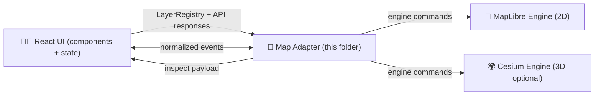

# 🗺️ Map Adapter (`web/src/adapters/map`)


-7b2)


> [!IMPORTANT]
> This folder is the **engine boundary** for KFM’s interactive map UI.  
> The map adapter exists so the rest of the web app never “talks MapLibre/Cesium directly” and we can keep governance (provenance, redaction, auditability) consistent across 2D + 3D.

---

## 🧭 TL;DR

- ✅ Normalize map engines (MapLibre 2D / Cesium 3D) behind one stable interface.
- ✅ Render only **API-served, contract-governed** layers (no hidden files, no direct DB calls).
- ✅ Every visible layer/feature must be **inspectable** (source + license + provenance).
- ✅ Timeline/time-filtered layers must respond consistently to the UI timeline slider.
- ✅ Keep UX accessible, secure, and fast (tiles > giant GeoJSON).

---

## 📌 Contents

- [Why an Adapter?](#-why-an-adapter)
- [Non‑negotiables](#-nonnegotiables)
- [Folder Layout](#-folder-layout)
- [Architecture](#-architecture)
- [Public Contract](#-public-contract)
- [Layer + Provenance Model](#-layer--provenance-model)
- [Timeline Integration](#-timeline-integration)
- [2D vs 3D Engines](#-2d-vs-3d-engines)
- [Performance](#-performance)
- [Accessibility](#-accessibility)
- [Security + Governance](#-security--governance)
- [Testing](#-testing)
- [Contributing](#-contributing)
- [Appendix: Project Reference Library](#-appendix-project-reference-library)

---

## 🧩 Why an Adapter?

KFM is built around a strict pipeline (data → catalogs → graph → API → UI → story). The UI is **not** allowed to bypass governance or introduce “mystery layers”.

So instead of letting every React component call MapLibre/Cesium APIs directly, we keep a single boundary:

- 🔒 **Governance**: provenance + redaction rules are enforced consistently.
- 🔁 **Swapability**: engines evolve; the UI contract should not.
- 🧪 **Testability**: we can unit test layer normalization + event mapping without running a full map engine.
- 🧠 **Clarity**: map logic lives in one place, not spread across components.

---

## 🧱 Non‑negotiables

> [!NOTE]
> If you change behavior here, treat it like a “platform boundary change”, not a styling tweak.

### ✅ Contract-first + provenance-first

- A layer is only “real” if it is represented by **contracted metadata** (STAC/DCAT/PROV aligned) and is served through the API.
- The adapter must support an **Inspect** UX: users can always see the “map behind the map” (origin + license + method lineage).

### ✅ No hidden data / no direct DB

- The map adapter **must not** ship data files as “convenient shortcuts” (GeoJSON in the repo, random TIFFs, etc.).
- The adapter **must not** query databases (Postgres/Neo4j/etc.). It only consumes API responses.

### ✅ No data leakage

- Respect any redaction/classification rules returned by the API.
- Avoid “zoom-level bypasses” that could reveal sensitive detail.

### ✅ Timeline correctness

- Layers with temporal semantics must respond to the timeline slider (filter, animate, or restyle deterministically).

---

## 🗂️ Folder Layout

> This is the intended shape. If implementation differs, update this README and/or refactor toward this layout.

```text
📦 web/
 └─ 🧩 src/
    └─ 🔌 adapters/
       └─ 🗺️ map/
          ├─ README.md ⭐
          ├─ index.ts
          ├─ types.ts
          ├─ createMapAdapter.ts
          ├─ engines/
          │  ├─ maplibre/   🧭 2D implementation
          │  └─ cesium/     🌍 3D implementation (optional)
          └─ __tests__/     🧪 contract + normalization tests
```

---

## 🧠 Architecture



### Boundary rule 📏
The adapter is responsible for translating:

- **Domain/UI intents** → engine calls (add layer, set view state, set time, etc.)
- **Engine events** → normalized UI events (click, hover, box select, etc.)
- **Engine feature identity** → stable KFM feature identity (for citations + Focus Mode)

---

## 🧾 Public Contract

> [!TIP]
> Keep the public surface area small. Prefer capability flags over exposing engine internals.

### Minimal TypeScript interface (spec)

```ts
export type MapEngine = "maplibre" | "cesium";

export type ViewState = {
  center: [lng: number, lat: number];
  zoom: number;
  bearing?: number; // degrees
  pitch?: number;   // degrees (0-85 typical)
};

export type TimeState = {
  // KFM should treat time as a first-class dimension (nullable if "timeless")
  currentISO?: string;   // e.g. "1875-01-01"
  rangeISO?: [string, string];
  mode?: "scrub" | "animate";
};

export type ProvenanceRef = {
  stacItemId?: string;
  stacCollectionId?: string;
  dcatDatasetId?: string;
  provBundleId?: string;

  // human-facing attribution
  title?: string;
  license?: string;
  attribution?: string;
};

export type LayerSpec = {
  id: string;                 // stable ID (no random UUID per session)
  title: string;              // for UI layer panel
  kind: "vector" | "raster" | "terrain" | "3dtiles" | "annotation";

  source: {
    type: "tiles" | "geojson" | "stac-asset" | "api";
    url: string;              // API endpoint or tile template
    format?: "mvt" | "png" | "jpg" | "geojson" | "cog" | "3dtiles";
  };

  paint?: Record<string, unknown>; // engine-agnostic style-ish blob
  layout?: Record<string, unknown>;

  opacity?: number;           // 0..1
  visible?: boolean;
  zIndex?: number;

  time?: {
    startISO?: string;
    endISO?: string;
    field?: string;           // feature property for time filtering (if applicable)
  };

  provenance: ProvenanceRef;  // required for anything visible
};

export type MapFeatureRef = {
  layerId: string;
  featureId: string;          // stable within layer
  properties?: Record<string, unknown>;
  geometryHint?: "point" | "line" | "polygon" | "raster-pixel" | "3d";
  provenance?: ProvenanceRef; // may be inherited from layer
};

export type MapEvent =
  | { type: "ready" }
  | { type: "moveEnd"; view: ViewState }
  | { type: "hover"; feature?: MapFeatureRef; screen: { x: number; y: number } }
  | { type: "click"; feature?: MapFeatureRef; screen: { x: number; y: number } }
  | { type: "error"; message: string; details?: unknown };

export interface MapAdapter {
  readonly engine: MapEngine;

  mount(container: HTMLElement): void;
  destroy(): void;

  setView(view: ViewState): void;
  getView(): ViewState;

  setTime(time: TimeState): void;

  addLayer(layer: LayerSpec): void;
  updateLayer(layer: LayerSpec): void;
  removeLayer(layerId: string): void;

  setLayerVisibility(layerId: string, visible: boolean): void;
  setLayerOpacity(layerId: string, opacity: number): void;

  /** For “map behind the map” inspector panels */
  inspectLayer(layerId: string): ProvenanceRef | undefined;

  /** Subscribe to normalized events */
  on(cb: (evt: MapEvent) => void): () => void;
}
```

> [!IMPORTANT]
> This interface is intentionally “boring”: **no engine objects** should leak out (no `maplibre.Map`, no Cesium `Viewer`).

---

## 🧬 Layer + Provenance Model

KFM’s UI must be able to answer, at any time:

- What is this layer?
- Where did it come from?
- What license governs it?
- What processing produced it?
- If it’s AI-generated or derived: what inputs + parameters created it?

### “Inspectable layer” UX contract 🔍

When a layer is visible, the adapter must provide enough metadata to populate:

- **Title + Source org**
- **License**
- **STAC/DCAT/PROV IDs** (or URLs) for traceability
- **Temporal extent** (if applicable)
- **A note if derived/AI-generated** (if flagged by API)

### Example `LayerSpec` (API → adapter)

```json
{
  "id": "kfm.historical_boundaries.counties_1870",
  "title": "Kansas County Boundaries (1870)",
  "kind": "vector",
  "source": {
    "type": "tiles",
    "url": "/api/tiles/kfm.historical_boundaries.counties/{z}/{x}/{y}.mvt",
    "format": "mvt"
  },
  "opacity": 0.85,
  "visible": true,
  "time": {
    "startISO": "1870-01-01",
    "endISO": "1870-12-31",
    "field": "valid_on"
  },
  "provenance": {
    "title": "County boundaries (1870)",
    "attribution": "Kansas Historical Society (digitized)",
    "license": "CC BY 4.0",
    "stacCollectionId": "kfm-historical-boundaries",
    "stacItemId": "kfm-historical-boundaries-counties-1870",
    "dcatDatasetId": "kfm:dcat:historical-boundaries",
    "provBundleId": "kfm:prov:boundaries:counties:digitization:v3"
  }
}
```

---

## ⏳ Timeline Integration

Timeline is a first-class UI control. The adapter should:

1. Accept `setTime({ currentISO })`.
2. Apply a deterministic filtering strategy per layer:
   - **Tile layers**: include time in the tile request (preferred) or use server-side filtering.
   - **GeoJSON layers**: filter client-side only if small + already governed (never “load everything”).
   - **Raster time-series**: swap the asset URL based on time (COG/imagery sequences).
3. Report back `moveEnd` events with view state, so timeline-driven stories can record “map actions”.

> [!TIP]
> Keep all time logic explicit. A layer should declare whether it is time-aware and how.

---

## 🧭 2D vs 3D Engines

### 🧭 MapLibre (2D default)

Best for:
- Vector tile basemaps + overlays
- Smooth interaction at typical web map scale
- Fast layer toggling, styling, and hover/click inspect

Recommended layer forms:
- `mvt` vector tiles for large feature sets
- raster tiles (`png`/`jpg`) for imagery overlays
- **small** GeoJSON for annotations or debugging only

### 🌍 Cesium (3D optional)

Best for:
- Terrain + vertical context (topography, cross-sections)
- 3D Tiles (point clouds, buildings, volumetric datasets)
- Story-driven “2D → 3D” transitions

**Key rule:** keep shared state synchronized
- `ViewState` should map cleanly between 2D and 3D (center/zoom ↔ camera position).
- Switching modes should preserve layer visibility intent (some layers may be engine-specific).

---

## 🚀 Performance

### Prefer “streamable” representations
- ✅ vector tiles (MVT) over giant GeoJSON
- ✅ server-side generalization over client-side crunching
- ✅ time-windowed requests for timeline scrubbing

### Avoid common map performance traps 🧨
- Rendering 50k+ GeoJSON features client-side
- Re-adding layers on every React render
- Doing expensive filtering in the main thread
- Sending unbounded queries from UI (should be API-governed)

### Raster formats (practical defaults)
- 🖼️ **JPEG**: aerial/satellite imagery (smaller)
- 🧾 **PNG**: linework/labels/transparent overlays
- 🧱 **COG**: if the API/tiler serves Cloud-Optimized GeoTIFF assets (use server-side tiling)

---

## ♿ Accessibility

Map UIs are tricky—this adapter must make it easier, not harder:

- Keyboard support for:
  - layer panel toggles
  - focusable “selected feature” list
- Respect `prefers-reduced-motion` for animated camera moves
- Provide an alternate “list view” path: selected features can be navigated without precision pointer actions
- Tooltip content must be screen-reader safe (no raw HTML from data)

---

## 🔐 Security + Governance

### 🛡️ Treat all layer content as untrusted input
Even “trusted datasets” can contain user-controlled fields.

- Never inject feature properties into `innerHTML`.
- Sanitize popup/tooltip content.
- Avoid dynamic code execution patterns (no `eval`, no string-built style expressions from user content).

### 🧾 Redaction & classification
- If the API says a dataset/layer is redacted beyond certain zoom/time extents, the adapter must enforce it.
- If a layer becomes invalid at a given time/zoom, it should:
  - auto-hide **and**
  - expose a user-facing reason (e.g. “restricted at this scale”).

### 🔑 Tokens & secrets
- No secrets in the web bundle.
- If map tiles require auth, use API-mediated token exchange or short-lived tokens.

---

## 🧪 Testing

### What we can unit test ✅
- LayerSpec → engine normalization (style mapping, defaults, capability flags)
- Event normalization (MapLibre/Cesium → `MapEvent`)
- Time filtering decisions (per layer kind)
- Provenance enforcement (“cannot add visible layer without provenance”)

### What should be integration tested 🧩
- Layer toggling + opacity control
- Timeline scrubbing across time-aware layers
- 2D/3D mode switch preserves intent
- Inspector panel always has provenance fields

---

## 🤝 Contributing

### Add a new layer type
Checklist ✅
- [ ] Define/extend `LayerSpec.kind` and required `source.format`
- [ ] Implement normalization for MapLibre and/or Cesium
- [ ] Ensure `inspectLayer()` returns a complete provenance payload
- [ ] Make timeline behavior explicit (even if “not time-aware”)
- [ ] Add tests for normalization + failure modes
- [ ] Update this README

### Add a new engine implementation
Checklist 🧰
- [ ] Implement the `MapAdapter` interface with **no engine leaks**
- [ ] Map events into normalized `MapEvent`
- [ ] Implement a capability map (what kinds/formats are supported)
- [ ] Provide a graceful “unsupported layer” behavior (warn + no crash)
- [ ] Add smoke tests (mount → add layer → click → destroy)

---

## 📚 Appendix: Project Reference Library

<details>
<summary>📖 How the project library informs this adapter (click to expand)</summary>

**KFM platform & governance**
- Kansas Frontier Matrix (KFM) – Comprehensive Technical Documentation (UI map/timeline, MapLibre + Cesium, provenance-first expectations)
- MARKDOWN_GUIDE_v13 (canonical subsystem homes; UI constraints; contract-first + evidence-first pipeline)

**Cartography & UX**
- Making Maps: A Visual Guide to Map Design for GIS (legend, symbology, visual hierarchy)
- Mobile Mapping: Space, Cartography and the Digital (mobile interaction constraints; map-as-interface)
- Responsive Web Design with HTML5 and CSS3 (responsive layout decisions for map + panels)

**WebGL / 3D**
- WebGL Programming Guide (rendering constraints; GPU budgeting)
- Archaeological 3D GIS (3D layers, terrain/mesh interpretation patterns)

**Data formats & performance**
- Compressed Image File Formats (PNG/JPEG tradeoffs; artifacts)
- Database Performance at Scale (latency budgets, caching mindset)
- Scalable Data Management for Future Hardware (streaming + caching principles; query reuse patterns)
- PostgreSQL Notes for Professionals (spatial + query awareness—**server-side only**)

**Geospatial analysis (server-side inspiration)**
- Python Geospatial Analysis Cookbook (GeoJSON, PostGIS workflows—feeds the API, not the UI)
- Cloud-Based Remote Sensing with Google Earth Engine (imagery/time-series layer expectations)

**Modeling, uncertainty, and “evidence artifacts”**
- Scientific Modeling & Simulation (reproducibility mindset)
- Understanding Statistics & Experimental Design (communicating uncertainty)
- Think Bayes (uncertainty as first-class metadata)
- Regression Analysis (communicating model assumptions; avoiding misleading visuals)

**Security**
- Ethical Hacking & Countermeasures / Gray Hat Python (threat modeling mindset; input handling hygiene)

**Systems + theory (long-term)**
- Data Spaces (federation and governed access patterns)
- Spectral Geometry of Graphs (graph-based overlays + interpretation)
- Principles of Biological Autonomy / Digital Humanism / AI Law foundations (human-centered governance framing)

</details>

---

## ✅ Definition of Done (for changes in this folder)

- [ ] Public interface remains engine-agnostic
- [ ] Provenance is enforced for visible layers
- [ ] Timeline interactions are deterministic
- [ ] No direct data files added to `web/`
- [ ] No direct DB calls added
- [ ] Security review: popups/tooltips safe; no HTML injection
- [ ] Accessibility review: keyboard + reduced motion
- [ ] Unit tests updated/added
- [ ] README updated if behavior changes

---
