# Adapters 🔌


> **Adapters = the translation + boundary layer** between KFM Web and the outside world (APIs, browser storage, map engines, WebGL, workers, auth, etc).  
> If it touches the network, the browser, a vendor SDK, or a file format… it belongs here. 🧱

---

## Quick map 🧭

| Term | Meaning | Where it lives |
|---|---|---|
| **Port** | An interface describing *what* the app needs (capability) | `src/**/ports` (or your project’s equivalent “core” location) |
| **Adapter** | A concrete implementation describing *how* we do it (HTTP, IndexedDB, Map engine, etc.) | `web/src/adapters/**` ✅ |
| **Composition root** | The one place where we wire ports → adapters | `src/app/bootstrap` / `src/main` / `src/di` (varies) |

---

## Non‑negotiables ✅

> 🧠 These are “architecture guardrails.” If you break them, it becomes harder to audit, swap tech, preserve provenance, or keep user agency intact.

1. **All side effects live in adapters.**  
   No `fetch()`, `localStorage`, `WebGL`, `navigator.geolocation`, SDK calls, etc. outside this folder.
2. **UI does not bypass governed boundaries.**  
   The UI should never “reach around” to raw stores/graphs directly; use the API layer and its contracts.
3. **Provenance is first‑class.**  
   Anything that can appear in the UI as “truth” should be able to carry *where it came from* (dataset IDs, citations, timestamps, pipeline run IDs).
4. **Human agency stays on top.**  
   Adapters must not create “autonomous” actions or silent side effects that change user-visible state without an explicit user flow (especially around AI-assisted features).

---

## Architecture at a glance 🏗️

```mermaid
flowchart TB
  UI["🖥️ UI Layer<br/>components • routes • views"] --> UC["🧠 Use-cases / Services<br/>business workflows"];
  UC -- calls --> PORTS["🔌 Ports (interfaces)"];
  PORTS -- implemented by --> ADAPTERS["🧰 Adapters (this folder)"];
  ADAPTERS --> EXT["🌍 Outside world<br/>HTTP APIs • Storage • Map engine • Workers • Auth"];
```



---

## Folder layout 📁

> This is the *intended* shape. If the repo differs today, keep the *ideas* and update the tree as you refactor.

```txt
web/src/
└─ 🧩 adapters/
   ├─ 🌐 api/            # HTTP/WS clients, DTO ↔ domain mapping, retries
   ├─ 💾 storage/        # localStorage / IndexedDB / Cache API
   ├─ 🌍 geo/            # GeoJSON, tiles, bbox, reprojection, geometry helpers
   ├─ 🗺️ map/            # map engine bridge (MapLibre / Cesium / deck.gl / etc.)
   ├─ 🧵 workers/        # Web Workers: heavy transforms, parsing, indexing
   ├─ 📡 telemetry/      # logging, metrics, traces, error reporting
   ├─ 🔐 auth/           # OAuth/OpenID, session tokens, role checks (client-side)
   └─ 📦 index.ts        # adapter factories + exports
```

---

## What belongs in adapters ✅

### 1) IO + side effects
- HTTP calls, WebSockets, SSE
- Browser APIs (storage, permissions, geolocation, clipboard)
- Worker initialization + message protocols
- File parsing (GeoJSON, CSV, shapefile/GeoPackage adapters if present)
- Image/tile loading & decoding (COGs/tilesets if applicable)

### 2) Vendor boundaries (anti‑corruption layer) 🧼
Adapters are where we **translate**:
- Vendor SDK objects → app types
- API DTOs → domain/UI models
- Browser exceptions → app error types
- Vendor auth/session semantics → app auth semantics

### 3) Performance tactics (as an implementation detail) ⚡
Caching, batching, retry/backoff, deduplication, compression—**as long as it stays invisible to the core** and respects correctness.

---

## What does NOT belong here 🚫

- Business rules (policy, decisions, “what should happen”)
- Domain invariants (validation that defines truth)
- UI components (except thin wrappers around external widgets)
- Long chains of transformations (push heavy transforms into workers and keep the adapter thin)

---

## The “Provenance Envelope” pattern 📦🧾

KFM’s core promise is provenance-first: users must be able to inspect *what a layer is*, *where it came from*, and *how it was produced*. Adapters are where external data first enters the Web app, so they’re the first place provenance can be attached.

### Recommended shape
Use a wrapper that travels with any “truthy” payload:

```ts
export type EvidenceRef =
  | { kind: "dataset"; id: string; label?: string; url?: string; license?: string }
  | { kind: "document"; id: string; label?: string; url?: string }
  | { kind: "api"; id: string; label?: string; url?: string };

export type Provenance = {
  retrievedAt: string;        // ISO timestamp
  refs: EvidenceRef[];        // citations / dataset ids / doc ids
  pipelineRunId?: string;     // if available from API
  notes?: string[];           // optional processing notes
};

export type Provenanced<T> = {
  value: T;
  provenance: Provenance;
};
```

### Adapter rule
> ✅ **Any adapter that returns data used in maps, narratives, “facts”, or AI summaries should return `Provenanced<T>`** (or something equivalent).

---

## Error model 🎯

Adapters should “normalize chaos” into predictable error shapes.

### Suggested discriminated union
```ts
export type AppError =
  | { kind: "NetworkError"; message: string; retryAfterMs?: number }
  | { kind: "AuthError"; message: string; status?: number }
  | { kind: "NotFound"; message: string }
  | { kind: "RateLimited"; message: string; retryAfterMs?: number }
  | { kind: "ValidationError"; message: string; details?: unknown }
  | { kind: "Unknown"; message: string; cause?: unknown };

export type Result<T> =
  | { ok: true; value: T }
  | { ok: false; error: AppError };
```

### Adapter rule
- **Never leak raw vendor exceptions** out of an adapter.
- Prefer `Result<T>` or typed errors over throwing.

---

## API client adapters 🌐

### Responsibilities
- Construct requests (headers, auth, correlation IDs)
- Runtime validate responses (don’t trust the network!)
- Convert DTO → app types
- Attach provenance (dataset ids, sources, timestamps)
- Enforce API boundary rules (no “secret” endpoints)

### Minimal example
```ts
export interface CatalogPort {
  searchLayers(params: { bbox?: [number, number, number, number]; q?: string }): Promise<Result<Provenanced<unknown>>>;
}

export function createCatalogApiAdapter(deps: {
  baseUrl: string;
  fetchImpl?: typeof fetch;
  getAuthToken?: () => string | null;
}): CatalogPort {
  const fetchImpl = deps.fetchImpl ?? fetch;

  return {
    async searchLayers(params) {
      try {
        const url = new URL("/api/catalog/search", deps.baseUrl);
        if (params.q) url.searchParams.set("q", params.q);
        if (params.bbox) url.searchParams.set("bbox", params.bbox.join(","));

        const token = deps.getAuthToken?.();
        const res = await fetchImpl(url.toString(), {
          headers: {
            ...(token ? { Authorization: `Bearer ${token}` } : {}),
            "Accept": "application/json",
          },
        });

        if (res.status === 401 || res.status === 403) {
          return { ok: false, error: { kind: "AuthError", message: "Not authorized", status: res.status } };
        }
        if (!res.ok) {
          return { ok: false, error: { kind: "NetworkError", message: `HTTP ${res.status}` } };
        }

        const json = await res.json();

        // TODO: runtime validation here (zod/io-ts/etc)
        return {
          ok: true,
          value: {
            value: json,
            provenance: {
              retrievedAt: new Date().toISOString(),
              refs: [{ kind: "api", id: "catalog.search", url: url.toString() }],
            },
          },
        };
      } catch (cause) {
        return { ok: false, error: { kind: "Unknown", message: "Request failed", cause } };
      }
    },
  };
}
```

---

## Storage adapters 💾

### Use cases
- User preferences (map basemaps, UI state)
- Offline/edge caching of recent queries (careful!)
- Session persistence
- Precomputed indexes (for faster spatial search)

### Rules of thumb
- Treat storage like an unreliable database: **quota can fail**
- Version your stored data (`schemaVersion`)
- Provide migration paths + fallbacks
- Never store sensitive data unencrypted (and prefer not storing at all)

---

## Geospatial adapters 🗺️

### What they do
- Convert between formats: GeoJSON ↔ internal feature types
- Normalize CRS / coordinate order rules (lon/lat vs lat/lon)
- Prepare bbox + tiling requests
- Support spatial predicates at the API boundary (intersects/contains/within)

### “Thin” vs “heavy”
- ✅ Thin transforms (bbox normalization, property mapping) can stay in adapters
- 🧠 Heavy transforms (topology fixes, simplification, reprojection at scale) should go to **workers** or the backend

---

## Map engine adapters 🧭🧱

Map engines are vendor-heavy (APIs, lifecycle rules, performance tricks). Wrap them so the rest of the app depends on **your** interface, not theirs.

### Recommended approach
Define a small “MapPort” that represents what the app needs:

```ts
export interface MapPort {
  setView(view: { center: [number, number]; zoom: number }): void;
  addLayer(layer: { id: string; type: string; source: unknown }): void;
  removeLayer(id: string): void;
  on(event: "click" | "moveend", handler: (e: unknown) => void): () => void;
}
```

Then implement it with the chosen engine in `adapters/map/*`.

---

## Worker adapters 🧵

If you parse big files, build spatial indexes, simplify geometry, generate vector tiles, or run client-side analytics:
- Do it in a **Worker**
- Wrap the worker protocol in an adapter so the rest of the app sees a normal async API

### Pattern
```ts
export interface GeometryOpsPort {
  simplifyGeoJson(input: unknown, opts: { tolerance: number }): Promise<Result<unknown>>;
}
```

---

## AI / “Focus Mode” boundary 🧠🛡️

Adapters that feed data to AI features must be extra strict:
- **Never** pass unsourced claims as facts
- Always preserve citations / references
- Make “unknown / not in data” a valid outcome
- Ensure the UI can label AI output clearly (origin + evidence)

> 🧯 If the adapter can’t attach evidence, it should downgrade the output to “unverified” (or refuse).

---

## Naming & code style ✍️

### Conventions
- `FooPort` = interface
- `createFooAdapter(...)` = factory (easier DI)
- `fooAdapter.ts` / `foo.port.ts` (pick one style and stay consistent)
- Keep adapter public surface small; hide vendor types in implementation

### Imports
- ✅ Adapters may import from core (ports, types, utilities)
- 🚫 Core must not import from adapters

---

## Testing strategy 🧪

### 1) Mock adapters for unit tests
Provide a simple in-memory or deterministic adapter for ports.

### 2) Contract tests
Write a shared test suite that runs against:
- the mock adapter
- the real adapter (optionally behind a test server)

### 3) “No side-effects” tests
Your use-cases should be testable without real network/storage by swapping adapters.

---

## PR checklist ✅

- [ ] No direct `fetch()` / browser API calls outside `web/src/adapters`
- [ ] New adapter implements a **port** (interface contract) and keeps vendor APIs internal
- [ ] Response decoding/validation exists (runtime validation or strict guards)
- [ ] Provenance is attached where data can become user-facing truth
- [ ] Errors are mapped to app error types (no raw throws leaking out)
- [ ] Basic tests exist (mock + contract test where appropriate)
- [ ] Telemetry hooks added for failures/latency (if applicable)

---

## “When should I create a new adapter?” 🤔

Create a new adapter when:
- You need to integrate a new external system (API, SDK, storage)
- You want to swap a vendor without touching business logic
- You need a clear boundary for provenance, auditing, or security controls
- You’re adding a new file format or data ingestion path

Don’t create one when:
- It’s just a pure transformation (put it in shared utils)
- It’s business logic (put it in services/use-cases)
- It’s rendering/UI behavior (put it in UI layer)

---

## Appendix: Adapter templates 🧩

<details>
<summary><strong>🧰 Template: adapter skeleton</strong></summary>

```ts
export interface ExamplePort {
  doThing(input: { id: string }): Promise<Result<Provenanced<unknown>>>;
}

export function createExampleAdapter(deps: {
  // dependency injection here
}): ExamplePort {
  return {
    async doThing(input) {
      // 1) validate input (optional)
      // 2) perform side effect (fetch/storage/worker)
      // 3) validate output
      // 4) attach provenance
      // 5) map errors
      return {
        ok: true,
        value: {
          value: {},
          provenance: {
            retrievedAt: new Date().toISOString(),
            refs: [{ kind: "api", id: "example.doThing" }],
          },
        },
      };
    },
  };
}
```

</details>

<details>
<summary><strong>🧾 Template: provenance refs</strong></summary>

```ts
const refs = [
  { kind: "dataset", id: "urn:kfm:dataset:...", label: "USGS ...", url: "..." },
  { kind: "document", id: "urn:kfm:doc:...", label: "Story Node ...", url: "..." },
  { kind: "api", id: "catalog.search", url: "https://..." },
] as const;
```

</details>
