# 🛰️ KFM Web — API Client Adapter (`web/src/adapters/api/client`)


> 🎯 **Goal:** A single, canonical place for the web app to call KFM’s governed backend APIs (REST + GraphQL) — *without bypassing contracts, provenance, or redaction.*

| 📌 Field | Value |
|---|---|
| 📍 Path | `web/src/adapters/api/client/` |
| 🧱 Layer | Interfaces & Adapters (web-side boundary) |
| 🔗 Backend surface | REST endpoints + (select) GraphQL for graph-style queries |
| 🧭 Source of truth | `src/server/` API contracts + OpenAPI/GraphQL schemas |
| 🗓️ Last updated | 2026-01-17 |

---

## ⚠️ Non‑negotiable invariants (read this first)

> ✅ **API boundary rule:** The **frontend must never query Neo4j directly** — all data access goes through the governed API layer.  
> ✅ **Pipeline ordering:** ETL → Catalogs (STAC/DCAT/PROV) → Graph → API → UI → Story Nodes → Focus Mode is **inviolable**.  
> ✅ **UI behavior:** The UI relies on the API and should **show whatever is returned**, avoiding hidden preprocessing that could break provenance.

<!-- Sources:
- Pipeline + API boundary invariants: :contentReference[oaicite:0]{index=0}
- Evidence-first + no unsourced narrative: :contentReference[oaicite:1]{index=1}
- UI relies on API / shows what is returned: :contentReference[oaicite:2]{index=2}
-->

---

## 🧭 Where this fits in the system

```mermaid
flowchart LR
  UI["🖥️ React Map UI<br/>(web/)"] -->|calls| C["🔌 API Client Adapter<br/>(this folder)"]
  C -->|REST / GraphQL| API["🧱 API Layer<br/>(FastAPI, contracts)"]
  API --> CAT["📚 Catalogs<br/>(STAC/DCAT/PROV)"]
  API --> PG["🗺️ PostGIS / PostgreSQL"]
  API --> G["🕸️ Neo4j Knowledge Graph"]
  UI --> STORY["📖 Story Nodes & Focus Mode"]
```



<!-- Sources:
- Canonical pipeline flow: :contentReference[oaicite:3]{index=3}
- FastAPI + OpenAPI + GraphQL + stateless scaling: :contentReference[oaicite:4]{index=4}
-->

---

## ✅ What belongs in this folder

This adapter should be the **only** place where the web app deals with:

- 🌐 **Transport details**: base URL, headers, query params, request body encoding
- 🔐 **Auth wiring** (when enabled): token injection, refresh strategy hooks
- 🧾 **Contract alignment**: request/response typing aligned to OpenAPI/GraphQL
- 🧯 **Error normalization**: consistent error objects for UI + domain layers
- 🧵 **Cancellation**: AbortController / request abort for map interactions
- 📈 **Observability hooks**: request IDs, timing, minimal logging (no secrets)
- 🧊 **Caching & dedupe** (where safe): especially for catalog + metadata reads
- 🧷 **Provenance preservation**: never drop evidence/provenance fields “for convenience”

<!-- Sources:
- Contract-first + provenance-first principle: :contentReference[oaicite:5]{index=5}
- Domain logic relies on interfaces (separation of what vs how): :contentReference[oaicite:6]{index=6}
-->

---

## 🚫 What does *not* belong here

Keep this folder boring on purpose:

- ❌ No domain decisions (“what layer is important?”)
- ❌ No UI formatting (labels, colors, chart bucketing)
- ❌ No hidden data filtering/redaction (that belongs to governed API)
- ❌ No “clever” schema massaging that breaks provenance or citations
- ❌ No direct database/graph access (ever)

<!-- Sources:
- UI must show what API returns; governed access via API boundary: :contentReference[oaicite:7]{index=7}
-->

---

## 🗂️ Suggested folder layout (may vary)

> Use this as a **north star** for keeping responsibilities clean — adjust names to match the actual repo conventions.

```text
📁 web/src/adapters/api/client/
├── 📄 README.md                  # you are here
├── 📄 index.ts                   # public exports (one entrypoint)
├── 📄 config.ts                  # base URL + env wiring
├── 📄 http.ts                    # fetch wrapper (headers, JSON, abort, timeouts)
├── 📄 graphql.ts                 # GraphQL request helper (if used in web)
├── 📄 errors.ts                  # ApiError normalization + type guards
├── 📄 endpoints.ts               # endpoint builders (paths, param helpers)
├── 📁 resources/                 # per-domain clients (datasets, stories, search)
│   ├── 📄 datasets.ts
│   ├── 📄 stories.ts
│   └── 📄 search.ts
└── 📁 __tests__/                 # unit tests for client behavior
```

---

## 🌐 Backend surfaces this client talks to

KFM’s backend is described as:

- A **FastAPI REST API** that provides an **OpenAPI/Swagger spec** documenting endpoints and request/response schemas
- A **GraphQL interface** (for relationship-heavy graph traversals), with safeguards needed against expensive queries
- A backend designed to be **stateless**, scalable behind a load balancer, with **CORS** configured for the React frontend (often on a different port during dev)
- Authentication planned/possible via **OAuth2 or token auth** for certain features

<!-- Sources:
- OpenAPI/Swagger, auth direction, CORS, rate limiting: :contentReference[oaicite:8]{index=8}
- GraphQL purpose + limits (depth/result/pagination): :contentReference[oaicite:9]{index=9}
- REST + GraphQL + stateless scaling + Swagger UI: :contentReference[oaicite:10]{index=10}
-->

---

## 🧩 API surfaces (high level)

> Treat this as a **map**, not a guarantee. The **OpenAPI definition is the contract**.

### 🧱 REST (examples)

| Method | Path | What it’s for |
|---:|---|---|
| GET | `/api/datasets` | List datasets + metadata |
| GET | `/api/datasets/{id}/data` | Fetch dataset payload (may be GeoJSON or a link to data/tiles) |
| GET | `/api/features/{dataset_id}` | Fetch map-ready features for a dataset |
| GET | `/api/stories/{story_id}` | Fetch Story Node content + metadata |
| GET | `/api/search?q=...` | Search datasets/features/stories/graph entities |
| POST | `/api/focus` | Focus Mode Q&A (question + UI/map context) |
| POST | `/api/ingest` | Admin-only ingest / pipeline trigger |

<!-- Sources:
- Example endpoint list (datasets, features, stories, search, focus, ingest): :contentReference[oaicite:11]{index=11}
- Additional examples (dataset by id, analysis, story submit): :contentReference[oaicite:12]{index=12}
-->

### 🕸️ GraphQL (when relationship traversal is needed)

Use GraphQL for queries that need to traverse graph relationships (people → events → places, etc.). **Always** keep queries bounded:

- ✅ paginate lists
- ✅ limit recursion depth / nesting
- ✅ avoid unbounded “fetch everything” patterns

<!-- Source: expensive query safeguards + pagination/depth limits: :contentReference[oaicite:13]{index=13} -->

---

## 🚀 Usage patterns (examples)

> ⚠️ These snippets are **illustrative**. Adapt to the actual exports implemented in this folder.

### 1) REST call (typed + abortable)

```ts
// Example: list datasets (abortable)
const controller = new AbortController();

try {
  const datasets = await api.request("/api/datasets", {
    method: "GET",
    signal: controller.signal,
  });

  // ✅ Render what the API returns (don’t silently drop provenance fields)
  return datasets;
} catch (err) {
  // Normalize to ApiError to make UI handling consistent
  throw api.toApiError(err);
}
```

### 2) GraphQL call (bounded query)

```ts
const query = `
  query PersonByName($name: String!) {
    person(name: $name) {
      name
      events {
        title
        date
        locations { name }
      }
    }
  }
`;

const data = await api.graphql(query, { name: "John Brown" });
```

<!-- Source for GraphQL usage intent + sample structure: :contentReference[oaicite:14]{index=14} -->

### 3) Focus Mode call (Q&A + context bundle)

```ts
const body = {
  question: "What happened here in 1856?",
  context: {
    // keep this compact + explicit
    selectedFeatureId: "feature:123",
    viewport: { bbox: [-101.0, 37.0, -94.0, 40.0], zoom: 6 },
    activeLayers: ["historic-boundaries", "settlements-1850s"],
  },
};

const answer = await api.request("/api/focus", {
  method: "POST",
  headers: { "Content-Type": "application/json" },
  body: JSON.stringify(body),
});
```

<!-- Sources:
- Focus Mode is evidence-constrained and provenance-linked: :contentReference[oaicite:15]{index=15}
- Focus Mode AI is advisory and evidence-backed in KFM vision: :contentReference[oaicite:16]{index=16}
-->

---

## ⚙️ Configuration

### 🌍 Base URL

This client should read a **single** base URL (env/config) and build all endpoint URLs from it.

Common approaches (pick one for the repo and standardize):

- `KFM_API_BASE_URL`
- `VITE_KFM_API_BASE_URL`
- `REACT_APP_KFM_API_BASE_URL`

### 🌐 CORS (dev)

If the web app is served from a different origin/port in development, CORS must allow it.

<!-- Source: CORS configured for React frontend on different domain/port in dev: :contentReference[oaicite:17]{index=17} -->

### 🔐 Authentication (when enabled)

Plan for a token hook (e.g., `getAccessToken(): string | null`) and ensure:

- tokens are **never** logged
- auth errors normalize consistently (`401/403`)
- “draft/private” features remain governed by the API

<!-- Source: OAuth2/token auth planned/possible: :contentReference[oaicite:18]{index=18} -->

---

## 🧾 Provenance, evidence, and “show what the API returns”

KFM’s core promise is provenance-first / evidence-first delivery: anything shown in UI or Focus Mode must be traceable to cataloged sources and provenance.

So the API client should:

- ✅ treat provenance metadata as **first-class**, not optional fluff
- ✅ avoid stripping fields like `sources`, `citations`, `prov`, `stac`, `dcat`, `lineage`, etc.
- ✅ bubble up evidence objects to the UI so users can inspect *why* something is shown
- ✅ keep responses as close to the contract as practical (mapping is fine; silent filtering is not)

<!-- Sources:
- Provenance-first + traceability requirement: :contentReference[oaicite:19]{index=19}
- Evidence-first narrative + no unsourced additions: :contentReference[oaicite:20]{index=20}
-->

---

## 🧨 Error model (recommended)

Normalize errors into one shape so UI layers don’t do bespoke parsing.

```ts
export type ApiError = {
  kind: "network" | "http" | "timeout" | "parse" | "unknown";
  message: string;
  status?: number;          // when HTTP
  requestId?: string;       // if server provides one
  url?: string;
  details?: unknown;        // machine-readable payload if present
};
```

---

## 🧪 Testing & contract checks

### ✅ Contract-first expectations

- The **OpenAPI definition is the contract**. Breaking it requires a version bump or new endpoint path.
- API changes should ship with contract tests against known inputs/outputs.
- This client should have unit tests for:
  - error normalization
  - auth header behavior
  - abort/cancellation
  - request building (query params, JSON encoding)
  - GraphQL bounded-query helpers (if applicable)

<!-- Sources:
- OpenAPI is the contract; breaking change requires versioning: :contentReference[oaicite:21]{index=21}
- APIs need OpenAPI/GraphQL schema + contract tests; keep backwards compatible: :contentReference[oaicite:22]{index=22}
-->

---

## 🔒 Security & governance notes

This client is part of a governed system. Keep these constraints in mind:

- 🧭 **Classification propagation:** no output can be less restricted than its inputs.
- 🕶️ **Redaction respect:** UI must not cause data leakage; follow server redactions and do not attempt to “work around” them.
- 🧾 **Auditability:** keep request handling deterministic and debuggable (without exposing secrets).

<!-- Sources:
- Sovereignty/classification propagation + UI safeguards: :contentReference[oaicite:23]{index=23}
- UI “no data leakage” invariant: :contentReference[oaicite:24]{index=24}
-->

---

## 🛠️ Troubleshooting

<details>
<summary><strong>😵 CORS errors in development</strong></summary>

- Verify the API is configured to allow the web origin/port.
- Confirm the client base URL is correct (no mixed http/https).
- Check preflight (`OPTIONS`) responses and headers.

<!-- Source: CORS configured for React dev: :contentReference[oaicite:25]{index=25} -->
</details>

<details>
<summary><strong>🧱 “Endpoint not found” / 404</strong></summary>

- Check the OpenAPI docs (Swagger UI) for the correct path and method.
- Ensure your base URL is pointing at the API service, not the web app.

<!-- Source: FastAPI provides OpenAPI/Swagger docs: :contentReference[oaicite:26]{index=26} -->
</details>

<details>
<summary><strong>🐢 GraphQL queries are slow / fail</strong></summary>

- Reduce nesting depth.
- Add pagination (avoid requesting huge lists).
- Prefer REST endpoints for straightforward dataset fetches.

<!-- Source: GraphQL must guard against expensive queries (depth/result limits/pagination): :contentReference[oaicite:27]{index=27} -->
</details>

---

## 🔗 Related (repo-level) docs

- 📘 `/docs/MASTER_GUIDE_v13.md` — pipeline ordering, invariants, governance  
- 🧱 `/src/server/` — API boundary and contract definitions  
- 🌐 `/web/` — React + Map UI (MapLibre; optional Cesium)

<!-- Sources:
- Repo canonical homes and web/ purpose: :contentReference[oaicite:28]{index=28}
- web/ uses React + MapLibre (+ optional Cesium / 3D Tiles): :contentReference[oaicite:29]{index=29}
-->

---

## 📚 Authoring & documentation standards (for this README)

- Prefer “how to contribute safely” over prose
- Keep examples bounded and contract-aligned
- Tie claims to governed sources (contracts, schemas, catalog references)

<!-- Source: governed docs emphasize claim-to-source linkage and validation: :contentReference[oaicite:30]{index=30} -->
