# 🔐 Auth Adapter (`web/src/adapters/auth`)

<kbd>layer: adapters</kbd> <kbd>scope: web</kbd> <kbd>status: draft</kbd> <kbd>focus: trust & safety</kbd>

A **single, testable authentication + authorization surface** for the KFM React web app.

KFM is explicitly **provenance-first** (citations/metadata are first-class, nothing is “black box”), and the UI should always let users trace what they’re seeing back to sources. That same “no black box” expectation applies to *access control*: users should be able to understand **why** something is visible/hidden and **what** actions they’re permitted to take. :contentReference[oaicite:0]{index=0}:contentReference[oaicite:1]{index=1}

> [!IMPORTANT]
> KFM’s architecture is intentionally modular: core logic is separated from UI/infrastructure via **ports & adapters**. This directory is the **web-side** implementation of that idea for auth. :contentReference[oaicite:2]{index=2}

---

<details>
<summary>📚 Table of contents</summary>

- [Why an “adapter”](#why-an-adapter)
- [Responsibilities](#responsibilities)
- [Non-goals](#non-goals)
- [How it fits in KFM](#how-it-fits-in-kfm)
- [Supported auth modes](#supported-auth-modes)
- [Public contract](#public-contract)
- [Usage patterns](#usage-patterns)
- [Security, privacy, and “no leakage” rules](#security-privacy-and-no-leakage-rules)
- [Testing & CI expectations](#testing--ci-expectations)
- [Troubleshooting](#troubleshooting)
- [References](#references)

</details>

---

## Why an “adapter”

In classic software design, an *adapter* lets a client talk to a system it otherwise can’t directly interface with by translating calls through a stable surface. :contentReference[oaicite:3]{index=3}

KFM adopts the same philosophy at the system level: the **Integration Layer (Interfaces & Adapters)** defines stable contracts so the rest of the system isn’t tightly coupled to any specific auth provider or implementation detail. :contentReference[oaicite:4]{index=4}

✅ **Outcome:** we can swap auth strategies (or evolve the API) with minimal blast radius.

---

## Responsibilities

This adapter is responsible for:

- 🔑 **Authenticating** the user (sign-in, sign-out, session restore)
- 🧾 Providing **current identity + claims** (roles/capabilities) to the UI
- 🧷 Attaching auth context to API calls (headers/cookies/CSRF as needed)
- ♻️ Handling refresh / re-auth flows consistently (including 401 recovery)
- 🧯 Enforcing “**no-leakage**” UX patterns (e.g., no secrets in URLs; no accidental caching)
- 🧭 Making permission boundaries **auditable & explainable** (human-centered, transparency-first) :contentReference[oaicite:5]{index=5}:contentReference[oaicite:6]{index=6}

---

## Non-goals

This adapter **does not**:

- 🚫 Implement backend authorization rules (those must be enforced server-side)
- 🚫 Decide what is “true” or “trusted” data (that’s provenance + governance)
- 🚫 Own map/story redaction logic — but it **must expose claims** so redaction layers can enforce consistently

---

## How it fits in KFM

KFM’s frontend is a React (TypeScript) SPA. :contentReference[oaicite:7]{index=7}

KFM’s clean architecture separates concerns into layers; adapters live at the boundary so we can change infrastructure without rewriting core logic. :contentReference[oaicite:8]{index=8}

### 🧩 Placement

```text
📦 web/
└─ 📁 src/
   └─ 📁 adapters/
      └─ 🔐 auth/
         └─ README.md  👈 you are here
```

This aligns with the repo’s “one canonical home per subsystem” principle (UI lives under `web/`). :contentReference[oaicite:9]{index=9}:contentReference[oaicite:10]{index=10}

### 🌐 Boundary diagram (conceptual)

```mermaid
flowchart LR
  UI[🖥️ React UI] -->|calls| Auth[🔐 Auth Adapter]
  Auth -->|claims/session| UI
  Auth -->|HTTP| API[🧩 FastAPI / GraphQL API]
  Auth -->|cookie / storage| Browser[(🌐 Browser Storage)]
  UI -->|policy checks| Redact[🕶️ Redaction & Capability Gates]
  Redact --> UI
```



### 🎯 Why we need auth in KFM

KFM anticipates authentication for features such as **saving user notes** or **restricting draft data**, and it notes OAuth2/token auth at the API boundary when auth is introduced. :contentReference[oaicite:11]{index=11}

Some endpoints/operations are explicitly privileged (e.g., ingestion triggers marked “admin only”). Your auth adapter needs to surface roles/capabilities so the UI can disable/guard these actions. :contentReference[oaicite:12]{index=12}

---

## Supported auth modes

This adapter is designed to support **one** configured mode at a time (selected at composition root):

### Mode A: Token / Bearer (OAuth2 or token auth)

- Obtain/access tokens via an auth flow
- Attach `Authorization: Bearer <token>` to API calls
- Refresh tokens (if applicable) before expiration
- Surface role claims (`roles`, `scopes`, `capabilities`) to the app

> The KFM API plan explicitly references OAuth2/token auth when authentication is introduced. :contentReference[oaicite:13]{index=13}

### Mode B: Cookie session (CSRF-protected)

If sessions are cookie-based, this adapter must also handle CSRF protections. A common risk pattern is when:
- the app uses cookies for session management, and
- it accepts “simple” cross-origin requests (no preflight), enabling CSRF in some scenarios. :contentReference[oaicite:14]{index=14}

> [!NOTE]
> Backend enforcement is mandatory. The adapter’s job is: send required CSRF headers/tokens, set `credentials` properly, and provide a consistent API for the UI.

---

## Public contract

> [!TIP]
> Treat this contract like a **port**. Keep it stable, and implement details behind it. That’s the heart of the Integration Layer. :contentReference[oaicite:15]{index=15}

Below is an *illustrative* contract (shape can be adapted to your actual codebase):

```ts
export type AuthStatus = "anonymous" | "authenticated" | "refreshing" | "error";

export type Capability =
  | "notes:write"
  | "drafts:read"
  | "drafts:write"
  | "ingest:trigger"
  | "admin:*";

export interface AuthUser {
  id: string;
  displayName?: string;
  email?: string;
  roles: string[];
  capabilities: Capability[];
}

export interface AuthSession {
  status: AuthStatus;
  user: AuthUser | null;
  accessToken?: string;     // if token mode
  expiresAt?: number;       // epoch ms
  lastAuthAt?: number;      // epoch ms
}

export interface SignInParams {
  // keep generic so provider can evolve:
  username?: string;
  password?: string;
  // oauth:
  authorizationCode?: string;
  codeVerifier?: string; // PKCE
}

export interface AuthAdapter {
  getSession(): Promise<AuthSession>;
  signIn(params: SignInParams): Promise<AuthSession>;
  signOut(): Promise<void>;

  /** Returns a token if token-based auth is enabled; otherwise null. */
  getAccessToken(): Promise<string | null>;

  /** Convenience helpers */
  hasRole(role: string): Promise<boolean>;
  hasCapability(cap: Capability): Promise<boolean>;

  /**
   * Attach auth context to outgoing requests.
   * (Implementation can add Bearer token OR enable credentials OR add CSRF headers.)
   */
  withAuth(init?: RequestInit): Promise<RequestInit>;
}
```

---

## Usage patterns

### 1) Composition root (create + provide)

Create the adapter once and provide it (React context, DI container, or app singleton).

```ts
// app/bootstrap.ts
import { createAuthAdapter } from "./adapters/auth";

export const auth = createAuthAdapter({
  mode: "token",               // or "cookie"
  apiBaseUrl: process.env.KFM_API_BASE_URL,
});
```

### 2) API calls

```ts
const init = await auth.withAuth({
  method: "GET",
  headers: { "Content-Type": "application/json" },
});

const res = await fetch(`${API_BASE}/api/some-endpoint`, init);

if (res.status === 401) {
  // optional: trigger refresh or bounce to sign-in
}
```

### 3) Route/UI gating

Auth should enable UI gating *without* being the sole line of defense.

```ts
const session = await auth.getSession();

const canIngest = session.user?.capabilities.includes("ingest:trigger");
```

> [!IMPORTANT]
> KFM’s UI must respect redaction/anti-leakage rules and maintain auditability for interactions. Auth claims are one of the inputs that make that enforcement possible. :contentReference[oaicite:16]{index=16}

---

## Security, privacy, and “no leakage” rules

KFM explicitly frames its design around **trust** (provenance-first, transparency, human-centered safeguards). :contentReference[oaicite:17]{index=17}:contentReference[oaicite:18]{index=18}

This adapter must follow that same posture.

### ✅ Don’t put secrets in URLs

Browsers may store URL parameters in history, which can capture sensitive data if it’s ever put into the query string. :contentReference[oaicite:19]{index=19}

- **Never** pass access tokens, session IDs, email/password, or reset tokens in query params.
- Prefer POST bodies, secure cookies, or authorization headers.

### ✅ Control credential form behaviors

Browsers may store sensitive inputs via autocomplete if not configured. :contentReference[oaicite:20]{index=20}

- Use `autocomplete="off"` where appropriate for sensitive fields (especially passwords)
- Avoid leaking usernames/emails into auto-filled caches in shared-machine contexts

### ✅ If using cookies, treat CSRF as a first-class threat

Cookie-based sessions combined with permissive request patterns can enable CSRF in some scenarios. :contentReference[oaicite:21]{index=21}

Mitigations typically include:
- CSRF tokens (double submit or synchronizer token)
- SameSite cookies
- Tight CORS policy + server-side CSRF validation

### ✅ Focus Mode & sensitive location protections

KFM’s Focus Mode rules are explicit:
- AI contributions must be **opt-in**, clearly labeled, and must respect sensitivity rules.  
- No sensitive location leaks: locations classified as sensitive must be generalized/omitted.  
- “No new narrative without sources, no data without provenance.” :contentReference[oaicite:22]{index=22}

Auth’s role here is to:
- expose *who* the user is and *what they can access* (roles/capabilities),
- ensure restricted datasets/features never load without proper authorization,
- ensure the UI can’t become a side-channel for restricted data.

> [!CAUTION]
> Never assume “hiding UI” is enough. Always assume a motivated user can inspect network traffic. If content is sensitive, the server must enforce it — the adapter helps the UI behave correctly and predictably.

### ✅ Human-centered, transparent access control

Digital humanism highlights trade-offs between efficiency and transparency, and the importance of citizen trust. :contentReference[oaicite:23]{index=23}

Practical implications for auth UX:
- Clear error states (“You don’t have access to drafts” vs silent failure)
- Visible sign-in status
- Minimal data collection and minimal retention consistent with the feature

---

## Testing & CI expectations

KFM governance emphasizes **contract-first** and **evidence-first** workflows, with validation gates and anti-leakage expectations. :contentReference[oaicite:24]{index=24}:contentReference[oaicite:25]{index=25}

### Recommended test coverage

- 🧪 Unit tests:
  - session restore (cold start)
  - token refresh logic
  - claim parsing (roles/capabilities)
  - `withAuth()` header/cookie behavior
- 🔌 Integration tests (mock API):
  - 401 → refresh → success
  - sign-out clears state and prevents future calls from including auth context
- 🧭 UX checks:
  - login form does not leak via URL
  - sensitive pages do not render “restricted” payloads pre-auth

### Docs hygiene (if your CI validates Markdown)

KFM docs governance includes YAML front-matter + reference/link validation as part of CI expectations. :contentReference[oaicite:26]{index=26}:contentReference[oaicite:27]{index=27}

---

## Troubleshooting

### “I’m signed in, but API calls still 401”
- Verify whether the backend expects **Bearer token** vs **cookie session**
- Ensure `withAuth()` attaches the correct mechanism for the configured mode
- Confirm token refresh is not failing silently

### “Sensitive content appears briefly then disappears”
- Avoid “optimistic rendering” of restricted content before claims load
- Render a loading/permission-check state until session is known

### “Focus Mode shows AI content without clicking”
- That violates opt-in requirements; ensure AI panels are gated and explicitly user-triggered. :contentReference[oaicite:28]{index=28}

---

## References

- KFM mission & provenance-first UI expectations (traceable sources; no black box). :contentReference[oaicite:29]{index=29}
- KFM clean architecture & Integration Layer (ports/adapters). :contentReference[oaicite:30]{index=30}
- KFM web frontend context (React TypeScript; provenance in visualization). :contentReference[oaicite:31]{index=31}:contentReference[oaicite:32]{index=32}
- Focus Mode governance: opt-in AI, no sensitive location leaks, provenance constraints. :contentReference[oaicite:33]{index=33}
- API auth expectations (OAuth2/token auth planned when authentication is introduced). :contentReference[oaicite:34]{index=34}
- Adapter pattern primer (conceptual grounding). :contentReference[oaicite:35]{index=35}
- Browser history/autocomplete risks (avoid URL secrets; control form caching). :contentReference[oaicite:36]{index=36}
- Digital humanism lens (trust vs transparency trade-offs). :contentReference[oaicite:37]{index=37}

