# 🧭 Geo Adapter (`web/src/adapters/geo`)

> **Typed geospatial utilities + “ports & adapters” glue** for KFM’s Map UI (React + MapLibre).  
> Keep geometry, CRS, tiling, and *provenance-carrying* map-layer preparation **centralized** and **auditable**.


---

## 🔎 Quick Links

- [Why this exists](#-why-this-exists)
- [What belongs here](#-what-belongs-here)
- [Conventions](#-conventions)
- [Suggested module layout](#-suggested-module-layout)
- [Usage patterns](#-usage-patterns)
- [Provenance payload shape](#-provenance-payload-shape)
- [Performance notes](#-performance-notes)
- [Security & integrity](#-security--integrity)
- [Testing checklist](#-testing-checklist)
- [Reference library](#-reference-library)

---

## 🎯 Why this exists

KFM is built around two non‑negotiables:

1) **Clean boundaries (ports & adapters)** so the UI can evolve without leaking map-engine details into domain logic.  
2) **Provenance-first publishing** so *anything* shown on the map can be traced back to a source + processing steps (“no mystery layers”).

This folder is the **Geo Adapter**: a stable, testable boundary that:
- normalizes/validates geometry,
- converts between CRSs and map-friendly representations,
- builds map-layer inputs (GeoJSON, tiles, WMS/WFS params),
- and **keeps provenance attached** to features/layers.

---

## 🧩 Where it fits

```mermaid
flowchart LR
  UI[🖥️ UI Components] -->|call| GEO[(🧭 geo adapter)]
  GEO -->|prepare| SOURCES[🗺️ Map sources/layers]
  SOURCES -->|render| MAP[🌍 MapLibre/WebGL]
  GEO -->|carry| PROV[🧾 provenance metadata]
  API[🔌 API client adapter] --> UI
  API --> GEO
```



**Rule of thumb:** if the code is *about shapes, coordinates, tiles, map-URLs, spatial math, or GeoJSON hygiene*, it belongs here.

---

## ✅ What belongs here

### 🧰 Core responsibilities
- **CRS & coordinate utilities**
  - normalize `LngLat`, axis order, degrees vs meters
  - `EPSG:4326` (WGS84) ↔ `EPSG:3857` (Web Mercator) conversions when necessary
- **GeoJSON utilities**
  - type guards & runtime validation (defensive parsing)
  - normalization (`FeatureCollection`, consistent `id`, stable ordering, safe defaults)
- **BBox + viewport helpers**
  - bbox from geometry/features
  - bbox padding & “fit bounds” inputs
  - bbox formatting for OGC services (WMS/WFS)
- **Tile math**
  - `lng/lat → z/x/y`
  - tile bbox, zoom constraints, pixel/extent helpers
- **Provenance attachment & merging**
  - attach citations & processing metadata to features/layers
  - merge provenance when features are derived from multiple sources
- **Map-engine boundary**
  - return data structures that *MapLibre can consume* **without** MapLibre types leaking everywhere

---

## 🚫 What doesn’t belong here

- **Fetching data** (HTTP, GraphQL, auth, retries) → `web/src/adapters/http` (or equivalent)
- **Business logic / domain decisions**
  - e.g., “which dataset is authoritative?” 
  - e.g., “what does this boundary mean historically?”
- **Long-running compute** (heavy topology ops, large simplification, raster crunching)  
  - Put it in a worker/compute layer and keep this adapter as the *thin boundary*.

---

## 📐 Conventions

### 1) Coordinate order (🔁 never guess)
- **GeoJSON is always `[lng, lat]`** (x then y).
- Any inbound `[lat, lng]` must be explicitly converted at the boundary.
- Keep an explicit `LngLat` type and avoid raw tuples in UI code.

### 2) CRS policy
- Treat **EPSG:4326** as the *interchange* CRS for data + provenance (catalog metadata typically uses it).
- Treat **EPSG:3857** as the *rendering* CRS for slippy tiles / Web Mercator map engines.
- If you transform, record it in provenance (`processing.steps[]`).

### 3) Bounding boxes
Use one canonical internal shape, e.g.:

- `BboxWsen = [westLng, southLat, eastLng, northLat]` (human-friendly)
- Convert to what a consumer expects:
  - OGC WMS/WFS typically wants `minx,miny,maxx,maxy` in the chosen CRS.
  - Some APIs want `west,south,east,north` naming—be explicit.

### 4) Stable IDs 🧷
Map interactivity is dramatically simpler when features/layers have stable identifiers:
- stable `layerId` (data contract id, not display name)
- stable `feature.id` (hash of source id + geometry id + time slice)
- stable `sourceId` (catalog/stac id)

> Stability beats cleverness: it makes caching, diffing, and UI state restore reliable.

---

## 🗂️ Suggested module layout

> If this folder already exists with different names, keep the **intent** and adapt the names.

```text
web/src/adapters/geo/
├─ 📄 README.md
├─ 🧩📄 index.ts                 # barrel exports
├─ 🧾📄 types.ts                 # LngLat, Bbox, CRS, Provenance types
├─ 🧼📄 normalize.ts             # normalizeLngLat, normalizeGeoJSON, normalizeBbox
├─ 🛡️📄 validate.ts              # runtime guards (safe parse)
├─ 🌐📐 crs.ts                   # wgs84<->webMercator (+ helpers)
├─ 📦📐 bbox.ts                  # bboxOf, padBbox, bboxToParams
├─ 🧱🗺️ tiles.ts                 # lngLatToTileXYZ, tileXYZToBbox
├─ 🧭🧾 ogc.ts                   # WMS/WFS param builders (safe URL building)
├─ 🧬📄 provenance.ts            # attach/merge/assert provenance
└─ 🧪 __tests__/
   ├─ 🧪 crs.test.ts
   ├─ 🧪 bbox.test.ts
   ├─ 🧪 tiles.test.ts
   └─ 🧪 provenance.test.ts
```

---

## 🧪 Usage patterns

### Pattern A — “Normalize → Validate → Enrich → Render”
```ts
import { normalizeGeoJSON, assertGeoJSON, withProvenance } from "@/adapters/geo";

const raw = await api.getLayerGeoJson(layerId);

const normalized = normalizeGeoJSON(raw);
assertGeoJSON(normalized);

const enriched = withProvenance(normalized, {
  datasetId: "kfm:stac:item:abc123",
  citations: [{ label: "Kansas Historical Quarterly, 1872", uri: "stac://..." }],
  processing: { steps: ["ST_Transform 3857→4326", "Simplify ε=5m"] },
});

map.setSource("layer-source", { type: "geojson", data: enriched });
```

### Pattern B — Viewport bbox → WFS query params
```ts
import { viewportBbox, bboxToWfsParams } from "@/adapters/geo";

// From MapLibre camera state
const bbox = viewportBbox(map); // returns [minx, miny, maxx, maxy] in EPSG:4326

const params = bboxToWfsParams({
  typeName: "kfm:parcels_1900",
  bbox,
  srsName: "EPSG:4326",
});

const url = buildUrl("https://example.org/geoserver/wfs", params);
const geojson = await fetch(url).then(r => r.json());
```

### Pattern C — Tile math for raster/COG/XYZ sources
```ts
import { lngLatToTileXYZ, tileXYZToBbox } from "@/adapters/geo";

const { z, x, y } = lngLatToTileXYZ({ lng, lat }, zoom);
const tileBbox = tileXYZToBbox({ z, x, y }, "EPSG:4326"); // or 3857 depending on service
```

---

## 🧾 Provenance payload shape

KFM’s UI expectations mean provenance must be **inspectable** and **mergeable**.

A practical shape (example):

```json
{
  "type": "Feature",
  "id": "feat:stable-hash",
  "properties": {
    "name": "Fort Riley",
    "kfm": {
      "datasetId": "kfm:stac:item:abc123",
      "time": { "start": "1853-01-01", "end": "1853-12-31" },
      "provenance": {
        "citations": [
          { "label": "Archival Map Sheet 12", "uri": "stac://collections/maps/items/sheet-12" }
        ],
        "processing": {
          "steps": ["georeference(controlPoints=10)", "reproject(EPSG:3857→4326)"],
          "tools": ["gdalwarp", "postgis"]
        }
      }
    }
  },
  "geometry": { "type": "Point", "coordinates": [-96.81, 39.09] }
}
```

✅ **Guideline:** provenance lives under a namespaced key (e.g., `properties.kfm.*`) so it won’t collide with dataset fields.

---

## 🚀 Performance notes

- **Prefer pure, deterministic helpers** (easy memoization + easy tests).
- **Avoid repeated geometry work**
  - cache bbox per feature collection (stable `layerId` + hash)
  - cache CRS conversions where safe
- **Keep the UI thread responsive**
  - heavy simplification / topology ops should run in a **Web Worker**
- **Map rendering**
  - simplify geometries for low zoom
  - avoid huge GeoJSON sources when vector tiles are possible
- **Images/tiles**
  - choose tile formats intentionally (PNG vs JPEG, etc.)
  - keep tile URLs safe and bounded (no arbitrary string concat)

---

## 🔒 Security & integrity

Even “just GeoJSON” can be hostile.

- **Treat inbound GeoJSON as untrusted input**
  - validate shape + types + coordinate ranges
  - cap vertex counts / feature counts (DoS prevention)
- **Never render HTML from properties** (popup injection risk)
- **Safe URL building**
  - allowlisted base URLs
  - encode params
  - reject `javascript:` / `data:` surprises
- **Path traversal awareness**
  - if you ever accept filenames/paths (downloads, exports), normalize & constrain

---

## 🧪 Testing checklist

✅ Minimum set:
- CRS round-trip correctness (known points)
- bbox correctness (points/lines/polygons; antimeridian edge cases)
- tile math correctness (z/x/y known examples)
- provenance merge rules (deterministic + order-independent)
- runtime validation rejects malformed input

✨ Nice-to-have:
- property-based tests for bbox/tiles
- snapshot tests for “layer config” output structures
- visual map regression tests (CI screenshots) when available

---

## 📚 Reference library

<details>
<summary><strong>📖 Project docs & books that inform this adapter (click to expand)</strong></summary>

### KFM Architecture & Governance
- **Kansas Frontier Matrix (KFM) – Comprehensive Technical Documentation**
- **Kansas Frontier Matrix — Master Guide (v13)**
- **Kansas-Frontier-Matrix: Open-Source Geospatial Historical Mapping Hub Design**
- **Data Spaces** (microservices, integration boundaries)

### Geospatial, GIS, Remote Sensing
- **Python Geospatial Analysis Cookbook** (PostGIS → GeoJSON, CRS transforms)
- **Making Maps: A Visual Guide to Map Design for GIS**
- **Mobile Mapping: Space, Cartography and the Digital**
- **Archaeological 3D GIS** (3D GIS + visualization constraints)
- **Cloud-Based Remote Sensing with Google Earth Engine** (raster sources + cloud workflows)
- **PostgreSQL Notes for Professionals** (PostGIS + query hygiene)

### Rendering & Web
- **WebGL Programming Guide** (rendering constraints + GPU mindset)
- **Responsive Web Design with HTML5 and CSS3** (mobile-first UI constraints)
- **Compressed Image File Formats (JPEG/PNG/GIF/...)** (tile asset choices)

### Performance, Modeling, QA
- **Database Performance at Scale**
- **Scalable Data Management for Future Hardware**
- **Scientific Modeling and Simulation (NASA-grade)** (verification/validation mindset)
- **Understanding Statistics & Experimental Design**
- **Regression Analysis with Python** + **Linear Regression Slides**
- **Think Bayes**
- **Graphical Data Analysis with R**

### Security & Safety
- **Ethical Hacking and Countermeasures**
- **Gray Hat Python**
- **On the path to AI Law’s prophecies…** (explainability, accountability framing)
- **Introduction to Digital Humanism** (human-centered & transparent systems)

### Advanced/Adjacent (useful for future geo analysis modules)
- **Spectral Geometry of Graphs**
- **Generalized Topology Optimization for Structural Design**
- **Principles of Biological Autonomy**

</details>

---

## 🛠️ Contributing

- Add functions as **small, composable utilities**.
- Prefer **explicit types** over “clever” inference.
- Update tests with every change.
- If you introduce a new dependency (turf/proj4/etc.), document:
  - why it’s needed,
  - bundle size impact,
  - and what API surface we standardize on.

---

## ✅ Definition of Done (DoD)

A geo-adapter change is “done” when:
- [ ] it’s documented in this README (or module doc),
- [ ] it has tests,
- [ ] it preserves/provides provenance metadata,
- [ ] it doesn’t leak MapLibre-specific types into the rest of the UI,
- [ ] it behaves deterministically across environments.

🧠 Remember: **maps are arguments** — not decorations. This adapter helps keep those arguments *traceable* and *trustworthy*.

