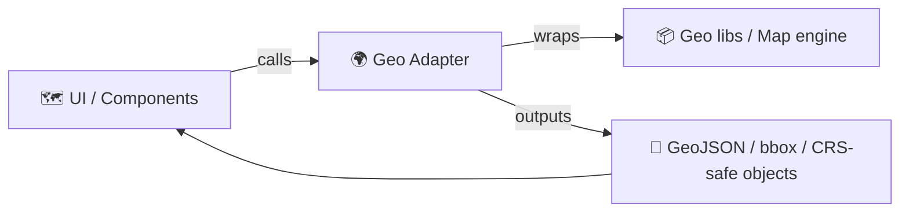

# 🌍 Geo Adapter — Test Suite


**Location:** `web/src/adapters/geo/__tests__/`

➡️ This folder contains **unit + adapter-level integration tests** for the **Geo adapter** used by the web UI.  
The mission here is simple: keep spatial behavior **correct, deterministic, and auditable** as the system evolves.

> [!TIP]
> Quick nav: [🎯 Purpose](#-purpose) • [🏃 Running tests](#-running-the-tests) • [🧰 Fixtures](#-fixtures--golden-data) • [✅ Coverage checklist](#-coverage-checklist) • [🧾 PR checklist](#-pr-checklist)

---

## ↩️ Links

- [⬅️ Back to geo adapter](..)
- [⬅️ Back to adapters](../..)
- [⬅️ Back to `web/src`](../../..)

---

## 🎯 Purpose

The Geo adapter is a **boundary layer** between:

- 🧠 **KFM’s domain-facing geo shapes** (GeoJSON, bbox, temporal filters, metadata)
- 🗺️ **Web mapping / geo libraries** (rendering engines, spatial utilities, projections, etc.)

These tests ensure:

- ✅ **No “mystery layers”**: all transformations are explicit and testable
- ✅ **Stable outputs**: ordering, rounding, normalization, and metadata behavior don’t drift
- ✅ **Regression-proofing**: when a geo bug happens once, it *never* happens again (add a test!)

---

## 🧱 Architecture fit: Ports & Adapters (why we test adapters hard)

Geo code tends to become “sticky” with vendor types (Map libraries, CRS utilities, spatial predicates).  
Adapters are where that stickiness lives — so tests act like a **contract wall** that keeps the rest of the app clean.



> [!NOTE]
> If a change forces UI or domain code to import map-engine types directly, that’s usually a smell.  
> Prefer expanding the adapter API and adding tests here.

---

## 🧪 What lives here

Typical contents (names may differ depending on the current runner/setup):

```text
📦 web/src/adapters/geo/
 ├─ 🧩 (adapter implementation files)
 └─ 🧪 __tests__/
    ├─ 📄 README.md            ← you are here
    ├─ 🧰 fixtures/            ← GeoJSON, bbox samples, edge cases
    ├─ 🧪 *.test.ts | *.spec.ts
    └─ 🧪 helpers.ts           ← shared builders/assertions (keep tiny)
```

### What we test (high-value targets)

- 🧭 **Coordinate conventions**
  - GeoJSON `[lon, lat]` order and bbox ordering
  - normalization for dateline-ish values (if supported)
- 🧱 **GeoJSON structure**
  - parsing/validation, missing fields, empty geometries, degenerate shapes
- 📦 **Catalog → map-friendly objects**
  - bbox extraction
  - CRS assumptions (GeoJSON commonly implies WGS84 / EPSG:4326)
  - “safe defaults” for the UI (no crashes)
- 🧪 **Determinism**
  - stable sorting (by id/time/etc. if adapter applies ordering)
  - stable rounding/tolerance behavior
- 🧯 **Known bug regressions**
  - lock the failure case into a fixture + a single focused assertion

---

## 🏃 Running the tests

From repo root, you’ll usually run tests from the `web/` workspace (or the monorepo root if configured that way).

```bash
# from repo root
cd web

# pick your package manager
pnpm test
# or
npm test
# or
yarn test
```

### Run only geo adapter tests (examples)

<details>
<summary>⚡ Vitest-style filtering</summary>

```bash
# run tests matching a path/pattern
pnpm vitest run src/adapters/geo

# or run a single file
pnpm vitest run src/adapters/geo/__tests__/geo.test.ts
```
</details>

<details>
<summary>🧪 Jest-style filtering</summary>

```bash
# run tests matching a path/pattern
pnpm jest src/adapters/geo

# or run a single file
pnpm jest src/adapters/geo/__tests__/geo.test.ts
```
</details>

> [!IMPORTANT]
> **Adapter tests must not require network access** (no remote tiles, no external geocoding, no live APIs).  
> If the adapter touches HTTP, mock it at the boundary and assert the request shape + response handling.

---

## 🧰 Fixtures & golden data

All geo bugs are “data bugs” in disguise. Fixtures are how we make them reproducible.

### ✅ Fixture rules

- 📌 **Small**: keep fixtures minimal and readable
- 🧾 **Self-documenting**: a short comment in the test explaining *why* it exists
- 🧭 **Explicit CRS**: if the adapter assumes EPSG:4326, encode that in the test name/assertions
- 🧊 **Deterministic**: avoid time-based randomness unless you seed/lock it
- 🔒 **No hidden transforms**: if a fixture needs projection, do it in the adapter and assert the result

### Suggested fixture naming

- `point__wichita.geojson`
- `line__trail_segment_small.geojson`
- `poly__county_simple.geojson`
- `bbox__kansas.geojson` (or `.json` if it’s just bbox)

> [!TIP]
> When a bug is found in production:  
> 1) add a fixture that reproduces it → 2) add a test that fails → 3) fix adapter → 4) keep the test forever ✅

---

## 🧭 Geo-specific gotchas (why tests matter)

- 🌐 **Coordinate order:** GeoJSON coordinates are `[longitude, latitude]`, not `[lat, lon]`
- 📦 **bbox order:** commonly `[minLon, minLat, maxLon, maxLat]`
- 🧲 **Floating point drift:** compare using tolerance (`toBeCloseTo` / epsilon) where needed
- 🧵 **Polygon winding:** some libraries care about ring direction; normalize if required
- 🌍 **Dateline/antimeridian:** bbox math and “wrap” behavior can surprise you
- 🗺️ **Projection:** Web Mercator vs geographic degrees (meters vs degrees) — keep units explicit

---

## ✅ Coverage checklist

Use this checklist when adding new adapter behavior (or when refactoring geo code):

- [ ] Inputs validate (bad GeoJSON doesn’t crash UI)
- [ ] CRS assumptions are explicit and tested
- [ ] bbox extraction matches GeoJSON expectations
- [ ] Feature ordering is stable (if adapter sorts)
- [ ] Transform math is tolerant where appropriate (no flaky float tests)
- [ ] No network / no reliance on real tiles/services
- [ ] Regression fixture added for any bug fix

---

## ✍️ Writing a new test

A good adapter test has **one reason to exist** and **one crisp assertion**.

```ts
// Vitest example:
// import { describe, it, expect } from "vitest";

// Jest example:
// import { describe, it, expect } from "@jest/globals";

describe("geo adapter", () => {
  it("normalizes bbox ordering (minLon/minLat/maxLon/maxLat)", () => {
    // Arrange: load a fixture or construct minimal GeoJSON/bbox input

    // Act: call the adapter function

    // Assert: verify ordering + values (use tolerance if needed)
    // expect(result).toEqual([minLon, minLat, maxLon, maxLat]);
  });
});
```

> [!NOTE]
> If your test has a lot of setup, consider moving *only the data* to a fixture and keeping logic inline.

---

## 🧯 Debugging tips

- 🔎 Log one thing at a time: bbox, CRS, and a single coordinate pair
- 🧊 If the test is flaky, it’s usually:
  - random ordering
  - floating comparisons
  - timezone/time-dependent parsing
- 🧪 Prefer “print the intermediate” over “bigger assertion”
- 🧱 If mocking a map engine: mock the smallest surface area (methods you call), not the whole world

---

## 🧾 PR checklist

Before merging geo adapter changes:

- [ ] I added/updated tests for the behavior change
- [ ] I added a regression test if I fixed a bug
- [ ] I did not introduce map-engine types into UI/domain layers
- [ ] Tests run locally and are deterministic
- [ ] Fixtures are minimal + documented

---

## 🔗 Related docs (project-level)

- 📚 KFM technical documentation (Testing & QA philosophy, contract-first data, provenance-first)
- 🧭 KFM architecture notes (web viewer, GeoJSON usage, modular design)

If you add new responsibilities to the geo adapter, update this README so future contributors know **where to put tests** and **how to keep them stable**. 🚀
