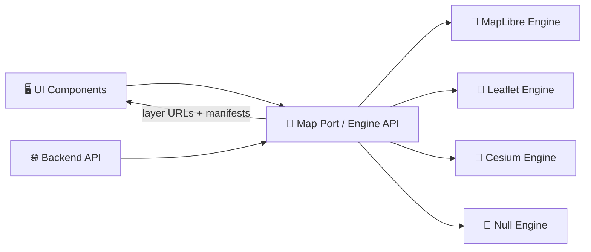

# 🗺️ Map Engines (Adapter Layer)


📍 **Location:** `web/src/adapters/map/engines/`

This folder houses **pluggable map rendering engines** for the KFM web viewer. Each engine implements the same **engine contract** so the rest of the UI can remain **map-library-agnostic** 🔌🧠.

> [!NOTE]
> We treat the map library (MapLibre / Leaflet / Cesium / etc.) as an *infrastructure detail*.
> The UI speaks to a stable **port** (`MapEngine`) and swaps **adapters** (engines) as needed.

---

## ✨ Why “Engines”?

KFM aims to keep core UI behavior stable while allowing the underlying renderer to evolve:
- ✅ Swap MapLibre ↔ Leaflet without rewriting the UI
- ✅ Add Cesium later for 3D / terrain without redesigning the app
- ✅ Test map behaviors in CI without requiring WebGL
- ✅ Enforce **dataset provenance + attribution** so we never ship “mystery layers” 🧾

---

## 🧱 Recommended Folder Layout

```text
📦 web/
 └─ 📂 src/
    └─ 📂 adapters/
       └─ 📂 map/
          └─ 📂 engines/
             ├─ 📂 maplibre/        # High-perf vector tiles + raster tiles (default direction)
             ├─ 📂 leaflet/         # Lightweight 2D overlays + GeoJSON (fallback / simple mode)
             ├─ 📂 cesium/          # 3D globe + terrain + 3D tiles (future expansion)
             ├─ 📂 null/            # Headless test engine (no DOM/WebGL)
             ├─ 📄 types.ts         # MapEngine contract + shared types
             ├─ 📄 registry.ts      # Engine registry / factory
             └─ 📄 index.ts         # Public exports
```

> [!TIP]
> If your engine needs helpers (converters, style mappers, layer factories), keep them inside the engine folder
> so the “blast radius” stays contained 💥➡️🧊.

---

## 🧭 Architectural View (Ports & Adapters)



### 🎯 What lives *outside* this folder
- Map UI components (controls, panels, timeline) 🧩
- Layer registry / layer catalog integration 🗂️
- API client + governance (redaction, permissions) 🛡️

### 🎯 What lives *inside* this folder
- Map library binding + lifecycle (mount/destroy) 🏗️
- Translating `LayerSpec` → library-specific layer/source objects 🧬
- Normalizing events (click/hover/move/selection) 🎛️
- Enforcing attribution + provenance display hooks 🧾

---

## 📜 Engine Contract (TypeScript)

> [!IMPORTANT]
> The contract must stay stable. Additive changes are OK. Breaking changes should be versioned
> or paired with migration + conformance tests ✅.

```ts
export type EngineId = "maplibre" | "leaflet" | "cesium" | "null";

export type MapCoord = { lon: number; lat: number };
export type MapView = {
  center: MapCoord;
  zoom: number;
  bearing?: number;
  pitch?: number;
};

export type TimeInstant = string; // ISO8601
export type TimeRange = { start: string; end: string }; // ISO8601

export type LayerKind =
  | "geojson"
  | "vector-tile"
  | "raster-tile"
  | "image-overlay"
  | "terrain"
  | "3d-tiles";

export type LayerProvenance = {
  title: string;              // Human readable name
  source: string;             // Who produced it
  license: string;            // License identifier or URL
  attribution: string;        // What we render in attribution UI
  stac?: string;              // STAC item/collection id or URL
  dcat?: string;              // DCAT dataset id or URL
  prov?: string;              // PROV bundle id or URL
  notes?: string;             // Optional disclaimers (derived/AI-generated, uncertainty, etc.)
};

export type LayerSpec = {
  id: string;
  kind: LayerKind;
  label?: string;

  // Source info (URLs should come from the API layer / server manifests)
  source: {
    url: string;
    sublayers?: string[];
    headers?: Record<string, string>;
  };

  // Visual + interaction
  visible?: boolean;
  opacity?: number;
  minZoom?: number;
  maxZoom?: number;
  interactive?: boolean;

  // Time filtering (for timeline slider)
  time?: TimeInstant | TimeRange;

  // 🧾 Provenance is required: no mystery layers
  provenance: LayerProvenance;
};

export type EngineEvent =
  | { type: "ready" }
  | { type: "move"; view: MapView }
  | { type: "click"; lonLat: MapCoord; layerHits?: Array<{ layerId: string; featureId?: string }> }
  | { type: "error"; error: unknown };

export type Unsubscribe = () => void;

export interface MapEngine {
  readonly id: EngineId;

  /** Mount into a container (engine owns the container’s contents). */
  mount(container: HTMLElement, initialView?: Partial<MapView>): Promise<void>;

  /** Tear down listeners, WebGL contexts, and internal caches. */
  destroy(): Promise<void>;

  /** View controls */
  setView(view: Partial<MapView>): void;
  getView(): MapView;

  /** Layer controls */
  addLayer(layer: LayerSpec): Promise<void>;
  removeLayer(layerId: string): Promise<void>;
  setLayerVisibility(layerId: string, visible: boolean): void;
  setLayerOpacity(layerId: string, opacity: number): void;

  /** Optional time hook (timeline slider). Engines that don’t support time can no-op. */
  setTime?(t: TimeInstant | TimeRange): void;

  /** Event stream */
  on(handler: (event: EngineEvent) => void): Unsubscribe;
}
```

---

## 🧾 Provenance & “No Mystery Layers”

KFM’s UI is expected to only display layers that are **provenance-linked**.

**What the engine must do:**
- ✅ Require `LayerSpec.provenance` for every layer
- ✅ Surface `provenance.attribution` in the map’s attribution UI (or a dedicated “Credits” panel)
- ✅ Provide a way for the UI to open “Layer Details” (metadata links like STAC/DCAT/PROV)
- ✅ Never silently add ad-hoc layers (debug layers should be visibly labeled as such) 🚧

> [!WARNING]
> If an engine cannot render attribution (or a dataset lacks provenance),
> the engine should **fail loudly** or mark the layer as **unpublishable** in production.

---

## ⏳ Time Slider Support (Historical Map Playback)

Many KFM experiences are time-indexed (e.g., “slide through years”).
Engines should treat time as a first-class capability where possible.

**Two common approaches:**
1. **Layer switching by time** (toggle visibility among multiple time-sliced layers)
2. **Filter by time** (apply a style/filter expression per-feature when supported)

> [!TIP]
> Prefer “filter by time” for vector tiles when the renderer supports it, and “layer switching”
> for raster overlays or simpler engines.

---

## 🧰 Engine Capability Matrix

| Capability 🧩 | MapLibre | Leaflet | Cesium |
|---|:---:|:---:|:---:|
| Vector tiles (`vector-tile`) | ✅ | ⚠️ (plugins / limited) | ⚠️ (not primary) |
| Raster tiles (`raster-tile`) | ✅ | ✅ | ✅ |
| GeoJSON (`geojson`) | ✅ | ✅ | ✅ |
| Image overlay (`image-overlay`) | ✅ | ✅ (strong) | ✅ |
| Timeline UI hooks (`setTime`) | ✅ (strong) | ✅ (via plugins) | ✅ (time-dynamic) |
| Terrain (`terrain`) | ⚠️ (limited / depends) | ❌ | ✅ (strong) |
| 3D tiles (`3d-tiles`) | ❌ | ❌ | ✅ (strong) |
| High-perf “many layers” | ✅ | ⚠️ | ✅ |
| Best for “simple overlays” | ⚠️ | ✅ | ⚠️ |

Legend: ✅ native / strong · ⚠️ possible but constrained · ❌ not supported

---

## 🧪 Testing Strategy

### ✅ Contract Conformance Tests
Every engine should pass the same “engine conformance suite”:
- Mount/destroy lifecycle
- Add/remove layers
- Visibility/opacity toggles
- Move/click event normalization
- Attribution + provenance enforcement

### 🧊 Null Engine
A `null/` engine enables:
- Fast unit tests without WebGL
- SSR-safe rendering (if needed)
- “UI-only” development mode

---

## 🧯 Common Pitfalls (and fixes)

- **WebGL context lost** (MapLibre): ensure `destroy()` removes canvas + listeners; handle re-mounts cleanly.
- **CORS on tiles**: prefer serving through KFM API / proxy or ensure correct headers.
- **Memory spikes**: avoid re-adding sources repeatedly; update in place when possible.
- **Inconsistent click hits**: normalize feature hit results to `{ layerId, featureId }`.

---

## 🧩 Adding a New Engine (Checklist)

- [ ] Create `web/src/adapters/map/engines/<engineId>/`
- [ ] Implement `MapEngine`
- [ ] Add factory + registration in `registry.ts`
- [ ] Add conformance tests + a tiny demo page/story
- [ ] Ensure attribution is visible for every rendered dataset 🧾
- [ ] Ensure engine only uses server-provided URLs/manifests (no bypass) 🛡️

---

## 🔗 Related Concepts (Inside KFM)

- Clean architecture / ports-and-adapters pattern 🏗️
- Provenance-first datasets (STAC/DCAT/PROV alignment) 🧾
- Frontend governance: no data leakage, respect redaction rules 🛡️

---

## 🧠 Philosophy (One-liner)

> **Swap the engine, keep the story.** 🗺️📚