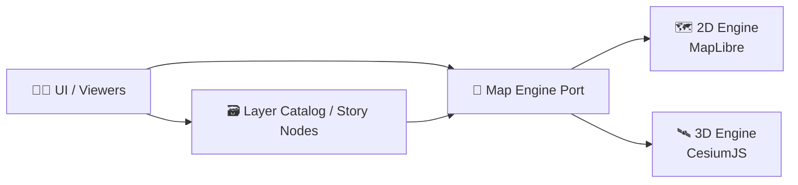

# 🛰️ Cesium Engine Adapter (KFM Web)

<p align="center">
  
  
  
  
</p>

> 🌎 **Purpose:** Provide an **optional 3D engine** for the KFM web map stack (terrain + globe + 3D datasets) while keeping **2D-first** navigation fast and lightweight.

---

## 🧭 Table of Contents

- [🎯 Why Cesium exists in KFM](#-why-cesium-exists-in-kfm)
- [🗺️ Where this engine fits](#️-where-this-engine-fits)
- [📦 Suggested folder layout](#-suggested-folder-layout)
- [🧩 Responsibilities](#-responsibilities)
- [🔌 Engine contract](#-engine-contract)
- [🧱 Layer support](#-layer-support)
- [⏱️ Timeline support](#️-timeline-support)
- [🔁 2D ↔ 3D synchronization](#-2d--3d-synchronization)
- [🧰 Build setup](#-build-setup)
- [🔐 Cesium ion tokens](#-cesium-ion-tokens)
- [🚀 Performance checklist](#-performance-checklist)
- [🧯 Troubleshooting](#-troubleshooting)
- [🧪 Dev workflow](#-dev-workflow)
- [📚 References](#-references)

---

## 🎯 Why Cesium exists in KFM

KFM’s web UI is designed to be **2D-first** (fast exploration, timelines, layers), but certain stories and datasets benefit massively from 3D:

- 🏔️ **Terrain context** (e.g., appreciating relief and landform changes over time)
- 🧱 **Streaming 3D Tiles** (point clouds, buildings, volumetric geo datasets)
- ⏱️ **Time-dynamic overlays** via **CZML** (great match for story/timeline-driven exploration)
- ✨ “Wow factor” moments for narrative transitions (e.g., “Kansas From Above” style beats)

> ⚠️ **Important:** 3D is heavier (GPU + memory + bandwidth). Treat Cesium as **opt-in** and load it **only when needed**.

---

## 🗺️ Where this engine fits

This adapter is part of the map “ports & adapters” approach: the app speaks to a **Map Engine interface**, and the engine implements it using CesiumJS.



**Key idea:** The **rest of the app** (stories, layer catalog, timeline) should not care *which engine* is active—only that the engine honors the same contracts.

---

## 📦 Suggested folder layout

> 👇 This is the *recommended* structure to keep Cesium-specific concerns contained.

```text
📦 web/
  └─ 🧭 src/
     └─ 🧩 adapters/
        └─ 🗺️ map/
           └─ 🧠 engines/
              ├─ 🧩 maplibre/
              └─ 🛰️ cesium/
                 ├─ README.md            👈 you are here
                 ├─ index.ts             🔁 public exports
                 ├─ CesiumEngine.ts      🧠 engine implementation
                 ├─ types.ts             🧾 Cesium-specific options/types
                 ├─ layers/
                 │  ├─ tiles3d.ts        🧱 3D Tiles loader
                 │  ├─ czml.ts           ⏱️ CZML loader
                 │  └─ imagery.ts        🛰️ imagery/rasters
                 └─ utils/
                    ├─ cameraSync.ts     🔁 2D ↔ 3D view conversions
                    └─ picking.ts        🖱️ feature picking/hover
```

---

## 🧩 Responsibilities

✅ This engine adapter **should**:

- 🛰️ Create/own the Cesium render context (Viewer/Scene) inside the provided container
- 🧭 Maintain the app’s **map view state** (center/heading/pitch/zoom-ish)
- 🧱 Load and manage Cesium-friendly layer types (3D Tiles, CZML, imagery, etc.)
- 🖱️ Emit consistent interaction events (click / hover / pick / camera changed)
- 🔎 Support “map behind the map” UX hooks (metadata/provenance surfaced per layer/feature)

🚫 This engine adapter **should NOT**:

- ❌ Implement UI widgets (timeline UI, layer panel UI, story UI)
- ❌ Hardcode dataset URLs (it should receive URLs/metadata from the catalog/API)
- ❌ Become a “mini app” (keep it a swap-in engine implementation)

---

## 🔌 Engine contract

> The actual interface lives elsewhere (the “port”). This is a **shape** the Cesium engine is expected to satisfy.

```ts
export type MapEngineId = "maplibre" | "cesium";

export interface MapViewState {
  /** WGS84 lon/lat in degrees */
  center: { lon: number; lat: number };
  /** camera heading / bearing in degrees */
  bearing: number;
  /** camera pitch in degrees */
  pitch: number;
  /** abstracted zoom level OR camera height depending on engine strategy */
  zoom: number;
  /** optional: time cursor for time-dynamic layers */
  time?: string; // ISO string
}

export type MapLayerType =
  | "3d-tiles"
  | "czml"
  | "imagery"
  | "geojson"
  | "unknown";

export interface MapLayerDescriptor {
  id: string;
  type: MapLayerType;
  label?: string;
  url: string;
  opacity?: number;
  visible?: boolean;
  meta?: Record<string, unknown>; // provenance, attribution, etc.
}

export interface MapEngine {
  readonly id: MapEngineId;

  init(container: HTMLElement, opts?: unknown): Promise<void>;
  destroy(): void;

  setView(view: MapViewState): void;
  getView(): MapViewState;

  addLayer(layer: MapLayerDescriptor): Promise<void>;
  removeLayer(layerId: string): void;
  setLayerVisibility(layerId: string, visible: boolean): void;
  setLayerOpacity(layerId: string, opacity: number): void;

  pick(screen: { x: number; y: number }): unknown | null;

  on(event: string, handler: (...args: any[]) => void): () => void;
}
```

---

## 🧱 Layer support

### ✅ Primary targets

| KFM Descriptor Type | Cesium Implementation | Best for | Notes |
|---|---|---|---|
| 🧱 `3d-tiles` | `Cesium3DTileset` | LiDAR point clouds, buildings, meshes | Expects a `tileset.json` URL |
| ⏱️ `czml` | `CzmlDataSource` | time-dynamic entities | Works great with a timeline cursor |
| 🛰️ `imagery` | `ImageryLayer` | basemaps + raster overlays | XYZ/WMS/WMTS patterns vary |
| 🧷 `geojson` | `GeoJsonDataSource` (Entities) | features, boundaries | Clamping & styling differ from 2D |

### ✍️ Layer descriptor examples

#### 🧱 3D Tiles
```json
{
  "id": "kansas-lidar-tiles",
  "type": "3d-tiles",
  "label": "Kansas LiDAR (Tiles)",
  "url": "https://example.org/tiles/kansas/tileset.json",
  "visible": true,
  "opacity": 1
}
```

#### ⏱️ CZML
```json
{
  "id": "migration-paths",
  "type": "czml",
  "label": "Migration Paths (1850–1900)",
  "url": "https://example.org/czml/migration.czml",
  "visible": true,
  "opacity": 1
}
```

---

## ⏱️ Timeline support

KFM’s UI includes a timeline slider; Cesium can participate by:

- Driving `viewer.clock.currentTime` from the app’s time cursor
- Keeping `viewer.timeline` **disabled** (KFM provides its own UI)
- Using CZML + availability intervals for time filtering

> 💡 If the timeline slider is the single source of truth, treat Cesium as a renderer that **reacts** to the app time cursor.

---

## 🔁 2D ↔ 3D synchronization

KFM can support both engines by:

1) **Dual-canvas strategy** (simple + robust):
- Keep MapLibre and Cesium in separate containers
- Toggle visibility (hide one canvas, show the other)
- Sync view state on switch

2) **Single-engine mode** (advanced):
- Attempt to approximate 2D mode inside Cesium (less ideal if MapLibre remains primary)

### Suggested sync rules ✅

- 📍 **Always store canonical view state in WGS84 lon/lat**
- 🔁 On switching **2D → 3D**:
  - Convert MapLibre center/bearing/pitch into a Cesium camera destination/orientation
- 🔁 On switching **3D → 2D**:
  - Ray pick the globe center and infer a 2D center + bearing + pitch/zoom approximation

> 🧠 Keep the conversion logic isolated in `utils/cameraSync.ts` so it can evolve independently.

---

## 🧰 Build setup

CesiumJS requires static assets (Workers, Assets, Widgets, ThirdParty) to be served by your web app.

> ✅ If you see runtime 404s for `Workers/*.js` or missing widget icons → your static assets aren’t being served correctly.

<details>
  <summary><strong>⚡ Vite example (recommended for modern stacks)</strong></summary>

```ts
// vite.config.ts (example)
import path from "path";
import { defineConfig } from "vite";
import react from "@vitejs/plugin-react";
import { viteStaticCopy } from "vite-plugin-static-copy";

const cesiumSource = "node_modules/cesium/Build/Cesium";
const cesiumBaseUrl = "cesiumStatic";

export default defineConfig({
  plugins: [
    react(),
    viteStaticCopy({
      targets: [
        { src: path.join(cesiumSource, "ThirdParty"), dest: cesiumBaseUrl },
        { src: path.join(cesiumSource, "Workers"), dest: cesiumBaseUrl },
        { src: path.join(cesiumSource, "Assets"), dest: cesiumBaseUrl },
        { src: path.join(cesiumSource, "Widgets"), dest: cesiumBaseUrl },
      ],
    }),
  ],
  define: {
    // ✅ required for ESM builds
    CESIUM_BASE_URL: JSON.stringify(cesiumBaseUrl),
  },
});
```

And in your app entry:

```ts
import "cesium/Build/Cesium/Widgets/widgets.css";
```

</details>

<details>
  <summary><strong>🧱 Webpack example (if your web app uses webpack)</strong></summary>

```js
// webpack.config.js (example)
const path = require("path");
const CopyWebpackPlugin = require("copy-webpack-plugin");
const webpack = require("webpack");

const cesiumSource = "node_modules/cesium/Build/Cesium";
const cesiumBaseUrl = "cesiumStatic";

module.exports = {
  plugins: [
    new CopyWebpackPlugin({
      patterns: [
        { from: path.join(cesiumSource, "Workers"), to: `${cesiumBaseUrl}/Workers` },
        { from: path.join(cesiumSource, "ThirdParty"), to: `${cesiumBaseUrl}/ThirdParty` },
        { from: path.join(cesiumSource, "Assets"), to: `${cesiumBaseUrl}/Assets` },
        { from: path.join(cesiumSource, "Widgets"), to: `${cesiumBaseUrl}/Widgets` },
      ],
    }),
    new webpack.DefinePlugin({
      CESIUM_BASE_URL: JSON.stringify(cesiumBaseUrl),
    }),
  ],
};
```

And in your app entry:

```js
import "cesium/Build/Cesium/Widgets/widgets.css";
```

</details>

---

## 🔐 Cesium ion tokens

Cesium ion is optional, but common if you use:

- 🌍 World Terrain
- 🏙️ OSM Buildings / hosted 3D content
- 🔎 Geocoding services

### Recommended practice ✅

- Store token in an environment variable (never hardcode)
- Use one token per deployed app
- Restrict allowed URLs for browser apps

```ts
import { Ion } from "cesium";

// Vite example (adjust to your env system)
Ion.defaultAccessToken = import.meta.env.VITE_CESIUM_ION_TOKEN ?? "";
```

> 🔒 If you see a warning about using a default/demo token, generate your own ion token and replace it.

---

## 🚀 Performance checklist

- ✅ Keep 3D opt-in (only render when user/story requests)
- ✅ Prefer `requestRenderMode` when possible (render on demand)
- ✅ Cap tileset quality / screen-space error for smooth performance
- ✅ Remove/unload tilesets when not needed (don’t let memory accumulate)
- ✅ Avoid enabling lots of expensive post-processing by default
- ✅ Make layer visibility/opacity changes cheap (don’t recreate primitives unless necessary)

---

## 🧯 Troubleshooting

### Black screen / missing icons / 404 Workers
- Confirm Cesium static assets are copied and served
- Confirm `CESIUM_BASE_URL` matches where your server hosts the files
- Confirm `widgets.css` is imported

### “Warning… default ion access token”
- Set `Ion.defaultAccessToken` from your environment
- Use a token scoped to your app + restrict URLs

### CORS errors loading tiles/czml
- Ensure the asset host sets `Access-Control-Allow-Origin`
- Prefer serving tiles through KFM’s controlled endpoints where feasible

### Click picking feels “off”
- Ensure you convert screen coords correctly (devicePixelRatio matters)
- Prefer globe/tileset pick methods appropriate to the primitive type

---

## 🧪 Dev workflow

### When adding a new Cesium-backed layer type 🧩
1. Add a `MapLayerType` discriminator
2. Implement loader in `layers/*`
3. Normalize events (click/pick/hover) into the engine’s event bus
4. Ensure all layers carry `meta` for provenance/attribution display
5. Add a short example descriptor to this README

---

## 📚 References

- CesiumJS Quickstart: https://cesium.com/learn/cesiumjs-learn/cesiumjs-quickstart/
- Configure CesiumJS for Vite/Webpack: https://cesium.com/blog/2024/02/13/configuring-cesiumjs-vite-webpack/
- 3D Tiles (overview): https://cesium.com/learn/3d-tiles/
- CZML (overview): https://cesium.com/learn/cesiumjs/ref-doc/CzmlDataSource.html

---
🧡 *Keep 2D fast. Make 3D magical. Ship provenance always.*