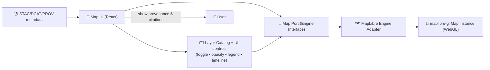

# 🗺️ MapLibre Engine Adapter (2D) — `web/src/adapters/map/engines/maplibre`


**MapLibre** is KFM’s primary **2D mapping engine** (fast vector tiles + interactive overlays via WebGL).  
This adapter lives behind the **map “port”** so the rest of the UI can stay engine-agnostic (e.g., swap to Cesium for 3D 🌍 without rewriting layer logic).

---

## ✨ What this engine is responsible for

✅ **Create & manage** a MapLibre map instance (mount/unmount, resize, cleanup)  
✅ Render **vector tile basemaps** + **thematic overlays** (GeoJSON / vector tiles / raster tiles)  
✅ Drive core UX staples:
- 🧩 Layer toggle on/off
- 🎚️ Opacity control
- 🗂️ Legends (and keeping them in sync with visible data)
- 🧾 “Map behind the map”: feature/layer metadata & provenance surfaced on click/hover
- ⏳ Timeline linkage for time-aware layers (scrub through years / dates)

🚫 Not responsible for:
- ETL / data processing (that happens earlier in the pipeline)
- Authoring Story Nodes (but it must support “story-driven map actions”)
- 3D/terrain rendering (use the Cesium engine for that)

---

## 🧠 KFM design constraints (non‑negotiables)

> [!IMPORTANT]
> KFM is **evidence-first** and **provenance-first**.  
> Any layer this engine renders should have a **clear pointer back** to dataset metadata (STAC/DCAT) and lineage (PROV) so the UI can expose citations and source context.

**Implications for this adapter:**
- Layers should carry enough identifiers/handles so a click can open a “details panel” (dataset title, owner/source, processing notes, etc.).
- “Pretty map” is not enough — we must support **traceability**.

---

## 🧱 Architecture (Ports & Adapters) 🔌



---

## 📁 Where this fits in the repo

```text
📁 web/
└── 📁 src/
    └── 📁 adapters/
        └── 📁 map/
            └── 📁 engines/
                └── 📁 maplibre/
                    ├── 📄 README.md   👈 you are here
                    └── 📄 (engine implementation files...)
```

---

## 🚀 Quick start (typical usage pattern)

> [!NOTE]
> Names below are **illustrative** (match them to the actual exported engine class / types in this folder).

### 1) Ensure MapLibre CSS is loaded 🎨

```ts
import 'maplibre-gl/dist/maplibre-gl.css';
```

### 2) Mount in React 🧩

```tsx
import React, { useEffect, useRef } from 'react';
// import { MapLibreEngine } from './MapLibreEngine';

export function MapView() {
  const elRef = useRef<HTMLDivElement | null>(null);

  useEffect(() => {
    if (!elRef.current) return;

    // const engine = new MapLibreEngine();
    // engine.mount(elRef.current, { styleUrl: '/styles/base.json', center: [-98, 38.5], zoom: 5 });

    return () => {
      // engine.destroy();
    };
  }, []);

  return <div ref={elRef} style={{ width: '100%', height: '100%' }} />;
}
```

---

## 🗂️ Supported layer types (recommended)

### 🧱 Vector Tiles (preferred for scale)
- Great for large datasets (boundaries, parcels, dense features)
- Styleable in the MapLibre style spec
- Best performance for pan/zoom

### 🧾 GeoJSON (best for small-to-medium overlays)
- Great for curated layers, story overlays, “selected features”
- Avoid massive GeoJSON blobs in production (performance)

### 🧊 Raster Tiles (XYZ / TileJSON)
- Great for scanned historical maps, hillshade, imagery, heatmaps
- Use opacity + ordering thoughtfully so layers remain readable

> [!TIP]
> If you’re serving rasters derived from COGs, prefer a **tile service / pre-tiled pyramid** (MapLibre consumes tiles; “direct COG reads” usually require extra tooling).

---

## 🧾 Provenance & metadata hooks (“map behind the map”) 🔎

KFM’s UI expects that users can **click or hover** and immediately see:
- Dataset name/title (human readable)
- Source organization (where it came from)
- Metadata + notes
- Ideally: citations/links to evidence artifacts

### ✅ What the engine should expose upstream
Even if the UI owns the panel, the engine should return enough context for:
- `layerId` / `datasetId` (or equivalent)
- `featureId` (if applicable)
- `properties` from the feature
- any “join keys” used to cross-link into graph/catalogs

**Practical guidance:**
- When you add a layer, store a small “descriptor” object alongside it.
- On click, resolve *rendered features* → map them back to descriptors → send to UI.

---

## ⏳ Timeline integration (temporal navigation)

Many KFM layers are time-aware (historical boundaries, land cover shifts, event series).

### What “time aware” usually means
- A layer’s features include a `year`, `date`, or `system:time_start`-style attribute
- The layer has known temporal coverage in metadata
- The UI timeline “scrub” should update the layer’s **filter** and/or **visibility**

### Recommended engine capability 🧠
Implement a method that can apply temporal updates consistently, e.g.
- set filter expressions on MapLibre layers
- swap sources per time-slice (if data is tiled by year)
- update legends/captions as the visible slice changes

Example (illustrative):
```ts
// engine.setTime({ year: 1885 });

// under the hood: map.setFilter(layerId, ["==", ["get", "year"], 1885])
```

> [!TIP]
> If you have many layers reacting to time, centralize a “time state” and push updates via a single engine method (avoids UI → map drift).

---

## 🧩 Adding a new layer (developer checklist) ✅

### 1) Data & governance (before UI)
- [ ] Dataset exists in **processed outputs**
- [ ] Dataset has **STAC** record(s)
- [ ] Dataset has **DCAT** entry
- [ ] Dataset has **PROV** lineage bundle (or equivalent lineage record)

### 2) UI/engine wiring
- [ ] Define a stable `layerId` (no random IDs)
- [ ] Provide:
  - [ ] default visibility
  - [ ] opacity defaults
  - [ ] legend spec (labels, stops, units)
  - [ ] attribution / source label
  - [ ] (optional) temporal metadata and time field mapping

### 3) Interaction
- [ ] Click returns feature info + provenance hook
- [ ] Hover (optional) shows quick label/tooltips
- [ ] Story Nodes can programmatically toggle/zoom to it

---

## 🧪 Testing strategy

### Unit tests ✅
- MapLibre instance can be mocked; test:
  - “mount/unmount calls expected map methods”
  - “layer add/remove dispatches correct MapLibre calls”
  - “time filter builds correct filter expression”
  - “opacity updates use correct paint properties”

### Integration tests 🧭
- Render a minimal map with a tiny GeoJSON fixture
- Verify click → returns expected feature props + descriptor IDs
- Verify timeline scrub → changes feature visibility/filter

---

## 🛠️ Troubleshooting (common gotchas)

<details>
<summary><strong>🧯 Tiles don’t load / blank map</strong></summary>

- Check CORS headers on your tile endpoints  
- Verify style URL is reachable and valid JSON  
- Confirm sources referenced in the style exist and match expected TileJSON/XYZ formats  
</details>

<details>
<summary><strong>🎨 Layers disappear after switching styles</strong></summary>

MapLibre style reloads can wipe custom layers/sources.  
Solution: re-add custom layers after `style.load` (or your chosen style-ready event).
</details>

<details>
<summary><strong>🐢 Performance tanks with GeoJSON</strong></summary>

- Avoid very large GeoJSON files  
- Prefer vector tiles for huge feature counts  
- Consider simplifying geometry server-side  
</details>

<details>
<summary><strong>🧠 Legends don’t match what’s shown</strong></summary>

Legends should be derived from the **same mapping** used for styling (stops/thresholds).  
If style changes with time or filters, update the legend on those state transitions.
</details>

---

## 📚 References & related docs

- 📘 KFM pipeline + governance (why Map UI must stay provenance-linked): `docs/MASTER_GUIDE_v13.md`
- 🗺️ Front-end design notes (maps + timeline + storytelling): see KFM technical docs
- ⏳ MapLibre time slider example (handy for temporal layers): `https://maplibre.org/maplibre-gl-js/docs/examples/create-a-time-slider/`

---

## 🧭 North-star behaviors (UX expectations)

- Users can **toggle layers** and **adjust opacity** easily 🎚️  
- Legends are **always accurate** 🧾  
- Clicking a feature reveals **source + context** (not just raw attributes) 🔎  
- Timeline scrubbing feels smooth and “truthful” (no hidden state drift) ⏳  
- This engine stays a clean adapter: it **doesn’t leak MapLibre details** into the rest of the app 🔌✅