# 🛰️ Telemetry Adapter — Test Suite (`web/src/adapters/telemetry/__tests__`)


> 📍 **You are here:** `web/src/adapters/telemetry/__tests__/README.md`  
> 🧠 **Goal:** Keep telemetry **trustworthy**, **schema-valid**, and **safe** (especially around redaction + sovereignty).

---

## 🧭 Quick links

- 📘 Repo guide: `../../../../../docs/MASTER_GUIDE_v13.md`
- ⚖️ Governance:  
  - `../../../../../docs/governance/ROOT_GOVERNANCE.md`  
  - `../../../../../docs/governance/ETHICS.md`  
  - `../../../../../docs/governance/SOVEREIGNTY.md`  
  - `../../../../../docs/governance/REVIEW_GATES.md`
- 🧾 Telemetry contracts (source of truth): `../../../../../schemas/telemetry/`

---

## ✅ What these tests are responsible for

These tests act like a **contract + safety harness** around the telemetry adapter:

- 🧾 **Contract-first validation**  
  Ensure emitted events match the **JSON Schemas** in `schemas/telemetry/` (shape, required fields, enums, versions).
- 🛡️ **Governance / redaction correctness**  
  Ensure telemetry never leaks sensitive content (PII, protected coordinates, restricted labels).
- 🧰 **Adapter behavior stays swappable**  
  The telemetry adapter is an **integration boundary**: tests should prove behavior without binding to any specific vendor SDK.
- 🧯 **Failure modes don’t cascade**  
  Telemetry must never take down UI flows (network down, collector missing, quota, serialization errors, etc.).

> [!IMPORTANT]
> Telemetry is part of KFM’s “trust plumbing.” If it’s wrong, we lose auditability.  
> If it’s *unsafe*, we lose community trust. 🚫

---

## 🧱 Context: where telemetry sits in the architecture

Telemetry in KFM is an **adapter**: it should be easy to replace without impacting core behavior.

```mermaid
flowchart LR
  UI[🗺️ Map UI / React] -->|calls| TA[🛰️ Telemetry Adapter]
  TA -->|sends| T1[📨 Transport: console/http/batch]
  T1 -->|exports| OBS[📊 Observability backend / dashboards]
  TA -->|must NOT leak| GOV[⚖️ Governance + Sovereignty Guardrails]
```



**Tests here should:**
- Validate **what** is emitted (schema + semantics)
- Validate **what is not** emitted (no raw sensitive payloads)
- Validate **how** emission behaves (non-blocking, resilient, configurable)

---

## 🗂️ Folder map (local)

```text
📁 web/
  📁 src/
    📁 adapters/
      📁 telemetry/
        📁 __tests__/   ✅ you are here
          📄 README.md
```

> If you add new helper utilities for tests (recommended), keep them **co-located** in this folder (e.g., `fixtures.ts`, `testTransport.ts`) to avoid “helper drift.” 🧲

---

## 🧪 Test categories we expect

### 1) 🧾 Contract tests (schema conformance)
**Purpose:** Telemetry payloads are essentially **API outputs**. Treat them like governed contracts.

✅ Example assertions (conceptual):
- `event_name` exists and matches allowed pattern / enum
- `event_version` matches schema version
- `timestamp` is valid + deterministic in tests (mocked)
- `payload` conforms (no extra fields if schema forbids them)

**Implementation tip:** Use a JSON-schema validator (commonly `ajv`) in tests if a helper already exists.

---

### 2) 🛡️ Redaction + sovereignty tests (no sensitive leaks)
Telemetry should reflect *that* a redaction happened, without storing the redacted data.

✅ Example assertions:
- Events triggered by “Focus Mode” or sensitive layers **emit an audit signal** (e.g. `focus_mode_redaction_notice_shown`)
- Payload includes **only** safe context (flags, generalized counts, coarse buckets)
- No raw lat/lon at full precision, no names, no IDs that can identify individuals

> [!WARNING]
> If a test ever includes real person names, precise site coordinates, private emails, API keys, etc. — **delete it** and regenerate synthetic fixtures. 🧨

---

### 3) 🧩 Configuration / consent tests
Telemetry must respect environment + user choices.

✅ Example assertions:
- Telemetry is disabled in certain environments (e.g., tests, local dev) unless explicitly enabled
- “Opt-out” prevents emission / export, but may allow **local-only** dev logging (if supported)
- Sampling behaves consistently when enabled

---

### 4) 🧯 Resilience tests (never block UI)
Telemetry should be **best-effort**.

✅ Example assertions:
- Transport throws → UI code continues; error is swallowed or routed to safe logger
- Offline mode → events are dropped or queued (depending on design) without crashing
- Burst events → batching/backpressure keeps UI responsive

---

## ▶️ Running these tests

Because KFM can be run with different JS package managers, use the repository scripts as the source of truth.

### Option A: run all web tests 🧪
```bash
# from repo root
cd web
npm test
```

### Option B: run telemetry-focused tests 🎯
```bash
# from repo root (examples — choose whichever matches your tooling)
npm test -- telemetry
npm test -- web/src/adapters/telemetry

# pnpm style (if used)
pnpm -C web test -- telemetry
pnpm -C web test -- web/src/adapters/telemetry
```

### Option C: watch mode 👀
```bash
cd web
npm test -- --watch
```

> [!NOTE]
> If none of the above match your scripts, open `web/package.json` and use whatever `test:*` scripts are defined there.

---

## 🧬 Adding a new telemetry event (the “contract-first” path)

When you introduce a new event, treat it like a schema’d API change:

1. 🧾 **Add/extend schema** under `schemas/telemetry/`  
2. 🧠 **Update the adapter** to emit the new event  
3. 🧪 **Add tests** that prove:
   - event conforms to schema
   - event is emitted in the correct UX path
   - payload contains no sensitive data
4. 🔒 **Consider governance impact**  
   If it intersects sovereignty/redaction, add explicit tests for audit signals and non-leakage.

✅ **Definition of Done checklist**
- [ ] Schema exists and validates
- [ ] Unit tests cover happy path
- [ ] Redaction/safety tests cover sensitive path
- [ ] Failure-mode tests cover transport errors
- [ ] No snapshots of unstable IDs/timestamps (or they’re normalized)

---

## 🧰 Test-writing guidelines (avoid flakiness)

### ⏱️ Make time deterministic
- Mock `Date.now()` / timers
- If UUIDs/session IDs exist, stub them

### 🧱 Prefer “assert on meaning,” not implementation
- Assert event content + schema compliance
- Avoid asserting internal queue lengths unless they are part of the contract

### 🧼 Keep fixtures synthetic + minimal
- Use the smallest payload that exercises the rule
- Never paste real dataset records into tests

### 🧯 Avoid brittle snapshots
If you must snapshot, normalize dynamic fields first:
- timestamps
- random IDs
- build hashes
- user agent strings

---

## 🔍 Common gotchas (and how to fix)

<details>
  <summary><strong>🧊 Tests failing randomly due to timers</strong></summary>

- Use fake timers consistently for the entire suite
- Flush promises + microtasks after emission
- Prefer explicit awaiting of telemetry “flush” if the adapter supports it

</details>

<details>
  <summary><strong>🧾 Schema failures after adding fields</strong></summary>

- Update the schema first (contract-first)
- Ensure the schema versioning strategy is respected
- Add migration logic only if older collectors must accept new payloads

</details>

<details>
  <summary><strong>🛡️ Safety test catches coordinates/PII</strong></summary>

- Replace fields with:
  - coarse grids / buckets
  - hashes (salted if appropriate)
  - boolean flags (`was_redacted: true`)
  - counts (`features_visible_count`)
- Add/extend a test that proves the new field stays safe

</details>

---

## 🧷 Maintainer notes

Telemetry tests are not “nice to have.” They are part of how KFM:
- proves compliance (audit trails)
- protects sensitive cultural / sovereignty data
- prevents accidental regressions during UI iteration

If you’re unsure whether something belongs in telemetry, ask:
> “Would we be comfortable publishing this exact payload publicly?” 
If the answer is **no**, it doesn’t belong. 🚫

---

🗺️✨ Happy testing — keep it observable *and* respectful.
