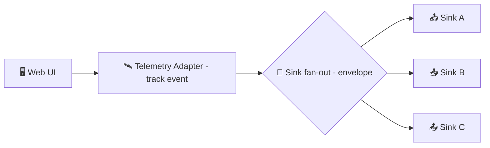

# 🛰️ Telemetry Sinks


**📍 Location:** `web/src/adapters/telemetry/sinks/`  
This folder contains **telemetry sink implementations** — the outbound adapters that take **structured telemetry events** and deliver them to a destination (console, HTTP endpoint, collector, etc.).

> ✅ **Goal:** Make telemetry *pluggable* (swap destinations without touching core logic) and *safe-by-default* (no governance/sovereignty leaks).

---

## 🧭 Why “sinks” exist

KFM follows a **ports & adapters / clean architecture** approach: core logic defines *what* telemetry is, and sinks define *where* it goes. This keeps the “center” independent of infrastructure choices (vendors, protocols, storage). ✨

Typical reasons you’ll add/modify a sink:

- 🧪 **Local dev**: human-readable output while building features
- 📈 **Observability**: performance + error signals for deployments
- 🧾 **Governance/audit signals**: *proof that guardrails executed* (e.g., Focus Mode showing a redaction notice)
- 🧩 **Experimentation**: try a new destination without refactoring upstream telemetry producers

---

## 🏗️ Where sinks sit in the stack



**Sinks are the last hop.** They should be treated as infrastructure: replaceable, testable, and not allowed to “invent” business meaning.

---

## 📁 Folder expectations

Keep this directory clean and discoverable:

```text
web/
└─ 📁 src/
   └─ 🧩 adapters/
      └─ 📡 telemetry/
         └─ 🧰 sinks/
            ├─ 📄 README.md  👈 you are here 📌
            ├─ 🧰📄 <sink>.ts  # (one file per sink, when possible)
            └─ 🧩📄 index.ts   # (exports / registry, if used)
```

> 🧠 If you’re unsure what counts as a “sink”: if its primary job is **delivery/transport/output**, it belongs here.

---

## ✅ What belongs in a sink

A sink should focus on **delivery mechanics**, not business logic:

- 📦 **Batching** (optional): reduce network chatter
- 🧯 **Backpressure**: bounded buffers, drop strategy, size limits
- 🔁 **Retry** (optional): with caps to avoid runaway loops
- 🧼 **Final sanitation**: enforce payload limits & guardrails (see below)
- 🧾 **Diagnostics**: minimal internal logging for sink failures (without leaking sensitive data)

### 🚫 What does *not* belong in a sink

- ❌ Deciding **what** to track (that’s upstream)
- ❌ Enriching with **sensitive raw data**
- ❌ Bypassing KFM constraints (sovereignty, redaction, classification)
- ❌ “Convenient” side channels (e.g., dumping full objects “temporarily”)

---

## 🧩 Recommended sink contract

> This is the **expected shape** for sinks in this folder. If the current codebase uses slightly different names, keep the same *capabilities*: `emit` + optional `flush`/`shutdown`.

```ts
export interface TelemetrySink {
  /** Human-readable identifier, used for debugging and routing. */
  readonly name: string;

  /**
   * Emit ONE telemetry envelope (already validated upstream).
   * Must be safe to call frequently and should never block UI for long.
   */
  emit(envelope: TelemetryEnvelope): void | Promise<void>;

  /**
   * Optional: force-deliver buffered events.
   * Useful on route changes or visibility/unload events.
   */
  flush?(): Promise<void>;

  /**
   * Optional: final cleanup (timers, network handles, etc.).
   */
  shutdown?(): Promise<void>;
}
```

### 📨 Envelope shape (example)

Telemetry should be **structured** and **schema-backed**. A typical envelope:

```ts
export type TelemetryEnvelope = {
  ts: number;                  // epoch ms
  event: {
    name: string;              // e.g., "focus_mode_redaction_notice_shown"
    kind: "ui" | "api" | "perf" | "security" | "governance";
    attributes?: Record<string, unknown>;
  };
  context: {
    app: "web";
    build?: string;            // git sha / build id
    sessionId?: string;        // pseudonymous
  };
  policy: {
    classification?: "public" | "internal" | "restricted";
    consent?: "opt-in" | "opt-out" | "required";
    redacted?: boolean;
  };
};
```

> 🔎 **Schema first:** prefer validating envelopes against `schemas/telemetry/` before they ever reach sinks.

---

## 🛡️ Privacy, sovereignty, and “no side-channel” rules

KFM’s governance stance means telemetry must not become a leakage path.

### 🔒 Hard rules (non-negotiable)

- 🚫 **No raw sensitive locations** (exact coordinates, precise site points, etc.)
- 🚫 **No direct PII** (email, phone, street address, names unless explicitly allowed)
- 🚫 **No secrets** (tokens, API keys, auth headers, cookies)
- ✅ **Prefer references** over values (dataset IDs, layer IDs, story IDs, etc.)
- ✅ **Prefer aggregation** over detail (counts, buckets, coarse regions)
- ✅ **Respect consent** (do not emit analytics if user is opted out)

> ⚠️ If a sink can “see” sensitive payloads, it must be able to **drop** them.  
> Defense-in-depth is expected — upstream should redact, but sinks should also protect.

### 🧯 Final sanitation checklist for sinks

Before sending an event out of process/network:

- [ ] 🧵 Enforce a **max payload size** (truncate attributes / drop oversized)
- [ ] 🧼 Remove known-danger keys (e.g., `token`, `authorization`, `cookie`)
- [ ] 🧭 Remove high-precision location fields (or coarsen to safe level)
- [ ] 🧾 Ensure the envelope carries **classification + consent**
- [ ] 🧪 Fail safely: if unsure → **drop**, don’t “try anyway”

---

## 🧾 Governance-friendly telemetry patterns

Certain events exist to prove guardrails executed and to support audits. Example patterns:

- `focus_mode_redaction_notice_shown` ✅ (audit that the user was warned)
- `sensitivity_rule_applied` ✅ (policy enforcement occurred)
- `dataset_access_denied` ✅ (boundary respected)

> 🧠 Tip: Governance events should be **minimal** but **traceable** (include policy ID / rule ID, not sensitive data).

---

## ➕ Adding a new sink

### 1) Create the sink file 🧱
Add a new implementation in this directory (example name):

- `FooSink.ts` (or `fooSink.ts` depending on project conventions)

### 2) Wire it into the sink registry 🔌
Common patterns:

- Export from `web/src/adapters/telemetry/sinks/index.ts`
- Register in a telemetry factory/router one level up (e.g., `web/src/adapters/telemetry/*`)

### 3) Ensure it obeys constraints 🔐
- Consent respected ✅
- Classification preserved ✅
- No sensitive leakage ✅
- Bounded buffering ✅

### 4) Add tests 🧪
At minimum:

- Emits correct request/batch shape
- Drops or sanitizes forbidden fields
- Doesn’t throw on network failure (unless explicitly designed to)
- Flush works (if implemented)

---

## 🧪 Testing guidance

A few patterns that keep sink tests stable:

- 🧺 **In-memory sink** for unit tests (collect envelopes for assertions)
- 🧯 **Network sinks** should be tested with mocked fetch/client
- ⏱️ Avoid timers where possible; if needed, make them injectable
- 📏 Assert payload size and sanitization behavior

<details>
<summary><strong>🧰 Example: minimal in-memory sink for tests</strong></summary>

```ts
export class MemorySink implements TelemetrySink {
  readonly name = "memory";
  readonly items: TelemetryEnvelope[] = [];

  emit(envelope: TelemetryEnvelope) {
    this.items.push(envelope);
  }

  flush() {
    return Promise.resolve();
  }
}
```

</details>

---

## 🧯 Troubleshooting

- **“No telemetry showing up”**
  - ✅ Confirm telemetry is enabled in the current environment
  - ✅ Confirm user consent/opt-out state
  - ✅ Confirm the sink is actually registered/selected
  - ✅ Check adblock/privacy extensions (network sinks often get blocked)

- **“Events are missing attributes”**
  - ✅ Check schema validation / attribute allowlists
  - ✅ Check payload size limits (truncation may occur)

- **“Perf issues / UI jank”**
  - ✅ Ensure sink is non-blocking
  - ✅ Batch + defer work (microtasks / idle callbacks) where appropriate
  - ✅ Bound buffers and drop under pressure

---

## 🔗 Related docs (repo)

- 📘 `docs/MASTER_GUIDE_v13.md` (repo layout + invariants)
- 🧭 `docs/governance/ETHICS.md` (ethics policy)
- 🧬 `docs/governance/SOVEREIGNTY.md` (sovereignty + sensitivity rules)
- 🚦 `docs/governance/REVIEW_GATES.md` (quality & compliance gates)
- 📐 `schemas/telemetry/` (telemetry schemas & contracts)

> If you add a new sink or change payload shape, **update schemas first** and ensure the CI gates remain green ✅

---
