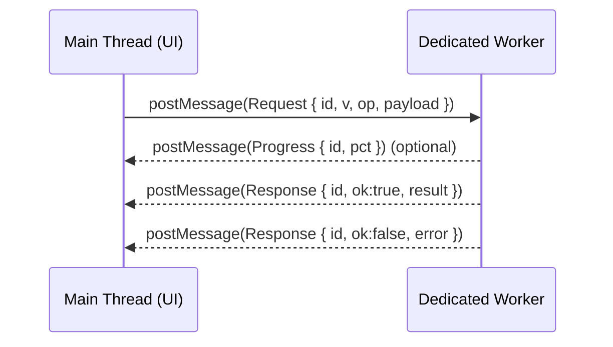

# 🧵 Dedicated Workers Adapter (Web)


| Field | Value |
| --- | --- |
| 📍 Path | `web/src/adapters/workers/dedicated/README.md` |
| 🎯 Purpose | Keep the UI responsive by offloading CPU-heavy work to a per-tab **Dedicated Web Worker** |
| 🧩 Architectural role | **Adapter layer** implementation detail (UI boundary → background thread) |
| 🧠 Typical workloads | Parsing/transforming large data, client-side indexing, geometry ops, data prep for rendering |

---

## 🧭 What lives in this folder?

This folder is the home for the **Dedicated Worker** “adapter” implementation used by the web client.

Typical responsibilities:

- ✅ **Lifecycle management**: create/terminate a worker, restart on crash, handle readiness
- ✅ **Message transport**: `postMessage` ↔ `message` event handling
- ✅ **Contract enforcement**: typed message envelopes, versioning, validation, error normalization
- ✅ **Performance controls**: transferables, batching, timeouts/cancellation, backpressure
- ✅ **Safety**: reject unknown ops, sanitize inputs, avoid dynamic code paths

> ✨ Design goal: the rest of the UI should call a clean API (e.g., `analyze()`, `index()`, `transform()`) without caring whether the implementation runs on the main thread, a worker, or remotely.

---

## ✅ When to use a Dedicated Worker

Use a **Dedicated Worker** when you need:

- 🏋️ CPU-heavy work (100ms+ blocks) that would jank the map/timeline UI
- 🧵 Per-tab/session isolation (each tab gets its own compute context)
- 🧰 Simple messaging (dedicated workers don’t require explicit “port” plumbing like shared workers)

Avoid dedicated workers when you need:

- 🌐 Cross-tab sharing / a single worker across windows → consider **SharedWorker**
- 📦 Offline-first caching, request interception, background sync → **Service Worker**
- ⚡ Tiny work (sub-10ms) that doesn’t justify serialization/messaging overhead → main thread

### 🧩 Worker types at a glance

| Type | Scope | Best for | Notes |
| --- | --- | --- | --- |
| Dedicated Worker | Per page/tab | Heavy compute for *this* UI session | Simplest messaging |
| SharedWorker | Many tabs/windows | Shared state & compute | Requires port-based comms |
| Service Worker | Origin + scope | Offline, caching, fetch interception | Different lifecycle model |

---

## 🧱 Architecture fit (KFM mindset)

KFM’s architecture emphasizes **clear boundaries** and **interface-first design**. In the web client, a dedicated worker is an *outer-ring implementation detail*.

**Implications for this folder:**

- 🧩 Treat worker messages as **contracts** (version them; no silent breaking changes).
- 🧾 Prefer deterministic, reproducible operations (same input → same output).
- 🧼 Keep domain/use-case logic portable: if a task can move to server later, the *contract stays stable*.

> 🔒 “Adapters should be swappable.” If tomorrow we run this workload in WASM, on the server, or in a worker pool—callers should not notice.

---

## 🔄 Message flow



---

## 📜 Contract: message envelope (recommended)

Keep the worker protocol **boring and explicit**:

- ✅ explicit `op`
- ✅ correlation `id`
- ✅ version `v`
- ✅ `ok` + normalized `error`
- ✅ optional `meta` for timings/provenance

### Example (TypeScript-friendly)

```ts
// ✅ Main thread -> worker
export type WorkerRequest<V extends number = 1> = {
  v: V;
  id: string;           // correlation id (uuid/ulid)
  op: string;           // operation name, e.g. "geojson.normalize"
  payload: unknown;     // structured-cloneable only
};

// ✅ Worker -> main thread (success/failure)
export type WorkerResponse<V extends number = 1> = {
  v: V;
  id: string;
  ok: true;
  result: unknown;
  meta?: {
    ms?: number;        // optional timing
    notes?: string[];
  };
} | {
  v: V;
  id: string;
  ok: false;
  error: {
    code: string;       // e.g. "INVALID_INPUT", "UNSUPPORTED_OP"
    message: string;
    details?: unknown;
  };
  meta?: {
    ms?: number;
  };
};

// ✅ Worker -> main thread (optional progress/events)
export type WorkerEvent<V extends number = 1> = {
  v: V;
  type: "progress";
  id: string;
  pct: number;          // 0..100
};
```

> 🧠 Rule of thumb: if you can’t serialize it with structured cloning, don’t send it.

---

## 🚀 Quick start patterns

### 1) Create the worker (module worker recommended)

```ts
// Example: bundler-friendly module worker
const worker = new Worker(new URL("./worker.entry.ts", import.meta.url), {
  type: "module",
  name: "kfm-dedicated-worker",
});
```

### 2) Minimal RPC wrapper (request/response correlation)

```ts
function callWorker<TRes>(
  worker: Worker,
  req: { v: number; id: string; op: string; payload: unknown },
  transfer?: Transferable[],
): Promise<TRes> {
  return new Promise((resolve, reject) => {
    const onMessage = (evt: MessageEvent) => {
      const msg = evt.data;
      if (!msg || msg.id !== req.id) return;

      worker.removeEventListener("message", onMessage);
      worker.removeEventListener("error", onError);

      if (msg.ok) resolve(msg.result as TRes);
      else reject(Object.assign(new Error(msg.error?.message ?? "Worker error"), { code: msg.error?.code, details: msg.error?.details }));
    };

    const onError = (err: ErrorEvent) => {
      worker.removeEventListener("message", onMessage);
      worker.removeEventListener("error", onError);
      reject(err.error ?? new Error(err.message));
    };

    worker.addEventListener("message", onMessage);
    worker.addEventListener("error", onError);

    // Transferables keep big buffers fast (no copy)
    worker.postMessage(req, transfer ?? []);
  });
}
```

---

## 🧰 Adding a new operation (checklist)

When you add a new background capability, keep it consistent:

1. **Define/extend the contract**
   - Add a stable `op` name (namespaced is preferred): `geojson.normalize`, `graph.query`, `timeline.bucketize`, etc.
   - Add/extend types for payload/result (and bump version if breaking)

2. **Implement the worker handler**
   - One handler per `op`
   - Validate inputs early → return `{ ok:false, error:{ code:"INVALID_INPUT" } }`

3. **Expose a friendly adapter function**
   - Example: `normalizeGeoJSON(input): Promise<NormalizedGeoJSON>`
   - The UI never calls `postMessage` directly

4. **Add tests**
   - Contract tests (request → response)
   - Determinism tests (same input → same output)
   - Performance tests for large payloads when relevant

5. **Document it**
   - Add the operation to an “Operations” list (below)

---

## 📦 Operations

> Add entries here as you implement them.

| `op` | Input | Output | Notes |
| --- | --- | --- | --- |
| _(placeholder)_ |  |  |  |

---

## 🧹 Lifecycle & cleanup

Dedicated workers are **per-tab** and should be cleaned up:

- ✅ Terminate the worker when the feature/page unmounts
- ✅ Consider a “singleton per tab” if multiple components need the same worker
- ✅ Provide a restart strategy (crash loop protection)

### Common patterns

- **Terminate from main thread** when done:
  - `worker.terminate()`
- **Self-terminate** from inside the worker:
  - `self.close()`

---

## ⚡ Performance tips (real-world)

- 📦 Use **Transferables** for large binary data (ArrayBuffer, MessagePort)
- 🪣 Batch small messages (avoid spamming `postMessage`)
- 🧊 Cache intermediate results inside the worker when safe (watch memory!)
- ⛔ Don’t send huge object graphs if a compact representation exists
- 🧯 Guard against runaway tasks (timeouts + cancellation)

> ✅ If you’re passing > ~5–10MB frequently, you should almost always be using transferables or a different strategy (tiling/chunking).

---

## 🔐 Security notes

Even though this is “client-side”, treat it as an untrusted boundary:

- ✅ Validate message shape + `op` allowlist
- ✅ Never `eval()` / dynamic Function construction
- ✅ Don’t accept arbitrary URLs or code strings as payload
- ✅ Normalize errors (no leaking internal stack traces in production)

---

## 🧪 Testing strategy

Recommended layers:

- ✅ **Unit**: message parser, validators, pure handlers
- ✅ **Integration**: spawn worker in a test harness and assert request/response
- ✅ **E2E (optional)**: ensure map/timeline stays responsive under load

Tip: keep handlers as pure functions so they can be tested without spinning up an actual worker.

---

## 🐞 Debugging

- 🧰 Use browser DevTools:
  - Chrome: **Sources → Threads / Workers**
- 🏷️ Name your worker (where supported) to make profiling sane
- 📣 Add lightweight logging gates:
  - `if (DEBUG_WORKERS) console.debug(...)`

---

## 🔗 Related (repo navigation)

- `web/src/adapters/` — adapters layer (UI boundary)
- `docs/` — contract-first & evidence-first guidance (pipeline boundaries, governance)

---

## ✅ PR checklist (copy/paste)

- [ ] Worker operation contract updated (and version bumped if breaking)
- [ ] Handler validates input and returns normalized errors
- [ ] Transferables used for large binary payloads
- [ ] Worker terminated / lifecycle managed (no leaks)
- [ ] Tests added/updated
- [ ] This README’s **Operations** table updated
