# ♻️ Service Worker Adapter (`web/src/adapters/workers/service`)  


> A **thin adapter** around the browser **Service Worker** APIs to support **offline-first UX**, **safe caching**, and a clean **architecture boundary** for KFM’s web frontend. 🧭💾  
> KFM explicitly considers packaging the front-end as a **Progressive Web App (PWA)** for offline use, and this folder is where that infrastructure belongs. :contentReference[oaicite:0]{index=0}

---

## 📌 Table of contents <a id="toc"></a>

- [🎯 Goals](#goals)
- [🧩 Why this lives in `adapters/`](#architecture-fit)
- [🗺️ High-level flow](#flow)
- [🧠 Core concepts](#core)
- [💾 Caching strategy](#caching)
- [🧾 Provenance-first rules](#provenance)
- [🗣️ Messaging contract (UI ↔ Service Worker)](#messaging)
- [🧪 Development & debugging](#dev)
- [🔐 Security & privacy guardrails](#security)
- [✅ PR checklist](#checklist)
- [📚 References & source docs](#refs)

---

## 🎯 Goals <a id="goals"></a>

- ✅ Provide an **offline-friendly** baseline (app shell + selected read-only resources)
- ✅ Keep the UI clean by avoiding scattered `navigator.serviceWorker` logic
- ✅ Implement **versioned** and **bounded** caching (avoid unbounded tile growth)
- ✅ Preserve KFM’s **provenance-first** “no mystery layers” rule in offline mode :contentReference[oaicite:1]{index=1}
- ✅ Keep this adapter *thin* (no business logic, no domain logic)

---

## 🧩 Why this lives in `adapters/` <a id="architecture-fit"></a>

KFM is designed with a **multi-layered clean architecture** where **interfaces & adapters** isolate core logic from infrastructure details. :contentReference[oaicite:2]{index=2}

Service workers are pure **infrastructure**:
- they run in a separate global scope (no DOM access),
- they act like a programmable network proxy,
- they have their own lifecycle and may be terminated/restarted. :contentReference[oaicite:3]{index=3}

So we keep **all** service worker concerns here to:
- prevent UI components from depending on browser globals,
- centralize lifecycle + caching decisions,
- allow future implementation swaps (e.g., different caching strategies) without changing app logic.

---

## 🗺️ High-level flow <a id="flow"></a>



```mermaid
flowchart TD
  UI[🖥️ Web UI] -->|calls| AD[♻️ SW Adapter]
  AD -->|register + message| SW[(🧵 Service Worker)]
  SW -->|fetch| NET[🌐 Network]
  SW -->|read/write| CACHE[(💾 Cache Storage)]
  NET --> API[⚙️ KFM API]
  API -->|enqueue long jobs| WQ[📦 Task Queue]
  WQ --> WORKERS[🛠️ Background Workers]
```

KFM’s backend is designed to remain **stateless** where possible and delegate heavy processing to **background workers / pipeline jobs**. :contentReference[oaicite:4]{index=4}  
When long tasks are queued, the API may return a **job ID** that the frontend can poll. :contentReference[oaicite:5]{index=5}

---

## 🧠 Core concepts <a id="core"></a>

### 1) Scope matters 🧵
The service worker’s **scope** is determined by where the SW script is served.  
Example: `/js/sw.js` can only intercept requests under `/js/*`, so SW files are commonly served from the top-level path for full-site scope. :contentReference[oaicite:6]{index=6}

✅ **Rule of thumb:** Keep the built SW output as high in the public path as possible.

---

### 2) Lifecycle is separate 🔁
Service workers are event-driven and have a lifecycle separate from your page; they can be terminated and restarted when next needed. :contentReference[oaicite:7]{index=7}

Common events:
- `install` → warm caches
- `activate` → cleanup old caches
- `fetch` → apply caching strategy per request
- `message` → UI ↔ SW coordination

---

### 3) “Offline-first” in KFM terms 🧭
Offline-first means the app remains usable without network connectivity; service workers are a key mechanism for that approach. :contentReference[oaicite:8]{index=8}

For KFM specifically:
- ❌ We are **not** trying to do heavy geoprocessing offline.
- ✅ We **are** trying to:
  - keep the app shell available,
  - support “browse what you already looked at” patterns,
  - preserve provenance/attribution visibility even from cache.

---

## 💾 Caching strategy <a id="caching"></a>

> Keep it **simple, explicit, and bounded** ✅

### Recommended strategies (by resource type)

| Resource type | Strategy | Why |
|---|---|---|
| App shell (`index.html`, JS/CSS bundles) | Cache-first (versioned) | Fast startup, deterministic rollback |
| Static assets (icons/fonts) | Cache-first | Low risk, high payoff |
| Map tiles (vector/raster) | Stale-while-revalidate **or** Network-first | Avoid blank maps offline; stay fresh when online |
| Read-only API GET (catalog, metadata, provenance) | Network-first with cache fallback | Fresh when online, usable offline |
| Writes (POST/PUT/PATCH) | ❌ Don’t cache | Risky + user-specific + auth |

### Versioning & eviction 🔖🧹
Use versioned cache names, e.g.:
- `kfm-app-v{BUILD_HASH}`
- `kfm-data-v{API_VERSION}`

On `activate`, delete old versions.  
Also implement a **hard cap** for tile caches (by count or total bytes) to prevent storage bloat.

<details>
  <summary>🧯 Why strict eviction matters</summary>

Tiles can grow without bound. If we don’t enforce caps, users eventually hit storage limits and caches become unpredictable.

</details>

---

## 🧾 Provenance-first rules <a id="provenance"></a>

KFM’s guiding principle is **provenance-first / contract-first**: anything visible in the UI must be traceable back to cataloged sources and provable processing (“no mystery layers”). :contentReference[oaicite:9]{index=9}

KFM also emphasizes open standards for data interchange/lineage (e.g., STAC/DCAT/PROV-O) and dataset metadata “contracts.” :contentReference[oaicite:10]{index=10}

### Implications for this adapter ✅
- **Do not synthesize data** in the service worker.
- Prefer caching endpoints that include or link to contract/provenance metadata.
- Store lightweight cache metadata (e.g., `cachedAt`, `apiBaseUrl`, `version`) so the UI can show *“cached at …”* instead of silently serving stale content.
- Always allow a “refresh from network” path when online.

> The storage layer likely uses checksums for verification/invalidation; mirror that mindset for SW caches by respecting ETags/versioning and invalidating predictably. :contentReference[oaicite:11]{index=11}

---

## 🗣️ Messaging contract (UI ↔ Service Worker) <a id="messaging"></a>

Service worker communication is typically via `postMessage` + `message` event handlers. :contentReference[oaicite:12]{index=12}

### Suggested message types (stable “contract”)
- `PING` / `PONG` — sanity check
- `CACHE_WARMUP` — prefetch a list of safe, read-only URLs
- `CACHE_CLEAR` — clear specific caches (or all, gated)
- `CACHE_STATS` — approximate storage usage + key counts
- `UPDATE_AVAILABLE` — notify UI that a new SW is installed and ready

### Example payloads (TypeScript-ish)
```ts
type SwMessage =
  | { type: "PING"; requestId: string }
  | { type: "CACHE_WARMUP"; urls: string[] }
  | { type: "CACHE_CLEAR"; cacheName?: string }
  | { type: "CACHE_STATS"; requestId: string };

type SwReply =
  | { type: "PONG"; requestId: string; ts: number }
  | { type: "CACHE_STATS_RESULT"; requestId: string; usageBytes?: number };
```

---

## 🧪 Development & debugging <a id="dev"></a>

### Verify registration ✅
- Chrome DevTools → **Application** → **Service Workers**
- Use **Update on reload** during local testing
- Inspect **Cache Storage** contents while testing fetch strategies

### Common gotchas 🧩
- Service workers require **HTTPS** (except `localhost`). :contentReference[oaicite:13]{index=13}
- A stale SW can keep serving old bundles:
  - unregister the SW,
  - clear site data,
  - reload.

---

## 🔐 Security & privacy guardrails <a id="security"></a>

Service workers intercept requests and can cache responses, so treat changes as security-sensitive.

- **Never cache secrets** (tokens, auth headers, private user data).
- Avoid caching authenticated endpoints unless you have a strong, audited design.
- Ensure offline caching does not hide attribution/provenance (keep it visible & verifiable). :contentReference[oaicite:14]{index=14}

---

## ✅ PR checklist <a id="checklist"></a>

- [ ] No direct `navigator.serviceWorker` usage outside this adapter
- [ ] Cache naming is versioned, and old caches are cleaned up on `activate`
- [ ] Tile caches are bounded (cap/eviction implemented)
- [ ] Offline mode makes staleness visible (timestamp or “cached” indicator)
- [ ] No “mystery layers”: cached content remains traceable to sources/contracts :contentReference[oaicite:15]{index=15}
- [ ] Upgrade path tested (install → waiting → activate)

---

## 📚 References & source docs <a id="refs"></a>

- **Kansas Frontier Matrix (KFM) – Comprehensive Technical Documentation** :contentReference[oaicite:16]{index=16}  
  - Clean architecture & adapters framing :contentReference[oaicite:17]{index=17}  
  - Front-end PWA/offline direction :contentReference[oaicite:18]{index=18}  
  - Provenance-first “no mystery layers” rule :contentReference[oaicite:19]{index=19}  
  - Background workers & job ID polling pattern :contentReference[oaicite:20]{index=20}

- **JavaScript Notes for Professionals — Workers / Service Workers** :contentReference[oaicite:21]{index=21}  
  - SW definition, lifecycle separation, scope constraints, messaging patterns :contentReference[oaicite:22]{index=22}:contentReference[oaicite:23]{index=23}:contentReference[oaicite:24]{index=24}

- **Responsive Web Design with HTML5 & CSS3 — Offline-first note** :contentReference[oaicite:25]{index=25}  
  - Offline-first concept and service worker direction :contentReference[oaicite:26]{index=26}
