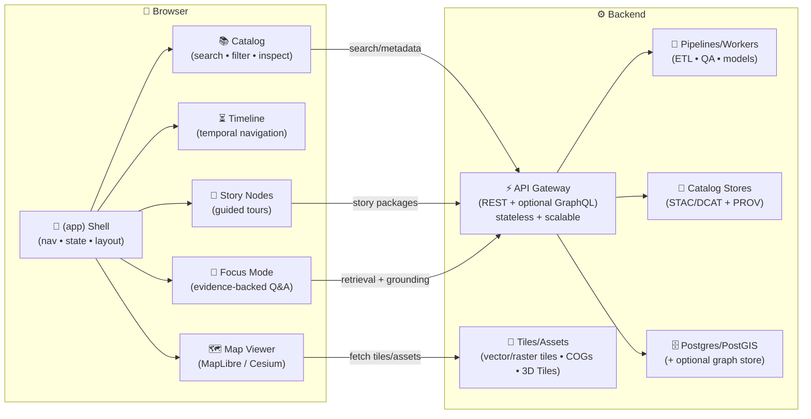

# 🗺️ Kansas Frontier Matrix — Web App `(app)` Route Group


> [!IMPORTANT]
> This folder is the **main interactive application shell** of KFM: map + timeline + catalog + narratives + analysis + Focus Mode AI.  
> It is where we deliver the core mission: **searchable, mappable, auditable, and modelable** spatial truth—without “mystery layers” or untraceable AI output.

---

## 📍 What this folder is

In Next.js App Router terms, `src/app/(app)` is a **route group**: it **organizes app routes without changing the URL**.

This is where “the product” lives:
- 🗺️ **Map + Layer Manager**
- 🧭 **Timeline / time scrubbing**
- 📚 **Dataset Catalog**
- 📖 **Story Nodes (narrative mode)**
- 📈 **Analysis + charts + modeling surfaces**
- 🤖 **Focus Mode (AI assistant) with citations**

---

## 🧱 How it fits in the full KFM system



> [!NOTE]
> **UI never queries the database directly.** Everything flows through the API (the system “gatekeeper”) to preserve trust boundaries, validation, redaction, and auditability.

---

## 🗂️ Expected structure inside `(app)`

This is an **illustrative** layout (update to match the actual tree as the app evolves):

```text
📁 web/src/app/(app)/
├─ 📄 README.md                # 👈 you are here
├─ 📄 layout.tsx               # 🧩 App shell layout (nav + providers)
├─ 📄 page.tsx                 # 🏠 Default entry (optional)
├─ 📄 loading.tsx              # ⏳ Route-group loading UI (optional)
├─ 📄 error.tsx                # 🧯 Route-group error boundary (optional)
│
├─ 📁 map/                     # 🗺️ Map surface (2D/3D)
│  └─ 📄 page.tsx
├─ 📁 catalog/                 # 📚 Dataset discovery + inspection
│  └─ 📄 page.tsx
├─ 📁 stories/                 # 📖 Story Nodes UI
│  └─ 📄 page.tsx
├─ 📁 analysis/                # 📈 Charts, regressions, scenario views
│  └─ 📄 page.tsx
└─ 📁 settings/                # ⚙️ User prefs, units, map defaults
   └─ 📄 page.tsx
```

---

## 🧭 UX pillars (non‑negotiables)

### 1) 🧾 Provenance-first (trust by design)
Every visible thing has a “why should I trust this?” answer:
- ✅ **Layer/source attribution always visible**
- ✅ **Metadata as first-class UI** (provider, license, collection method, timestamps, uncertainty)
- ✅ **Provenance links** (processing chain, model version, inputs, citations)

**If we can’t show provenance, it doesn’t ship.**

### 2) 📜 Contract-first (stability by design)
- UI consumes **typed, versioned API contracts** (OpenAPI/GraphQL schemas).
- If UI needs something new, we **add/extend the contract first**, then implement.

### 3) ⏳ Time is a primary navigation axis
- Timeline scrubbing is a core feature, not an afterthought.
- Layers declare temporal coverage + resolution; timeline drives layer state.

### 4) 📖 Narrative + exploration are peers
- “Story mode” should feel like an interactive documentary.
- At any moment, a user can leave the story and explore freely (and come back).

### 5) 🤖 Human-centered AI (Focus Mode is advisory)
- AI **never** acts autonomously.
- AI answers are clearly labeled, **always cited**, and constrained to KFM-known evidence.

---

## 🗺️ Map & 3D viewer patterns

### 🧩 2D viewer: MapLibre GL JS
Use MapLibre for:
- Basemap + overlay layers (vector tiles, raster tiles, GeoJSON overlays)
- Hover/click inspection
- Drawing tools (bbox/polygon analysis queries)
- Performance-friendly interaction for most layers

**Implementation tips**
- Prefer client-only rendering for WebGL viewers.
- Keep layer definitions declarative (style + source + provenance pointer).
- Always wire inspection → metadata/provenance drawer.

### 🛰️ 3D viewer: CesiumJS + 3D Tiles
Use Cesium for:
- 3D terrain / globe context
- 3D Tiles streaming (e.g., LiDAR point clouds, building models)

**Rule of thumb:** 3D is opt-in. It should never be required to use core functionality.

### 🧾 “The map behind the map”
Every layer and chart should expose:
- Source name
- Catalog record link
- License/terms
- Processing summary
- Time range / update time
- Sensitivity & redactions (if any)

---

## 📖 Story Nodes (Narrative Mode)

Story Nodes are designed so that **domain experts can author content** without writing application code.

**Common format**
- `story.md` → narrative text (with citations/footnotes)
- `story.json` → step-by-step map state (layers, camera, timeline, highlights)

**UI responsibilities**
- Render markdown safely (sanitize)
- Provide step controls (next/prev, scroll-driven)
- Sync each step with:
  - Map camera
  - Active layers
  - Timeline position
  - Optional callouts/highlights

> [!TIP]
> Treat Story Nodes as “machine-ingestible storytelling”: the UI should be able to extract citations, entities, and linked datasets from the story package.

---

## 🤖 Focus Mode (AI Assistant)

Focus Mode is the **contextual AI panel** embedded in the map experience.

### Core rules ✅
- **Advisory-only**: no autonomous changes, no auto-publishing, no hidden actions
- **Citations required**: every material claim must link to cataloged sources
- **Constrained**: if the answer isn’t in KFM’s data, it must say so
- **Clearly labeled**: users must never confuse AI summaries with curated facts

### What Focus Mode is good at
- Summarizing “what’s here” (current viewport, selection, time slice)
- Connecting entities (places/events/people/documents)
- Producing lightweight analysis narratives (trend explanations) *when supported by data*

### What Focus Mode must not do
- Invent sources
- Reveal sensitive coordinates or restricted content
- Present speculation as fact

---

## 🔌 Data access patterns (frontend)

### 📡 API as gatekeeper
All data (metadata, tiles, story packages, analysis outputs) comes through the API:
- Validation
- Redaction
- Auth enforcement
- Audit logging
- Contract stability

### ♻️ Caching & request hygiene
- Use request deduping + caching for catalog reads
- Use `AbortController` for viewport-driven queries
- Don’t DDoS ourselves: throttle map-driven queries

### 🧷 Typing & contracts
- Prefer generated types from OpenAPI/GraphQL
- Avoid “mystery JSON” in UI code

---

## 🛡️ Security, privacy, and sensitive data

### 🔐 Data sensitivity tiers
KFM may include:
- Public datasets
- Restricted datasets
- “Public but sensitive” datasets (e.g., endangered sites)

**UI obligations**
- Honor redactions and generalizations
- Display sensitivity badges and usage constraints
- Avoid leaking restricted attributes via tooltips, exports, or AI prompts

### 🧯 Responsible disclosure
Security issues should be reported privately (no public exploit details).

---

## 🚀 Performance checklist (especially for map surfaces)

- ✅ Dynamic import heavy WebGL components
- ✅ Virtualize long layer lists + catalog results
- ✅ Prefer tiles/COGs over huge GeoJSON when possible
- ✅ Offload parsing to Web Workers for large client-side transforms
- ✅ Keep “interaction budget” in mind (60fps target)

---

## ✅ Testing expectations for `(app)`

**Recommended layers**
- Unit tests for utility logic (formatters, selectors, small components)
- Integration tests for API↔UI flows (mock server or test backend)
- E2E tests for critical paths:
  - Load app → search → enable layer → inspect provenance
  - Move timeline → confirm layer changes
  - Open Story Node → step through → map sync stays consistent
  - Open Focus Mode → ask question → citations present

> [!NOTE]
> E2E tests should cover **trust-critical flows** first (provenance + Focus Mode citations).

---

## 🧩 Adding a new UI feature in `(app)` (definition of done)

When you add a new screen / capability, you must ensure:

### ✅ “Trust Contract”
- [ ] Every new dataset/layer has a provenance UI (source + license + processing)
- [ ] Any AI output includes citations (and is labeled as AI)
- [ ] Sensitive data rules are honored (redactions/generalization)

### ✅ “System Contract”
- [ ] API contract updated first (OpenAPI/GraphQL), types flow to UI
- [ ] No direct DB calls from UI
- [ ] Performance reviewed (bundle size + map interaction)

### ✅ “Experience Contract”
- [ ] Works on desktop + tablet (minimum)
- [ ] Accessible controls and keyboard navigation where applicable
- [ ] Timeline integration considered (even if not used)

---

## 🧾 Glossary

- **STAC**: SpatioTemporal Asset Catalog — standard for spatial assets (imagery, tiles, etc.)
- **DCAT**: Data Catalog Vocabulary — standard for dataset catalog metadata
- **PROV‑O**: W3C Provenance Ontology — standard for “how was this made?”
- **Story Node**: A governed narrative package (markdown + config) that syncs map state to a story
- **Focus Mode**: Evidence-backed AI assistant embedded in the map UI
- **Layer**: A visual dataset representation (vector/raster/3D) with provenance, license, and time semantics

---

## 📚 Project reference library (used to shape this folder)

> [!IMPORTANT]
> These documents are part of the project’s internal knowledge base.  
> **Do not paste large excerpts** into code or docs—use them for guidance and cite sources properly.

<details>
<summary><strong>🧠 Modeling, Statistics, and AI</strong></summary>

- `Scientific Modeling and Simulation_ A Comprehensive NASA-Grade Guide.pdf` — validation, verification, uncertainty, reproducibility for modeling surfaces.
- `Understanding Statistics & Experimental Design.pdf` — experimental rigor, avoiding misleading inference, clear reporting.
- `regression-analysis-with-python.pdf` — regression workflows, scaling considerations, interpretation.
- `Regression analysis using Python - slides-linear-regression.pdf` — linear regression fundamentals and communication.
- `think-bayes-bayesian-statistics-in-python.pdf` — Bayesian reasoning patterns for uncertainty-aware UI.
- `Deep Learning for Coders with fastai and PyTorch - Deep.Learning.for.Coders.with.fastai.and.PyTorchpdf` — model training, evaluation, practical ML patterns.
- `graphical-data-analysis-with-r.pdf` — exploratory data analysis and truthful visualization.
- `Spectral Geometry of Graphs.pdf` — network/graph intuition for knowledge graph-driven features.
- `Generalized Topology Optimization for Structural Design.pdf` — optimization thinking for planning/engineering layers.
- `Principles of Biological Autonomy - book_9780262381833.pdf` — systems thinking and feedback loops (useful for ecological modeling narratives).

</details>

<details>
<summary><strong>🗺️ GIS, Cartography, Remote Sensing, and 3D</strong></summary>

- `making-maps-a-visual-guide-to-map-design-for-gis.pdf` — cartographic clarity: legends, symbology, hierarchy, labeling.
- `Mobile Mapping_ Space, Cartography and the Digital - 9789048535217.pdf` — mobile-first mapping constraints and field usability.
- `python-geospatial-analysis-cookbook.pdf` — practical geospatial processing patterns and web-facing analysis.
- `Cloud-Based Remote Sensing with Google Earth Engine-Fundamentals and Applications.pdf` — remote sensing pipelines and derived indices.
- `Archaeological 3D GIS_26_01_12_17_53_09.pdf` — 3D GIS concepts, cultural heritage visualization patterns.

</details>

<details>
<summary><strong>🗄️ Data, Databases, and Scale</strong></summary>

- `PostgreSQL Notes for Professionals - PostgreSQLNotesForProfessionals.pdf` — SQL/Postgres best practices (incl. patterns relevant to PostGIS).
- `Database Performance at Scale.pdf` — indexing, query planning, caching and performance discipline.
- `Scalable Data Management for Future Hardware.pdf` — future-facing performance architecture (latency, compilation strategies).
- `Data Spaces.pdf` — interoperability, governance, sharing ecosystems.

</details>

<details>
<summary><strong>🌐 Web, UI Engineering, Graphics, and Formats</strong></summary>

- `responsive-web-design-with-html5-and-css3.pdf` — responsive layouts, accessibility foundations.
- `webgl-programming-guide-interactive-3d-graphics-programming-with-webgl.pdf` — WebGL fundamentals supporting map/3D overlays.
- `compressed-image-file-formats-jpeg-png-gif-xbm-bmp.pdf` — choosing the right formats for tiles, thumbnails, and exports.
- `concurrent-real-time-and-distributed-programming-in-java-threads-rtsj-and-rmi.pdf` — real-time + concurrency concepts for streaming/near-real-time UI features.

</details>

<details>
<summary><strong>🛡️ Security, Ethics, and Governance</strong></summary>

- `ethical-hacking-and-countermeasures-secure-network-infrastructures.pdf` — threat modeling, defense-in-depth mindset.
- `Gray Hat Python - Python Programming for Hackers and Reverse Engineers (2009).pdf` — attacker perspective (use for strengthening defenses, not exploits).
- `Introduction to Digital Humanism.pdf` — human agency, transparency, and trustworthy interfaces.
- `On the path to AI Law’s prophecies and the conceptual foundations of the machine learning age.pdf` — policy/legal framing for AI features and governance.

</details>

<details>
<summary><strong>📚 Programming Compendiums (broad reference)</strong></summary>

- `A programming Books.pdf`
- `B-C programming Books.pdf`
- `D-E programming Books.pdf`
- `F-H programming Books.pdf`
- `I-L programming Books.pdf`
- `M-N programming Books.pdf`
- `O-R programming Books.pdf`
- `S-T programming Books.pdf`
- `U-X programming Books.pdf`

Use these as quick references across languages, paradigms, and implementation details when building UI + services.

</details>

---

### 🧭 Core project spec
- `Kansas Frontier Matrix (KFM) – Comprehensive Technical Documentation.pdf` — the canonical vision + architecture description driving KFM UI requirements.

---

## 🧠 Final reminder

If you’re adding a feature and you’re unsure whether it belongs in `(app)`:

✅ Put it here if it is part of the **interactive KFM experience** (map, time, catalog, story, analysis, Focus Mode).  
❌ Put it elsewhere if it is marketing, docs, or unauthenticated landing content.

---

