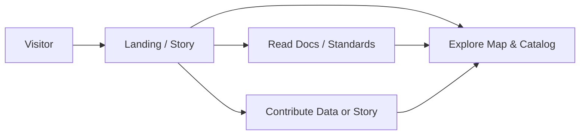

# 🧭 `web/src/app/(marketing)` — Public Site & Marketing Surfaces (KFM)


-2b2b2b)


> ✨ This folder hosts the **public-facing experience** for **Kansas Frontier Matrix (KFM)** — the landing pages, onboarding, docs-like content, and legal pages that introduce the platform and build trust.

---

## 🎯 What this route group is for

✅ **Primary goals**
- Explain **what KFM is** and **why it matters** (mission, audiences, outcomes).
- Onboard visitors into the **core product** (map/catalog/storytelling) with clear CTAs.
- Communicate KFM’s **provenance-first** stance: every claim should be inspectable and defensible. :contentReference[oaicite:0]{index=0}
- Provide “docs-lite” pages (glossary, standards, contributor info) without forcing a GitHub deep-dive. :contentReference[oaicite:1]{index=1}

🚫 **Non-goals**
- Heavy authenticated workflows (editing, ingestion dashboards, admin tooling).
- High-frequency/real-time UI (save that for the app route group).
- Shipping big WebGL payloads “just for flair” (marketing must stay fast + accessible). :contentReference[oaicite:2]{index=2}

---

## 🧠 Messaging anchors (keep these consistent)

These are the “north stars” for copy + UX in marketing surfaces:

- **Mission:** make Kansas’s spatial truth *searchable, mappable, auditable, and modelable* for everyone. :contentReference[oaicite:3]{index=3}
- **Open + extensible:** standards-based, composable components, no lock-in story. :contentReference[oaicite:4]{index=4}
- **Provenance-first:** the UI should always let users inspect sources/lineage for what they’re seeing. :contentReference[oaicite:5]{index=5} :contentReference[oaicite:6]{index=6}
- **Focus Mode AI:** helpful, *advisory*, and grounded in citations—never opaque authority. :contentReference[oaicite:7]{index=7} :contentReference[oaicite:8]{index=8}
- **Digital Humanism:** humans, communities, and accountability come before “AI hype.” :contentReference[oaicite:9]{index=9}

> [!IMPORTANT]
> **Marketing copy is part of the product.** Any claim that can’t be sourced should be rewritten, softened, or moved into a roadmap section with clear labeling. :contentReference[oaicite:10]{index=10}

---

## 🧩 Next.js mental model for `(marketing)`

In the App Router, **route groups** like `(marketing)`:
- help organize routes and share layouts
- **do not appear in the URL path**

So `app/(marketing)/about/page.tsx` typically becomes `/about`.

---

## 🗂️ Suggested folder layout

> Your actual routes may differ — this is the recommended “shape” for public surfaces.

```text
web/src/app/(marketing)/
├─ 📄 README.md                 👈 you are here 📌
├─ 🧱 layout.tsx                # 🧱 marketing shell (header/footer)
├─ 🏠 page.tsx                  # 🏠 landing
├─ 📖 about/
│  └─ 📖 page.tsx               # 📖 mission, story, audiences
├─ 📚 docs/
│  ├─ 📚 page.tsx               # 📚 docs-lite index
│  └─ 🧩 standards/
│     └─ 🧩 page.tsx            # 🧩 STAC / DCAT / PROV-O overview (plain-language)
├─ 🧠 glossary/
│  └─ 🧠 page.tsx               # 🧠 shared vocabulary (reduces confusion)
├─ ⚖️ (legal)/
│  ├─ 🔐 privacy/
│  │  └─ 🔐 page.tsx            # 🔐 privacy policy
│  └─ 🧾 terms/
│     └─ 🧾 page.tsx            # 🧾 terms
├─ ✍️ (content)/
│  └─ ✍️ ...                    # ✍️ MDX/markdown-backed pages (optional)
└─ 🖼️ opengraph-image.tsx       # 🖼️ social previews (optional)
```

---

## 🧱 Layout & component conventions

### ✅ Preferred defaults
- **Server Components by default** (min JS).
- **Client Components only when needed** (forms, toggles, interactive demos).
- Keep marketing pages **static or ISR-friendly**; avoid runtime DB dependency.
- Use **progressive enhancement**: pages must remain useful with JS disabled. :contentReference[oaicite:11]{index=11}

### ✨ Suggested shell responsibilities (`layout.tsx`)
- Global header/nav + footer
- Skip link + landmarks for a11y
- Shared metadata defaults (title template, base description)
- Optional “Provenance / Trust” callout component

---

## 🔎 Provenance & claims policy (hard rule)

Marketing must model the same trust behavior as the KFM app:

✅ Do
- Include **sources** (catalog IDs, docs links, citations) for:
  - numeric claims (counts, coverage, timelines)
  - historical assertions
  - performance claims
  - AI/ML results
- Label **interpretation vs fact** (especially in historical narratives). :contentReference[oaicite:12]{index=12}
- When describing map/cartography, use best practices (legend, scale, uncertainty). :contentReference[oaicite:13]{index=13} :contentReference[oaicite:14]{index=14}

🚫 Don’t
- “Best in class / revolutionary / flawless accuracy” language without sources.
- Claim model outcomes without explaining data + method. :contentReference[oaicite:15]{index=15} :contentReference[oaicite:16]{index=16}

### ✍️ MDX/Markdown citation pattern (example)

```md
KFM includes provenance metadata for published layers.[^prov]

[^prov]: See: Provenance-first UX guidelines and source inspection patterns.
```

> Tip: Treat citations like first-class UI—**footnotes are a feature**, not clutter. :contentReference[oaicite:17]{index=17}

---

## 🗺️ Maps & visuals on marketing pages

Marketing pages may include map previews/demos, but keep them **lightweight**:

- Prefer **static images** or **pre-rendered video** for hero sections
- If you embed interactive WebGL:
  - lazy-load via dynamic import
  - provide a non-WebGL fallback
  - keep it optional and accessible :contentReference[oaicite:18]{index=18} :contentReference[oaicite:19]{index=19}
- Use correct image formats and compression (don’t ship PNGs like they’re free). :contentReference[oaicite:20]{index=20}

> [!NOTE]
> Cartography is communication. If an image could be misread, add a caption, legend, or uncertainty note. :contentReference[oaicite:21]{index=21}

---

## 🧪 Analytics & experiments (do this like science)

If we test copy, onboarding flows, or CTAs:
- Define **hypothesis**, **primary metric**, **guardrails**, **duration**, and **stop conditions**
- Document each experiment (even “failed” ones)
- Avoid vanity metrics; align with real user value :contentReference[oaicite:22]{index=22} :contentReference[oaicite:23]{index=23}

<details>
<summary>🧾 A/B experiment template (copy/paste)</summary>

```md
## Experiment: <name>

- Hypothesis:
- Audience:
- Variant A:
- Variant B:
- Primary metric:
- Guardrails:
- Sample size target / duration:
- Launch date:
- End date:
- Result:
- Decision:
- Links (PRs, dashboards):
- Notes / confounders:
- Sources / methodology:
```
</details>

---

## ♿ Accessibility & responsive UX checklist

- Keyboard navigation works end-to-end
- Focus states are visible
- Touch targets are comfortable on mobile
- Headings are semantic and ordered
- Images have meaningful alt text
- Color contrast is acceptable
- Layout is responsive (not “desktop-first only”) :contentReference[oaicite:24]{index=24} :contentReference[oaicite:25]{index=25}

---

## 🛡️ Security & privacy (marketing still needs defenses)

Marketing surfaces often include contact/newsletter forms — treat them as attack surfaces:
- Validate + sanitize inputs
- Rate-limit submissions / add bot protection as needed
- Don’t leak stack traces or internal identifiers
- Minimize tracking, avoid unnecessary PII :contentReference[oaicite:26]{index=26} :contentReference[oaicite:27]{index=27}

---

## ✅ PR checklist (marketing pages)

- [ ] Page has `metadata` (title/description/OpenGraph)
- [ ] Page is useful with JS disabled
- [ ] Any numbers or claims have a source/citation
- [ ] Images are optimized + have alt text
- [ ] Lighthouse/perf is reasonable (no giant bundles)
- [ ] A11y basics pass (keyboard, landmarks, headings)
- [ ] Copy uses consistent terminology (see glossary)
- [ ] Any experiment flags are documented

---

## 🧭 Visitor flow (what we’re building toward)



---

## 📚 Reference library (project files used as design + engineering backbone)

> These references shape how we write, design, validate, and ship marketing surfaces.
> Keep this list updated as the library grows.

### 🧠 KFM vision, UX rules, and contributor clarity
- Kansas Frontier Matrix (KFM) – Comprehensive Technical Documentation :contentReference[oaicite:28]{index=28}
- KFM markdown / story-node guidelines (provenance & structure) :contentReference[oaicite:29]{index=29}
- Kansas-Frontier-Matrix Design Audit – gaps & enhancement opportunities :contentReference[oaicite:30]{index=30}
- Kansas-Frontier-Matrix — open-source design & hub concept :contentReference[oaicite:31]{index=31}

### 🗺️ GIS, cartography, mobility, and cultural heritage
- Making Maps: A Visual Guide to Map Design for GIS :contentReference[oaicite:32]{index=32}
- Mobile Mapping: Space, Cartography and the Digital :contentReference[oaicite:33]{index=33}
- Archaeological 3D GIS :contentReference[oaicite:34]{index=34}
- Python Geospatial Analysis Cookbook :contentReference[oaicite:35]{index=35}
- PostgreSQL Notes for Professionals (PostGIS-friendly reference) :contentReference[oaicite:36]{index=36}
- Cloud-Based Remote Sensing with Google Earth Engine :contentReference[oaicite:37]{index=37}

### 🌐 Web UX, WebGL, and media hygiene
- Responsive Web Design with HTML5 and CSS3 :contentReference[oaicite:38]{index=38}
- WebGL Programming Guide (interactive 3D graphics fundamentals) :contentReference[oaicite:39]{index=39}
- Compressed Image File Formats (JPEG/PNG/GIF/etc.) :contentReference[oaicite:40]{index=40}

### 🧱 Data systems, scale, and performance thinking
- Database Performance at Scale :contentReference[oaicite:41]{index=41}
- Scalable Data Management for Future Hardware :contentReference[oaicite:42]{index=42}
- Data Spaces (federation/governance patterns) :contentReference[oaicite:43]{index=43}

### 📈 Statistics, ML, and “don’t overclaim”
- Understanding Statistics & Experimental Design :contentReference[oaicite:44]{index=44}
- Regression Analysis with Python :contentReference[oaicite:45]{index=45}
- Regression (slides / linear regression examples) :contentReference[oaicite:46]{index=46}
- Graphical Data Analysis with R :contentReference[oaicite:47]{index=47}
- Think Bayes (Bayesian statistics in Python) :contentReference[oaicite:48]{index=48}
- Basics of Linear Algebra for Machine Learning :contentReference[oaicite:49]{index=49}
- Understanding Machine Learning (theory grounding) :contentReference[oaicite:50]{index=50}

### 🧪 Modeling & simulation (reproducibility mindset)
- Scientific Modeling and Simulation (NASA-grade guide) :contentReference[oaicite:51]{index=51}
- SciPy Lecture Notes :contentReference[oaicite:52]{index=52}
- MATLAB Notes for Professionals :contentReference[oaicite:53]{index=53}

### 🔐 Security mindset (especially for public pages & forms)
- Ethical Hacking and Countermeasures (secure infrastructure) :contentReference[oaicite:54]{index=54}
- Gray Hat Python (security + reverse engineering reference) :contentReference[oaicite:55]{index=55}

### 🧭 Ethics, governance, and human-centered framing
- Introduction to Digital Humanism :contentReference[oaicite:56]{index=56}
- On the path to AI Law’s prophecies… (conceptual + governance lens) :contentReference[oaicite:57]{index=57}
- Principles of Biological Autonomy (systems/autonomy inspiration) :contentReference[oaicite:58]{index=58}

### 🧰 Programming + tooling references (for contributors)
- Bash Notes for Professionals :contentReference[oaicite:59]{index=59}
- Implementing Programming Languages :contentReference[oaicite:60]{index=60}
- Objective-C Notes for Professionals :contentReference[oaicite:61]{index=61}
- Flexible Software Design :contentReference[oaicite:62]{index=62}
- Programming book bundles (internal library):
  - B-C programming Books :contentReference[oaicite:63]{index=63}
  - F-H programming Books :contentReference[oaicite:64]{index=64}
  - I-L programming Books :contentReference[oaicite:65]{index=65}
  - O-R programming Books :contentReference[oaicite:66]{index=66}
  - S-T programming Books :contentReference[oaicite:67]{index=67}
  - A programming Books (library file; may be large / not indexed)
  - D-E programming Books (library file; may be large / not indexed)
  - M-N programming Books (library file; may be large / not indexed)
  - U-X programming Books (library file; may be large / not indexed)

---

## 🧷 Quick “definition of done” for marketing

A marketing page is “done” when it is:
- **Fast** ⚡
- **Accessible** ♿
- **Honest** ✅
- **Cited / inspectable** 🔍
- **Actionable** 🧭

If it’s missing any of the above, it’s not finished yet. 😉

