# 🧩 KFM Web API (`app/api`) — Route Handlers & Contracts


> **📍 You are here:** `web/src/app/api/README.md`  
> This folder contains the **web-facing API routes** for the Kansas Frontier Matrix (KFM) web client, built with **Next.js App Router**.  
> Think of this as our **BFF (Backend-for-Frontend) / API Gateway** layer: it enforces governance rules, normalizes contracts, and safely proxies to the core services.

---

## 🧭 What lives here (and what does *not*)

### ✅ This folder is for…
- **Route handlers** exposed under `/api/*` (Next.js `app/api/**/route.ts`)
- **Gateway responsibilities**:
  - Contract normalization (consistent response envelopes)
  - Input validation & defensive parsing
  - Auth/session enforcement (if/when enabled)
  - Rate limiting & abuse prevention (if/when enabled)
  - Caching hints (ETag / Cache-Control) where safe
  - Provenance + classification propagation (always)

### ❌ This folder is *not* for…
- Direct database access (Postgres/PostGIS, Neo4j, etc.)
- Business logic implementations (keep those in shared server modules, e.g. `src/server/*`)
- Frontend UI components (React Server/Client Components live elsewhere)

> [!IMPORTANT]
> **API boundary rule:** the UI must never query the knowledge graph or databases directly.  
> All governed access flows through the API layer (this folder + shared server modules).

---

## 🔒 Non‑negotiable KFM invariants (do not break)

These are the system “laws” that every endpoint in `app/api` must respect:

1. **Pipeline ordering is absolute**  
   `ETL → Catalogs (STAC/DCAT/PROV) → Graph → API → UI → Story Nodes → Focus Mode`

2. **Provenance-first publishing**  
   No dataset/model output becomes “publicly usable” until it has catalog metadata **and** provenance lineage.

3. **Evidence-first narrative**  
   Story Nodes & AI outputs must not contain unsourced claims. Responses must include evidence pointers.

4. **Sovereignty & classification propagation**  
   **No output artifact can be less restricted than its inputs.** Redaction/generalization is mandatory where required.

5. **Deterministic, idempotent ETL expectations**  
   API endpoints that trigger/reflect pipeline artifacts must behave in a way compatible with reproducibility.

6. **Validation gates on contributions**  
   Any new endpoint must ship with schema validation, tests, and documentation updates.

---

## 🗂️ Folder map (typical patterns)

> This is an **illustrative** map — your exact routes may differ. Keep this README updated as routes evolve.

```text
📁 web/
  📁 src/
    📁 app/
      📁 api/
        📄 README.md  👈 you are here
        📁 health/
          📄 route.ts
        📁 datasets/
          📄 route.ts
          📁 [id]/
            📁 data/
              📄 route.ts
        📁 features/
          📁 [datasetId]/
            📄 route.ts
        📁 search/
          📄 route.ts
        📁 focus/
          📄 route.ts
        📁 graphql/
          📄 route.ts
```

---

## 🧠 Architecture overview (why this layer exists)

```mermaid
flowchart LR
  A[🧑‍💻 Browser UI] -->|fetch /api/*| B[🧩 Next.js app/api Route Handler]
  B -->|calls| C[🧱 src/server/* Service Modules]
  C -->|REST| D[⚡ FastAPI Core API]
  C -->|GraphQL| E[🕸️ GraphQL Endpoint]
  D --> F[(🗄️ Postgres + PostGIS)]
  D --> G[(🧠 Neo4j Knowledge Graph)]
  D --> H[📦 Catalogs: STAC/DCAT/PROV]
```



---

## 🧾 API surface (canonical capabilities)

KFM’s backend exposes a mix of **REST** and **GraphQL** capabilities, oriented around:
- datasets & metadata
- geospatial features
- stories (narratives)
- search
- analysis (e.g., NDVI/time series style queries)
- Focus Mode (AI-assisted Q&A)
- ingestion (admin only)

### REST: common endpoint families
> Treat the following as **canonical concepts**. The web gateway may proxy 1:1, or may wrap/rename for UI needs.

| Category | Example route | Notes |
|---|---:|---|
| 📦 Datasets | `GET /api/datasets` | List datasets + metadata |
| 📦 Dataset data | `GET /api/datasets/{id}/data` | Data payloads may be large; prefer bounds/filters |
| 🗺️ Features | `GET /api/features/{dataset_id}` | Usually bounded queries; GeoJSON output typical |
| 📖 Stories | `GET /api/stories/{story_id}` | Narrative content (often JSON) |
| 🔎 Search | `GET /api/search?query=...` | Cross-dataset + documents + places |
| 🤖 Focus Mode | `POST /api/focus` | Evidence-backed AI answer |
| 🧪 Ingest | `POST /api/ingest` | **Admin only**; triggers pipeline work |

### GraphQL: semantic traversal (graph-shaped questions)
GraphQL is ideal when the query is inherently relational (people ↔ events ↔ places).

<details>
<summary>🕸️ Example GraphQL query (conceptual)</summary>

```graphql
{
  person(name: "John Brown") {
    name
    events {
      title
      date
      locations { name }
    }
  }
}
```
</details>

---

## 📏 Contract rules (how endpoints should behave)

### 1) Always return a stable envelope
Even if upstream services vary, our web API should be predictable.

**Recommended response shape:**
```json
{
  "ok": true,
  "data": { },
  "meta": {
    "request_id": "uuid",
    "timestamp": "ISO-8601",
    "provenance": {
      "dataset_ids": ["..."],
      "prov_ids": ["..."],
      "sources": [{ "title": "...", "uri": "...", "license": "..." }]
    },
    "classification": {
      "level": "public|restricted|sensitive",
      "rules_applied": ["..."]
    }
  }
}
```

**Recommended error shape:**
```json
{
  "ok": false,
  "error": {
    "code": "BAD_REQUEST|UNAUTHORIZED|FORBIDDEN|NOT_FOUND|RATE_LIMITED|UPSTREAM_ERROR",
    "message": "Human-readable summary",
    "details": {}
  },
  "meta": { "request_id": "uuid", "timestamp": "ISO-8601" }
}
```

> [!TIP]
> Log and return a `request_id` for every request. It turns “it broke” into “we can find it.”

### 2) Validate *everything* at the boundary
- Validate JSON bodies (shape + types)
- Validate and sanitize query params
- Parse dates strictly (ISO 8601)
- Enforce bounds on:
  - pagination size
  - bbox area
  - recursion depth (GraphQL)
  - text length (search/focus prompts)

### 3) Prefer explicit filters over huge payloads
Geospatial datasets get big fast. Design endpoints so clients can request *only what they need*.

---

## 🗺️ Geospatial output conventions

### GeoJSON for vector features (default)
- Use standard GeoJSON FeatureCollections where appropriate
- Include CRS information in `meta` (even if GeoJSON omits explicit CRS)

### Tiles for performance (recommended for maps)
If/when implemented:
- Vector tiles (MVT) for scalable rendering
- Raster tiles (PNG/JPEG) for imagery overlays (format chosen by content type)

> [!NOTE]
> When returning imagery, choose formats intentionally:
> - **JPEG**: photographic imagery (smaller)
> - **PNG**: crisp linework, transparency, categorical layers

---

## 🤖 Focus Mode endpoints (AI with receipts)

Focus Mode is powerful *only if it is governed*.

**Rules for `/api/focus`:**
- ✅ Always return:
  - the answer
  - evidence pointers (datasets, citations, source URIs)
  - confidence/limits (what we don’t know)
  - classification + redactions applied (if any)
- ❌ Never return:
  - unsourced narrative claims
  - sensitive locations at full precision when restricted
  - internal-only documents without policy approval

---

## ⚡ Performance & scalability checklist

> KFM must support heavy geospatial and analytics workloads gracefully.

### Quick wins
- Pagination for lists (`limit`, `cursor`)
- Spatial filtering (`bbox`, `intersects`, `within`)
- Time-window filtering (`start`, `end`)
- Response compression (platform default)
- Cache where safe:
  - immutable catalog metadata
  - dataset lists
  - tiles (if present)

### “Don’t do this”
- Returning entire layers as GeoJSON without bounds
- Unbounded graph traversals
- `SELECT *` style data pulls (explicit columns only)
- Mixing admin/ingest operations into public endpoints

---

## 🛡️ Security & hardening (defensive defaults)

- Input validation (server-side, always)
- AuthZ before expensive work (fail fast)
- Rate limit public endpoints where appropriate
- Avoid leaking stack traces in JSON errors
- Protect admin-only endpoints (`/api/ingest`) with strict access controls
- Treat all upstream calls as untrusted (timeouts, retries, circuit breaks)

> [!IMPORTANT]
> Security is not a feature — it’s a property.  
> When adding a route, assume it will be attacked on day one.

---

## 🧪 Testing expectations

For each route:
- ✅ unit tests for validation + contract shape
- ✅ integration tests for upstream proxying (mocked upstream allowed)
- ✅ governance tests:
  - classification propagation
  - provenance required/attached
  - evidence required for narrative/AI responses

---

## ➕ Adding a new API route (recipe)

1. **Create the route folder**
   - `web/src/app/api/<your-route>/route.ts`

2. **Implement handler**
   - Prefer calling shared service modules (`src/server/*`)
   - Add strict parsing & schema validation

3. **Return standard envelope**
   - Include provenance + classification meta

4. **Document it**
   - Add to the “API surface” section above
   - Add examples (curl + response snippets)

5. **Test it**
   - Add unit tests + minimal integration coverage

6. **Run CI**
   - Ensure this change does not violate the KFM invariants

---

## 📚 Project reference shelf (the “why” behind the rules)

These project files inform our API design and governance posture:

### 🧱 KFM architecture & governance
- **Kansas Frontier Matrix (KFM) – Comprehensive Technical Documentation**  
- **MARKDOWN_GUIDE_v13.md.gdoc** (pipeline & invariants)

### 🗺️ GIS, cartography & spatial systems
- *python-geospatial-analysis-cookbook.pdf*
- *KFM- python-geospatial-analysis-cookbook-over-60-recipes-to-work-with-topology-overlays-indoor-routing-and-web-application-analysis-with-python.pdf*
- *Cloud-Based Remote Sensing with Google Earth Engine-Fundamentals and Applications.pdf*
- *making-maps-a-visual-guide-to-map-design-for-gis.pdf*
- *Mobile Mapping_ Space, Cartography and the Digital - 9789048535217.pdf*
- *Archaeological 3D GIS_26_01_12_17_53_09.pdf*

### 📊 Modeling, statistics & reproducible analysis (for `/api/analysis/*`)
- *Scientific Modeling and Simulation_ A Comprehensive NASA-Grade Guide.pdf*
- *Understanding Statistics & Experimental Design.pdf*
- *regression-analysis-with-python.pdf*
- *Regression analysis using Python - slides-linear-regression.pdf*
- *think-bayes-bayesian-statistics-in-python.pdf*
- *graphical-data-analysis-with-r.pdf*
- *Generalized Topology Optimization for Structural Design.pdf*
- *Spectral Geometry of Graphs.pdf*

### 🗄️ Data management, performance & scalability
- *PostgreSQL Notes for Professionals - PostgreSQLNotesForProfessionals.pdf*
- *Database Performance at Scale.pdf*
- *Scalable Data Management for Future Hardware.pdf*
- *Data Spaces.pdf*

### 🌐 Web delivery & visualization (impacts tiles/imagery contracts)
- *responsive-web-design-with-html5-and-css3.pdf*
- *webgl-programming-guide-interactive-3d-graphics-programming-with-webgl.pdf*
- *compressed-image-file-formats-jpeg-png-gif-xbm-bmp.pdf*

### 🔐 Security, ethics & human-centered governance
- *ethical-hacking-and-countermeasures-secure-network-infrastructures.pdf* (defensive reference)
- *Gray Hat Python - Python Programming for Hackers and Reverse Engineers (2009).pdf* (defensive reference)
- *Introduction to Digital Humanism.pdf*
- *On the path to AI Law’s prophecies and the conceptual foundations of the machine learning age.pdf*
- *Principles of Biological Autonomy - book_9780262381833.pdf*

### 📚 General programming compendiums (multi-book references)
- *A programming Books.pdf*
- *B-C programming Books.pdf*
- *D-E programming Books.pdf*
- *F-H programming Books.pdf*
- *I-L programming Books.pdf*
- *M-N programming Books.pdf*
- *O-R programming Books.pdf*
- *S-T programming Books.pdf*
- *U-X programming Books.pdf*
- *(Deep Learning for Coders with fastai and PyTorch - …pdf — if present in the repo, use for ML service patterns)*

---

## ✅ PR checklist for changes in `app/api`

- [ ] Route returns standard envelope (`ok`, `data`, `meta`)
- [ ] Provenance included for published data
- [ ] Classification propagated and enforced
- [ ] Input validation added (params + body)
- [ ] Pagination or bounds exist for large collections
- [ ] Timeouts and error handling for upstream calls
- [ ] Tests added/updated
- [ ] README updated (this file)

---

> 🏁 Goal: every `/api/*` route is **governed, reproducible, and boring-in-production** — even when the data and stories are exciting.

