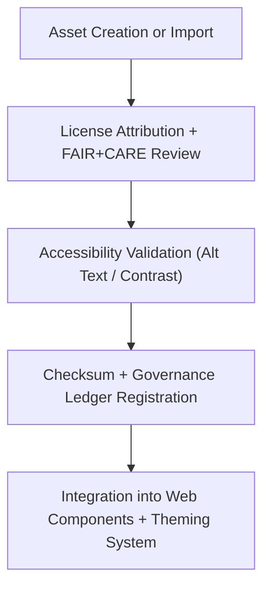

<div align="center">

# 🖼️ **Kansas Frontier Matrix — Web Assets Repository (v2.1.1 · Tier-Ω+∞ Certified)**  
`web/src/assets/README.md`

**Mission:** Store and govern all **visual, audio, and media assets** for the Kansas Frontier Matrix (KFM)  
frontend application under FAIR+CARE, WCAG, and open licensing standards — ensuring ethical design,  
transparent attribution, and reproducible visual provenance.

[](../../../docs/)
[](../../../docs/standards/faircare-validation.md)
[](../../../docs/standards/accessibility.md)
[](../../../LICENSE)

</div>

---

## 📚 Overview

The **Web Assets Repository** contains all static resources used in the KFM frontend, including  
icons, illustrations, map graphics, and promotional media. Each asset is versioned, attributed,  
and verified for **FAIR+CARE compliance**, **WCAG accessibility**, and **ethical sourcing**.

Core objectives:
- 🧩 Maintain centralized, version-controlled repository for visual assets.  
- ⚖️ Ensure provenance and license attribution under FAIR+CARE governance.  
- ♿ Guarantee accessible alt text, captions, and semantic labeling.  
- 🌍 Support multi-resolution and high-contrast variants for inclusivity.  

---

## 🗂️ Directory Layout

```bash
web/src/assets/
├── README.md                      # This file — Asset repository documentation
│
├── icons/                         # SVG icons (line, filled, semantic)
│   ├── map.svg
│   ├── clock.svg
│   ├── ai.svg
│   └── ledger.svg
│
├── banners/                       # Hero images and branding banners
│   ├── kfm_banner.webp
│   ├── faircare_banner.webp
│   └── governance_header.webp
│
└── illustrations/                 # Custom vector illustrations and infographics
    ├── focus-mode-diagram.svg
    ├── stac-workflow.svg
    └── ai-governance-flow.svg
```

---

## ⚙️ Asset Governance Model


<!-- END OF MERMAID -->

---

## 🧱 Core Asset Categories

| Category | Description | FAIR+CARE Function | Validation Workflow |
|:--|:--|:--|:--|
| **Icons** | SVGs for UI, maps, and semantic visual cues. | Accessibility + Ethics | `design-validate.yml` |
| **Banners** | Hero and header visuals for major modules. | Transparency + Provenance | `faircare-validate.yml` |
| **Illustrations** | Educational and contextual infographics. | Collective Benefit (CARE) | `governance-ledger.yml` |

---

## 🧠 FAIR + CARE Integration

| Principle | Implementation | Validation |
|:--|:--|:--|
| **Findable** | Assets indexed in manifest with searchable metadata. | `policy-check.yml` |
| **Accessible** | WCAG alt-text, ARIA labeling, and color contrast. | `design-validate.yml` |
| **Interoperable** | SVG + WebP open formats only (no proprietary). | `ui-validate.yml` |
| **Reusable** | CC-BY licensed assets with clear attribution. | `faircare-validate.yml` |
| **Collective Benefit (CARE)** | Culturally and ethically sourced media. | `governance-ledger.yml` |

---

## ♿ Accessibility & Ethics Standards

| Feature | Implementation | Validation Workflow |
|:--|:--|:--|
| **Alt Text** | All images require `alt` or ARIA `label` attributes. | `design-validate.yml` |
| **Color Contrast** | Visuals must maintain ≥ 4.5:1 ratio. | `design-validate.yml` |
| **Motion Sensitivity** | No excessive animation or flashing. | `faircare-validate.yml` |
| **Attribution Labels** | Licensing metadata embedded in file headers. | `policy-check.yml` |

---

## 🔍 Provenance & Governance Integration

| Artifact | Purpose | Path |
|:--|:--|:--|
| **Asset Manifest** | Registry of all visual assets with metadata. | `releases/v2.1.1/manifest.zip` |
| **Governance Ledger** | Logs checksums and license details. | `data/reports/audit/data_provenance_ledger.json` |
| **FAIR+CARE Ethics Report** | Verifies inclusivity and cultural compliance. | `data/reports/fair/data_care_assessment.json` |

---

## 🧾 Example Asset Metadata

```yaml
---
asset_id: "icon_ai_v2.1.1"
title: "AI Neural Network Icon"
creator: "KFM Design Team"
source: "Original KFM Vector"
license: "CC-BY 4.0"
faircare_status: "Tier-Ω+∞ Verified"
checksum: "sha256:3ad1b6a987fc42ce..."
governance_ledger_entry: "data/reports/audit/data_provenance_ledger.json"
accessibility_compliance: "WCAG 2.1 AA"
alt_text: "Stylized neural network representing AI reasoning system."
---
```

---

## 🧮 Observability Metrics

| Metric | Description | Target | Workflow |
|:--|:--|:--|:--|
| **FAIR+CARE Compliance Rate** | Percentage of assets ethically reviewed. | 100% | `faircare-validate.yml` |
| **Accessibility Compliance** | Alt text, color contrast, and motion score. | ≥ 95 | `design-validate.yml` |
| **License Attribution Accuracy** | Proper license recorded in metadata. | 100% | `policy-check.yml` |
| **Governance Sync Rate** | Asset provenance recorded to ledger. | 100% | `governance-ledger.yml` |

---

## 🧾 Validation Workflows

| Workflow | Function | Output |
|:--|:--|:--|
| `design-validate.yml` | Runs accessibility and visual audits. | `reports/validation/a11y_validation.json` |
| `faircare-validate.yml` | Audits ethical sourcing and inclusivity. | `reports/fair/data_care_assessment.json` |
| `policy-check.yml` | Confirms metadata and licensing structure. | `reports/audit/policy_check.json` |
| `governance-ledger.yml` | Logs checksum and provenance for media. | `data/reports/audit/data_provenance_ledger.json` |

---

## 🕰 Version History

| Version | Date | Author | Summary |
|:--|:--|:--|:--|
| **v2.1.1** | 2025-11-16 | @kfm-design | Added provenance and FAIR+CARE metadata for all assets; updated governance tracking. |
| v2.0.0 | 2025-10-25 | @kfm-accessibility | Integrated WCAG validation and cultural compliance checks. |
| v1.0.0 | 2025-10-04 | @kfm-docs | Established web asset documentation and governance metadata format. |

---

<div align="center">

**Kansas Frontier Matrix © 2025**  
*“Every Image Has a Source — Every Source Has a Story.”*  
📍 `web/src/assets/README.md` — FAIR+CARE-aligned asset repository documentation for the Kansas Frontier Matrix web platform.

</div>

