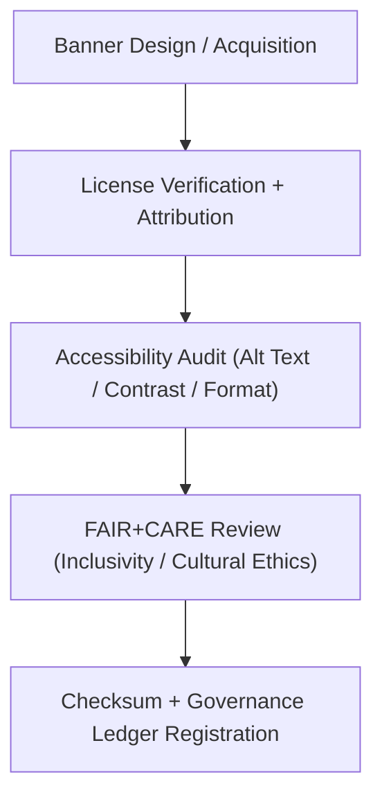

<div align="center">

# 🏞️ **Kansas Frontier Matrix — Web Banners & Hero Media (v2.1.1 · Tier-Ω+∞ Certified)**  
`web/src/assets/banners/README.md`

**Mission:** Curate, validate, and document all **banner and hero imagery** used within  
the **Kansas Frontier Matrix (KFM)** web platform — ensuring all visuals comply with  
**FAIR+CARE**, **WCAG 2.1 AA**, and **ethical provenance** standards for accessibility and governance.

[](../../../../docs/)
[](../../../../docs/standards/faircare-validation.md)
[](../../../../docs/standards/accessibility.md)
[](../../../../LICENSE)

</div>

---

## 📚 Overview

The **Banners Module** stores all hero images and branded media used across KFM’s web interface.  
These images represent the visual identity of the system and are required to meet  
FAIR+CARE governance, accessibility, and provenance documentation standards.

Core objectives:
- 🖼️ Maintain high-resolution, license-compliant, accessible hero imagery.  
- ⚖️ Ensure all banners meet FAIR+CARE ethical design and cultural representation standards.  
- ♿ Provide alt text, captions, and high-contrast variants for accessibility.  
- 🔗 Link all banners to governance ledger for transparency and provenance.  

---

## 🗂️ Directory Layout

```bash
web/src/assets/banners/
├── README.md                         # This file — Documentation for banners
│
├── kfm_banner.webp                   # Primary banner used across documentation
├── faircare_banner.webp              # FAIR+CARE ethics campaign banner
└── governance_header.webp            # Header image for governance and audit pages
```

---

## ⚙️ Banner Governance Model


<!-- END OF MERMAID -->

---

## 🧱 Core Banner Assets

| File | Description | FAIR+CARE Function | Validation Workflow |
|:--|:--|:--|:--|
| **kfm_banner.webp** | Core platform banner (homepage & documentation). | Accessibility + Provenance | `design-validate.yml` |
| **faircare_banner.webp** | FAIR+CARE governance visual promoting ethics & openness. | Responsibility + Ethics | `faircare-validate.yml` |
| **governance_header.webp** | Governance council banner for policy dashboards. | Transparency + Authority | `governance-ledger.yml` |

---

## 🧠 FAIR + CARE Integration

| Principle | Implementation | Validation |
|:--|:--|:--|
| **Findable** | All banners cataloged in the media manifest. | `policy-check.yml` |
| **Accessible** | Each file includes alt text, caption, and WCAG-compliant contrast. | `design-validate.yml` |
| **Interoperable** | Stored as `.webp` for modern, efficient, open-source compatibility. | `ui-validate.yml` |
| **Reusable** | CC-BY 4.0 license with metadata embedded. | `faircare-validate.yml` |
| **Collective Benefit (CARE)** | Promotes equitable representation and transparency. | `governance-ledger.yml` |

---

## ♿ Accessibility Standards (WCAG 2.1 AA)

| Requirement | Implementation | Validation Workflow |
|:--|:--|:--|
| **Alt Text** | Each image includes descriptive `alt` and ARIA metadata. | `design-validate.yml` |
| **Contrast** | Visual brightness adjusted for high-contrast users. | `design-validate.yml` |
| **Responsive Scaling** | Fluid aspect ratio maintained for all screen sizes. | `ui-validate.yml` |
| **Reduced Motion** | Static fallback provided for animated media. | `faircare-validate.yml` |

---

## 🔍 Provenance & Governance Integration

| Artifact | Purpose | Path |
|:--|:--|:--|
| **Media Manifest** | Metadata catalog of all banners and assets. | `releases/v2.1.1/manifest.zip` |
| **Governance Ledger** | Records checksum, source, and license for audit. | `data/reports/audit/data_provenance_ledger.json` |
| **FAIR+CARE Ethics Report** | Evaluates inclusivity and ethical representation. | `data/reports/fair/data_care_assessment.json` |

---

## 🧾 Example Banner Metadata

```yaml
---
asset_id: "kfm_banner_v2.1.1"
title: "Kansas Frontier Matrix — Hero Banner"
creator: "KFM Design Team"
source: "Internal Original Artwork"
license: "CC-BY 4.0"
faircare_status: "Tier-Ω+∞ Verified"
checksum: "sha256:6b24f91d7e53af90..."
alt_text: "Stylized Kansas landscape blending maps, data layers, and archives."
caption: "Kansas Frontier Matrix — Linking data, history, and governance."
governance_ledger_entry: "data/reports/audit/data_provenance_ledger.json"
accessibility_compliance: "WCAG 2.1 AA"
---
```

---

## 🧮 Observability Metrics

| Metric | Description | Target | Workflow |
|:--|:--|:--|:--|
| **Accessibility Compliance Rate** | Banners passing WCAG validation. | 100% | `design-validate.yml` |
| **License Attribution Accuracy** | Banners with embedded metadata and license tags. | 100% | `policy-check.yml` |
| **FAIR+CARE Compliance Score** | Ethical and cultural audit score. | ≥ 95 | `faircare-validate.yml` |
| **Governance Sync Rate** | Provenance successfully logged in ledger. | 100% | `governance-ledger.yml` |

---

## 🧾 Validation Workflows

| Workflow | Function | Output |
|:--|:--|:--|
| `design-validate.yml` | Validates alt text, color contrast, and accessibility. | `reports/validation/a11y_validation.json` |
| `faircare-validate.yml` | Audits ethical representation and inclusivity. | `reports/fair/data_care_assessment.json` |
| `policy-check.yml` | Confirms metadata and license attribution. | `reports/audit/policy_check.json` |
| `governance-ledger.yml` | Records provenance and checksum for all banners. | `data/reports/audit/data_provenance_ledger.json` |

---

## 🕰 Version History

| Version | Date | Author | Summary |
|:--|:--|:--|:--|
| **v2.1.1** | 2025-11-16 | @kfm-design | Added governance-linked FAIR+CARE metadata and alt text compliance. |
| v2.0.0 | 2025-10-25 | @kfm-accessibility | Introduced WCAG and cultural ethics validation for all banners. |
| v1.0.0 | 2025-10-04 | @kfm-docs | Initial documentation and provenance schema for banner media. |

---

<div align="center">

**Kansas Frontier Matrix © 2025**  
*“Every Banner Carries a Message — Every Message Has Provenance.”*  
📍 `web/src/assets/banners/README.md` — FAIR+CARE-aligned web banners documentation for the Kansas Frontier Matrix.

</div>

