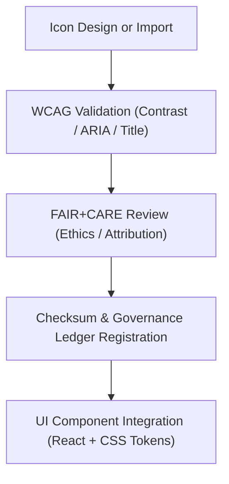

<div align="center">

# 🧩 **Kansas Frontier Matrix — Icon Library (v2.1.1 · Tier-Ω+∞ Certified)**  
`web/src/assets/icons/README.md`

**Mission:** Maintain an **accessible, FAIR+CARE-governed icon library** for the  
**Kansas Frontier Matrix (KFM)** web platform — ensuring every SVG adheres to accessibility,  
ethical sourcing, and provenance standards for transparent and inclusive design.

[](../../../../docs/)
[](../../../../docs/standards/faircare-validation.md)
[](../../../../docs/standards/accessibility.md)
[](../../../../LICENSE)

</div>

---

## 📚 Overview

The **KFM Icon Library** contains reusable SVG icons designed for FAIR+CARE-aligned user interfaces.  
All icons are optimized for accessibility, semantic consistency, and provenance tracking,  
and verified under WCAG 2.1 AA and FAIR+CARE compliance frameworks.

Core objectives:
- 🧭 Provide scalable, semantic icons for consistent UI communication.  
- ♿ Ensure accessibility via ARIA labels and title/desc metadata.  
- ⚖️ Embed provenance metadata and ethical sourcing information.  
- 🌍 Enable color theming and high-contrast variants for inclusivity.  

---

## 🗂️ Directory Layout

```bash
web/src/assets/icons/
├── README.md              # This file — Icon library documentation
│
├── map.svg                # Map visualization icon
├── clock.svg              # Timeline or time-based event icon
├── ai.svg                 # AI reasoning or intelligence visualization icon
└── ledger.svg             # Governance ledger / provenance tracking icon
```

---

## ⚙️ Icon Governance Model


<!-- END OF MERMAID -->

---

## 🧱 Icon Standards

| Standard | Requirement | Implementation |
|:--|:--|:--|
| **Format** | All icons are SVG 1.1+ with `viewBox` defined. | `W3C SVG Validation` |
| **Accessibility** | Each icon includes `<title>` and `<desc>` for screen readers. | `aria-labelledby` attributes |
| **Contrast** | Color and stroke values pass 4.5:1 ratio. | `design-validate.yml` |
| **Ethics / FAIR+CARE** | Metadata includes author, license, and provenance. | `faircare-validate.yml` |
| **Performance** | SVGs ≤ 10KB and minified automatically. | Build CI optimization |

---

## 🧠 FAIR + CARE Integration

| Principle | Implementation | Validation |
|:--|:--|:--|
| **Findable** | Indexed in the manifest with searchable metadata. | `policy-check.yml` |
| **Accessible** | Alt text and ARIA roles included in every SVG. | `design-validate.yml` |
| **Interoperable** | Compatible with design tokens and color themes. | `ui-validate.yml` |
| **Reusable** | Licensed under CC-BY 4.0 for open reuse. | `faircare-validate.yml` |
| **Collective Benefit (CARE)** | Promotes ethical and inclusive iconography. | `governance-ledger.yml` |

---

## ♿ Accessibility & WCAG Compliance

| Guideline | Implementation | Validation |
|:--|:--|:--|
| **1.1.1 – Text Alternatives** | `<title>` + `<desc>` + `aria-labelledby` for each icon. | `design-validate.yml` |
| **1.4.3 – Contrast (Minimum)** | Verified ≥ 4.5:1 for strokes/fills. | `design-validate.yml` |
| **2.4.6 – Headings & Labels** | Contextual labeling for assistive technologies. | `ui-validate.yml` |
| **3.1.5 – Reading Level** | Clear, descriptive icon names for users and developers. | `docs-validate.yml` |

---

## 🔍 Provenance & Governance Integration

| Artifact | Purpose | Path |
|:--|:--|:--|
| **Icon Manifest** | Registry of icon names, licenses, and checksums. | `releases/v2.1.1/manifest.zip` |
| **Governance Ledger** | Logs provenance data and checksum for each icon. | `data/reports/audit/data_provenance_ledger.json` |
| **FAIR+CARE Ethics Log** | Stores inclusivity and attribution audit results. | `data/reports/fair/data_care_assessment.json` |

---

## 🧾 Example Icon Metadata

```yaml
---
icon_id: "ledger_v2.1.1"
title: "Governance Ledger Icon"
creator: "KFM Design Team"
source: "Original KFM Vector"
license: "CC-BY 4.0"
faircare_status: "Tier-Ω+∞ Verified"
checksum: "sha256:aa431be8cd32b4e8..."
alt_text: "Open ledger symbol representing governance records."
governance_ledger_entry: "data/reports/audit/data_provenance_ledger.json"
accessibility_compliance: "WCAG 2.1 AA"
---
```

---

## 🧮 Observability Metrics

| Metric | Description | Target | Workflow |
|:--|:--|:--|:--|
| **Accessibility Compliance Rate** | % of icons passing ARIA + alt text audits. | 100% | `design-validate.yml` |
| **Contrast Validation** | % of icons passing 4.5:1 contrast ratio. | 100% | `design-validate.yml` |
| **License Attribution Accuracy** | Icons with valid CC-BY attribution. | 100% | `policy-check.yml` |
| **Governance Sync Rate** | Icon provenance successfully logged. | 100% | `governance-ledger.yml` |

---

## 🧾 Validation Workflows

| Workflow | Function | Output |
|:--|:--|:--|
| `design-validate.yml` | Validates WCAG accessibility and visual compliance. | `reports/validation/a11y_validation.json` |
| `faircare-validate.yml` | Audits inclusivity and ethics in design. | `reports/fair/data_care_assessment.json` |
| `policy-check.yml` | Verifies metadata, licensing, and naming conventions. | `reports/audit/policy_check.json` |
| `governance-ledger.yml` | Logs checksums and provenance metadata. | `data/reports/audit/data_provenance_ledger.json` |

---

## 🕰 Version History

| Version | Date | Author | Summary |
|:--|:--|:--|:--|
| **v2.1.1** | 2025-11-16 | @kfm-design | Added metadata templates, FAIR+CARE linkage, and ARIA compliance validation. |
| v2.0.0 | 2025-10-25 | @kfm-accessibility | Introduced color contrast validation and semantic labels. |
| v1.0.0 | 2025-10-04 | @kfm-docs | Initial icon library documentation and governance integration. |

---

<div align="center">

**Kansas Frontier Matrix © 2025**  
*“Every Icon Is a Signal — Every Signal Carries Provenance.”*  
📍 `web/src/assets/icons/README.md` — FAIR+CARE-aligned icon library documentation for the Kansas Frontier Matrix.

</div>

