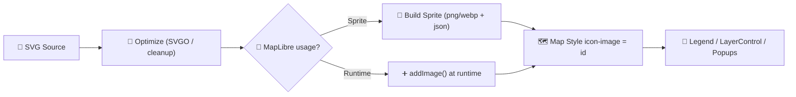

# 🗺️ Map Icons — Kansas Frontier Matrix (KFM)


> 📍 **Path:** `web/src/assets/icons/map/`  
> 🎯 **Purpose:** Consistent, legible, provenance-aware icons for KFM’s map UI (layers, markers, legends, and map-adjacent controls).

---

## ✅ What belongs here

Icons that are used **on/with the map**:

- 📌 **Point markers** (POI, settlements, sites, incidents, Story Node locations)
- 🧱 **Layer glyphs** (LayerControl list icons, legend keys, symbology thumbnails)
- 🧭 **Map UI glyphs** (map-specific buttons like locate, compass, measure… if not shared globally)
- 🧪 **Experimental symbology** (as long as it’s clearly labeled + governed)

---

## 🚫 What does NOT belong here

- 🧩 Generic app UI icons used everywhere (put those in the global icons folder if you have one)
- 🖼️ Photos, textures, posters, banners (those are **assets**, not **icons**)
- 🔒 Anything with unclear licensing / provenance

> ⚠️ **KFM rule of thumb:** if an icon is user-facing symbology, it is part of the UI “contract” — breaking it breaks trust (and sometimes breaks the map style).

---

## 🗂️ Suggested folder layout

> If the folder is already organized differently, **don’t churn it** just to match this tree.  
> Use this as the target structure for *new* additions.

```text
📁 map/
├── 📁 poi/           # Points of interest (town, fort, school, landmark…)
├── 📁 infra/         # Infrastructure (rail, road, bridge, depot…)
├── 📁 hazard/        # Hazards / alerts (flood, fire, drought…)
├── 📁 boundary/      # Admin boundaries / regions (county, tribal, district…)
├── 📁 event/         # Event markers (battle, treaty, migration…)
├── 📁 ui/            # Map-only UI glyphs (measure, locate…)
├── 📁 legend/        # Legend swatches/patterns (optional)
└── 📄 README.md      # (this file)
```

---

## 🏷️ Naming convention

Keep names **predictable** and **stable**:

- ✅ `kebab-case`
- ✅ Prefix with a semantic category (so IDs don’t collide)
- ✅ Keep IDs short, but meaningful
- ✅ No spaces, no weird punctuation, no “final_v7_REAL.svg” 😅

**Recommended pattern:**

```text
<category>-<thing>[-<variant>].svg
```

Examples:

- `poi-town.svg`
- `infra-rail-station.svg`
- `hazard-flood.svg`
- `event-battle.svg`
- `boundary-county.svg`
- `poi-museum-outline.svg` (variant)

> 🧠 **Treat the filename (minus extension) as the icon ID**.  
> If you rename it, anything referencing that ID (MapLibre style, layer configs, legend UI) may break.

---

## 🎨 SVG standards (preferred)

### ✅ SVG “golden rules”

- ✅ **Use SVG first** (scale cleanly, theme cleanly, ship small)
- ✅ `viewBox="0 0 24 24"` (or 32×32 if your set is standardized that way — just be consistent)
- ✅ Use **`currentColor`** where possible
- ✅ Keep shapes **simple** (icons must read at 14–18px)
- ✅ Align to pixel grid for crispness (especially strokes)
- ✅ Remove editor junk (`<metadata>`, unused groups, hidden layers)

### 🚫 Avoid

- ❌ Hard-coded random fills unless the icon *must* be multi-color
- ❌ Embedded rasters inside SVG
- ❌ Tiny details and thin strokes that vanish at map zooms
- ❌ Text in icons (language + scaling problems)

---

## 🎨 Theming + color philosophy

KFM icons should support:

- 🌗 Light/Dark themes
- 🗺️ Different basemaps
- 📊 Multiple layers visible at once (visual hierarchy)

**Recommended approach:**

- **Monochrome SVG** + theme via CSS / style rules  
- Reserve color for **meaning**, not decoration:
  - 🔥 hazard severity
  - ✅ verified vs 🧩 inferred vs ❓ uncertain
  - 🧭 “active tool” states

> 🟣 If you *must* use color, prefer **variants** (e.g. `hazard-fire.svg`, `hazard-fire-muted.svg`) over magic internal fills that can’t be themed.

---

## 🧭 MapLibre integration options

KFM can render icons in MapLibre in a few common ways:

### Option A — 🧩 Sprite-based icons (best for map styles)
- Icons are compiled into a sprite sheet (`sprite.json` + `sprite.png/webp`)
- MapLibre style uses `icon-image: "<icon-id>"`

**Pros:** fast, cacheable, scalable  
**Cons:** requires a build step / tooling

### Option B — ➕ Runtime `addImage()` (fine for small sets)
- Load a PNG (or a rasterized SVG) at runtime and register it

**Pros:** simple, flexible  
**Cons:** runtime overhead, less consistent across layers if unmanaged

### Option C — 🧷 HTML markers (last resort)
- For special interactive UI elements, not normal symbology

**Pros:** easy interaction  
**Cons:** perf costs on large datasets

---

## 📌 Anchors, offsets, and “pin logic”

Icons fall into two families:

- 🎯 **Centered glyphs** (anchor center)
- 📍 **Pins** (anchor bottom-center)

When you add a new “pin” icon:
- Ensure the visual tip is centered on the x-axis
- Avoid excessive whitespace below the tip
- Keep consistent proportions across pins

> 🧩 The map style (or layer config) should define `icon-anchor` / `icon-offset` consistently.  
> Avoid baking alignment hacks into the artwork itself.

---

## ♿ Accessibility (yes, even for icons)

Icons are part of the interface and need to be readable:

- ✅ Prefer clear silhouettes
- ✅ Don’t rely on color-only encoding
- ✅ If an SVG is used in React UI, include a `<title>` or aria label

Example (React component usage):

```tsx
// Pseudocode: import style depends on your build (SVGR/Vite/etc.)
import TownIcon from "./poi/poi-town.svg";

export function LayerRow() {
  return (
    <span className="LayerRow">
      
      <span>Town</span>
    </span>
  );
}
```

---

## 🧾 Provenance & licensing requirements

KFM is provenance-first. Icons must be provenance-safe too.

### ✅ Minimum required metadata (per icon or per icon set)

If icons are created in-house:
- Source: `KFM original`
- License: inherit repo license (unless otherwise stated)

If icons are imported:
- Record the **source** (where)
- Record the **license** (what)
- Record **modifications** (how it was edited)

#### Suggested metadata file (recommended)

Place a sidecar file next to the icon:

```text
poi-town.svg
poi-town.meta.json
```

<details>
<summary>📄 <code>*.meta.json</code> template (click to expand)</summary>

```json
{
  "id": "poi-town",
  "title": "Town",
  "category": "poi",
  "tags": ["settlement", "population", "place"],
  "source": {
    "type": "original",
    "name": "KFM",
    "url": null
  },
  "license": {
    "spdx": "Apache-2.0",
    "url": null
  },
  "created_by": "KFM",
  "modified_by": ["KFM"],
  "notes": "Centered glyph, optimized for 16–20px UI + map sprite."
}
```

</details>

> 🔒 If provenance cannot be established, the icon cannot ship.

---

## 🛠️ Adding a new icon (PR checklist)

### 1) Create / source the icon
- [ ] Icon is either original OR from a vetted, compatible license source
- [ ] Icon communicates a single concept (no “combo” icons)

### 2) Save it correctly
- [ ] Placed in the correct subfolder
- [ ] Named with the convention (`category-thing[-variant].svg`)
- [ ] Uses a consistent `viewBox`
- [ ] Works at 14px, 16px, 18px, 24px

### 3) Optimize
- [ ] Remove editor metadata
- [ ] Reduce paths where possible
- [ ] Ensure fills/strokes are intentional

### 4) Prove it
- [ ] Add provenance metadata (`*.meta.json`) OR document provenance for the set
- [ ] No unclear licensing

### 5) Validate visually
- [ ] Looks correct on light & dark themes
- [ ] Looks correct on different basemaps (satellite, topo, OSM-style)
- [ ] Anchor makes sense (center vs bottom)

---

## 🔁 Icon pipeline (recommended)



---

## 🔍 Troubleshooting

**Icon looks blurry**
- Try snapping to pixel grid
- Avoid fractional stroke widths at small sizes
- Prefer SVG → sprite generation at 2× resolution if rasterizing

**Icon doesn’t show in MapLibre**
- Confirm the icon ID matches `icon-image`
- If using sprites, confirm the sprite contains the ID
- If using runtime registration, ensure `addImage()` runs before the layer is added

**Icon color is “wrong”**
- Check for hard-coded fills/strokes
- Prefer `currentColor` and let theme/style own the color

---

## 🔗 Related KFM docs (recommended reading)

- 📚 Governance & review gates (why provenance matters)
- 🧭 Map UI architecture (MapLibre + layers + legend patterns)
- 🧾 Repo standards (naming, structure, documentation workflow)

> Link these here once your repo paths are confirmed (keep links relative when possible).
