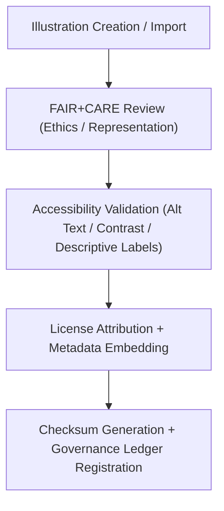

<div align="center">

# 🎨 **Kansas Frontier Matrix — Illustrations & Infographics (v2.1.1 · Tier-Ω+∞ Certified)**  
`web/src/assets/illustrations/README.md`

**Mission:** Manage, govern, and validate all **illustrations and infographics** used in the  
**Kansas Frontier Matrix (KFM)** web ecosystem — ensuring accessibility, ethical representation,  
and full provenance alignment under FAIR+CARE governance.

[](../../../../docs/)
[](../../../../docs/standards/faircare-validation.md)
[](../../../../docs/standards/accessibility.md)
[](../../../../LICENSE)

</div>

---

## 📚 Overview

The **Illustrations Repository** hosts educational and contextual vector artwork used to  
explain concepts within the Kansas Frontier Matrix — from AI reasoning diagrams to  
provenance maps and FAIR+CARE workflow infographics.

Core objectives:
- 🖼️ Ensure every illustration has **clear provenance** and open licensing.  
- ♿ Maintain **WCAG-compliant** accessibility through text alternatives and contrast.  
- ⚖️ Align all visual storytelling with **FAIR+CARE ethical principles**.  
- 📜 Store detailed metadata for **audit, reuse, and citation**.  

---

## 🗂️ Directory Layout

```bash
web/src/assets/illustrations/
├── README.md                             # This file — Documentation for illustrations
│
├── focus-mode-diagram.svg                # Focus Mode AI and context integration diagram
├── stac-workflow.svg                     # Visualization of STAC metadata lifecycle
└── ai-governance-flow.svg                # Diagram explaining AI governance pipeline
```

---

## ⚙️ Illustration Governance Model


<!-- END OF MERMAID -->

---

## 🧱 Core Illustration Assets

| File | Description | FAIR+CARE Function | Validation Workflow |
|:--|:--|:--|:--|
| **focus-mode-diagram.svg** | Explains Focus Mode’s AI, provenance, and contextual logic. | Responsibility + Transparency | `faircare-validate.yml` |
| **stac-workflow.svg** | Depicts STAC → DCAT → Governance lifecycle. | Findable + Interoperable | `stac-validate.yml` |
| **ai-governance-flow.svg** | Visualizes AI model review and audit chain. | Ethics + Accountability | `governance-ledger.yml` |

---

## 🧠 FAIR + CARE Integration

| Principle | Implementation | Validation |
|:--|:--|:--|
| **Findable** | Indexed in manifest with FAIR metadata tags. | `policy-check.yml` |
| **Accessible** | Each SVG includes `title`, `desc`, and ARIA labeling. | `design-validate.yml` |
| **Interoperable** | Open SVG format, compatible with screen readers. | `ui-validate.yml` |
| **Reusable** | Licensed under CC-BY 4.0 and versioned in ledger. | `faircare-validate.yml` |
| **Collective Benefit (CARE)** | Promotes open education and transparency. | `governance-ledger.yml` |

---

## ♿ Accessibility & Ethics Standards

| Feature | Implementation | Validation |
|:--|:--|:--|
| **Alt Text + Descriptions** | Each image includes `<title>` and `<desc>` tags. | `design-validate.yml` |
| **Contrast Ratio** | Foreground/background ratio ≥ 4.5:1. | `design-validate.yml` |
| **Keyboard Navigation** | Focusable elements for interactive infographics. | `ui-validate.yml` |
| **Ethical Context** | All content ethically reviewed for cultural neutrality. | `faircare-validate.yml` |

---

## 🔍 Provenance & Governance Integration

| Artifact | Purpose | Path |
|:--|:--|:--|
| **Illustration Manifest** | Lists all illustrations with metadata. | `releases/v2.1.1/manifest.zip` |
| **Governance Ledger** | Logs checksum, author, and ethics validation. | `data/reports/audit/data_provenance_ledger.json` |
| **FAIR+CARE Audit Report** | Assesses ethical compliance for each illustration. | `data/reports/fair/data_care_assessment.json` |

---

## 🧾 Example Illustration Metadata

```yaml
---
asset_id: "focus-mode-diagram_v2.1.1"
title: "Focus Mode Context Diagram"
creator: "KFM Design Team"
source: "Original Artwork"
license: "CC-BY 4.0"
faircare_status: "Tier-Ω+∞ Verified"
checksum: "sha256:8b1ef63d53e83f48..."
alt_text: "Diagram showing how Focus Mode integrates AI reasoning, FAIR+CARE governance, and data provenance."
caption: "Focus Mode connects people, data, and AI ethically and transparently."
governance_ledger_entry: "data/reports/audit/data_provenance_ledger.json"
accessibility_compliance: "WCAG 2.1 AA"
---
```

---

## 🧮 Observability Metrics

| Metric | Description | Target | Workflow |
|:--|:--|:--|:--|
| **FAIR+CARE Compliance Rate** | % of illustrations with ethical approval. | 100% | `faircare-validate.yml` |
| **Accessibility Compliance** | Alt text and WCAG ratio compliance rate. | ≥ 95 | `design-validate.yml` |
| **Provenance Sync Rate** | Ledger entries successfully recorded. | 100% | `governance-ledger.yml` |
| **License Attribution Accuracy** | Metadata includes full author and license info. | 100% | `policy-check.yml` |

---

## 🧾 Validation Workflows

| Workflow | Function | Output |
|:--|:--|:--|
| `design-validate.yml` | Validates WCAG/ARIA compliance for all illustrations. | `reports/validation/a11y_validation.json` |
| `faircare-validate.yml` | Checks ethical and cultural inclusivity compliance. | `reports/fair/data_care_assessment.json` |
| `policy-check.yml` | Verifies metadata accuracy and license attribution. | `reports/audit/policy_check.json` |
| `governance-ledger.yml` | Records checksum and governance provenance. | `data/reports/audit/data_provenance_ledger.json` |

---

## 🕰 Version History

| Version | Date | Author | Summary |
|:--|:--|:--|:--|
| **v2.1.1** | 2025-11-16 | @kfm-design | Added ethical metadata structure, FAIR+CARE audit integration, and provenance validation. |
| v2.0.0 | 2025-10-25 | @kfm-accessibility | Introduced ARIA labeling and WCAG validation framework. |
| v1.0.0 | 2025-10-04 | @kfm-docs | Initial illustration documentation and governance mapping. |

---

<div align="center">

**Kansas Frontier Matrix © 2025**  
*“Illustration Is Knowledge Made Visible — Provenance Makes It Trustworthy.”*  
📍 `web/src/assets/illustrations/README.md` — FAIR+CARE-aligned illustration and infographic documentation for the Kansas Frontier Matrix.

</div>

