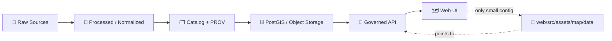

# 🗺️ Map Data Assets (UI-side) — `web/src/assets/map/data`


> **TL;DR**: This folder holds **small, version-controlled map artifacts** required by the web client at build/runtime (styles, layer manifests, tiny overlays, legends).  
> **It is NOT the data lake.** Canonical datasets should flow through the governed pipeline and be served via the API (GeoJSON stream / vector tiles / raster tiles).

---

## ✨ Why this folder exists

KFM is “**the map behind the map**” — every map layer shown in the UI should remain **traceable, governed, and source-linked**. That means we keep the web repo **lightweight**, and we point the UI at the **API** for authoritative data.

This directory is where we keep:
- 🎨 **Map styles** (client configuration)  
- 🧩 **Layer registry/manifest** (what layers exist + how to request them)  
- 🧭 **Legend + attribution UI helpers**  
- 🧪 **Tiny dev/test fixtures** (optional, small only)

---

## ✅ What belongs here

**Good fits ✅**
- 🎨 MapLibre/Mapbox style JSON (basemap style, theme variants)
- 🧩 Layer registry (JSON/TS/MD) that maps **layer IDs → API endpoints**
- 🧷 Small static icon metadata (e.g., marker sprite config)
- 🧭 Legend definitions & category ramps (small)
- 🧪 Micro GeoJSON fixtures for tests (small, low risk)

---

## 🚫 What does NOT belong here

**Hard “no” 🚫**
- 🐘 Large GeoJSON / Shapefiles / GeoTIFFs / MBTiles
- 🧱 “Just drop the dataset in the frontend” shortcuts
- 🔒 Sensitive geometry/coordinates (especially for culturally sensitive sites)
- 🧨 Any data without licensing + attribution + provenance linkage

If it’s “real data,” it belongs in:
- `data/raw/` → `data/processed/` → catalog/prov → database → API  
…and the **web** should consume it from there.

---

## 🧠 KFM “Truth Path” (how map data should flow)



**Key idea**: UI assets define *how to request + render* data, not *store* the data.

---

## 📦 Suggested layout

> Your exact structure may differ — this is the “intended” organization for keeping things clean & scalable.

```text
web/src/assets/map/data/
├─ 🎨 styles/                # Map style JSON (MapLibre compatible)
│  ├─ basemap.light.json
│  ├─ basemap.dark.json
│  └─ style.tokens.json      # optional: shared tokens for theme generation
│
├─ 🧩 layers/                # Layer registry / manifests
│  ├─ layers.registry.json
│  ├─ layers.schema.json     # optional: JSON Schema for validation
│  └─ layers.readme.md       # optional: notes for layer authors
│
├─ 🧭 legends/               # Legend definitions & ramps
│  ├─ legends.json
│  └─ ramps/                 # color ramps or classifications (small)
│
├─ 🧪 fixtures/              # tiny GeoJSON fixtures for tests/dev only
│  └─ demo_county_outline.geojson
│
└─ 📄 README.md              # <-- you are here
```

---

## 🧩 Layer IDs are a contract

Layer IDs are referenced by:
- 🧭 map UI toggles
- 📚 Story Nodes (map context + narrative linking)
- 🔍 search / “Focus Mode” side panels
- 🧾 citations / provenance popovers

So treat IDs like public API:
- ✅ stable
- ✅ descriptive
- ✅ versioned when breaking changes happen

**Recommended ID format:**
- `domain__topic__year_or_range__variant`  
  Example: `hydrology__streams__1880__lines`

---

## 🌐 Data formats & CRS rules

### GeoJSON overlays (small + interactive)
- **Default CRS**: WGS84 / EPSG:4326
- **Coordinate order**: `[lon, lat]` (x = longitude, y = latitude)  
- Keep GeoJSON tiny; use API `bbox` filters when possible.

### Tile layers (big + performant)
Use tiles for heavy layers:
- 🧩 **Vector tiles (MVT)**: `.../{z}/{x}/{y}.pbf`
- 🖼️ **Raster tiles**: `.../{z}/{x}/{y}.png` (or `.webp`)

Tiles are how we keep the UI fast while supporting large historical layers.

---

## 🔌 Layer registry schema (recommended)

> You can implement this as JSON, YAML, or TS objects — the point is consistency + provenance.

### Minimum fields (suggested)
| Field | Type | Purpose |
|---|---:|---|
| `id` | string | Stable layer ID (contract) |
| `title` | string | Human label |
| `kind` | `"vector-tiles" \| "raster-tiles" \| "geojson"` | Rendering strategy |
| `source` | object | URL template(s) for API requests |
| `dcatDatasetId` | string | Dataset ID for provenance popover |
| `license` | string | License short ID / link |
| `attribution` | string | Attribution text shown in UI |
| `minzoom` / `maxzoom` | number | Visibility bounds |
| `defaultOn` | boolean | Whether enabled by default |
| `tags` | string[] | Search + grouping |

### Example (vector tile layer)
```jsonc
{
  "id": "trails__historic__1880__primary",
  "title": "Historic Trails (c.1880)",
  "kind": "vector-tiles",
  "source": {
    "tiles": ["/tiles/trails_historic_1880/{z}/{x}/{y}.pbf"]
  },
  "dcatDatasetId": "trails_historic_1880",
  "license": "Public Domain",
  "attribution": "KFM • Source: …",
  "minzoom": 4,
  "maxzoom": 14,
  "defaultOn": false,
  "tags": ["history", "transport", "trails"]
}
```

### Example (GeoJSON overlay)
```jsonc
{
  "id": "counties__outline__1890__light",
  "title": "County Outlines (1890)",
  "kind": "geojson",
  "source": {
    "url": "/api/v1/datasets/geo_counties_1890/data?format=geojson&bbox={bbox}"
  },
  "dcatDatasetId": "geo_counties_1890",
  "license": "CC-BY 4.0",
  "attribution": "KFM • Source: …",
  "minzoom": 4,
  "maxzoom": 22,
  "defaultOn": false,
  "tags": ["admin", "boundaries"]
}
```

---

## 🎨 Styling guidance (keep it boring & consistent)

- Prefer **data-driven styling** (by year/class/category) over one-off manual styles.
- Keep legends **explicit**: a user should understand a layer without guessing.
- Avoid “pretty defaults” that hide uncertainty — KFM is evidence-first 🧾

**If you introduce new symbology**, add/update:
- 🧭 legend entries  
- 🧾 attribution & license text  
- 🔗 dataset linkage (`dcatDatasetId`) so provenance popovers work  

---

## 🔐 Ethics & CARE guardrails

Some layers may require safety measures:
- blur / grid / aggregate sensitive coordinates
- hide high precision unless explicitly allowed
- apply governance rules consistently

If a layer *might* be sensitive, treat it as sensitive until proven otherwise. 🧠

---

## ✅ PR checklist for map assets

Before merging:
- [ ] No large data files committed (keep Git lean 🪶)
- [ ] Layer IDs are stable + documented
- [ ] Every new layer has attribution + license + dataset linkage
- [ ] GeoJSON overlays are EPSG:4326 and small
- [ ] Tile layers hit `/tiles/...` endpoints and render correctly
- [ ] Legends match styling (no “mystery colors”)
- [ ] Story Nodes that reference layers still resolve properly

---

## 🔎 Quick troubleshooting

<details>
  <summary><strong>🧭 “My layer renders in the ocean.”</strong></summary>

- You probably flipped coordinate order: `[lat, lon]` instead of `[lon, lat]`.
- Verify CRS: GeoJSON should be WGS84/EPSG:4326 unless explicitly documented otherwise.

</details>

<details>
  <summary><strong>🧩 “GeoJSON is slow / crashes the tab.”</strong></summary>

- Switch to **vector tiles** if it’s large or dense.
- If you must use GeoJSON, require a `bbox` filter and simplify geometry upstream.

</details>

<details>
  <summary><strong>🧾 “Where do I put the provenance popover info?”</strong></summary>

- Don’t hardcode provenance in the UI.
- Link to the dataset (`dcatDatasetId`) and let the UI fetch metadata from the catalog/API.

</details>

---

## 📚 Related docs (recommended reading)

> These should live in the repo; adjust links if paths change.

- 🧱 Architecture overview: `../../../../../docs/architecture/system_overview.md`
- 🔌 API contracts & endpoints: `../../../../../src/server/api/README.md`
- 🧾 Governance & provenance: `../../../../../docs/governance/`
- 🧠 Story Nodes templates: `../../../../../docs/story_nodes/` (or your project’s template location)

---

## 🧭 North Star (pun intended)

If a user asks: **“Where did this line/polygon come from?”**  
…the UI should be able to answer in one click: **dataset → license → source → lineage** 🧾✨
