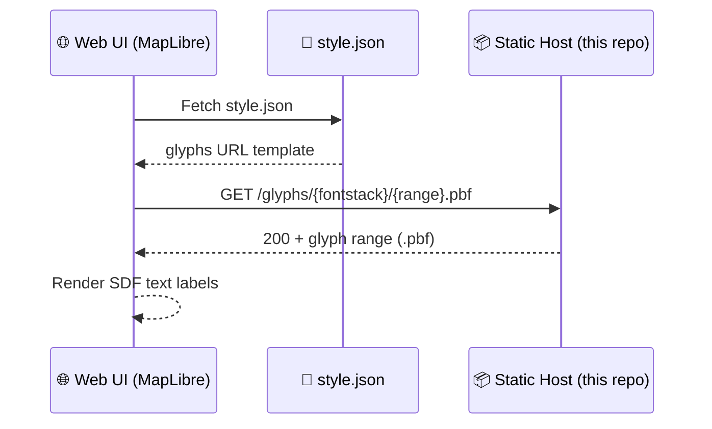

# 🔤 Map Glyphs (SDF `.pbf`) — MapLibre/Mapbox Style Fonts


-6f42c1)


This folder holds **Signed Distance Field (SDF) glyph ranges** packaged as **Protocol Buffers (`.pbf`)**.
They are used by **MapLibre GL JS** (and Mapbox-Style renderers) to draw **text labels** on vector maps.

> ✅ If your map renders text (roads, town names, POI labels), you need a working `glyphs` endpoint in your style JSON.

---

## ✨ What are “glyphs” in map styles?

In MapLibre/Mapbox style JSON, `glyphs` is a URL template pointing to a font server (or static folder) that serves
**glyph ranges** in 256-codepoint chunks:

- `{fontstack}` → a **comma-separated font stack** (URL-encoded)
- `{range}` → a **256 Unicode codepoint range**, like `0-255`, `256-511`, etc.

When your map needs to render a label, MapLibre requests the matching `.pbf` ranges for the fonts in use.

---

## 🧠 TL;DR

- **Glyphs ≠ webfonts** (`.woff`, `.ttf`, `.otf`)
- **Glyphs = prebuilt SDF “atlases”** delivered as `.pbf`
- These are fetched dynamically as the map encounters text
- This directory is for **self-hosted/offline-friendly** map typography

---

## 🗂️ Expected folder layout

> This is the “classic” glyph layout most static hosts use.

```text
🗺️ web/src/assets/map/glyphs/
├─ 📁 Open Sans Regular/
│  ├─ 0-255.pbf
│  ├─ 256-511.pbf
│  ├─ 512-767.pbf
│  └─ …
├─ 📁 Noto Sans Regular/
│  ├─ 0-255.pbf
│  └─ …
└─ 📄 README.md  ← you are here
```

> ⚠️ If your style uses **multi-font stacks**, the requested `{fontstack}` may look like:
> `Open Sans Regular,Arial Unicode MS Regular` (URL-encoded).  
> That can require **composited stacks** (see “Font stacks” below).

---

## 🔗 Where this connects in the app

Your **style JSON** must contain a `glyphs` field, for example:

```json
{
  "version": 8,
  "name": "KFM Style",
  "glyphs": "https://YOUR_DOMAIN_HERE/assets/map/glyphs/{fontstack}/{range}.pbf"
}
```

### ✅ Local/self-host note
If you’re deploying to GitHub Pages or a subpath, prefer a **fully-qualified URL** so the base path doesn’t surprise you.

---

## 🧱 Font stacks: keep them simple (unless you run a glyph server)

Map styles often set `text-font` like this:

```json
{
  "layout": {
    "text-font": ["Open Sans Regular", "Arial Unicode MS Regular"]
  }
}
```

That’s convenient, but it can complicate self-hosting because MapLibre may request:

```text
{fontstack} = "Open Sans Regular,Arial Unicode MS Regular"
```

### Recommended approach ✅
- Prefer **single-font stacks** where possible (especially for English-only labels).
- If you need broad Unicode support, consider:
  - a dedicated glyph server (dynamic composition), or
  - a known set of prebuilt composite stacks (more maintenance).

---

## 🛠️ Adding or updating fonts

### Option A — Easiest (UI tool)
Use a font → glyph generator (export zip of `.pbf` ranges), then drop the output here under a folder named
exactly like your `text-font` value.

- Pros: fast, low friction
- Cons: may not be “pipeline reproducible” unless you also record inputs + tool version

### Option B — CLI / reproducible build (recommended for long-term)
Use a pinned toolchain to generate glyph ranges from `.ttf/.otf` fonts and commit the outputs.

**Best practice for KFM-style governance:**
- store font sources *somewhere stable* (not necessarily in this folder)
- record:
  - font file name + version
  - license
  - generation tool + version
  - date generated
- regenerate deterministically when updating

> 🔁 Treat glyphs like a *build artifact*: same inputs should produce the same outputs.

---

## ✅ Quick validation checklist

Use this when glyph labels look wrong (missing characters, tofu ☐☐☐, or blank labels):

- [ ] The style JSON has a `glyphs` property
- [ ] Requests for `…/{fontstack}/{range}.pbf` return **200**, not 404
- [ ] Folder names match the **exact** font face names used in `text-font`
- [ ] The server serves `.pbf` files (MIME type isn’t usually critical, but responses must not be blocked)
- [ ] You’re not accidentally pointing `glyphs` at a sprite path (or vice versa)

### Browser debugging tip 🧩
Open DevTools → Network → filter by `.pbf` and look for failed glyph requests.

---

## 🧯 Common issues & fixes

### 404 on `…/Open%20Sans%20Regular/0-255.pbf`
- The folder might be named differently than the `text-font` value.
- Rename folder to match the style’s font name exactly (including spaces/case).

### Requests look like `…/Open%20Sans%20Regular,Arial%20Unicode%20MS%20Regular/0-255.pbf`
- That’s a **composite font stack** request.
- Fix by:
  - using a single-font `text-font`, **or**
  - hosting composite glyph stacks, **or**
  - running a glyph composition server.

### “Text disappears” after style change
- The new style may reference a new font stack name.
- Ensure glyphs exist for the new `text-font` and that the `glyphs` URL template is correct.

---

## 🔒 Licensing & provenance (important)

Fonts are licensed assets. Glyphs are derived from fonts.

Before adding any new glyph set:

- [ ] Confirm the font license allows redistribution in your deployment model
- [ ] Keep attribution where required
- [ ] Record the provenance (font source + version + generator tool)

> 🧾 If in doubt, prefer fonts with permissive licenses (e.g., SIL OFL).

---

## 🔁 Related assets (don’t mix these up)

- **Sprites**: icons/patterns (`sprite.json` + `sprite.png`)  
- **Glyphs**: text rendering (`{fontstack}/{range}.pbf`)  
- **Tiles**: vector or raster map data (TileJSON, `.pbf`, `.mvt`, `.png`, etc.)

Keeping these separate makes offline hosting and debugging *way* easier.

---

## 📚 References

- MapLibre Style Spec — Glyphs: <https://maplibre.org/maplibre-style-spec/glyphs/>
- MapLibre Style Spec — Root example: <https://www.maplibre.org/maplibre-style-spec/root/>
- Mapbox Style Spec — Glyphs: <https://docs.mapbox.com/style-spec/reference/glyphs/>
- OpenMapTiles notes on fonts & glyph hosting: <https://openmaptiles.org/docs/style/mapbox-gl-style-spec/>

---

## 🧭 Diagram: how glyphs are fetched


