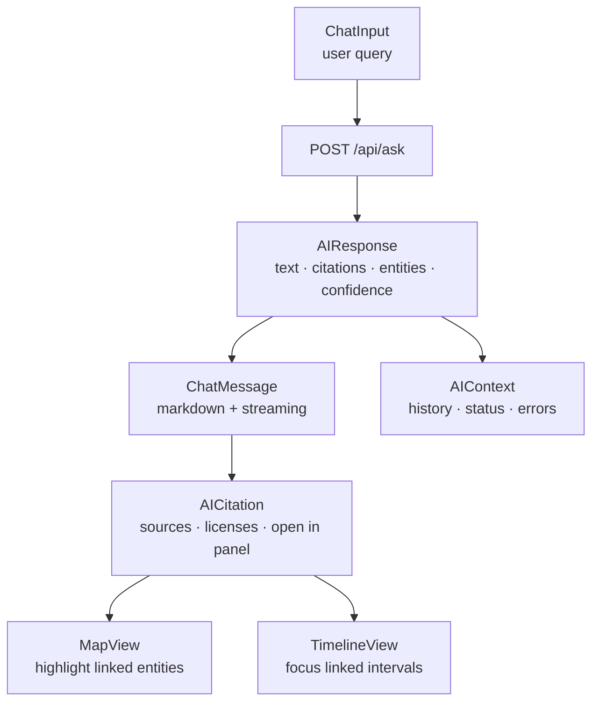
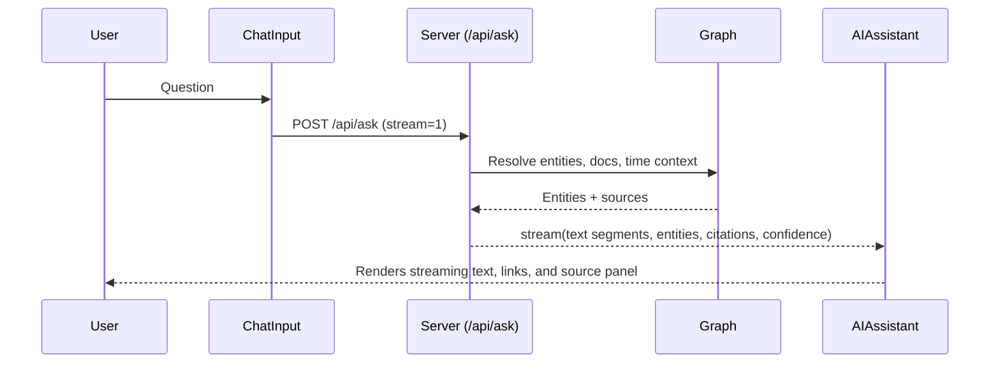

<div align="center">

# 🤖 Kansas Frontier Matrix — **AI Assistant Component**  
`web/src/components/AIAssistant/`

**Conversational Exploration · Summaries · Q&A · Entity Linking**

[](../../../../../.github/workflows/ci.yml)
[](../../../../../.github/workflows/codeql.yml)
[](../../../../../docs/)
[](../../../../../docs/design/reviews/accessibility/)
[](../../../../../LICENSE)

</div>

---

## 🧭 Overview

The **AI Assistant** enables **conversational exploration** of the KFM knowledge graph.  
Users ask natural-language questions; the Assistant responds with **context-aware answers**, **citations**, and **entity links** that can highlight **MapView** features and focus **TimelineView** intervals.

**Principles (MCP-DL v6.2):** explainability, provenance, semantic alignment, and accessible conversational UX.

> *“Every answer tells a story — the Assistant turns Kansas’s data into dialogue.”*

---

## 🧱 Directory Structure

```text
web/src/components/AIAssistant/
├── AIAssistant.tsx        # Main chat container + layout & streaming glue
├── ChatInput.tsx          # Text input, hotkeys, submit, IME-friendly
├── ChatMessage.tsx        # Message bubbles (user/AI) with markdown render
├── AICitation.tsx         # Source list (title · license · entity jump)
├── styles.scss            # Tokens, layout, motion, markdown rules
└── __tests__/             # Jest + RTL (streaming, linking, a11y)
```

---

## 🧩 Architecture



---

## 🔍 Core Features

| Feature                  | Description                                                               | Backend / Contract      |
| :----------------------- | :------------------------------------------------------------------------ | :---------------------- |
| **Conversational Q&A**   | Natural language questions with grounded answers                          | `POST /api/ask`         |
| **Entity Linking**       | Detects People/Places/Events/Documents and links to panels & map          | AIResponse.entities     |
| **Citations Panel**      | Lists sources with license and direct entity/document jumps               | AIResponse.citations    |
| **Streaming Output**     | Token/segment streaming for responsive UX                                 | FastAPI Streaming       |
| **Confidence Signals**   | Displays confidence & evidence strength                                   | AIResponse.confidence   |
| **Context Sync**         | Highlights map features; focuses timeline intervals                       | Map/Timeline contexts   |
| **Accessibility**        | Keyboard-complete, screen-reader safe, reduced-motion aware               | WCAG 2.1 AA             |

---

## 💬 Reference Implementation (concise)

```tsx
import React, { useState } from "react";
import { useFetch } from "../../hooks/useFetch";
import "./styles.scss";

export function AIAssistant() {
  const [prompt, setPrompt] = useState("");
  const { data, loading, error } = useFetch(
    prompt ? `/api/ask?stream=1&prompt=${encodeURIComponent(prompt)}` : null
  );

  return (
    <section className="ai-assistant" role="complementary" aria-label="AI Assistant">
      <form
        onSubmit={(e) => { e.preventDefault(); setPrompt((e.target as any).q.value); }}
        className="ai-input"
      >
        <label htmlFor="q" className="sr-only">Ask a question</label>
        <input id="q" name="q" placeholder="Ask about treaties, rivers, droughts…" />
        <button type="submit">Ask</button>
      </form>

      <div className="ai-messages" aria-live="polite">
        {loading && <div className="msg loading">Thinking…</div>}
        {error && <div className="msg error">Unable to get an answer.</div>}
        {data?.messages?.map((m: any, i: number) => (
          <div key={i} className={`msg ${m.role}`}>{m.text}</div>
        ))}
      </div>
    </section>
  );
}
```

---

## 🧠 Data Model (TypeScript)

```ts
export interface AIResponse {
  text: string;                          // final or partial text (stream segments supported)
  citations?: Citation[];                // sources/datasets with titles & licenses
  entities?: EntityReference[];          // linked graph entities for map/timeline
  confidence?: number;                   // 0..1 model confidence
  timestamp: string;                     // ISO 8601
}

export interface Citation {
  id: string;
  title: string;
  sourceUrl?: string;
  license?: string;                      // e.g., CC-BY 4.0
  excerpt?: string;
}

export interface EntityReference {
  id: string;
  type: "Person" | "Place" | "Event" | "Document";
  label: string;
  coordinates?: [number, number];
  bbox?: [number, number, number, number];
}
```

*Types live in `web/src/types/ai.d.ts` and align with KFM’s graph schema (CIDOC CRM · PROV-O · OWL-Time).*

---

## 🧭 Interaction Flow



---

## 🎨 UI & Styling

| Aspect              | Notes                                                                 |
| :------------------ | :-------------------------------------------------------------------- |
| **Layout**          | Messages column + citations pane (stacks on mobile)                   |
| **Markdown**        | Sanitized render; code/quote/list support                             |
| **Theme**           | Adapts to light/dark tokens from `ThemeContext`                       |
| **Motion**          | Framer Motion for enter/appear; auto-disabled on PRM                  |
| **Scroll**          | Auto-scroll to latest; “jump to newest” affordance for long threads   |

```scss
.ai-assistant { display:flex; flex-direction:column; gap:.75rem; }
.ai-messages { overflow:auto; max-height: calc(100vh - 260px); }
.msg.ai { background: var(--kfm-color-surface); border-left: 3px solid var(--kfm-color-accent); }
```

---

## ♿ Accessibility (WCAG 2.1 AA)

- **Keyboard:** `Alt+A` focus panel; `Enter` submit; `Esc` clear.  
- **Live Region:** `aria-live="polite"` for streamed segments; debounce to avoid AT spam.  
- **Focus Order:** Input → latest message → citations; trap focus in modal citation view.  
- **Motion/Contrast:** Honors `prefers-reduced-motion`; tokens meet ≥4.5:1.  
- **Labels:** Inputs/buttons include clear `aria-label`/`aria-describedby`.

Audited with **axe-core** + **Lighthouse**.

---

## 🧪 Testing & Validation

| Test                       | Purpose                                                | Tools                |
| :------------------------- | :----------------------------------------------------- | :------------------- |
| Streaming rendering        | Incremental segments append correctly                  | MSW + RTL            |
| Entity linking → map/tl    | Click/link dispatches highlight & interval focus       | Jest DOM + mocks     |
| Citations provenance       | Titles/licenses present; links open safely             | RTL                  |
| Keyboard flow & live      | Skip-link, focus order, aria-live correctness          | axe-core + RTL       |
| Theme & PRM                | Stable visuals across themes; motion disabled on PRM   | Jest Snapshot + RTL  |

**Coverage target:** ≥ **90%**.

---

## 🛠 Performance Notes

- Start rendering **as soon as first stream chunk arrives**; append progressively.  
- Use **idempotent** entity highlight calls to avoid churn.  
- Memoize citation and entity lists; batch DOM updates with `requestAnimationFrame`.  
- Avoid expensive re-renders by splitting `ChatMessage` into `React.memo` blocks.

---

## 🧾 Provenance & Integrity

| Artifact         | Description                                                                 |
| :--------------- | :-------------------------------------------------------------------------- |
| **Inputs**       | `/api/ask`, `/api/entity/{id}`, graph metadata, STAC-linked documents       |
| **Outputs**      | Messages, citation panels, map/timeline highlights                          |
| **Dependencies** | React 18+, Fetch/Axios, Markdown renderer, Framer Motion, TailwindCSS       |
| **Integrity**    | CI gates: lint, type, unit/integration, a11y audits, performance budgets    |

---

## 🧠 MCP Compliance Checklist

| Principle             | Implementation                                              |
| :-------------------- | :---------------------------------------------------------- |
| Documentation-first   | README + TSDoc on props and handlers                        |
| Reproducibility       | Deterministic data→UI pipeline; logged AI provenance        |
| Explainability        | Visible citations + confidence displayed with every answer  |
| Accessibility         | WCAG 2.1 AA validated in CI                                 |
| Interoperability      | CIDOC CRM · PROV-O · OWL-Time semantics respected           |

---

## 🔗 Related Documentation

- **Components Overview** — `web/src/components/README.md`  
- **AIContext & Hooks** — `web/src/context/README.md`  
- **Utilities (aiUtils.ts)** — `web/src/utils/README.md`  
- **Web UI Architecture** — `web/ARCHITECTURE.md`  
- **AI System Overview** — `docs/ai/overview.md`

---

## 🧾 Versioning & Metadata

| Field | Value |
| :---- | :---- |
| **Version** | `v1.6.0` |
| **Codename** | *Explainable Streaming & Entity Linking Upgrade* |
| **Last Updated** | 2025-10-17 |
| **Maintainers** | @kfm-ai · @kfm-web |
| **License** | MIT (code) · CC-BY 4.0 (docs) |
| **Alignment** | CIDOC CRM · PROV-O · OWL-Time · WCAG 2.1 AA |
| **Maturity** | Stable / Production |

---

## 📜 License

Released under the **MIT License**.  
© 2025 Kansas Frontier Matrix — explainable, auditable, and accessible AI for spatiotemporal history.
