<div align="center">

# 🤖 Kansas Frontier Matrix — **AI Assistant Component**  
`web/src/components/AIAssistant/`

**Conversational Exploration · Summaries · Q&A · Entity Linking**

[](../../../../../.github/workflows/ci.yml)
[](../../../../../.github/workflows/codeql.yml)
[](../../../../../docs/)
[](../../../../../docs/design/reviews/accessibility/)
[](../../../../../LICENSE)

</div>

---

```yaml
---
title: "KFM • AI Assistant Component (web/src/components/AIAssistant/)"
version: "v1.5.0"
last_updated: "2025-10-14"
owners: ["@kfm-ai", "@kfm-web"]
tags: ["ai","assistant","nlp","knowledge-graph","q&a","react","mcp","accessibility"]
license: "MIT"
semantic_alignment:
  - CIDOC CRM (entity linkage)
  - PROV-O (source provenance)
  - WCAG 2.1 AA
  - OWL-Time (temporal context reasoning)
---
````

---

## 🧭 Overview

The **AI Assistant** component powers the **conversational exploration interface** of the Kansas Frontier Matrix (KFM) Web Application.
It allows users to query the historical **knowledge graph** in plain English, generating **context-aware answers** with citations and interactive links to people, places, and events on the **map** and **timeline**.

This module integrates with:

* `/api/ask` — AI model inference and answer generation
* `/api/entity/{id}` — entity metadata retrieval
* `AIContext` — stores conversation history, streaming responses, and context state
* `MapView` and `TimelineView` — for dynamic highlighting of entities mentioned in answers

Built according to **MCP-DL v6.2**, it emphasizes **explainable AI**, **provenance transparency**, and **accessible conversational UX**.

---

## 🧱 Directory Structure

```text
web/src/components/AIAssistant/
├── AIAssistant.tsx        # Main chat container + layout
├── ChatInput.tsx          # Text input and submission handler
├── ChatMessage.tsx        # Renders user and AI messages with animation
├── AICitation.tsx         # Displays linked entities and sources
├── styles.scss            # Theming, layout, animations, markdown rendering
└── __tests__/             # Jest + RTL tests (message flow, entity linking, accessibility)
```

---

## ⚙️ Component Architecture

```mermaid
flowchart TD
  UI["ChatInput<br/>user query"] --> API["AI API<br/>POST /ask"]
  API --> RES["AIResponse<br/>text · citations · entities"]
  RES --> MSG["ChatMessage<br/>renders formatted text"]
  MSG --> CITE["AICitation<br/>links to sources/entities"]
  CITE --> MAP["MapView<br/>highlight related entities"]
  CITE --> TL["TimelineView<br/>focus on linked events"]
  RES --> HIST["AIContext<br/>preserves chat history"]
%% END OF MERMAID
```



> The Assistant serves as the cognitive layer between human interaction and the KFM graph — turning data into dialogue and insights.

---

## 🧩 Key Features

| Feature                  | Description                                                    | Backend Link        |
| :----------------------- | :------------------------------------------------------------- | :------------------ |
| **Conversational Input** | Accepts natural-language questions about Kansas history        | `/api/ask`          |
| **Knowledge Summaries**  | Retrieves and formats entity-level summaries                   | `/api/entity/{id}`  |
| **Entity Linking**       | Detects and links entities (people, places, events) in AI text | Neo4j Graph         |
| **Citations Panel**      | Displays sources and provenance metadata                       | AIResponse metadata |
| **AI Confidence**        | Shows model confidence levels and evidence strength            | Response metadata   |
| **Streaming Support**    | Supports real-time text streaming from FastAPI backend         | `StreamingResponse` |
| **Accessibility**        | Fully keyboard-accessible and screen reader compliant          | WCAG 2.1 AA         |

---

## 💬 Example Usage

```tsx
import React from "react";
import { AIAssistant } from "./AIAssistant";

export default function RightPanel() {
  return (
    <aside className="ai-panel" role="complementary" aria-label="AI Assistant Panel">
      <AIAssistant />
    </aside>
  );
}
```

---

## 🧠 Interaction Flow

```mermaid
sequenceDiagram
  participant U as User
  participant A as AIAssistant
  participant S as Server (FastAPI)
  participant G as Graph (Neo4j)

  U->>A: "Show me droughts in western Kansas during the 1930s"
  A->>S: POST /api/ask
  S->>G: Query drought events (1930–1940, region='Kansas')
  G-->>S: Return entities + sources
  S-->>A: AIResponse { text, entities, citations }
  A-->>U: "The Dust Bowl drought (1930–1939) devastated western Kansas..." + map highlights
%% END OF MERMAID
```



---

## 🧩 Data Model (TypeScript)

```ts
export interface AIResponse {
  text: string;                     // AI-generated answer
  citations?: Citation[];           // Linked sources or datasets
  entities?: EntityReference[];     // Map/timeline entities
  confidence?: number;              // Model confidence score
  timestamp: string;                // ISO 8601 UTC time
}

export interface EntityReference {
  id: string;
  type: "Person" | "Place" | "Event" | "Document";
  label: string;
  coordinates?: [number, number];
}
```

These interfaces (defined in `web/src/types/ai.d.ts`) ensure strict alignment between backend responses and frontend display logic.

---

## 🎨 UI & Styling

| Element              | Description                                                 |
| :------------------- | :---------------------------------------------------------- |
| **Layout**           | Two-column responsive chat panel (Messages · Citations)     |
| **Animations**       | `Framer Motion` fade and slide transitions for message flow |
| **Theme**            | Adaptive to `ThemeContext` (dark/light palette)             |
| **Markdown Support** | `Markdown-it` renders rich text, lists, and links           |
| **Scroll Behavior**  | Infinite scroll + auto-anchor to latest message             |
| **Typography**       | Readable at 16px+ base, line height ≥ 1.6, contrast ≥ 4.5:1 |

Example SCSS:

```scss
.ai-panel {
  background: var(--kfm-color-surface);
  color: var(--kfm-color-text);
  display: flex;
  flex-direction: column;
  border-left: 1px solid var(--kfm-color-muted);
}

.message {
  padding: 0.75rem 1rem;
  animation: fadeInUp 0.3s ease;
}
```

---

## ♿ Accessibility (WCAG 2.1 AA)

* **Keyboard Shortcuts:**

  * `Alt+A` → Focus AI Assistant
  * `Enter` → Send message
  * `Esc` → Clear or close chat
* **ARIA Live Region:** AI responses use `aria-live="polite"` to announce streaming text updates.
* **Focus Order:** Logical progression (Input → Messages → Citations).
* **Motion Sensitivity:** Framer Motion transitions disabled when `prefers-reduced-motion` is true.
* **Color Contrast:** Tokens meet 4.5:1 ratio across themes.

Accessibility verified with **axe-core**, **Lighthouse**, and manual screen reader testing (NVDA, VoiceOver).

---

## 🧪 Testing & Validation

| Test                    | Description                                                      | Tool          |
| :---------------------- | :--------------------------------------------------------------- | :------------ |
| **Message Rendering**   | Validates correct rendering order and animation of chat messages | Jest + RTL    |
| **API Integration**     | Mocks `/api/ask` responses, simulates streaming updates          | MSW           |
| **Entity Linking**      | Ensures clicking entity links triggers Map/Timeline highlights   | Jest DOM      |
| **Accessibility Audit** | Checks ARIA live region and focus order                          | axe-core      |
| **Dark/Light Mode**     | Verifies style consistency across themes                         | Jest Snapshot |

**Coverage target:** ≥ **90%** for all logic and rendering branches.

---

## 🧾 Provenance & Integrity

| Artifact         | Description                                                                    |
| :--------------- | :----------------------------------------------------------------------------- |
| **Inputs**       | AI API responses (`/ask`, `/entity/{id}`), Neo4j graph data, STAC metadata     |
| **Outputs**      | Conversational UI with citations, linked entities, and highlights              |
| **Dependencies** | React 18+, Axios, Markdown-it, Framer Motion, TailwindCSS                      |
| **Integrity**    | CI validates AI provenance links, accessibility audits, and performance checks |

---

## 🧠 MCP Compliance Checklist

| MCP Principle       | Implementation                                                 |
| :------------------ | :------------------------------------------------------------- |
| Documentation-first | README + TSDoc for every subcomponent                          |
| Reproducibility     | Deterministic message flow + logged AI provenance              |
| Explainability      | All citations and confidence values visible to users           |
| Accessibility       | WCAG 2.1 AA + ARIA live updates validated in CI                |
| Open Standards      | JSON API, CIDOC CRM mappings, FAIR data compliance             |
| Provenance          | All AI answers link back to source datasets via `/entity/{id}` |

---

## 🔗 Related Documentation

* **Web Frontend Components Overview** — `web/src/components/README.md`
* **AIContext** — `web/src/context/README.md`
* **Utilities: aiUtils.ts** — `web/src/utils/README.md`
* **Web UI Architecture** — `web/ARCHITECTURE.md`
* **AI System Overview** — `docs/ai/overview.md`

---

## 📜 License

Released under the **MIT License**.
© 2025 Kansas Frontier Matrix — developed under **MCP-DL v6.2** for explainable, auditable, and transparent AI-assisted exploration.

> *“Every answer tells a story — the AI Assistant turns Kansas’s data into dialogue.”*

```
```
