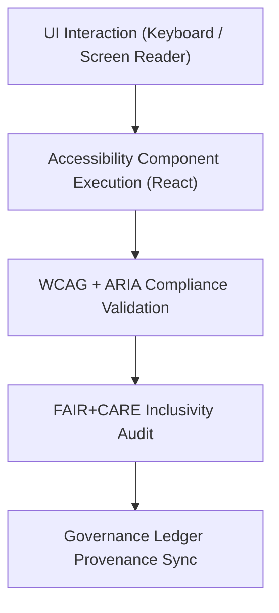

<div align="center">

# ♿ **Kansas Frontier Matrix — Accessibility Components Library (v2.1.1 · Tier-Ω+∞ Certified)**  
`web/src/components/Accessibility/README.md`

**Mission:** Deliver modular, reusable, and FAIR+CARE-aligned accessibility components  
for the **Kansas Frontier Matrix (KFM)** web application, ensuring inclusivity, governance traceability,  
and WCAG 2.1 AA compliance across all user interface modules.

[](../../../../../docs/)
[](../../../../../docs/standards/faircare-validation.md)
[](../../../../../docs/standards/accessibility.md)
[](../../../../../LICENSE)

</div>

---

## 📚 Overview

The **Accessibility Components Library** provides dedicated React components and utilities  
that enhance accessibility, usability, and inclusive design across the KFM platform.  
Each component is tested against **WCAG 2.1 AA**, **WAI-ARIA 1.2**, and **FAIR+CARE governance standards**,  
ensuring an equitable and transparent user experience.

Core objectives:
- ♿ Enable full accessibility for all users and assistive technologies.  
- 🧭 Maintain WCAG compliance through reusable components and hooks.  
- 🔗 Integrate FAIR+CARE ethics into accessibility behaviors.  
- 📊 Log component validation and accessibility audits into governance ledger.  

---

## 🗂️ Directory Layout

```bash
web/src/components/Accessibility/
├── README.md                     # This file — Accessibility component documentation
│
├── skip-link.tsx                 # Jump link for keyboard navigation to main content
├── aria-status.tsx               # Live region component for announcements
├── focus-trap.tsx                # Keeps keyboard focus within modal/dialog boundaries
└── screen-reader-only.tsx        # Hides content visually but exposes to screen readers
```

---

## ⚙️ Accessibility Governance Model


<!-- END OF MERMAID -->

---

## 🧱 Core Components

| Component | Description | FAIR+CARE Function | Validation Workflow |
|:--|:--|:--|:--|
| **Skip Link** | Provides “Skip to Content” link for keyboard users. | Accessibility + Ethics | `design-validate.yml` |
| **Aria Status** | Announces dynamic updates via ARIA live regions. | Transparency + Inclusivity | `ui-validate.yml` |
| **Focus Trap** | Retains focus inside modals or dialogs for usability. | Responsibility + Usability | `ui-validate.yml` |
| **Screen Reader Only** | Displays content exclusively to assistive tech. | Collective Benefit (CARE) | `faircare-validate.yml` |

---

## 🧠 FAIR + CARE Integration

| Principle | Implementation | Validation |
|:--|:--|:--|
| **Findable** | Accessibility metrics indexed in governance reports. | `governance-ledger.yml` |
| **Accessible** | Components meet WCAG 2.1 AA compliance. | `design-validate.yml` |
| **Interoperable** | ARIA + JSON schema definitions standardized across UI. | `policy-check.yml` |
| **Reusable** | Components shared across all feature modules. | `ui-validate.yml` |
| **Collective Benefit (CARE)** | Promotes inclusivity and equal access by design. | `faircare-validate.yml` |

---

## ♿ Accessibility Standards (WCAG 2.1 AA)

| Feature | Implementation | Validation Workflow |
|:--|:--|:--|
| **Keyboard Focus** | Full navigation control and visual feedback. | `ui-validate.yml` |
| **ARIA Labels** | Roles and state announcements implemented. | `design-validate.yml` |
| **Contrast Ratio** | ≥ 4.5:1 for all text and interactive elements. | `design-validate.yml` |
| **Dynamic Updates** | Screen readers alerted via `aria-live`. | `docs-validate.yml` |

---

## 🔍 Provenance & Governance Integration

| Artifact | Description | Path |
|:--|:--|:--|
| **Accessibility Reports** | Records WCAG/ARIA validation results. | `reports/validation/a11y_validation.json` |
| **FAIR+CARE Ethics Log** | Ensures ethical and inclusive accessibility design. | `reports/fair/data_care_assessment.json` |
| **Governance Ledger** | Logs checksums and provenance data for each component. | `data/reports/audit/data_provenance_ledger.json` |

---

## 🧾 Example Component Metadata

```yaml
---
component_id: "accessibility_skiplink_v2.1.1"
authors: ["@kfm-accessibility"]
faircare_status: "Tier-Ω+∞ Verified"
checksum: "sha256:2d8e9a7e1f25b31a..."
governance_ledger_entry: "data/reports/audit/data_provenance_ledger.json"
accessibility_compliance: "WCAG 2.1 AA"
license: "MIT"
---
```

---

## 🧮 Observability Metrics

| Metric | Description | Target | Workflow |
|:--|:--|:--|:--|
| **WCAG Compliance Rate** | % of components meeting WCAG AA standards. | ≥ 95 | `design-validate.yml` |
| **Accessibility Audit Pass Rate** | % of components passing axe-core checks. | 100% | `design-validate.yml` |
| **FAIR+CARE Compliance** | Inclusive accessibility governance compliance. | ≥ 95 | `faircare-validate.yml` |
| **Governance Sync Rate** | Components successfully logged in ledger. | 100% | `governance-ledger.yml` |

---

## 🧾 Validation Workflows

| Workflow | Function | Output |
|:--|:--|:--|
| `ui-validate.yml` | Tests keyboard focus, navigation, and usability. | `reports/validation/ui_validation.json` |
| `design-validate.yml` | Validates WCAG and ARIA compliance. | `reports/validation/a11y_validation.json` |
| `faircare-validate.yml` | Audits inclusive design ethics and accessibility. | `reports/fair/data_care_assessment.json` |
| `governance-ledger.yml` | Logs checksum and accessibility provenance. | `data/reports/audit/data_provenance_ledger.json` |

---

## 🕰 Version History

| Version | Date | Author | Summary |
|:--|:--|:--|:--|
| **v2.1.1** | 2025-11-16 | @kfm-accessibility | Added governance integration and FAIR+CARE-linked accessibility metrics. |
| v2.0.0 | 2025-10-25 | @kfm-web | Introduced ARIA live regions and keyboard focus management utilities. |
| v1.0.0 | 2025-10-04 | @kfm-docs | Initial accessibility component documentation. |

---

<div align="center">

**Kansas Frontier Matrix © 2025**  
*“Accessibility Is the Architecture of Inclusion.”*  
📍 `web/src/components/Accessibility/README.md` — FAIR+CARE-aligned Accessibility Components documentation for the Kansas Frontier Matrix.

</div>
