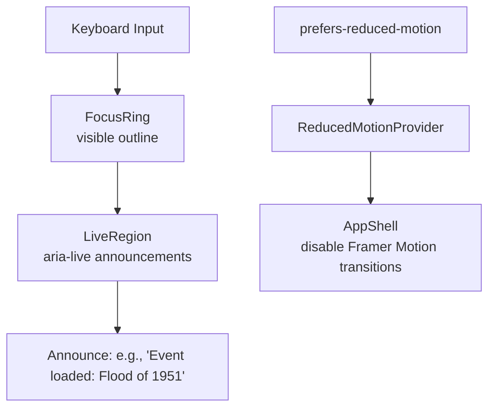

<div align="center">

# ♿ Kansas Frontier Matrix — **Accessibility Components**  
`web/src/components/Accessibility/`

**Keyboard Navigation · Screen Reader Support · Focus Management · Reduced Motion**

[](../../../../../.github/workflows/ci.yml)
[](../../../../../docs/design/reviews/accessibility/)
[](../../../../../docs/)
[](../../../../../LICENSE)

</div>

---

## 🧭 Overview

The **Accessibility Components** enforce **inclusive-by-default** behavior across KFM’s Web Frontend—ensuring keyboard users, screen-reader users, and motion/contrast-sensitive users can navigate maps, timelines, and narratives with parity.

They integrate **WCAG 2.1 AA**, **WAI-ARIA 1.2**, and **MCP-DL v6.2** practices via `AccessibilityContext`, theme tokens, and global hotkey hooks.

> Accessibility isn’t decorative; it’s **structural**.

---

## 🧱 Directory Structure

```text
web/src/components/Accessibility/
├── FocusRing.tsx              # Global visible focus outline (keyboard-first)
├── SkipToContentLink.tsx      # Landmark bypass to <main id="main">
├── LiveRegion.tsx             # ARIA announcements (AI updates, timeline changes)
├── ReducedMotionProvider.tsx  # Disables motion for PRM users
├── HotkeyHints.tsx            # Overlay of supported shortcuts
├── styles.scss                # High-contrast tokens + focus styles
└── __tests__/                 # Focus, live region, PRM, overlay behavior tests
```

---

## ♿ Key Accessibility Features

| Component                 | Purpose                                                  | WCAG / ARIA Mapping           |
| :------------------------ | :------------------------------------------------------- | :---------------------------- |
| **FocusRing**             | Always-visible focus ring for keyboard navigation        | 2.4.7 Focus Visible           |
| **SkipToContentLink**     | Jump to main content, bypass repetitive regions          | 2.4.1 Bypass Blocks           |
| **LiveRegion**            | Announces state changes (status messages)                | 4.1.3 Status Messages         |
| **ReducedMotionProvider** | Honors `prefers-reduced-motion`, disables animations     | 2.3.3 Animation from Interact |
| **HotkeyHints**           | Keyboard help overlay; fully keyboard operable           | 2.1.1 Keyboard Operable       |
| **styles.scss**           | ≥4.5:1 contrast; visible focus outlines                  | 1.4.3 Contrast (Minimum)      |

---

## ⚙️ Implementation Example — FocusRing

```tsx
// FocusRing.tsx
import React from "react";

export const FocusRing: React.FC<{ children: React.ReactNode }> = ({ children }) => (
  <div className="focus-ring-wrapper">
    {children}
    <span className="focus-outline" aria-hidden="true" />
  </div>
);
```

```scss
/* styles.scss (excerpt) */
.focus-outline {
  outline: 2px solid var(--kfm-color-accent);
  outline-offset: 3px;
}
:focus-visible {
  outline: 2px solid var(--kfm-color-accent);
  outline-offset: 3px;
}
```

---

## 🧩 Interaction Flow



---

## 🧠 Integration Notes

- **Contexts:** Components subscribe to `AccessibilityContext` for focus mode, PRM, and high-contrast flags.  
- **Hotkeys:** Global `useKeyboardShortcuts()` drives app-wide shortcuts (map pan/zoom, timeline scrub, help).  
- **Motion:** When PRM is set, Framer Motion transitions are bypassed in favor of instant state changes.  
- **ARIA:** Correct roles (`dialog`, `status`), labels, and `aria-live="polite"` for non-interruptive announcements.  
- **Debounce Announce:** Batch timeline/map updates to avoid AT “announcement spam.”  
- **Focus Persistence:** Maintain focus on actionable elements after layout/context changes.

---

## 🎨 Styling & Visual Design

| Topic             | Guidance                                                                 |
| :---------------- | :------------------------------------------------------------------------ |
| Contrast          | High-contrast tokens for text/controls in light & dark themes            |
| Focus             | Always-visible focus rings; large targets; no outline suppression         |
| Typography        | Base 1.0–1.125rem; line-height ≥ 1.5; respect browser zoom ≥ 200%        |
| Motion            | Wrap transitions with `@media (prefers-reduced-motion)` guards            |
| Overlay           | Hotkey overlay uses motion if allowed; otherwise snaps open/closed        |

```scss
:root { --focus-outline-color: var(--kfm-color-accent); }
:focus-visible { outline: 2px solid var(--focus-outline-color); outline-offset: 3px; }
```

---

## 🧪 Testing & Validation

| Test                     | Expectation                                              | Tools                    |
| :----------------------- | :------------------------------------------------------- | :----------------------- |
| Keyboard focus cycle     | Logical tab order across header → map → panels → timeline| Cypress + axe-core       |
| Live region messaging    | Announces updates once per change                         | RTL + NVDA/VoiceOver     |
| PRM behavior             | Animations fully disabled when PRM is active             | Jest (matchMedia mock)   |
| Contrast checks          | All text/controls ≥ 4.5:1                                | Lighthouse + axe-core    |
| Hotkey overlay           | `?` opens; fully operable by keyboard; focus trapped     | RTL + user-event         |

**Target coverage:** ≥ **90%** for a11y components and hooks.

---

## 🧾 Provenance & Integrity

| Artifact   | Description                                                             |
| :--------- | :---------------------------------------------------------------------- |
| Inputs     | AccessibilityContext state; system preferences; keyboard events         |
| Outputs    | Visible focus, ARIA announcements, reduced-motion handling, hotkey UI   |
| Dependencies | React 18+, TailwindCSS/SCSS, Framer Motion (optional), axe-core      |
| Integrity  | CI: lint/type, axe/Lighthouse audits, E2E keyboard flows               |

---

## 🧠 MCP Compliance Checklist

| Principle           | Implementation                                              |
| :------------------ | :---------------------------------------------------------- |
| Documentation-first | README + TSDoc; linked to design reviews                   |
| Reproducibility     | Deterministic a11y behavior via context & tokens           |
| Accessibility       | WCAG 2.1 AA automated in CI                                |
| Provenance          | Token/version reference in `styles/variables.scss`         |
| Open Standards      | WAI-ARIA 1.2 · CSS Custom Properties · Reduced Motion API  |
| Inclusivity         | Universal design spans map, timeline, and narrative views  |

---

## 🔗 Related Documentation

- **Components Overview** — `web/src/components/README.md`  
- **AccessibilityContext** — `web/src/context/README.md`  
- **Design Reviews** — `docs/design/reviews/accessibility/`  
- **Keyboard Focus Audit** — `docs/testing/a11y/keyboard.md`  
- **Screen Reader Audit** — `docs/testing/a11y/screen-reader.md`

---

## 🧾 Versioning & Metadata

| Field | Value |
| :---- | :---- |
| **Version** | `v1.6.0` |
| **Codename** | *Inclusive Interaction & PRM Upgrade* |
| **Last Updated** | 2025-10-17 |
| **Maintainers** | @kfm-accessibility · @kfm-ui |
| **License** | MIT (code) · CC-BY 4.0 (docs) |
| **Alignment** | WCAG 2.1 AA · WAI-ARIA 1.2 · MCP-DL v6.2 |
| **Maturity** | Stable / Production |

---

## 📜 License

Released under the **MIT License**.  
© 2025 Kansas Frontier Matrix — developed under **MCP-DL v6.2** for transparent, inclusive, and reproducible accessibility design.
