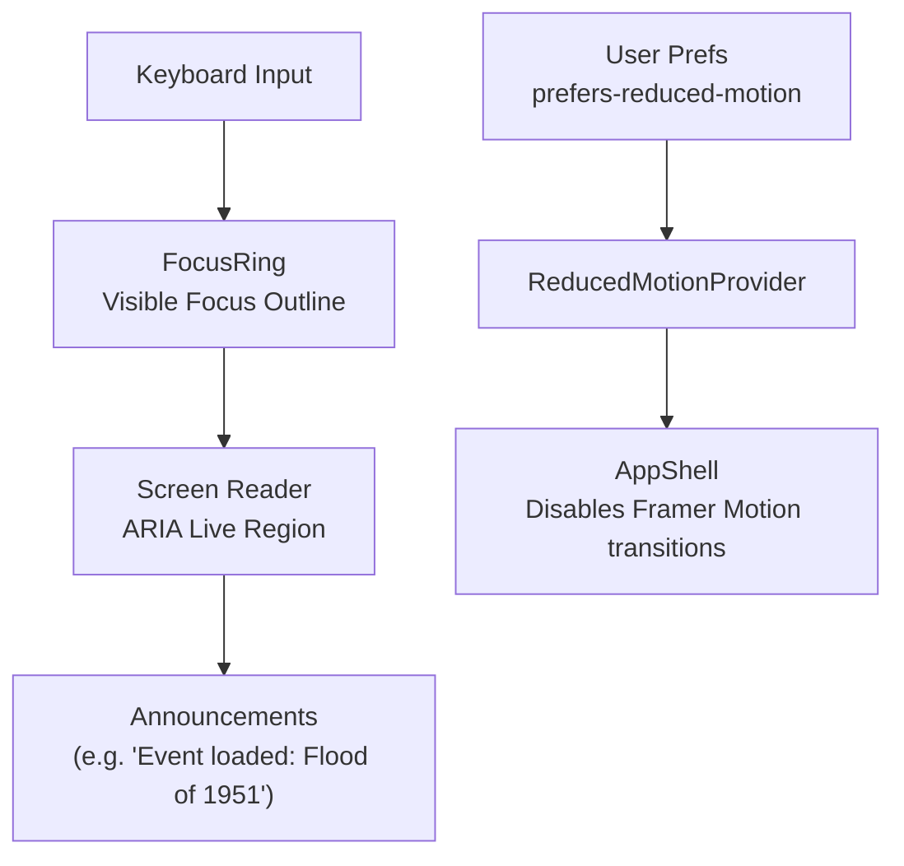

<div align="center">

# ♿ Kansas Frontier Matrix — **Accessibility Components**  
`web/src/components/Accessibility/`

**Keyboard Navigation · Screen Reader Support · Focus Management · Reduced Motion**

[](../../../../../.github/workflows/ci.yml)
[](../../../../../docs/design/reviews/accessibility/)
[](../../../../../docs/)
[](../../../../../LICENSE)

</div>

---

```yaml
---
title: "KFM • Accessibility Components (web/src/components/Accessibility/)"
version: "v1.4.0"
last_updated: "2025-10-14"
owners: ["@kfm-accessibility", "@kfm-ui"]
tags: ["accessibility","focus","aria","reduced-motion","keyboard","screen-reader","mcp"]
license: "MIT"
semantic_alignment:
  - WCAG 2.1 AA
  - WAI-ARIA 1.2
  - MCP-DL v6.2
---
````

---

## 🧭 Overview

The **Accessibility Components** embody the Kansas Frontier Matrix’s mission of **inclusive, universal design**, ensuring that users with assistive technologies experience the same interactive exploration of Kansas’s maps, timelines, and historical data.

These components apply **WCAG 2.1 AA** and **MCP-DL v6.2** standards, integrating with `AccessibilityContext`, `ThemeContext`, and global keyboard hooks.
Their purpose: to manage focus visibility, provide live ARIA announcements, and respect user preferences such as **reduced motion** and **high contrast modes**.

> Accessibility is a **core design principle** in KFM — not an afterthought. It’s built into every motion, interaction, and dataset visualization.

---

## 🧱 Directory Structure

```text
web/src/components/Accessibility/
├── FocusRing.tsx              # Global visual focus outline for keyboard navigation
├── SkipToContentLink.tsx      # "Skip to Content" link for keyboard/screen readers
├── LiveRegion.tsx             # Announces updates (AI messages, timeline changes)
├── ReducedMotionProvider.tsx  # Disables transitions for motion-sensitive users
├── HotkeyHints.tsx            # Overlay panel listing available keyboard shortcuts
├── styles.scss                # High-contrast color tokens and focus ring styles
└── __tests__/                 # Unit and integration tests for focus/ARIA behavior
```

---

## ♿ Key Accessibility Features

| Component                 | Purpose                                                  | WCAG Alignment                    |
| :------------------------ | :------------------------------------------------------- | :-------------------------------- |
| **FocusRing**             | Draws visible outlines around keyboard-focused elements  | 2.4.7 Focus Visible               |
| **SkipToContentLink**     | Bypass repetitive navigation to reach main content       | 2.4.1 Bypass Blocks               |
| **LiveRegion**            | Announces dynamic updates (AI, timeline, map events)     | 4.1.3 Status Messages             |
| **ReducedMotionProvider** | Disables animations when `prefers-reduced-motion`        | 2.3.3 Animation from Interactions |
| **HotkeyHints**           | Displays accessible overlay of active keyboard shortcuts | 2.1.1 Keyboard Operable           |
| **styles.scss**           | Provides ≥4.5:1 contrast ratio, visible focus outlines   | 1.4.3 Contrast (Minimum)          |

---

## ⚙️ Implementation Example — FocusRing

```tsx
import React from "react";

export const FocusRing: React.FC<{ children: React.ReactNode }> = ({ children }) => (
  <div className="focus-ring-wrapper">
    {children}
    <span className="focus-outline" aria-hidden="true" />
  </div>
);
```

```scss
// styles.scss
.focus-outline {
  outline: 2px solid var(--kfm-color-accent);
  outline-offset: 3px;
  transition: outline 0.1s ease;
}
```

> The `FocusRing` is globally applied to all interactive controls — buttons, timeline handles, map markers, and modals — ensuring that keyboard users have consistent, visible focus indicators across the interface.

---

## 🧩 Interaction Flow



---

## 🧠 Integration Notes

* **Context Linkage:** All components subscribe to `AccessibilityContext` for motion preferences, focus mode, and screen reader activation flags.
* **Hotkey Hooks:** `useKeyboardShortcuts()` manages all global shortcuts (map zoom, timeline navigation, AI toggle).
* **Reduced Motion:** Disables Framer Motion animations and substitutes fade transitions with instant state updates.
* **ARIA Roles:** Proper roles and labels used (`role="dialog"`, `role="status"`, `aria-live="polite"`).
* **Announcement Management:** Debounced updates prevent “speech spam” and repeated screen reader triggers.
* **Focus Behavior:** Maintains focus persistence after context updates (map panning, timeline scroll).

---

## 🎨 Styling & Visual Design

| Feature            | Description                                                               |
| :----------------- | :------------------------------------------------------------------------ |
| **Contrast Mode**  | Uses high-contrast color tokens validated for both light and dark themes  |
| **Focus States**   | Outlined via accent token `--kfm-color-accent`; visible across all themes |
| **Typography**     | Accessible text sizes (`1rem–1.25rem` base) and line spacing ≥ 1.5        |
| **Reduced Motion** | All CSS transitions wrapped in `@media (prefers-reduced-motion)` guards   |
| **Hotkey Overlay** | Animated using `Framer Motion` but auto-disables for reduced-motion users |

Example SCSS:

```scss
:root {
  --focus-outline-color: var(--kfm-color-accent);
}

:focus-visible {
  outline: 2px solid var(--focus-outline-color);
  outline-offset: 3px;
}
```

---

## 🧪 Testing & Validation

| Test Type                | Description                                                 | Tools                 |
| :----------------------- | :---------------------------------------------------------- | :-------------------- |
| **Keyboard Navigation**  | Ensures focus cycles correctly through interactive elements | Cypress + axe-core    |
| **Screen Reader Output** | Verifies ARIA live regions announce updates properly        | NVDA / VoiceOver      |
| **Color Contrast**       | Validates 4.5:1 ratio for text and controls                 | axe-core / Lighthouse |
| **Reduced Motion**       | Confirms animations disable when preference set             | Puppeteer automation  |
| **Hotkey Overlay**       | Tests `?` key triggers hint overlay                         | Jest + RTL            |

> **Target Coverage:** ≥ **90%** for all accessibility hooks and components.

---

## 🧾 Provenance & Integrity

| Artifact         | Description                                                                    |
| :--------------- | :----------------------------------------------------------------------------- |
| **Inputs**       | AccessibilityContext, user system settings, keyboard events                    |
| **Outputs**      | Focus indicators, ARIA messages, hotkey overlays                               |
| **Dependencies** | React 18+, Framer Motion, TailwindCSS, axe-core                                |
| **Integrity**    | Verified via CI/CD: accessibility audits, Lighthouse scans, and full E2E tests |

---

## 🧠 MCP Compliance Checklist

| MCP Principle       | Implementation                                                 |
| :------------------ | :------------------------------------------------------------- |
| Documentation-first | README + per-component inline annotations                      |
| Reproducibility     | Deterministic keyboard, motion, and ARIA behavior              |
| Accessibility       | WCAG 2.1 AA + CI automation                                    |
| Provenance          | Motion & color tokens versioned in `variables.scss`            |
| Open Standards      | WAI-ARIA 1.2, CSS Custom Properties, Reduced-Motion API        |
| Inclusivity         | Universal design embedded across map, timeline, and AI modules |

---

## 🔗 Related Documentation

* **Web Frontend Components Overview** — `web/src/components/README.md`
* **Context — AccessibilityContext** — `web/src/context/README.md`
* **Accessibility Design Reviews** — `docs/design/reviews/accessibility/`
* **Keyboard Focus Audit** — `docs/testing/a11y/keyboard.md`
* **Screen Reader Audit** — `docs/testing/a11y/screen-reader.md`

---

## 📜 License

Released under the **MIT License**.
© 2025 Kansas Frontier Matrix — developed under **MCP-DL v6.2** for transparency, inclusivity, and reproducible accessibility design.

> *“Accessibility isn’t a feature — it’s the frontier every user deserves to cross.”*

```
```
