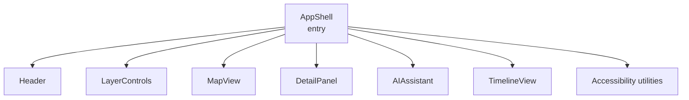
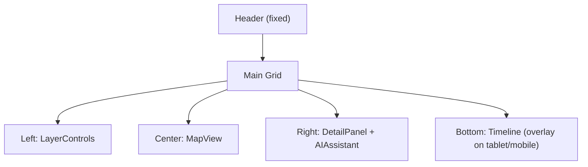

<div align="center">

# 🏗️ Kansas Frontier Matrix — **AppShell Component**  
`web/src/components/AppShell/`

**Core Layout · Global Providers · Responsive Container**

[](../../../../../.github/workflows/ci.yml)
[](../../../../../.github/workflows/codeql.yml)
[](../../../../../docs/)
[](../../../../../docs/design/reviews/accessibility/)
[](../../../../../LICENSE)

</div>

---

## 🧭 Overview

**AppShell** provides the **structural backbone** of KFM’s Web Frontend.  
It mounts global **context providers**, defines the **responsive grid**, and composes the primary UI regions: **Header**, **LayerControls**, **MapView**, **DetailPanel**, **AIAssistant**, and **TimelineView**—all orchestrated to keep **time, space, and narrative** in sync.

> *“The command center where contexts meet components.”*

---

## 🧱 Directory Structure

```text
web/src/components/AppShell/
├── AppShell.tsx        # Core layout + providers composition
├── AppLayout.tsx       # Grid definitions (desktop/tablet/mobile)
├── LoadingScreen.tsx   # Splash while configs/STAC load
├── ErrorBoundary.tsx   # Fail-safe rendering for child components
├── styles.scss         # Grid + tokens + motion hooks
└── __tests__/          # RTL/Jest: render, context, a11y, responsive
```

---

## 🗺️ Architecture



AppShell wraps children with global providers (Theme, Timeline, Layer, Map, AI, Accessibility) to ensure deterministic behavior.

---

## 🧠 Responsibilities

| Responsibility        | Description                                                                          |
| :-------------------- | :----------------------------------------------------------------------------------- |
| **Providers**         | Initializes Theme, Accessibility, AI, Timeline, Layer, and Map contexts              |
| **Layout Grid**       | CSS Grid/Flex hybrid for stable 3-column desktop, adaptive tablet/mobile             |
| **Routing/State**     | Hosts top-level routes and persistent UI state (selection, open panels, modals)      |
| **Error Handling**    | `ErrorBoundary` catches faults; graceful degradation                                 |
| **Loading Stage**     | `LoadingScreen` until configuration/STAC are ready                                   |
| **Motion & Theme**    | Framer Motion transitions; honors reduced-motion; theme tokens propagate globally    |

---

## 💬 Reference Implementation (concise)

```tsx
import React from "react";
import {
  ThemeProvider, TimelineProvider, LayerProvider, MapProvider,
  AIProvider, AccessibilityProvider
} from "../../context";
import { Header } from "../Header";
import { MapView } from "../MapView";
import { TimelineView } from "../TimelineView";
import { LayerControls } from "../LayerControls";
import { DetailPanel } from "../DetailPanel";
import { AIAssistant } from "../AIAssistant";
import "./styles.scss";

export const AppShell: React.FC = () => (
  <AccessibilityProvider>
    <ThemeProvider>
      <AIProvider>
        <TimelineProvider>
          <LayerProvider>
            <MapProvider>
              <div className="app-shell" role="application">
                <Header />
                <main id="main" className="app-main" role="main">
                  <LayerControls />
                  <MapView />
                  <DetailPanel />
                  <AIAssistant />
                </main>
                <TimelineView />
              </div>
            </MapProvider>
          </LayerProvider>
        </TimelineProvider>
      </AIProvider>
    </ThemeProvider>
  </AccessibilityProvider>
);
```

---

## 🧮 Layout Grid



**Breakpoints**

- `≥1280px` → three columns (Controls · Map · Panels)  
- `768–1279px` → Timeline overlays as drawer; panels stack  
- `<768px` → Vertical flow: Map → Panels → Timeline

---

## 🎨 Styling & Theming

| Feature          | Implementation                                                                        |
| :--------------- | :------------------------------------------------------------------------------------- |
| **Tokens**       | CSS variables from `styles/variables.scss` (`--kfm-color-*`, `--kfm-radius`, etc.)     |
| **Theme**        | `ThemeContext` toggles root tokens (light/dark)                                        |
| **Motion**       | Framer Motion for major region transitions; disabled on `prefers-reduced-motion`       |
| **Typography**   | Fluid `clamp()` scale; AA contrast verified                                            |

```scss
.app-shell {
  display:grid; grid-template-columns: 1fr 2fr 1fr; grid-template-rows: auto 1fr auto; height:100dvh;
  background:var(--kfm-color-bg); color:var(--kfm-color-text);
}
.app-main { display:grid; grid-template-columns: 1fr 2fr 1fr; gap:1rem; padding:1rem; }
```

---

## ♿ Accessibility (WCAG 2.1 AA)

- Landmarks: `role="application"`, `role="main"`; skip-link from Header to `#main`.  
- Focus order: Header → Map → Panels → Timeline (verified via tests).  
- Live regions announce significant changes (AI response, selection updates).  
- Motion & contrast respect user preferences.

A11y validated in CI (axe-core + Lighthouse).

---

## 🧪 Testing

| Case                    | Expectation                                                | Tooling          |
| :---------------------- | :--------------------------------------------------------- | :--------------- |
| Provider availability   | All child components can read context defaults             | RTL + Jest       |
| Grid renders at sizes   | Snapshots for mobile/tablet/desktop match expected layout  | Cypress + Jest   |
| Error boundary          | Renders fallback UI on child crash                         | RTL              |
| Loading screen gating   | Hides only after configs/STAC ready                        | Jest + MSW       |
| A11y audit              | No critical violations                                     | axe-core         |

**Coverage target:** ≥ **95%** integration + a11y.

---

## 🧾 Provenance & Integrity

| Artifact   | Description                                                  |
| :--------- | :----------------------------------------------------------- |
| Inputs     | Context providers, STAC config, API env                      |
| Outputs    | Orchestrated, responsive application shell                   |
| Dependencies | React 18+, TypeScript, TailwindCSS, Framer Motion         |
| Integrity  | CI gates: lint, type-check, tests, Lighthouse/axe reports   |

---

## 🧠 MCP Compliance Checklist

| Principle           | Implementation                                   |
| :------------------ | :----------------------------------------------- |
| Documentation-first | README + TSDoc before merge                      |
| Reproducibility     | Context-driven, deterministic layout              |
| Accessibility       | WCAG 2.1 AA with automated CI validation         |
| Provenance          | Context lineage and STAC source references       |
| Modularity          | Extensible grid for future panels/components     |

---

## 🔗 Related Documentation

- **Components Overview** — `web/src/components/README.md`  
- **Context Providers** — `web/src/context/README.md`  
- **Web UI Architecture** — `web/ARCHITECTURE.md`  
- **Accessibility Reviews** — `docs/design/reviews/accessibility/`

---

## 🧾 Versioning & Metadata

| Field | Value |
| :---- | :---- |
| **Version** | `v1.6.0` |
| **Codename** | *Orchestrated Grid & Providers Upgrade* |
| **Last Updated** | 2025-10-17 |
| **Maintainers** | @kfm-web · @kfm-architecture |
| **License** | MIT (code) · CC-BY 4.0 (docs) |
| **Alignment** | CIDOC CRM (UI structural context) · OWL-Time · WCAG 2.1 AA |
| **Maturity** | Stable / Production |

---

## 📜 License

Released under the **MIT License**.  
© 2025 Kansas Frontier Matrix — constructed under **MCP-DL v6.2** for reproducible, accessible, and modular design.
