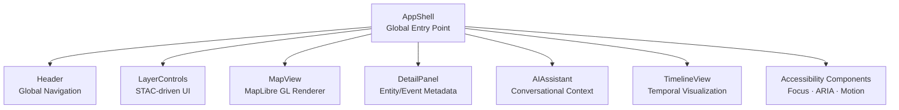
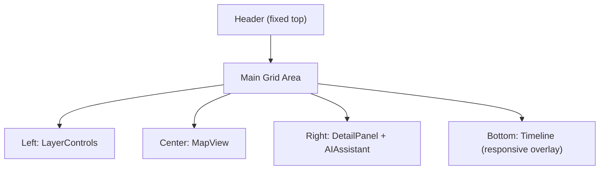

<div align="center">

# 🏗️ Kansas Frontier Matrix — **AppShell Component**  
`web/src/components/AppShell/`

**Core Layout · Global Providers · Responsive Container**

[](../../../../../.github/workflows/ci.yml)
[](../../../../../.github/workflows/codeql.yml)
[](../../../../../docs/)
[](../../../../../docs/design/reviews/accessibility/)
[](../../../../../LICENSE)

</div>

---

```yaml
---
title: "KFM • AppShell Component (web/src/components/AppShell/)"
version: "v1.5.0"
last_updated: "2025-10-14"
owners: ["@kfm-web", "@kfm-architecture"]
tags: ["react","layout","context","theme","timeline","map","mcp"]
license: "MIT"
semantic_alignment:
  - CIDOC CRM (UI structural context)
  - OWL-Time (temporal data handling)
  - WCAG 2.1 AA
---
````

---

## 🧭 Overview

The **AppShell** component defines the **core structural framework** of the Kansas Frontier Matrix (KFM) web application.
It initializes **global context providers**, manages **responsive layout regions**, and coordinates rendering of key UI modules —
including **Header**, **MapView**, **TimelineView**, **LayerControls**, **DetailPanel**, and **AIAssistant**.

> **Purpose:** The AppShell acts as the “command center” of KFM — integrating time, map, and narrative layers into a cohesive, responsive user experience.

---

## 🧱 Directory Structure

```text
web/src/components/AppShell/
├── AppShell.tsx        # Core layout + context orchestration
├── AppLayout.tsx       # CSS Grid + flex-based layout definitions
├── LoadingScreen.tsx   # Initial splash while loading configuration
├── ErrorBoundary.tsx   # Captures component or API errors gracefully
├── styles.scss         # Layout, grid templates, and theme integration
└── __tests__/          # Jest + RTL tests for rendering & context state
```

---

## ⚙️ Component Architecture



> The AppShell ensures unified access to context and consistent data flow between visual components.

---

## 🧠 Responsibilities

| Responsibility          | Description                                                                         |
| :---------------------- | :---------------------------------------------------------------------------------- |
| **Context Loading**     | Initializes all app-wide providers — Theme, Timeline, Map, Layer, AI, Accessibility |
| **Layout Grid**         | Defines responsive region hierarchy for map, timeline, and side panels              |
| **Routing & State**     | Manages high-level navigation and persistent UI state (selected entities, modals)   |
| **Error Handling**      | Wraps children with `ErrorBoundary` for fail-safe recovery                          |
| **Loading State**       | Displays `LoadingScreen` until configuration and STAC data are fetched              |
| **Theming & Animation** | Integrates `Framer Motion` transitions across layouts and theme changes             |

---

## 💬 Example Implementation

```tsx
import React from "react";
import {
  ThemeProvider,
  TimelineProvider,
  LayerProvider,
  MapProvider,
  AIProvider,
  AccessibilityProvider,
} from "../../context";

import { Header } from "../Header";
import { MapView } from "../MapView";
import { TimelineView } from "../TimelineView";
import { LayerControls } from "../LayerControls";
import { DetailPanel } from "../DetailPanel";
import { AIAssistant } from "../AIAssistant";
import "./styles.scss";

export const AppShell: React.FC = () => {
  return (
    <AccessibilityProvider>
      <ThemeProvider>
        <AIProvider>
          <TimelineProvider>
            <LayerProvider>
              <MapProvider>
                <div className="app-shell" role="application">
                  <Header />
                  <main className="app-main">
                    <LayerControls />
                    <MapView />
                    <DetailPanel />
                    <AIAssistant />
                  </main>
                  <TimelineView />
                </div>
              </MapProvider>
            </LayerProvider>
          </TimelineProvider>
        </AIProvider>
      </ThemeProvider>
    </AccessibilityProvider>
  );
};
```

> This component ensures all child modules share the same contextual and semantic environment.

---

## 🧮 Layout Grid



### Grid System Notes

* Implemented using **CSS Grid + Flexbox hybrid** for adaptive scaling
* Responsive breakpoints:

  * `≥1280px`: 3-column layout (Controls · Map · Panels)
  * `768–1279px`: Timeline collapses to overlay drawer
  * `<768px`: Stack layout (Map → Panels → Timeline)
* Map retains priority with min-width enforcement
* Timeline animates with `slideUp` / `slideDown` transitions

---

## 🎨 Styling & Theming

| Feature             | Implementation                                                             |
| :------------------ | :------------------------------------------------------------------------- |
| **Theme Tokens**    | Inherits global CSS variables (`--kfm-color-bg`, `--kfm-color-text`, etc.) |
| **Light/Dark Mode** | `ThemeContext` toggles global CSS root properties                          |
| **Motion**          | `Framer Motion` animates mounting/unmounting of major panels               |
| **Typography**      | Scales fluidly via `clamp()` functions; accessible contrast ratio ≥ 4.5:1  |
| **Frameworks**      | TailwindCSS utilities combined with SCSS for custom grid layout            |

```scss
.app-shell {
  display: grid;
  grid-template-columns: 1fr 2fr 1fr;
  grid-template-rows: auto 1fr auto;
  height: 100vh;
  background-color: var(--kfm-color-bg);
  color: var(--kfm-color-text);
}
```

---

## ♿ Accessibility (WCAG 2.1 AA)

* **Landmark Roles:** `role="application"` for AppShell · `role="main"` for central grid
* **Keyboard Focus:** Logical tab order between Header → Map → Panels → Timeline
* **ARIA Integration:** Context-driven dynamic `aria-live` updates (e.g., AI responses, selection changes)
* **Reduced Motion:** All Framer Motion transitions disabled via `prefers-reduced-motion`
* **Color Contrast:** Verified against light/dark backgrounds with axe-core in CI

Accessibility Score: **≥ 95** (axe-core + Lighthouse)

---

## 🧪 Testing

| Test Case                | Description                                        | Tool       |
| :----------------------- | :------------------------------------------------- | :--------- |
| **Render Validation**    | Confirms all child components mount correctly      | Jest + RTL |
| **Context Availability** | Validates providers expose default values          | Jest       |
| **ErrorBoundary**        | Catches component render errors gracefully         | RTL        |
| **LoadingScreen**        | Verifies splash persists until STAC metadata loads | Jest + MSW |
| **Responsive Layout**    | Snapshot tests for mobile, tablet, desktop         | Cypress    |
| **Accessibility Audit**  | Checks ARIA roles, tab order, color contrast       | axe-core   |

> **Coverage Target:** ≥ **95%** across integration and accessibility tests.

---

## 🧾 Provenance & Integrity

| Artifact         | Description                                                      |
| :--------------- | :--------------------------------------------------------------- |
| **Inputs**       | Context providers, STAC metadata, API endpoints                  |
| **Outputs**      | Fully orchestrated React application layout                      |
| **Dependencies** | React 18+, Framer Motion, TailwindCSS, TypeScript                |
| **Integrity**    | CI/CD verifies reproducibility, performance, and a11y compliance |

---

## 🧠 MCP Compliance Checklist

| MCP Principle       | Implementation                                  |
| :------------------ | :---------------------------------------------- |
| Documentation-first | README + inline TSDoc before merge              |
| Reproducibility     | Consistent layout state via contexts            |
| Accessibility       | WCAG 2.1 AA with automated CI validation        |
| Provenance          | Context lineage + data source integrity logged  |
| Open Standards      | Semantic HTML, ARIA roles, CSS Custom Props     |
| Modularity          | Extensible grid layout supporting future panels |

---

## 🔗 Related Documentation

* **Web Frontend Components** — `web/src/components/README.md`
* **Context Providers** — `web/src/context/README.md`
* **Web UI Architecture** — `web/ARCHITECTURE.md`
* **Accessibility Design Guide** — `docs/design/reviews/accessibility/`

---

## 📜 License

Released under the **MIT License**.
© 2025 Kansas Frontier Matrix — constructed under **MCP-DL v6.2** for reproducible, accessible, and modular design.

> *“The AppShell is the frontier’s foundation — where Kansas’s stories, data, and design converge.”*

```
```
