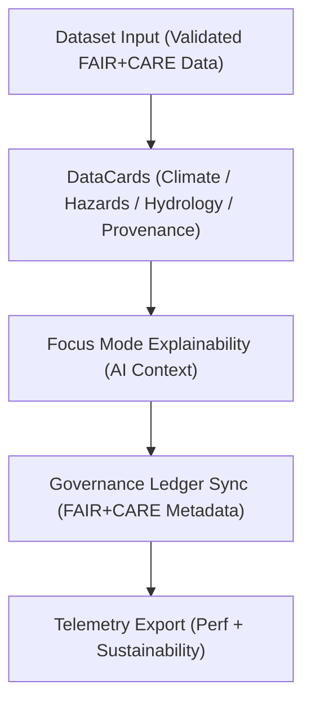

<div align="center">

# 🗂️ **Kansas Frontier Matrix — DataCards Components**
`web/src/components/DataCards/README.md`

**Purpose:** Define the **FAIR+CARE-certified DataCards** used for summarizing environmental, historical, and governance datasets across the Kansas Frontier Matrix (KFM) web app.  
Each DataCard visualizes dataset metrics, lineage, and ethics metadata while maintaining accessibility and energy efficiency under **MCP v6.3** and **ISO 9241-210**.

[](../../../../docs/README.md)
[](../../../../LICENSE)
[](../../../../docs/standards/faircare.md)
[]()

</div>

---

## 📘 Overview

**DataCards** provide modular, tokenized visualizations that combine numerical summaries, governance metadata, and explainable AI results.  
They reinforce **data transparency, ethics, and interpretability** across the KFM web experience.

---

## 🗂️ Directory Layout

```
web/src/components/DataCards/
├── README.md
├── ClimateCard.tsx         # Temperature, precipitation, drought metrics
├── HazardsCard.tsx         # Flood, tornado, and hazard risk insights
├── HydrologyCard.tsx       # Aquifer, streamflow, watershed summaries
├── ProvenanceCard.tsx      # Dataset lineage, checksum, FAIR+CARE ledger info
└── metadata.json           # Governance + accessibility metadata for DataCards
```

---

## 🧩 Data Flow & Architecture



**Lifecycle**
1. **Dataset Input:** consumes normalized STAC/DCAT metadata.  
2. **Card Render:** displays contextual summaries + FAIR+CARE indicators.  
3. **Explainability:** Focus Mode overlays reasoning + CARE annotations.  
4. **Governance:** provenance and certification linked to ledger.  
5. **Telemetry:** a11y, performance, and render energy logged.

---

## ⚙️ Component Contracts

| Contract | Purpose | Validator |
|----------|----------|-----------|
| Data Schema | JSON props aligned to DCAT/STAC metadata | Schema guards |
| A11y Contract | WCAG 2.1 compliance for charts and cards | `accessibility_scan.yml` |
| Governance Contract | Provenance + FAIR+CARE audit reference | `faircare-validate.yml` |
| Telemetry Contract | Energy + performance metrics schema | `telemetry-export.yml` |

Artifacts logged to:
- `docs/reports/telemetry/build_metrics.json`  
- `../../../../releases/v9.7.0/focus-telemetry.json`

---

## 🧠 FAIR+CARE Governance Matrix

| Principle | Implementation | Oversight |
|------------|----------------|------------|
| **Findable** | Cards indexed in FAIR+CARE registry and searchable by dataset ID. | @kfm-data |
| **Accessible** | Fully keyboard-accessible with ARIA + descriptive alt text. | @kfm-accessibility |
| **Interoperable** | Props follow JSON-LD/DCAT schema for metadata interoperability. | @kfm-architecture |
| **Reusable** | Self-contained components reusable across dashboards. | @kfm-design |
| **Collective Benefit** | Amplifies public access to scientific + cultural data. | @faircare-council |
| **Authority to Control** | Governance Council validates dataset provenance. | @kfm-governance |
| **Responsibility** | Developers ensure transparent and sustainable rendering. | @kfm-sustainability |
| **Ethics** | Cards reviewed for equity, neutrality, and explainable visuals. | @kfm-ethics |

---

## 🧾 Example Metadata Record

```json
{
  "id": "datacards_v9.7.0",
  "cards": ["ClimateCard", "HazardsCard", "ProvenanceCard"],
  "a11y_score": 99.4,
  "ai_explainability": true,
  "energy_use_wh": 0.85,
  "fairstatus": "certified",
  "telemetry_synced": true,
  "timestamp": "2025-11-05T18:30:00Z"
}
```

---

## ⚙️ Component Summaries

| Component | Description | Role |
|-----------|-------------|------|
| `ClimateCard` | Displays Kansas climate averages, drought indexes, and FAIR+CARE validation badges. | Environmental Insight |
| `HazardsCard` | Shows tornado, flood, and hazard frequencies with provenance summary. | Risk Overview |
| `HydrologyCard` | Provides aquifer depth, streamflow, and hydrologic variability metrics. | Water Resource Insight |
| `ProvenanceCard` | Visualizes lineage, checksum, and governance references. | Transparency & Ethics |

---

## ♿ Accessibility & Visualization Standards

- Semantic HTML5, ARIA roles, and labeled regions.  
- Data visualizations pass **WCAG 2.1 AA** contrast + color accessibility.  
- Chart legends, tooltips, and data points keyboard-focusable.  
- Motion-safe animations respect `prefers-reduced-motion`.  
- Results validated using **axe-core** and **Lighthouse CI** in `accessibility_scan.yml`.

---

## 🌱 Sustainability Metrics

| Metric | Target | Verified By |
|-------|--------|-------------|
| Avg. Render Energy | ≤ 0.9 Wh | @kfm-sustainability |
| Carbon Output | ≤ 1.0 gCO₂e | @kfm-security |
| Lighthouse Perf | ≥ 90 | CI pipeline |
| Renewable Hosting | 100% | @kfm-infrastructure |

Tracked in telemetry snapshot:  
`../../../../releases/v9.7.0/focus-telemetry.json`

---

## 🕰️ Version History

| Version | Date | Author | Summary |
|----------|------|---------|----------|
| v9.7.0 | 2025-11-05 | KFM Core Team | Upgraded + aligned: contracts, a11y validation, CARE annotations, telemetry schema v1. |
| v9.6.0 | 2025-11-03 | KFM Core Team | Integrated governance + AI explainability overlay. |
| v9.5.0 | 2025-11-02 | KFM Core Team | Added ProvenanceCard with ledger linkage. |
| v9.3.2 | 2025-10-28 | KFM Core Team | Established FAIR+CARE DataCard system. |

---

<div align="center">

**© 2025 Kansas Frontier Matrix — MIT / CC-BY 4.0**  
Maintained under **Master Coder Protocol v6.3** · FAIR+CARE Certified · Diamond⁹ Ω / Crown∞Ω Ultimate Certified  
[Back to Components Index](../README.md) · [Docs Index](../../../../docs/README.md)

</div>