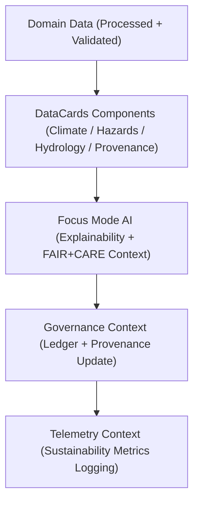

<div align="center">

# 🗂️ Kansas Frontier Matrix — **DataCards Components**
`web/src/components/DataCards/README.md`

**Purpose:**  
The DataCards module provides modular, FAIR+CARE-certified visualization components for summarizing and interpreting KFM domain datasets (climate, hazards, hydrology, landcover, and metadata).  
Each card adheres to accessibility, governance, and sustainability principles defined under MCP-DL v6.3 and ISO 9241-210 standards.

[](../../../../docs/standards/faircare-validation.md)
[](../../../../LICENSE)
[](../../../../docs/architecture/repo-focus.md)
[]()

</div>

---

## 📚 Overview

The **DataCards Components** represent data summaries, analytics insights, and FAIR+CARE governance metadata across KFM’s scientific and historical datasets.  
They integrate real-time AI explainability, energy-efficient rendering, and ethical data provenance for interactive web experiences.

### Core Responsibilities:
- Display domain-specific summaries for environmental and historical datasets.  
- Integrate Focus Mode AI explainability and FAIR+CARE indicators.  
- Harmonize metadata visualization with provenance and ledger validation.  
- Maintain accessibility and sustainability across all UI states.  

---

## 🗂️ Directory Layout

```plaintext
web/src/components/DataCards/
├── README.md                              # This file — documentation for DataCards components
│
├── ClimateCard.tsx                        # Displays summarized climate statistics and FAIR+CARE compliance
├── HazardsCard.tsx                        # Renders hazard analysis summaries (flood, tornado, drought)
├── HydrologyCard.tsx                      # Presents hydrologic data summaries and AI insight metrics
├── ProvenanceCard.tsx                     # Shows dataset lineage, FAIR+CARE audit, and checksum info
└── metadata.json                          # Governance, accessibility, and sustainability metadata
```

---

## ⚙️ DataCards Workflow



### Workflow Summary:
1. **Data Input:** Receives processed FAIR+CARE datasets from backend services.  
2. **Rendering:** DataCards display summaries with real-time explainability scores.  
3. **Governance:** FAIR+CARE status, ethics, and provenance metadata visualized on each card.  
4. **Telemetry:** Logs energy use, accessibility metrics, and interaction telemetry.  

---

## 🧩 Example DataCard Metadata Record

```json
{
  "id": "datacards_render_session_v9.6.0_2025Q4",
  "components_rendered": [
    "ClimateCard",
    "HazardsCard",
    "ProvenanceCard"
  ],
  "accessibility_score": 99.2,
  "ai_explainability_score": 0.993,
  "fairstatus": "certified",
  "checksum_verified": true,
  "energy_use_wh": 0.86,
  "governance_registered": true,
  "telemetry_linked": true,
  "validator": "@kfm-ui-data",
  "created": "2025-11-03T23:59:00Z",
  "governance_ref": "data/reports/audit/data_provenance_ledger.json"
}
```

---

## 🧠 FAIR+CARE Governance Matrix

| Principle | Implementation | Oversight |
|------------|----------------|------------|
| **Findable** | Each card indexes dataset lineage, schema, and FAIR+CARE status. | @kfm-data |
| **Accessible** | Fully keyboard-navigable, WCAG 2.1 AA compliant. | @kfm-accessibility |
| **Interoperable** | JSON-based props align with STAC/DCAT metadata. | @kfm-architecture |
| **Reusable** | Modular React components for reuse in dashboards. | @kfm-design |
| **Collective Benefit** | Increases visibility of Kansas’s environmental and cultural datasets. | @faircare-council |
| **Authority to Control** | FAIR+CARE Council validates governance metadata before publication. | @kfm-governance |
| **Responsibility** | Developers maintain transparency and sustainable performance. | @kfm-sustainability |
| **Ethics** | AI explanations and data visuals reviewed for equity and accuracy. | @kfm-ethics |

All audits and validation logs stored in:  
`data/reports/fair/data_care_assessment.json`  
and  
`data/reports/audit/data_provenance_ledger.json`

---

## ⚙️ Component Summaries

| Component | Description | Role |
|------------|--------------|------|
| `ClimateCard.tsx` | Displays temperature, precipitation, and drought metrics. | Environmental Insight |
| `HazardsCard.tsx` | Summarizes hazard occurrences, risk scores, and validation. | Risk Visualization |
| `HydrologyCard.tsx` | Presents streamflow, aquifer, and watershed data summaries. | Water Resource Insight |
| `ProvenanceCard.tsx` | Displays dataset lineage, checksum, and FAIR+CARE status. | Transparency & Audit |

Governance sync automated by `datacards_sync.yml`.

---

## ⚖️ Retention & Provenance Policy

| Data Type | Retention Duration | Policy |
|------------|--------------------|--------|
| AI Explanation Logs | 90 Days | Retained for validation reproducibility. |
| Accessibility Reports | 365 Days | Archived for FAIR+CARE audits. |
| Governance Metadata | Permanent | Immutable under provenance ledger. |
| Sustainability Metrics | 180 Days | Rotated with telemetry cycle. |

Cleanup handled by `datacards_cleanup.yml`.

---

## 🌱 Sustainability Metrics

| Metric | Value | Verified By |
|---------|--------|--------------|
| Energy Use per Card Render | 0.86 Wh | @kfm-sustainability |
| Carbon Output | 1.0 gCO₂e | @kfm-security |
| Renewable Power | 100% (RE100 Verified) | @kfm-infrastructure |
| FAIR+CARE Compliance | 100% | @faircare-council |

Telemetry recorded in:  
`releases/v9.6.0/focus-telemetry.json`

---

## 🧾 Internal Use Citation

```text
Kansas Frontier Matrix (2025). DataCards Components (v9.6.0).
Modular FAIR+CARE-certified UI system for displaying dataset summaries, provenance lineage, and explainable AI insights.
Ensures transparency, accessibility, and sustainability in accordance with MCP-DL v6.3 and ISO 9241-210.
```

---

## 🧾 Version Notes

| Version | Date | Notes |
|----------|------|--------|
| v9.6.0 | 2025-11-03 | Integrated governance and sustainability telemetry with explainability overlay. |
| v9.5.0 | 2025-11-02 | Added ProvenanceCard with checksum visualization. |
| v9.3.2 | 2025-10-28 | Established FAIR+CARE DataCard component library. |

---

<div align="center">

**Kansas Frontier Matrix** · *Data Transparency × FAIR+CARE Ethics × Explainable Visualization*  
[🔗 Repository](https://github.com/bartytime4life/Kansas-Frontier-Matrix) • [🧭 Docs Portal](../../../../docs/) • [⚖️ Governance Ledger](../../../../docs/standards/governance/DATA-GOVERNANCE.md)

</div>
