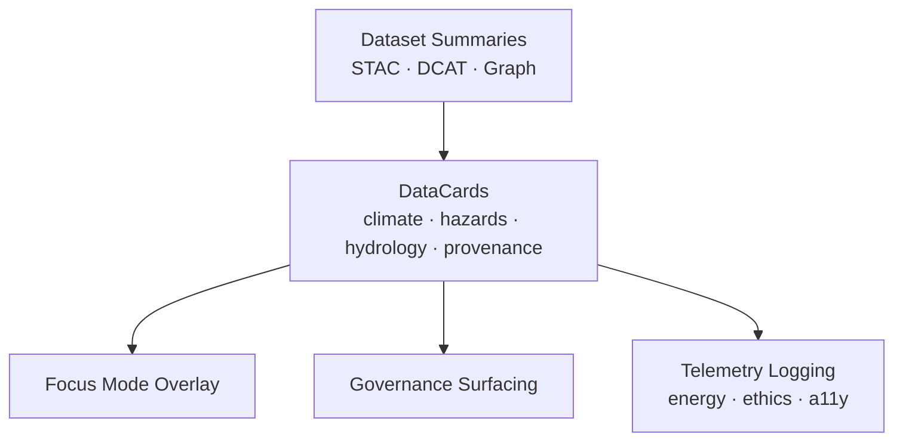
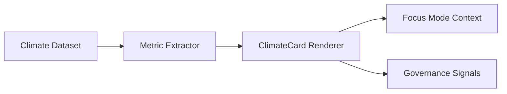
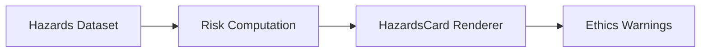
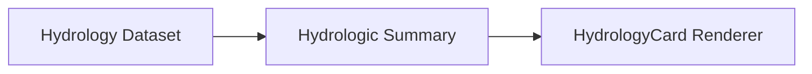
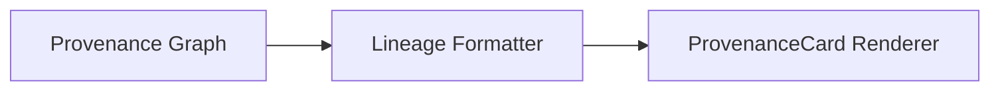
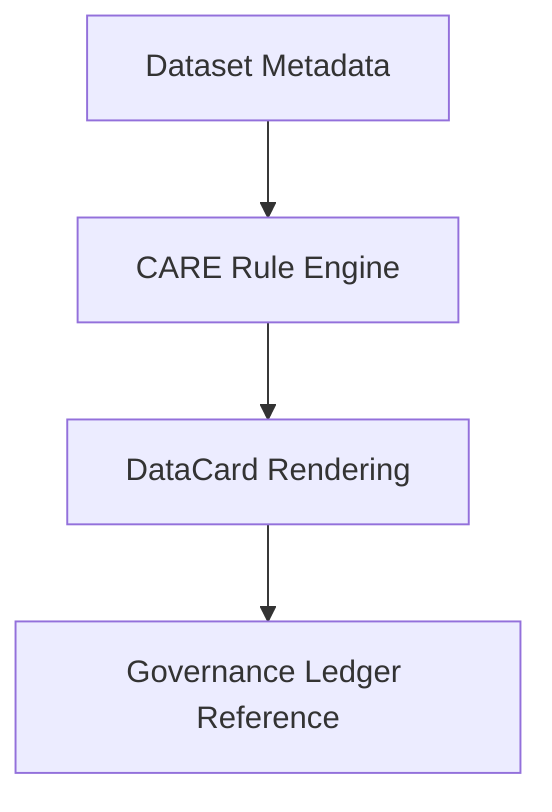
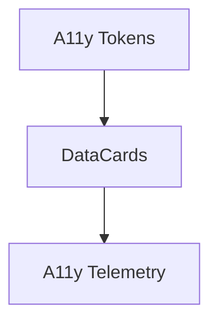

<div align="center">

# 🗂️ **Kansas Frontier Matrix — DataCards Architecture**  
`web/src/components/DataCards/README.md`

**Purpose:**  
Provide the **deep-architecture specification** for DataCards components in KFM v10.3.2 — modular, FAIR+CARE-certified UI units that summarize environmental, historical, and governance datasets with explainability, provenance, and sustainability telemetry.  
DataCards bridge **STAC/DCAT metadata**, **Focus Mode v2.5 narratives**, and **governance ledgers** into accessible, ethical, and energy-aware visual summaries.

[]()
[]()
[]()
[]()

</div>

---

# 📘 Executive Summary

**DataCards** are reusable React components that:

- Render key metrics for climate, hazards, hydrology, and provenance  
- Visualize FAIR+CARE, license, and checksum status  
- Overlay Focus Mode v2.5 explainability and ethics flags  
- Propagate provenance (PROV-O, STAC, DCAT)  
- Emit telemetry on usage, performance, and sustainability  
- Enforce accessibility and ethical visualization standards  

They form the **information tiles** used across dashboards, governance views, focus panels, and story-node contexts.

---

# 🗂️ Directory Layout (Authoritative v10.3.2)

```text
web/src/components/DataCards/
├── README.md
├── ClimateCard.tsx
├── HazardsCard.tsx
├── HydrologyCard.tsx
├── ProvenanceCard.tsx
└── metadata.json
```

---

# 🧩 High-Level DataCards Flow



---

# 🧬 Component Families (Deep Specification)

## 1️⃣ ClimateCard.tsx — Climate Insight Capsule

### Inputs
- STAC collections of climate metrics  
- Temporal aggregate metrics (mean, anomalies, extremes)  
- FAIR+CARE flags  
- Provenance references  

### Outputs
- Visual summary (bars/charts)  
- CARE label indicator (public, sensitive, restricted)  
- Provenance link chips  



---

## 2️⃣ HazardsCard.tsx — Risk & Hazard Overview

### Inputs
- Storm events, flood histories, tornado tracks  
- Derived hazard indexes  
- spatial coverage, time windows  

### Outputs
- hazard scores  
- risk level badges  
- FAIR+CARE warnings if vulnerability data is sensitive  



---

## 3️⃣ HydrologyCard.tsx — Water Resource Snapshot

### Inputs
- aquifer levels  
- streamflow time series  
- watershed metrics  

### Outputs
- water-availability panels  
- trend indicators  
- provenance chips referencing hydrologic sources  



---

## 4️⃣ ProvenanceCard.tsx — Lineage & Governance Surface

### Inputs
- dataset provenance (PROV-O)  
- checksums  
- license  
- governance ledger references  

### Outputs
- lineage timeline snippet  
- license tags  
- checksum verification status  
- FAIR+CARE summary  



---

# 🔐 FAIR+CARE Governance Architecture

Each DataCard enforces:

- CARE visibility logic for sensitive indicators  
- Sovereignty-respecting aggregations  
- Clear labeling of risk & uncertainty  
- Display of license & rights holders  
- Governance summary for dataset use  



Governance logs:

```
../../../../docs/reports/audit/web-datacards-governance-ledger.json
```

---

# ♿ Accessibility Architecture (WCAG 2.1 AA)

Data visualizations in DataCards must:

- use WCAG-compliant color ramps  
- support keyboard navigation  
- provide alt-text and ARIA labels for charts and badges  
- avoid color-only encodings for critical information  
- respect prefers-reduced-motion  



---

# 📡 Telemetry & Sustainability Integration

Telemetry captured for DataCards:

- `datacard_render_ms`  
- `datacard_energy_wh`  
- `a11y_coverage_score`  
- `care_warning_events`  
- `focus_overlay_usage`  

Telemetry destination:

```
../../../../releases/v10.3.2/focus-telemetry.json
```

---

# ⚙️ CI/CD Validation

| Area | Validation |
|------|------------|
| Types | TS strict mode |
| A11y | axe-core + Lighthouse |
| Governance | faircare-validate.yml |
| Telemetry | telemetry-export.yml |
| Docs | docs-lint.yml |

---

# 🧾 Example DataCards Metadata Record

```json
{
  "id": "datacards_v10.3.2",
  "cards": [
    "ClimateCard",
    "HazardsCard",
    "HydrologyCard",
    "ProvenanceCard"
  ],
  "a11y_score": 99.3,
  "fairstatus": "certified",
  "ai_explainability": true,
  "energy_use_wh": 0.81,
  "telemetry_synced": true,
  "timestamp": "2025-11-14T19:05:00Z"
}
```

---

# 🕰️ Version History

| Version | Date | Summary |
|--------|--------|---------|
| v10.3.2 | 2025-11-14 | Deep architecture rebuild; integrated Focus Mode v2.5 overlay, governance DAG, sustainability telemetry, and updated schemas. |
| v9.7.0 | 2025-11-05 | Previous version. |

---

<div align="center">

**Kansas Frontier Matrix — DataCards Architecture**  
🗂️ Insight Tiles · 🌐 FAIR+CARE · 🔗 Provenance · ♿ Accessible Visualization  
© 2025 Kansas Frontier Matrix — MIT License  

[Back to Components Index](../README.md)

</div>
