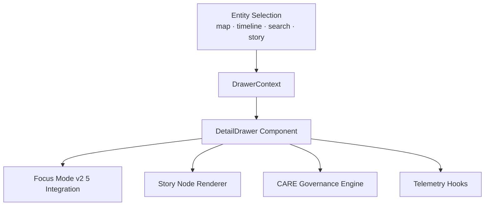
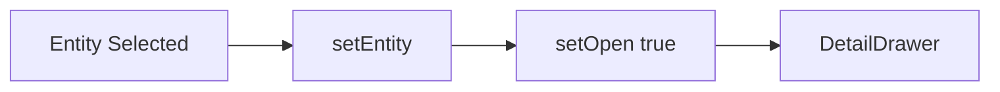
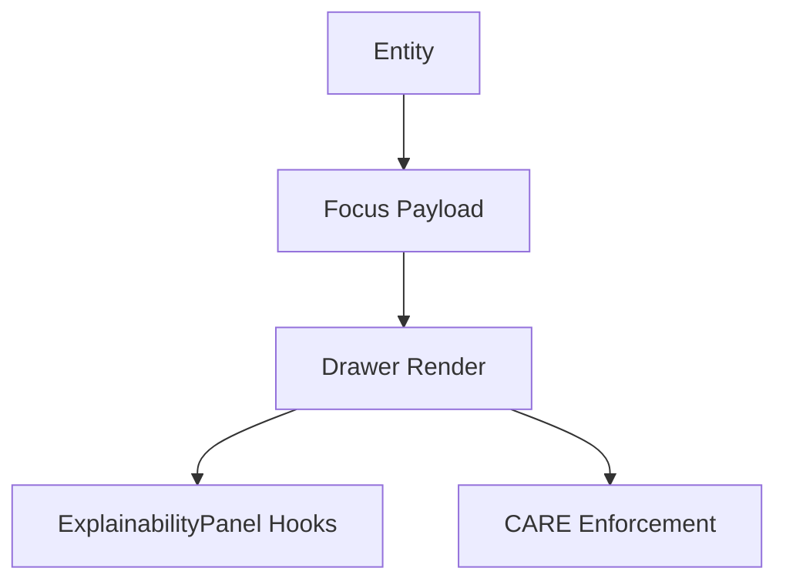
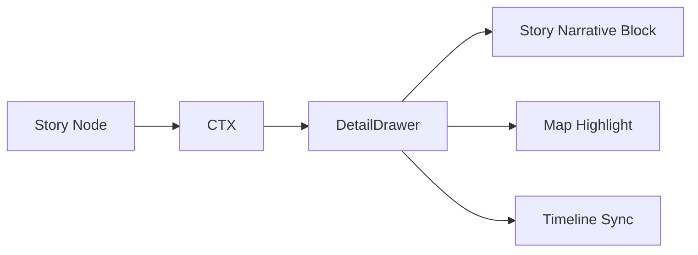
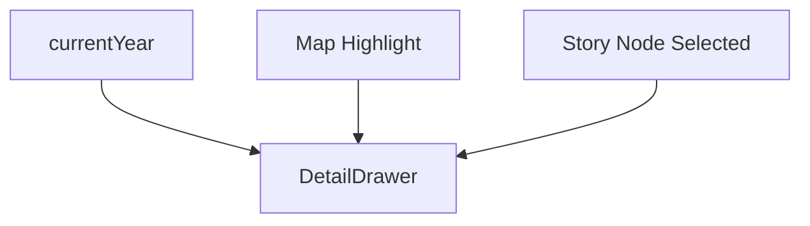
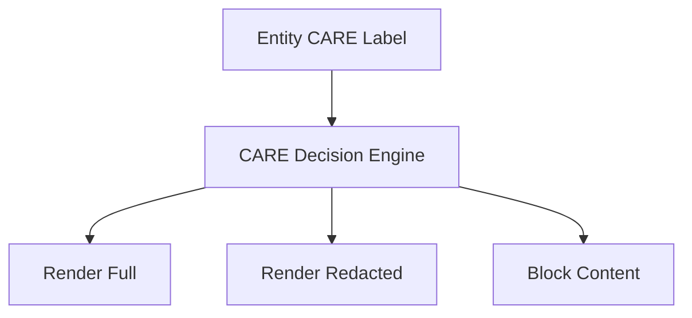
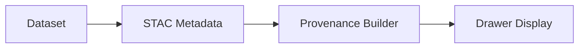
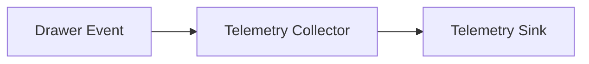
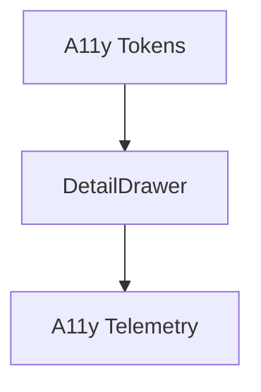

<div align="center">

# 🪶 **Kansas Frontier Matrix — Detail Drawer Architecture**  
`web/src/components/DetailDrawer/README.md`

**Purpose:**  
Define the **full deep-architecture** of the KFM Detail Drawer subsystem — the contextual intelligence panel that powers entity-centric exploration, Focus Mode v2.5 integration, CARE-governed redaction, temporal & spatial alignment, story-node propagation, and sustainability telemetry.

[]()
[]()
[]()
[]()

</div>

---

# 📘 Executive Summary

The **Detail Drawer** is the central contextual panel for the KFM web platform. It provides:

- Entity-centric contextual summaries  
- Focus Mode v2.5 narrative integration  
- Story Node contextualization  
- Map + Timeline synchronization  
- CARE-governed visibility (redaction + masking)  
- Provenance surface (dataset lineage, citations, checksum)  
- Rendering energy + accessibility telemetry  
- Stable navigation UI across all routes  

It is the **semantic “info cortex”** of KFM’s interactive user experience.

---

# 🗂️ Directory Layout (Authoritative v10.3.2)

```text
web/src/components/DetailDrawer/
├── README.md
├── DetailDrawer.tsx
├── drawer-context.ts
├── drawer-utils.ts
└── drawer.css
```

---

# 🧩 High-Level Drawer Architecture



---

# 🧬 DrawerContext — State & Event Backbone

Maintains:

- `entity` — the selected entity  
- `open` — drawer visibility state  
- `setEntity()` — entity mutation  
- `setOpen()` — lifecycle of toggle  

## Context Flow



---

# 🧠 Focus Mode v2.5 Integration

When a user selects an entity:

- Drawer pulls Focus payload from Focus Mode provider  
- Renders:
  - narrative summary  
  - CARE flags  
  - provenance chips  
  - explainability overlays (if provided)  

## Integration Architecture



---

# 🧱 Story Node Integration

When a Story Node is selected:

- Drawer loads story card data  
- Displays narrative clusters  
- Shows temporal + spatial footprint  
- Links provenance through STAC/DCAT references  

## Story Node Flow



---

# 🗺️ Map & Timeline Synchronization

The drawer listens to:

- map highlight events (`kfm:map:select`)  
- timeline year change (`kfm:timeline:year`)  

Drawer updates its content when:

- temporal bounds mismatch  
- the entity changes meaningfully  
- predictive mode (>2025) is entered  

## Sync Architecture



---

# 🔐 CARE Governance Enforcement (Deep Mode)

All content must pass the **CARE Decision Engine**:

**CARE Rules**  
- Public → Full content  
- Sensitive → Partial content + redactions  
- Restricted → Full block + sovereignty notice  

## CARE Lifecycle



The drawer must mark restricted content with:
- sovereignty domain  
- cultural sensitivity notices  
- provenance-based justification  

---

# 🔍 Provenance & Citation Architecture

The drawer surfaces:

- Story Node → Dataset lineage  
- Checksums  
- dataset → item → collection chain  
- license metadata  
- archival references  
- PROV-O relationships  

## Provenance Flow



---

# 📡 Telemetry & Sustainability Integration

Every drawer event emits telemetry:

- `drawer_open`  
- `drawer_close`  
- `drawer_content_load`  
- `drawer_redaction_event`  
- `drawer_energy_est_wh`  
- `drawer_a11y_tokens`  

Telemetry endpoint:

```
../../../../releases/v10.3.2/focus-telemetry.json
```

## Telemetry Flow



---

# ♿ Accessibility Architecture (WCAG 2.1 AA)

The drawer provides:

- `role="complementary"`  
- keyboard escape close  
- focus-trapping  
- screenreader announcements  
- high contrast colors  
- reduced motion transitions  
- spatial context summaries  

## A11y DAG



---

# 🎨 Drawer UI Structure

```text
<aside role="complementary" aria-label="Entity details">
  <header>
    <h2>Title</h2>
    <button aria-label="Close">✕</button>
  </header>
  <section>
    <!-- narrative, story, provenance, or CARE redaction -->
  </section>
</aside>
```

CSS tokens include:

- `--drawer-bg`  
- `--drawer-border`  
- `--drawer-contrast`  
- `--drawer-motion`  

---

# ⚙️ drawer-utils.ts — Helper Systems

Utilities include:

### Telemetry
- wrapper for logging drawer events  
- energy estimation  

### Governance
- CARE enforcement  
- sovereignty rules  

### Motion-control  
- disabled if user prefers reduced motion  

---

# 🧾 Example Drawer Metadata Record

```json
{
  "id": "detaildrawer_v10.3.2",
  "open_events": 1321,
  "restricted_blocks": 12,
  "a11y_score": 99.1,
  "energy_use_wh": 0.77,
  "checksum_verified": true,
  "timestamp": "2025-11-14T17:44:00Z"
}
```

---

# 🕰️ Version History

| Version | Date | Summary |
|--------|--------|---------|
| v10.3.2 | 2025-11-14 | Deep architecture rebuild; CARE engine, provenance pipeline, telemetry DAG, design tokens, sync flows. |
| v9.9.0 | 2025-11-08 | Previous version. |

---

<div align="center">

**Kansas Frontier Matrix — Detail Drawer Architecture**  
🪶 Contextual Intelligence · 🌐 Ethical Redaction · 🔗 Provenance by Design · ♿ Inclusive Interaction  
© 2025 Kansas Frontier Matrix — MIT License  

[Back to Components Index](../README.md)

</div>
