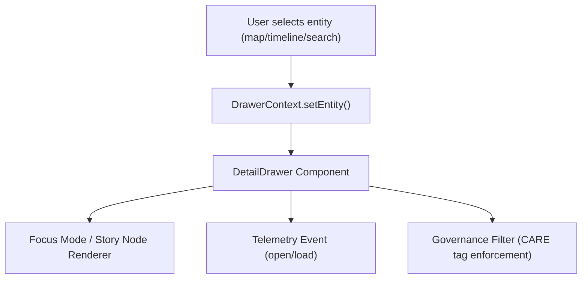

<div align="center">

# 🪶 **Detail Drawer — Contextual Information Panel**  
`web/src/components/DetailDrawer/README.md`

**Purpose:**  
Provide a unified, accessible **information drawer** for displaying contextual details — such as **Focus Mode summaries**, **story nodes**, or **dataset metadata** — in the Kansas Frontier Matrix (KFM) web application.  
Ensures FAIR+CARE visibility compliance, accessibility, and smooth integration with the **Map**, **Timeline**, and **Focus Mode** systems.

[](../../../../docs/)
[](../../../../LICENSE)
[](../../../../docs/standards/)
[](#)

</div>

---

## 📘 Overview

The **Detail Drawer** component provides a collapsible, right-hand contextual panel for KFM’s interactive UI.  
It dynamically displays entity details (e.g., events, people, sites, datasets) selected on the **map**, **timeline**, or **search results**, and is synchronized with **Focus Mode** and **story node navigation**.

### Key Features
- 🧠 Displays AI-generated **Focus summaries** or story narratives.  
- 🗺️ Synchronizes with **map and timeline selections**.  
- ⚖️ Enforces **FAIR+CARE governance** for ethical visibility.  
- ♿ Fully **accessible** (ARIA roles, keyboard controls).  
- 📊 Emits **telemetry** on open, close, and content load events.  

---

## 🗂️ Directory Layout

```plaintext
web/
└─ src/
   └─ components/
      └─ DetailDrawer/
         README.md           # This file — Detail Drawer documentation
         DetailDrawer.tsx    # React component for contextual drawer
         drawer-context.ts   # Shared open/close state across modules
         drawer-utils.ts     # Animation, telemetry, governance helpers
         drawer.css          # Drawer styling and transitions
```

---

## ⚙️ Component Architecture



**Lifecycle**
1. Entity selected on map/timeline triggers drawer open.  
2. DrawerContext stores selected entity metadata.  
3. Drawer loads Focus Mode or story content.  
4. Telemetry logs interaction and CARE governance check.  

---

## 🧩 Example — `DetailDrawer.tsx`

```tsx
import React, { useContext } from "react";
import { DrawerContext } from "./drawer-context";
import { enforceGovernance } from "../../features/story/utils/governance";
import { logDrawerEvent } from "./drawer-utils";

export function DetailDrawer() {
  const { entity, open, setOpen } = useContext(DrawerContext);
  if (!open) return null;

  const content = enforceGovernance(entity);
  logDrawerEvent("open", entity.id);

  return (
    <aside
      role="complementary"
      aria-label="Entity details"
      className="detail-drawer"
    >
      <header>
        <h2>{entity.label}</h2>
        <button aria-label="Close details" onClick={() => setOpen(false)}>✕</button>
      </header>
      <section>
        {content ? (
          <p dangerouslySetInnerHTML={{ __html: content }} />
        ) : (
          <p>⚠ Content restricted by FAIR+CARE governance.</p>
        )}
      </section>
    </aside>
  );
}
```

---

## 🧠 Context API — `drawer-context.ts`

Maintains global open/close state and currently selected entity.

```ts
import { createContext, useState } from "react";

export const DrawerContext = createContext<any>(null);

export function DrawerProvider({ children }) {
  const [entity, setEntity] = useState(null);
  const [open, setOpen] = useState(false);
  return (
    <DrawerContext.Provider value={{ entity, setEntity, open, setOpen }}>
      {children}
    </DrawerContext.Provider>
  );
}
```

---

## ⚙️ Utilities — `drawer-utils.ts`

### Logging & Telemetry
```ts
export function logDrawerEvent(action: string, entityId: string) {
  fetch("/api/telemetry", {
    method: "POST",
    body: JSON.stringify({
      event: `drawer-${action}`,
      entity_id: entityId,
      timestamp: new Date().toISOString(),
    })
  });
}
```

### Governance Enforcement
Applies **CARE tag** filtering before rendering content.

```ts
export function applyGovernanceFilter(entity) {
  const tag = entity.governance?.care_tag ?? "public";
  if (tag === "sensitive") return null;
  if (tag === "restricted")
    return `⚠ Restricted details hidden per CARE guidelines.`;
  return entity.summary ?? "";
}
```

---

## 🎨 Styling (`drawer.css`)

```css
.detail-drawer {
  position: fixed;
  top: 0;
  right: 0;
  width: 420px;
  height: 100%;
  background: var(--background-color, #fff);
  border-left: 1px solid #ccc;
  box-shadow: -2px 0 8px rgba(0, 0, 0, 0.15);
  overflow-y: auto;
  transform: translateX(0);
  transition: transform 0.25s ease;
}

.detail-drawer header {
  display: flex;
  justify-content: space-between;
  align-items: center;
  padding: 1rem;
  background: var(--header-bg, #f5f5f5);
}

.detail-drawer button {
  background: none;
  border: none;
  font-size: 1.4rem;
  cursor: pointer;
}
```

> Uses CSS variables for **high-contrast** and **dark-mode** compatibility.

---

## 📊 Telemetry & FAIR+CARE

Every interaction (open, close, scroll, content load) is recorded:

```json
{
  "event": "drawer-open",
  "entity": "fort-larned",
  "timestamp": "2025-11-08T14:50:00Z",
  "user_role": "public",
  "governance": "approved"
}
```

Governance enforcement prevents display of restricted content for unauthorized users.  
Audit results integrated into FAIR+CARE dashboards.

---

## ♿ Accessibility Features

| Feature | Implementation |
|----------|----------------|
| ARIA Roles | `role="complementary"` + `aria-label` |
| Keyboard Support | `Esc` closes drawer |
| Focus Management | Drawer traps focus when open |
| Screen Reader Announcements | `aria-live="polite"` for summary updates |
| High Contrast Mode | Respects global theme tokens |
| Reduced Motion | Drawer transitions disable on prefers-reduced-motion |

---

## 🧾 Internal Citation

```text
Kansas Frontier Matrix (2025). Detail Drawer — Contextual Information Panel (v9.9.0).
Provides FAIR+CARE-compliant contextual UI component for rendering entity summaries, timelines, and ethical metadata in the KFM web interface.
```

---

## 🕰️ Version History

| Version | Date       | Author | Summary |
|--------:|------------|--------|----------|
| v9.9.0 | 2025-11-08 | `@kfm-web` | Added fully accessible, FAIR+CARE-compliant detail drawer integrated with Focus Mode and governance telemetry. |
| v9.8.0 | 2025-11-05 | `@kfm-ui` | Enhanced keyboard navigation and Focus synchronization. |
| v9.7.0 | 2025-11-01 | `@kfm-core` | Initial drawer layout and context management added. |

---

<div align="center">

**Kansas Frontier Matrix**  
*Contextual Insights × FAIR+CARE Governance × Accessible Design*  
© 2025 Kansas Frontier Matrix · Master Coder Protocol v6.3 · FAIR+CARE Certified · Diamond⁹ Ω / Crown∞Ω Ultimate Certified  

[Back to Components Index](../../README.md) · [Governance Charter](../../../../docs/standards/governance/DATA-GOVERNANCE.md)

</div>

