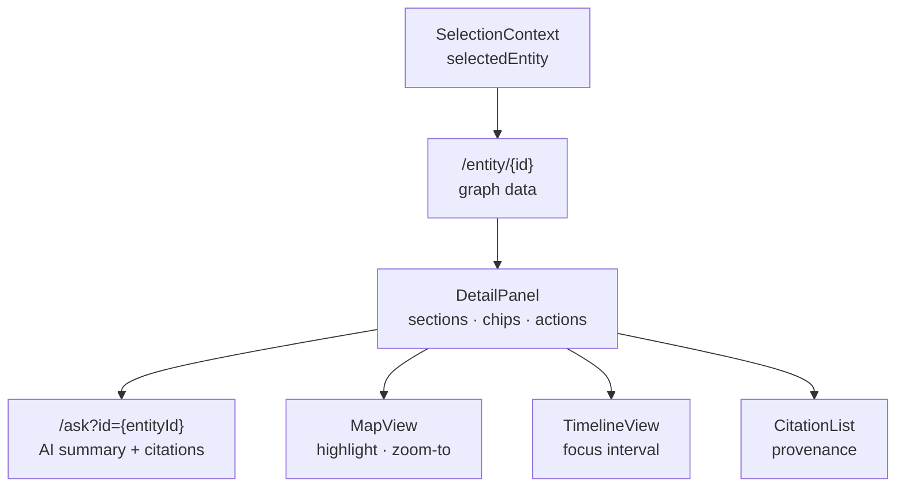
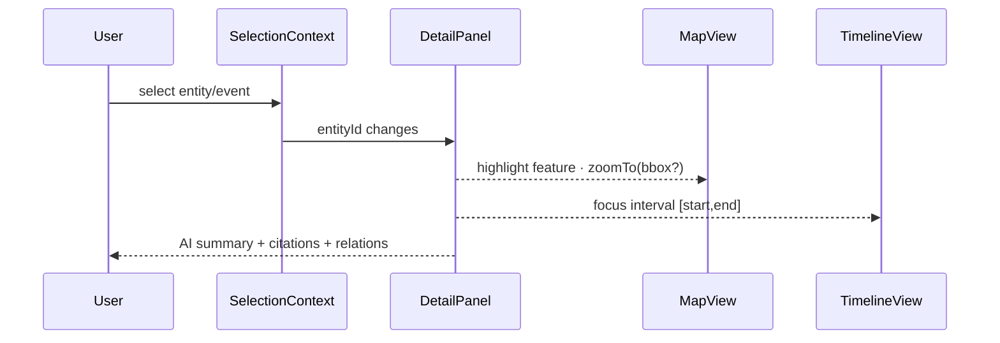

<div align="center">

# 🪟 Kansas Frontier Matrix — **DetailPanel Component**  
`web/src/components/DetailPanel/`

**Entity Insight · Provenance Citations · AI Summaries · Temporal & Spatial Context**

[](../../../../../.github/workflows/ci.yml)
[](../../../../../.github/workflows/codeql.yml)
[](../../../../../docs/)
[](../../../../../docs/design/reviews/accessibility/)
[](../../../../../LICENSE)

</div>

---

## 🧭 Overview

**DetailPanel** renders a **semantic dossier** for the currently selected **entity or event**, aligning **space (map)**, **time (timeline)**, and **narrative (AI summary + citations)**.  
It consolidates data from `/api/entity/{id}` and optional AI summaries from `/api/ask?id={entityId}`, and projects temporal intervals and spatial context into a single, accessible panel.

> *“Every document has a voice — the DetailPanel lets Kansas’s archives speak.”*

---

## 🧱 Directory Structure

```text
web/src/components/DetailPanel/
├── DetailPanel.tsx        # Root orchestrator: fetch, compose sections, a11y
├── DetailSection.tsx      # Labeled content blocks (Summary, Data, Links)
├── CitationList.tsx       # Provenance citations (title, source, license, excerpt)
├── RelatedEntities.tsx    # Linked entities/events (graph relations)
├── TimelineChips.tsx      # Start/end chips, interval badges, uncertainty hints
├── MapContextChip.tsx     # Quick map focus/zoom-to for the entity
├── styles.scss            # Theme-aware layout, sticky header, animations
└── __tests__/             # RTL/Jest: API mocks, a11y, keyboard, snapshots
```

---

## 🗺️ Architecture



*Deterministic contract:* Selection drives fetch; panel renders sections; actions affect **Map** and **Timeline** in lockstep.

---

## 🧩 Key Features

| Feature                      | Description                                                                 | Source / Contract                                  |
| :--------------------------- | :-------------------------------------------------------------------------- | :------------------------------------------------- |
| **Entity Overview**          | Name, type (Person/Place/Event/Document), description                      | `GET /entity/{id}`                                 |
| **AI Summaries**             | Short/medium/long synthesis with inline citation anchors                    | `GET /ask?id={entityId}`                           |
| **Citations & Provenance**   | Document list with license, source URL, excerpt                             | Graph relations (`MENTIONS`, `DERIVED_FROM`)       |
| **Linked Entities**          | People, places, events, documents (typed chips)                             | `PARTICIPATED_IN`, `OCCURRED_AT`, etc.             |
| **Temporal Context**         | Interval badges (start/end), uncertainty/confidence hints                   | `startDate`/`endDate` (OWL-Time aligned)           |
| **Spatial Context**          | Zoom-to focus, highlight feature on map                                     | `coordinates`/`bbox`                               |
| **A11y-first Panel**         | Live region announcements, landmark semantics, keyboard close               | `AccessibilityContext`                             |

---

## 💬 Reference Implementation (concise)

```tsx
// DetailPanel.tsx (excerpt)
import React from "react";
import { useFetch } from "../../hooks/useFetch";
import { useTheme } from "../../context/ThemeContext";
import { TimelineChips } from "./TimelineChips";
import { CitationList } from "./CitationList";
import { RelatedEntities } from "./RelatedEntities";

export interface DetailPanelProps { entityId: string; }

export function DetailPanel({ entityId }: DetailPanelProps) {
  const { data: entity, loading, error } = useFetch(`/api/entity/${entityId}`);
  const { data: ai } = useFetch(`/api/ask?id=${entityId}`);
  const { theme } = useTheme();

  if (loading) return <section role="region" aria-busy="true" aria-live="polite">Loading…</section>;
  if (error || !entity) return <section role="region">Unable to load details.</section>;

  return (
    <section
      className={`kfm-detail ${theme}`}
      role="complementary"
      aria-label={`Details for ${entity.label}`}
      data-testid="detail-panel"
    >
      <header className="kfm-detail__header">
        <h2>{entity.label}</h2>
        <span className="kfm-detail__type">{entity.type}</span>
        <TimelineChips start={entity.startDate} end={entity.endDate} />
      </header>

      {ai?.answer && (
        <article className="kfm-detail__summary" aria-label="AI Summary">
          <p>{ai.answer}</p>
        </article>
      )}

      <RelatedEntities items={entity.relatedEntities ?? []} />
      <CitationList items={entity.citations ?? []} />
    </section>
  );
}
```

---

## 🧠 TypeScript Contracts

```ts
export interface EntityDetail {
  id: string;
  label: string;
  type: "Person" | "Place" | "Event" | "Document";
  description?: string;
  summary?: string; // backend-provided optional synopsis
  coordinates?: [number, number];
  startDate?: string; // ISO-8601 (OWL-Time interval)
  endDate?: string;
  confidence?: number; // 0..1 uncertainty hint
  relatedEntities?: { id: string; label: string; type: "Person"|"Place"|"Event"|"Document" }[];
  citations?: Citation[];
}

export interface Citation {
  id: string;
  title: string;
  sourceUrl?: string;
  license?: string; // e.g., CC-BY 4.0
  excerpt?: string;
}
```

---

## 🧩 Rendering Flow (timeline + map)



---

## 🎨 Layout & Styling

| Aspect           | Implementation                                                                 |
| :--------------- | :------------------------------------------------------------------------------ |
| **Shell**        | 30–40% viewport (desktop) · mobile drawer; sticky header & scroll sections     |
| **Sections**     | Summary · Details · Linked Entities · Citations · Actions                       |
| **Motion**       | Framer Motion slide-in/out (auto-disabled on reduced motion)                    |
| **Tokens**       | Theme variables from `web/src/styles/variables.scss`                            |
| **Markdown**     | AI text rendered safely (sanitized) with basic markdown support                 |

```scss
.kfm-detail {
  background: var(--kfm-color-bg);
  color: var(--kfm-color-text);
  border-left: 1px solid color-mix(in oklab, var(--kfm-color-text), transparent 85%);
  display: grid; grid-template-rows: auto 1fr;
}
.kfm-detail__header { position: sticky; top: 0; backdrop-filter: blur(6px); }
```

---

## ♿ Accessibility (WCAG 2.1 AA)

- Landmark: `<aside role="complementary">` with descriptive `aria-label`  
- Live region: announces entity changes (`aria-live="polite"`)  
- Keyboard: `Esc` closes panel; `Tab` remains within panel when focused  
- Semantics: headings order (`h2` panel title → `h3` subsections)  
- Contrast: tokens validated ≥ 4.5:1; focus ring always visible  
- Motion: honors `prefers-reduced-motion: reduce` for transitions

---

## 🧪 Testing

| Case                     | Expectation                                                     | Tooling                  |
| :----------------------- | :-------------------------------------------------------------- | :----------------------- |
| Entity fetch & render    | Calls `/entity/{id}`; renders fields/sections                   | Jest + MSW + RTL         |
| AI summary + citations   | Calls `/ask?id=`; inline citation anchors render                | Jest + RTL               |
| Keyboard & a11y          | Tab order + `Esc` close; no axe violations                      | RTL + axe-core           |
| Timeline/map sync        | Dispatches focus interval + map highlight on selection          | Mocks for contexts       |
| Error & loading states   | Graceful fallbacks with `aria-busy`, retry affordance           | Jest                     |
| Snapshot                 | Stable visuals across themes & screen sizes                     | Jest Snapshots           |

**Coverage target:** ≥ **90%**.

---

## 🛠 Performance Notes

- Cache entity payloads by `entityId` to minimize network churn  
- Memoize derived sections (citations, related lists)  
- Defer AI summary request until entity payload resolves  
- Avoid forced reflows in long lists; virtualize if needed

---

## 🧾 Provenance & Integrity

| Artifact         | Description                                                                  |
| :--------------- | :--------------------------------------------------------------------------- |
| **Inputs**       | `/api/entity/{id}` (graph), `/api/ask` (AI), Selection/Timeline/Map contexts |
| **Outputs**      | Panel sections (summary, relations, citations)                               |
| **Dependencies** | React 18+, Fetch/Axios, Markdown renderer, Framer Motion                     |
| **Integrity**    | CI: type-check, unit/integration, axe-core + Lighthouse, snapshot tests      |

---

## 🧠 MCP Compliance Checklist

| Principle             | Implementation                                       |
| :-------------------- | :--------------------------------------------------- |
| Documentation-first   | README + TSDoc on props and sections                 |
| Reproducibility       | Deterministic data→UI pipeline                       |
| Provenance            | Explicit citation list with license/source            |
| Accessibility         | WCAG 2.1 AA validated in CI                          |
| Interoperability      | CIDOC CRM + OWL-Time + PROV-O alignment              |

---

## 🔗 Related Documentation

- **Components Overview** — `web/src/components/README.md`  
- **AIAssistant** — `web/src/components/AIAssistant/README.md`  
- **Context (Selection/Timeline/Map)** — `web/src/context/README.md`  
- **Web UI Architecture** — `web/ARCHITECTURE.md`

---

## 🧾 Versioning & Metadata

| Field | Value |
| :---- | :---- |
| **Version** | `v1.6.0` |
| **Codename** | *Provenance & Interval Sync Upgrade* |
| **Last Updated** | 2025-10-17 |
| **Maintainers** | @kfm-web · @kfm-knowledge |
| **License** | MIT (code) · CC-BY 4.0 (docs) |
| **Alignment** | CIDOC CRM · OWL-Time · PROV-O · WCAG 2.1 AA |
| **Maturity** | Stable / Production |

---

## 📜 License

Released under the **MIT License**.  
© 2025 Kansas Frontier Matrix — built under **MCP-DL v6.2** for traceable, semantic, and reproducible digital history.
