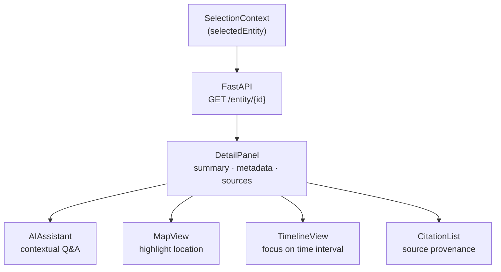
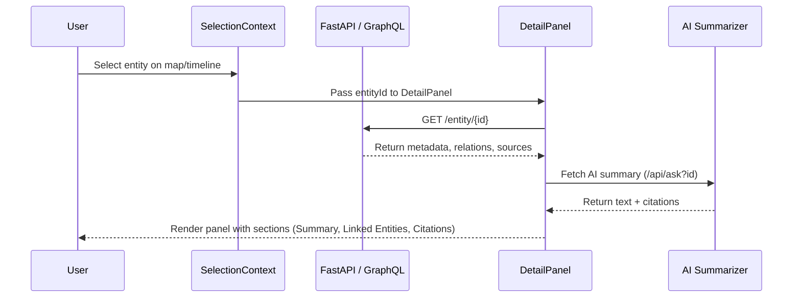

<div align="center">

# 🪟 Kansas Frontier Matrix — **DetailPanel Component**  
`web/src/components/DetailPanel/`

**Entity Insight · Provenance Citations · AI Summaries · Temporal & Spatial Context**

[](../../../../../.github/workflows/ci.yml)
[](../../../../../.github/workflows/codeql.yml)
[](../../../../../docs/)
[](../../../../../docs/design/reviews/accessibility/)
[](../../../../../LICENSE)

</div>

---

```yaml
---
title: "KFM • DetailPanel Component (web/src/components/DetailPanel/)"
version: "v1.5.0"
last_updated: "2025-10-14"
owners: ["@kfm-web", "@kfm-knowledge"]
tags: ["react","entity","details","knowledge-graph","ai","accessibility","timeline","mcp"]
license: "MIT"
semantic_alignment:
  - CIDOC CRM (entity relationships)
  - OWL-Time (temporal range representation)
  - PROV-O (data provenance)
  - WCAG 2.1 AA
---
````

---

## 🧭 Overview

The **DetailPanel** component presents comprehensive information about a **selected entity or event** in the Kansas Frontier Matrix.
It bridges the **interactive map**, **timeline**, and **AI Assistant**, turning data from the knowledge graph into readable, contextual narratives.

It integrates structured, AI-generated, and provenance-aware data to show:

* Entity and event details from `/api/entity/{id}`
* AI summaries via `/api/ask?id={entityId}`
* Temporal intervals and map locations
* Citations and linked relationships (people, places, documents, events)

> **Purpose:** Transform Kansas’s datasets and archives into accessible, traceable stories — connecting geography, time, and knowledge.

---

## 🧱 Directory Structure

```text
web/src/components/DetailPanel/
├── DetailPanel.tsx        # Root component: orchestrates data fetching & rendering
├── DetailSection.tsx      # Section component for grouped info (summary, metadata)
├── CitationList.tsx       # Displays source citations & provenance metadata
├── RelatedEntities.tsx    # Shows linked entities/events from the knowledge graph
├── styles.scss            # Theming, responsive layout, animations
└── __tests__/             # Jest + RTL tests (rendering, API, accessibility)
```

---

## ⚙️ Component Architecture



> The DetailPanel connects multiple application layers — acting as the semantic and visual link between entity data, temporal ranges, and spatial locations.

---

## 🧩 Key Features

| Feature                    | Description                                                    | Data Source                                     |
| :------------------------- | :------------------------------------------------------------- | :---------------------------------------------- |
| **Entity Overview**        | Displays name, type, and description                           | `/api/entity/{id}` (Neo4j Graph)                |
| **AI Summary Integration** | Fetches short, medium, and long AI-generated summaries         | `/api/ask?id={entityId}`                        |
| **Citations & Provenance** | Lists documents, treaties, or datasets that mention the entity | Graph relationships: `MENTIONS`, `DERIVED_FROM` |
| **Linked Entities**        | Lists related people, places, and events                       | `PARTICIPATED_IN`, `OCCURRED_AT`                |
| **Temporal Context**       | Highlights active time range on timeline                       | `TimelineContext`                               |
| **Spatial Context**        | Zooms or highlights related map features                       | `MapContext`                                    |
| **Accessibility**          | ARIA-compliant region with keyboard focus and live updates     | `AccessibilityContext`                          |

---

## 💬 Example Usage

```tsx
import React from "react";
import { useSelection } from "../../context/SelectionContext";
import { DetailPanel } from "./DetailPanel";

export function RightSidebar() {
  const { selected } = useSelection();
  return (
    <aside className="detail-sidebar" role="complementary" aria-label="Entity Detail Panel">
      {selected ? (
        <DetailPanel entityId={selected.id} />
      ) : (
        <p>Select an item to view details.</p>
      )}
    </aside>
  );
}
```

---

## 🧠 TypeScript Interfaces

```ts
export interface DetailPanelProps {
  entityId: string;
}

export interface EntityDetail {
  id: string;
  label: string;
  type: "Person" | "Place" | "Event" | "Document";
  description?: string;
  summary?: string;
  coordinates?: [number, number];
  startDate?: string;
  endDate?: string;
  relatedEntities?: { id: string; label: string; type: string }[];
  citations?: Citation[];
}

export interface Citation {
  id: string;
  title: string;
  sourceUrl?: string;
  license?: string;
  excerpt?: string;
}
```

> All types are aligned with KFM’s **knowledge graph ontology** — mapping to CIDOC CRM entity types (e.g., `E21_Person`, `E5_Event`).

---

## 🧩 Rendering Flow



---

## 🎨 Layout & Styling

| Feature             | Implementation                                                     |
| :------------------ | :----------------------------------------------------------------- |
| **Width**           | 30–40% viewport (desktop) → collapsible drawer (mobile)            |
| **Sections**        | Summary · Details · Linked Entities · Sources · Timeline           |
| **Animation**       | `Framer Motion` slide-in/out transitions                           |
| **Themes**          | Inherits `ThemeContext` (light/dark)                               |
| **Typography**      | Semantic headings `<h2>` / `<h3>` · Markdown rendering for AI text |
| **Scroll Behavior** | Sticky header · smooth scroll · overflow-y auto                    |

Example:

```scss
.detail-sidebar {
  background: var(--kfm-color-bg);
  color: var(--kfm-color-text);
  border-left: 1px solid var(--kfm-color-muted);
  transition: transform 0.3s ease;
}
```

---

## ♿ Accessibility (WCAG 2.1 AA)

* **Landmark Role:** `<aside role="complementary">`
* **ARIA Live Region:** Announces new entity selections dynamically
* **Keyboard Navigation:** `Esc` closes panel; `Tab` cycles within panel
* **Headings:** Proper semantic levels ensure screen reader context
* **Contrast:** All text and link colors tested for ≥ 4.5:1 ratio
* **Motion Sensitivity:** Disables animations if `prefers-reduced-motion: reduce`

Accessibility validated in CI via **axe-core** + **Lighthouse**.

---

## 🧪 Testing

| Test Case               | Description                                                   | Tool                  |
| :---------------------- | :------------------------------------------------------------ | :-------------------- |
| **API Integration**     | Mocks `/api/entity/{id}` and `/api/ask` to validate rendering | Jest + MSW            |
| **Section Rendering**   | Verifies Summary, Linked Entities, Citations sections appear  | React Testing Library |
| **Keyboard Navigation** | Confirms tab order, focus trapping, and `Esc` close           | axe-core              |
| **Error Handling**      | Displays fallback message on fetch failure                    | Jest Mocks            |
| **Snapshot Testing**    | Validates visual consistency across themes                    | Jest Snapshots        |

> **Coverage target:** ≥ **90%** lines and branches.

---

## 🧾 Provenance & Integrity

| Artifact         | Description                                                                  |
| :--------------- | :--------------------------------------------------------------------------- |
| **Inputs**       | `/api/entity/{id}` (graph data), `/api/ask` (AI summary), `SelectionContext` |
| **Outputs**      | HTML panel with semantic sections, citations, and summaries                  |
| **Dependencies** | React 18+, Axios, Markdown-it, Framer Motion                                 |
| **Integrity**    | CI validates API mocks, markdown sanitization, a11y compliance               |

---

## 🧠 MCP Compliance Checklist

| MCP Principle             | Implementation                                   |
| :------------------------ | :----------------------------------------------- |
| Documentation-first       | README + inline TSDoc                            |
| Reproducibility           | Deterministic API + UI rendering pipeline        |
| Provenance                | Source citations + dataset lineage visible in UI |
| Accessibility             | Full WCAG 2.1 AA + CI verification               |
| Semantic Interoperability | CIDOC CRM + OWL-Time mapping for entities        |

---

## 🔗 Related Documentation

* **Web Frontend Components Overview** — `web/src/components/README.md`
* **AIAssistant Component** — `web/src/components/AIAssistant/README.md`
* **Context — Selection & Timeline** — `web/src/context/README.md`
* **Web UI Architecture** — `web/ARCHITECTURE.md`

---

## 📜 License

Released under the **MIT License**.
© 2025 Kansas Frontier Matrix — developed under **MCP-DL v6.2** for traceable, semantic, and reproducible digital history.

> *“Every document has a voice — the Detail Panel lets Kansas’s archives speak.”*

```
```
