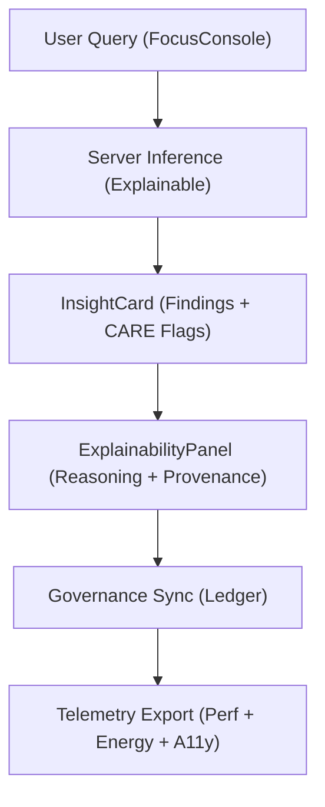

<div align="center">

# 🧠 **Kansas Frontier Matrix — Focus Mode Components**
`web/src/components/FocusMode/README.md`

**Purpose:** Define the **explainable, FAIR+CARE-certified** UI components that power the Focus Mode experience — connecting entity-centric queries to transparent summaries, provenance chips, and governance telemetry under **MCP v6.3**.

[](../../../../docs/README.md)
[](../../../../LICENSE)
[](../../../../docs/standards/faircare.md)
[]()

</div>

---

## 📘 Overview

Focus Mode enables entity-focused exploration with explainable AI overlays and **CARE safeguards**.  
Components render **server-produced** summaries and subgraphs while surfacing provenance, licenses, and dataset lineage.

---

## 🗂️ Directory Layout

```
web/src/components/FocusMode/
├── README.md
├── FocusConsole.tsx         # Conversational interface for entity-centric queries
├── InsightCard.tsx          # Summarized, FAIR+CARE-labeled findings
├── ExplainabilityPanel.tsx  # Reasoning visualization + provenance chips
└── metadata.json            # Governance + telemetry metadata for Focus Mode
```

---

## 🧩 Interaction Flow



1. **Query:** UI sends entity request to server; client does **not** run models.  
2. **Findings:** InsightCard displays summaries, citations, and CARE notices.  
3. **Explainability:** Panel shows reasoning paths and dataset lineage.  
4. **Governance:** Writes to provenance ledgers with dataset + license refs.  
5. **Telemetry:** Interaction metrics appended to the release snapshot.

---

## ⚙️ Component Contracts

| Contract | Purpose | Validator |
|----------|----------|-----------|
| Findings Schema | Typed summary + citation payload | TypeScript + runtime guards |
| Provenance Contract | License, checksum, dataset IDs | `faircare-validate.yml` |
| Explainability Contract | Reasoning references & CARE flags | Governance review |
| Telemetry Contract | Perf/energy/a11y metrics | `telemetry-export.yml` |

Artifacts:
- `../../../../docs/reports/telemetry/build_metrics.json`  
- `../../../../releases/v9.7.0/focus-telemetry.json`

---

## 🧠 FAIR+CARE Governance Matrix

| Principle | Implementation | Oversight |
|------------|----------------|------------|
| **Findable** | Sessions and citations indexed in ledgers. | @kfm-data |
| **Accessible** | Keyboard-first, descriptive labels, and alt text. | @kfm-accessibility |
| **Interoperable** | JSON-LD payloads align with DCAT/PROV-O. | @kfm-architecture |
| **Reusable** | Components share tokenized styles & props. | @kfm-design |
| **Collective Benefit** | Highlights public/educational value of insights. | @faircare-council |
| **Authority to Control** | CARE gates hide sensitive content or require consent. | @kfm-governance |
| **Responsibility** | Telemetry flags energy + a11y regressions. | @kfm-sustainability |
| **Ethics** | Neutral narrative guidance and bias checks. | @kfm-ethics |

---

## 🧾 Example Focus Mode Metadata

```json
{
  "id": "focusmode_v9.7.0",
  "queries": 214,
  "a11y_score": 98.8,
  "ai_explainability": true,
  "care_gate_triggered": 3,
  "energy_use_wh": 1.18,
  "telemetry_synced": true,
  "timestamp": "2025-11-05T18:40:00Z"
}
```

---

## ♿ Accessibility Standards

- Contrast ≥ 4.5:1; motion-safe transitions; screen-reader landmarks.  
- Keyboard shortcuts documented in `FocusConsole` (e.g., **Enter** to submit, **Esc** to close panels).  
- Tooltips, legends, and badges are focusable and labelled (ARIA).

---

## 🌱 Sustainability Targets

| Metric | Target | Verified By |
|-------|--------|-------------|
| Energy per Session | ≤ 1.2 Wh | Telemetry |
| Lighthouse A11y | ≥ 95 | CI pipeline |
| Carbon Output | ≤ 1.4 gCO₂e | Telemetry |
| Renewable Hosting | 100% | Ops dashboard |

---

## 🕰️ Version History

| Version | Date | Author | Summary |
|----------|------|---------|----------|
| v9.7.0 | 2025-11-05 | KFM Core Team | Upgraded & aligned: contracts, governance sync, telemetry schema v1, keyboard aids. |
| v9.6.0 | 2025-11-03 | KFM Core Team | Added bias metrics and CARE flags to findings. |
| v9.5.0 | 2025-11-02 | KFM Core Team | Enhanced explainability visualization and sustainability hooks. |
| v9.3.2 | 2025-10-28 | KFM Core Team | Established Focus Mode component set. |

---

<div align="center">

**© 2025 Kansas Frontier Matrix — MIT / CC-BY 4.0**  
Maintained under **Master Coder Protocol v6.3** · FAIR+CARE Certified · Diamond⁹ Ω / Crown∞Ω Ultimate Certified  
[Back to Components Index](../README.md) · [Docs Index](../../../../docs/README.md)

</div>