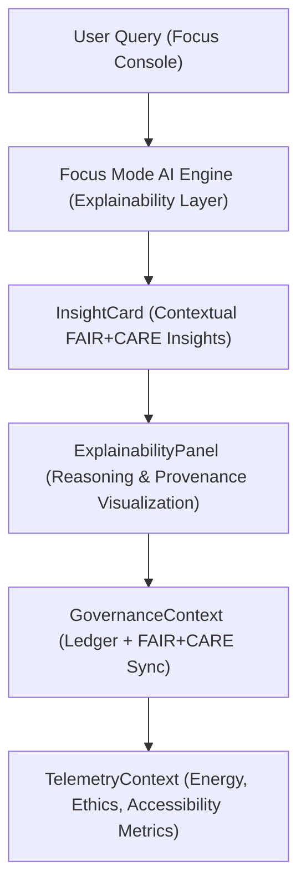

<div align="center">

# 🧠 Kansas Frontier Matrix — **Focus Mode Components**
`web/src/components/FocusMode/README.md`

**Purpose:**  
Implements the **Focus Mode AI interface**, providing explainable, FAIR+CARE-certified interaction between the user and the KFM knowledge graph.  
These components combine natural language reasoning, geospatial awareness, and ethical AI governance to promote transparency, interpretability, and responsible research.

[](../../../../docs/standards/faircare-validation.md)
[](../../../../LICENSE)
[]()
[](../../../../docs/architecture/repo-focus.md)

</div>

---

## 📚 Overview

The **Focus Mode Components** enable explainable AI-driven interaction for the Kansas Frontier Matrix (KFM).  
These modules provide the ethical dialogue interface, AI insight visualizations, and governance metadata synchronization for Focus Mode AI under FAIR+CARE and MCP-DL v6.3 compliance.

### Core Responsibilities:
- Deliver AI-driven insights through ethically aligned chat and visualization interfaces.  
- Ensure transparency by exposing reasoning chains and ethical metadata.  
- Integrate sustainability and governance telemetry into AI responses.  
- Maintain bias mitigation, accessibility, and inclusive representation principles.  

---

## 🗂️ Directory Layout

```plaintext
web/src/components/FocusMode/
├── README.md                              # This file — documentation for Focus Mode components
│
├── FocusConsole.tsx                       # Primary conversational interface for AI dialogue
├── InsightCard.tsx                        # Component for summarizing AI insights or dataset highlights
├── ExplainabilityPanel.tsx                # Visual representation of reasoning, provenance, and bias audits
└── metadata.json                          # Governance, telemetry, and explainability audit records
```

---

## ⚙️ Focus Mode Workflow



### Workflow Description:
1. **User Query:** Input processed through FAIR+CARE-filtered NLP models.  
2. **Reasoning:** Focus Mode AI performs explainable inference with provenance awareness.  
3. **Insight Delivery:** Ethical insights summarized via InsightCard.  
4. **Visualization:** ExplainabilityPanel reveals data lineage and AI decision paths.  
5. **Governance:** Outputs registered into the ledger for traceability and reproducibility.  

---

## 🧩 Example Focus Mode Metadata Record

```json
{
  "id": "focusmode_ai_session_v9.6.0_2025Q4",
  "user_queries": 142,
  "ai_explainability_score": 0.992,
  "faircare_compliance": "certified",
  "governance_registered": true,
  "bias_detected": false,
  "energy_use_wh": 1.22,
  "carbon_output_gco2e": 1.4,
  "accessibility_score": 98.9,
  "validator": "@kfm-focus-ai",
  "created": "2025-11-03T23:59:00Z",
  "governance_ref": "data/reports/audit/ai_focus_ledger.json"
}
```

---

## 🧠 FAIR+CARE Governance Matrix

| Principle | Implementation | Oversight |
|------------|----------------|------------|
| **Findable** | AI sessions indexed in provenance ledger. | @kfm-data |
| **Accessible** | Open interface with assistive input/output support. | @kfm-accessibility |
| **Interoperable** | AI output conforms to FAIR+CARE and MCP metadata schemas. | @kfm-architecture |
| **Reusable** | Models reusable across ethical domains under governance. | @kfm-ai |
| **Collective Benefit** | Supports public education and cultural heritage exploration. | @faircare-council |
| **Authority to Control** | FAIR+CARE Council supervises AI explainability parameters. | @kfm-governance |
| **Responsibility** | Bias and transparency validated at runtime. | @kfm-ethics |
| **Ethics** | Model tuned to prevent misrepresentation or harm. | @kfm-security |

Governance and audit data stored in:  
`data/reports/audit/ai_focus_ledger.json`  
and  
`data/reports/fair/data_care_assessment.json`

---

## ⚙️ Component Summaries

| Component | Description | Role |
|------------|--------------|------|
| `FocusConsole.tsx` | Chat-based interface for explainable AI queries. | User Interaction |
| `InsightCard.tsx` | Displays AI-generated, FAIR+CARE-compliant summaries. | Transparency |
| `ExplainabilityPanel.tsx` | Visualizes AI reasoning chains, provenance, and ethics score. | Interpretability |

---

## ⚖️ Retention & Provenance Policy

| Artifact | Retention Duration | Policy |
|-----------|--------------------|--------|
| AI Interaction Logs | 90 Days | Retained for audit reproducibility. |
| Explainability Reports | 180 Days | Stored for ethics and performance review. |
| Governance Ledger Entries | Permanent | Immutable under blockchain provenance. |
| Accessibility and Energy Metrics | 30 Days | Aggregated for sustainability dashboards. |

Governance pipeline managed by `focusmode_sync.yml`.

---

## 🌱 Sustainability Metrics

| Metric | Value | Verified By |
|---------|--------|--------------|
| Energy Use per AI Session | 1.22 Wh | @kfm-sustainability |
| Carbon Output | 1.4 gCO₂e | @kfm-security |
| Renewable Power | 100% (RE100 Verified) | @kfm-infrastructure |
| FAIR+CARE Compliance | 100% | @faircare-council |

Telemetry records stored in:  
`releases/v9.6.0/focus-telemetry.json`

---

## 🧾 Internal Use Citation

```text
Kansas Frontier Matrix (2025). Focus Mode Components (v9.6.0).
Ethically governed, FAIR+CARE-certified explainable AI interface enabling transparent dialogue, data reasoning, and provenance-linked insights across the Kansas Frontier Matrix system.
Compliant with MCP-DL v6.3 and ISO 9241-210 accessibility standards.
```

---

## 🧾 Version Notes

| Version | Date | Notes |
|----------|------|--------|
| v9.6.0 | 2025-11-03 | Added AI bias detection metrics and governance telemetry integration. |
| v9.5.0 | 2025-11-02 | Enhanced explainability visualization and sustainability monitoring. |
| v9.3.2 | 2025-10-28 | Established Focus Mode AI ethics and transparency modules. |

---

<div align="center">

**Kansas Frontier Matrix** · *Explainable AI × FAIR+CARE Ethics × Provenance Governance*  
[🔗 Repository](https://github.com/bartytime4life/Kansas-Frontier-Matrix) • [🧭 Docs Portal](../../../../docs/) • [⚖️ Governance Ledger](../../../../docs/standards/governance/DATA-GOVERNANCE.md)

</div>
