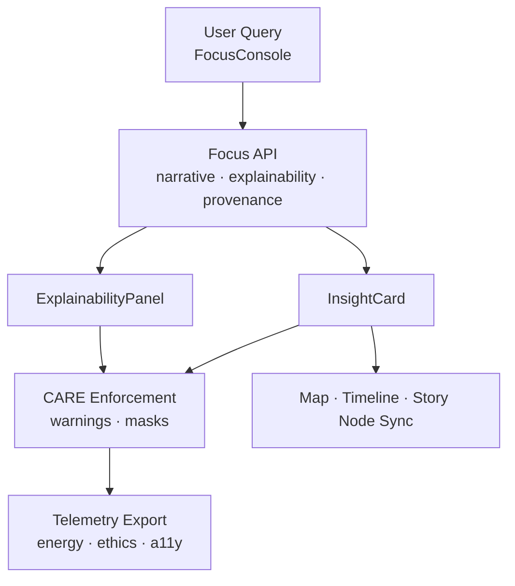
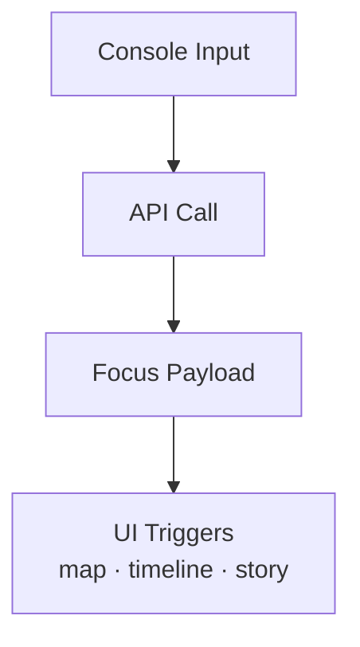
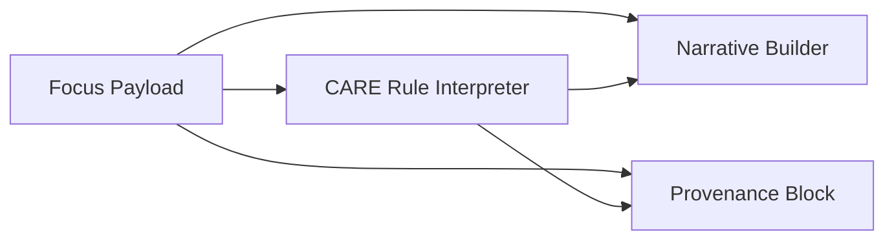
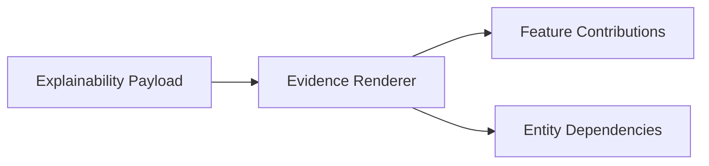
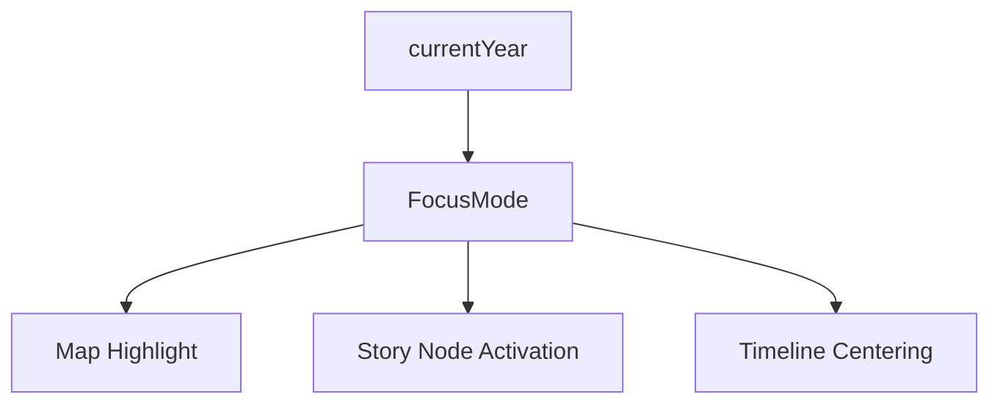
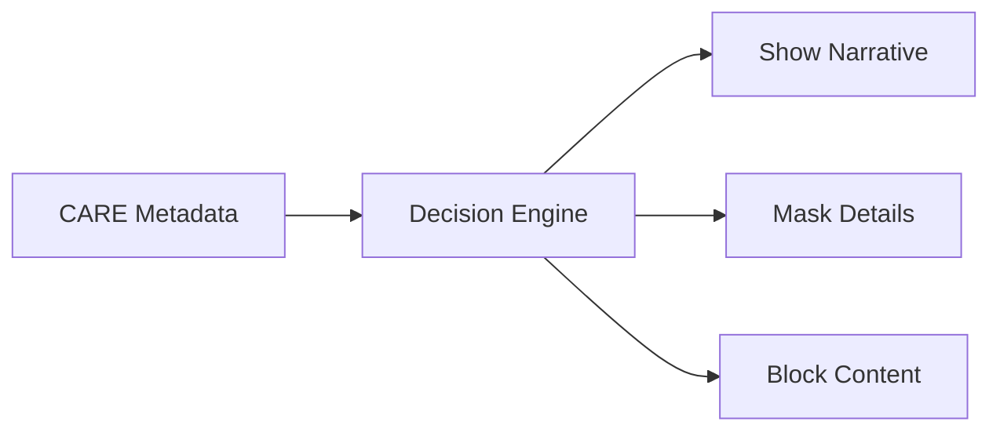
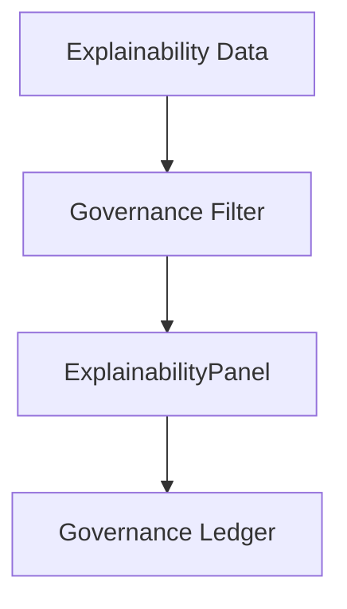
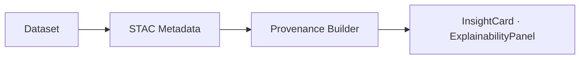
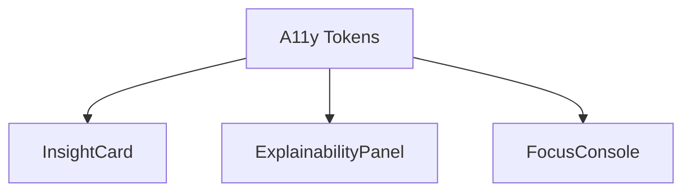
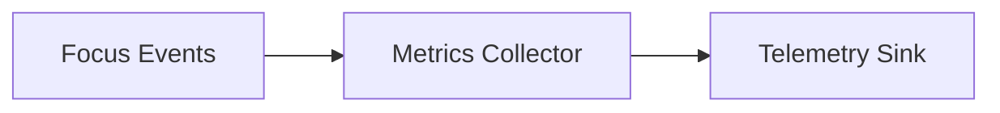

<div align="center">

# 🧠 **Kansas Frontier Matrix — Focus Mode UI Architecture**  
`web/src/components/FocusMode/README.md`

**Purpose:**  
Provide the **full deep-architecture specification** for Focus Mode components in KFM v10.3.2.  
Focus Mode unifies explainable AI, semantic narrative rendering, governance enforcement (FAIR+CARE), provenance surfacing, temporal + spatial sync, and sustainability telemetry into a cohesive user-facing reasoning engine.

[]()
[]()
[]()
[]()

</div>

---

# 📘 Executive Summary

**Focus Mode v2.5** is the core **explainable reasoning UI** of the Kansas Frontier Matrix.  
It provides:

- Entity-centric reasoning  
- Narrative summaries with citations  
- SHAP/LIME-style explainability overlays  
- CARE-governed redactions & sovereignty protections  
- Provenance chips (dataset lineage · Story Node links · licenses)  
- Temporal & spatial synchronization  
- Sustainability telemetry  
- FAIR+CARE governance warnings  
- Accessibility-complete narrative rendering  

This document defines the entire front-end structure powering Focus Mode.

---

# 🗂️ Directory Layout (Authoritative v10.3.2)

```text
web/src/components/FocusMode/
├── README.md
├── FocusConsole.tsx
├── InsightCard.tsx
├── ExplainabilityPanel.tsx
└── metadata.json
```

---

# 🧩 High-Level Focus Mode Architecture



---

# 🧬 Focus Mode v2.5 Data Contract (Client Responsibilities Only)

Focus Mode **never** computes AI locally — it renders server-generated:

- narrative  
- subgraph  
- explainability tokens  
- provenance bundles  
- ethics_flags  
- care_labels  
- telemetry metadata  

Client must:

- interpret  
- render  
- enforce CARE rules  
- log telemetry  
- propagate temporal/spatial sync events  

---

# 🧱 1. FocusConsole.tsx — Query Interface & Context Bridge

### Responsibilities
- Collect user entity queries  
- Call focus API with query → entity reference  
- Display loading, CARE warnings, and provenance badges  
- Push events to:
  - Map highlight  
  - Timeline alignment  
  - Story Node context  

## Architecture



---

# 📑 2. InsightCard.tsx — Narrative + Provenance Surface

InsightCard displays:

- narrative paragraphs  
- citations  
- dataset lineage  
- CARE labels  
- license info  
- sovereignty markers  
- relevance scoring (server-provided)  

## Architecture



---

# 🔍 3. ExplainabilityPanel.tsx — Explainable AI Overlay

Explainability Panel renders:

- Reasoning steps  
- SHAP/LIME attribution bars  
- Ontology hop visualizations  
- Dataset evidence trails  
- Ethics warnings (redacted reasoning)  
- PROV-O + CIDOC CRM references  

## Architecture



---

# 🌐 Temporal + Spatial Synchronization

Focus Mode synchronizes with:

- **MapView** (highlight geometry · layer filtering)  
- **Timeline** (jump to event year)  
- **Story Nodes** (open linked narratives)  

## Sync Architecture



Predictive scenario years (>2025) show projection notices per CARE ethics.

---

# 🔐 FAIR+CARE Governance Enforcement (Deep Mode)

Focus Mode enforces:

- **CARE Flags**: public, sensitive, restricted  
- **CARE masking**: hides or fuzzes protected content  
- **Sovereignty rules**: tribal jurisdiction boundaries  
- **Ethical overlays**: explicit disclaimers for sensitive interpretations  
- **License + checksum provenance**  

## CARE Enforcement Flow



---

# 🧠 Explainability + Governance Joint Model

Explainability Panel enforces governance by:

- Redacting feature attributions tied to sensitive datasets  
- Highlighting ethical-risk dependencies  
- Showing provenance-driven warnings  
- Recording each explainability access in telemetry  

## Joint Governance Pipeline



---

# 🛰️ Provenance Architecture (PROV-O + STAC + CIDOC CRM)

Every Focus Mode card displays provenance via:

- source IDs  
- dataset → item → collection → provider chain  
- checksums  
- STAC metadata  
- CIDOC CRM relationships  
- PROV-O lineage  

## Provenance Flow



---

# ♿ Accessibility Architecture (WCAG 2.1 AA)

Focus Mode UI follows strict a11y rules:

- keyboard-first navigation  
- focus-visible rings  
- motion-safe transitions  
- full ARIA labeling  
- screenreader-friendly narrative ordering  
- <h> hierarchy + region roles  
- timeline-year announcements  

## A11y DAG



---

# 📡 Telemetry & Sustainability Architecture

Telemetry logs:

- reasoning latency  
- number of explainability calls  
- CARE masking events  
- ethical-risk warnings  
- energy estimate per interaction (Wh)  
- interaction modality (keyboard, assistive tech)  

Telemetry is appended to:

```
../../../../releases/v10.3.2/focus-telemetry.json
```

## Telemetry DAG



Sustainability tracking follows ISO 50001 + carbon estimation tokens.

---

# ⚙️ CI/CD Validation

| Test | Ensures |
|------|---------|
| `faircare-validate.yml` | CARE compliance + ethics correctness |
| `telemetry-export.yml` | sustainability + governance telemetry audited |
| `accessibility_scan.yml` | WCAG AA validated |
| `docs-lint.yml` | front-matter + protocol correctness |
| `schema-validate.yml` | provenance + explainability schemas correct |
| `codeql.yml` | security correctness |

---

# 🧾 Example Focus Mode Metadata Record

```json
{
  "id": "focusmode_v10.3.2",
  "queries": 412,
  "a11y_score": 98.9,
  "ai_explainability": true,
  "care_gate_triggered": 4,
  "energy_use_wh": 1.02,
  "checksum_verified": true,
  "timestamp": "2025-11-14T20:22:00Z"
}
```

---

# 🕰️ Version History

| Version | Date | Summary |
|--------|--------|---------|
| v10.3.2 | 2025-11-14 | Full deep-architecture rebuild; added CARE engine, sync DAGs, explainability governance pipeline, sustainability telemetry. |
| v9.7.0 | 2025-11-05 | Previous version. |

---

<div align="center">

**Kansas Frontier Matrix — Focus Mode UI Architecture**  
🧠 Explainable AI · 🔐 Ethical Reasoning · 🌐 FAIR+CARE · 🔗 Provenance Integrity  
© 2025 Kansas Frontier Matrix — MIT License  

[Back to Components Index](../README.md)

</div>
