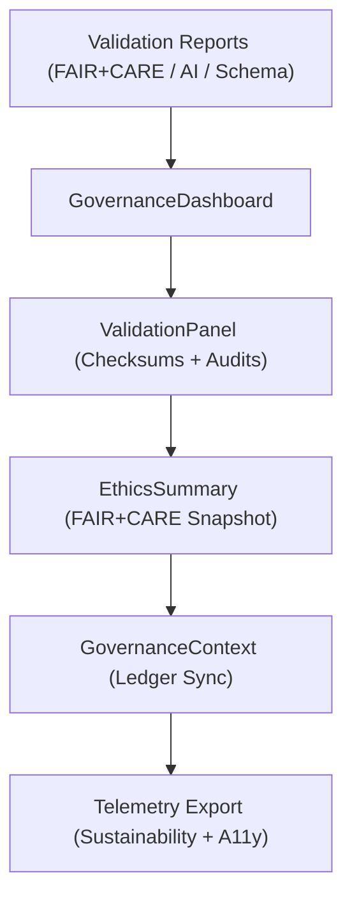

<div align="center">

# ⚖️ **Kansas Frontier Matrix — Governance Components**
`web/src/components/Governance/README.md`

**Purpose:** Define FAIR+CARE-certified components for visualizing **provenance, audit, and ethics data** in the Kansas Frontier Matrix (KFM) web interface.  
These components connect validation workflows, governance ledgers, and ethical dashboards under **MCP v6.3** and **ISO 19115 provenance standards**.

[](../../../../docs/README.md)
[](../../../../LICENSE)
[](../../../../docs/standards/faircare.md)
[]()

</div>

---

## 📘 Overview

The **Governance Components** power KFM’s **audit dashboards**, **ethics summaries**, and **FAIR+CARE reports**.  
They serve as the visual governance interface linking backend validation pipelines to user-facing ledgers and transparency metrics.

---

## 🗂️ Directory Layout

```
web/src/components/Governance/
├── README.md
├── GovernanceDashboard.tsx    # Central ethics + provenance overview
├── ValidationPanel.tsx        # Schema, checksum, and FAIR+CARE result view
├── EthicsSummary.tsx          # Certification, ethics, and AI audit summary
└── metadata.json              # Component-level governance metadata
```

---

## 🧩 Visualization Flow



1. **Reports Input:** Governance data from FAIR+CARE pipelines.  
2. **Dashboard:** Aggregates validation results, provenance, and audit metrics.  
3. **ValidationPanel:** Displays schema and checksum validations.  
4. **EthicsSummary:** Summarizes FAIR+CARE, CARE flags, and bias metrics.  
5. **Sync:** Commits results to governance ledgers and telemetry.

---

## ⚙️ Component Contracts

| Contract | Purpose | Validator |
|----------|----------|-----------|
| Governance Contract | Provenance + FAIR+CARE audit metadata | `faircare-validate.yml` |
| A11y Contract | Accessible rendering and labeling | `accessibility_scan.yml` |
| Telemetry Contract | Perf + energy + ledger sync schema | `telemetry-export.yml` |
| Dashboard Contract | Summary aggregation & display metrics | Schema guards |

Artifacts recorded in:
- `../../../../docs/reports/audit/data_provenance_ledger.json`  
- `../../../../releases/v9.7.0/focus-telemetry.json`

---

## 🧠 FAIR+CARE Governance Matrix

| Principle | Implementation | Oversight |
|------------|----------------|------------|
| **Findable** | Governance artifacts indexed per release in ledgers. | @kfm-data |
| **Accessible** | WCAG 2.1 AA dashboards with chart alt-text & ARIA labels. | @kfm-accessibility |
| **Interoperable** | Metadata conforms to STAC, DCAT, ISO 19115 provenance. | @kfm-architecture |
| **Reusable** | Components reused across dashboards and AI ethics modules. | @kfm-design |
| **Collective Benefit** | Enables open, traceable science and public ethics review. | @faircare-council |
| **Authority to Control** | Council reviews FAIR+CARE and ethics dashboards. | @kfm-governance |
| **Responsibility** | Maintains checksum, provenance, and audit integrity. | @kfm-security |
| **Ethics** | Visuals audited for neutrality and inclusive representation. | @kfm-ethics |

---

## 🧾 Example Metadata Record

```json
{
  "id": "governance_ui_v9.7.0",
  "components": ["GovernanceDashboard", "ValidationPanel", "EthicsSummary"],
  "a11y_score": 99.5,
  "checksum_verified": true,
  "ai_explainability": true,
  "energy_use_wh": 1.25,
  "telemetry_synced": true,
  "timestamp": "2025-11-05T18:45:00Z"
}
```

---

## ⚙️ Component Summaries

| Component | Description | Role |
|-----------|-------------|------|
| `GovernanceDashboard` | Displays governance metrics, validation, and ethics data. | Central Governance View |
| `ValidationPanel` | Visualizes schema checks, FAIR+CARE, and audit outcomes. | Audit Visualization |
| `EthicsSummary` | Compact overview of AI ethics and CARE compliance. | Communication Layer |

---

## ♿ Accessibility Highlights

- Chart color palettes contrast-tested (≥ 4.5:1).  
- Screen-reader support for legends and tooltips.  
- Keyboard navigation for panel filters and tabs.  
- Reduced-motion transitions for focus and report updates.  
- Lighthouse and axe audits run on each CI build.

---

## 🌱 Sustainability Metrics

| Metric | Target | Verified By |
|-------|--------|-------------|
| Dashboard Render Energy | ≤ 1.3 Wh | Telemetry |
| Carbon Output | ≤ 1.5 gCO₂e | CI telemetry |
| Lighthouse Perf | ≥ 90 | CI workflow |
| Renewable Power | 100% | @kfm-infrastructure |

---

## 🕰️ Version History

| Version | Date | Author | Summary |
|----------|------|---------|----------|
| v9.7.0 | 2025-11-05 | KFM Core Team | Upgraded and aligned: contracts, telemetry schema v1, CI mappings, and CARE reporting. |
| v9.6.0 | 2025-11-03 | KFM Core Team | Added ethics dashboard integration and real-time ledger sync. |
| v9.5.0 | 2025-11-02 | KFM Core Team | Enhanced accessibility + sustainability tracking. |
| v9.3.2 | 2025-10-28 | KFM Core Team | Established governance visualization architecture. |

---

<div align="center">

**© 2025 Kansas Frontier Matrix — MIT / CC-BY 4.0**  
Maintained under **Master Coder Protocol v6.3** · FAIR+CARE Certified · Diamond⁹ Ω / Crown∞Ω Ultimate Certified  
[Back to Components Index](../README.md) · [Docs Index](../../../../docs/README.md)

</div>