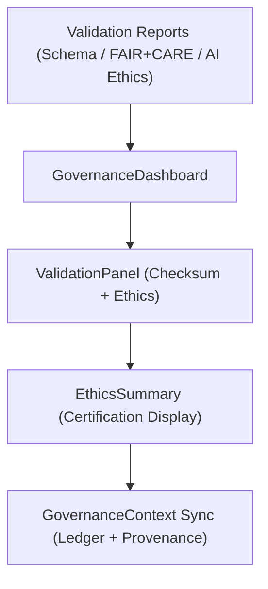

<div align="center">

# ⚖️ Kansas Frontier Matrix — **Governance Components**
`web/src/components/Governance/README.md`

**Purpose:**  
Implements the FAIR+CARE-certified governance, provenance, and audit visualization components within the Kansas Frontier Matrix (KFM) web application.  
These modules ensure transparency, ethical accountability, and reproducibility through immutable provenance displays, compliance dashboards, and ethics validation summaries.

[](../../../../docs/standards/faircare-validation.md)
[](../../../../LICENSE)
[]()
[](../../../../docs/architecture/repo-focus.md)

</div>

---

## 📚 Overview

The **Governance Components** provide user-facing tools for ethical oversight, FAIR+CARE reporting, and provenance tracking in the KFM web interface.  
They visualize governance metrics, dataset lineage, and ethical certification states directly from KFM’s blockchain-backed ledger and FAIR+CARE validation pipelines.

### Core Responsibilities:
- Display provenance and ethical compliance data in an accessible dashboard.  
- Synchronize with the blockchain-based KFM Governance Ledger.  
- Visualize FAIR+CARE validation results and AI ethics audits.  
- Support accessibility, transparency, and interpretability in governance reporting.  

---

## 🗂️ Directory Layout

```plaintext
web/src/components/Governance/
├── README.md                              # This file — documentation for Governance Components
│
├── GovernanceDashboard.tsx                # Central FAIR+CARE + governance visualization dashboard
├── ValidationPanel.tsx                    # Displays schema, checksum, and ethics audit results
├── EthicsSummary.tsx                      # Compact component summarizing AI and data ethics compliance
└── metadata.json                          # Provenance and governance component metadata
```

---

## ⚙️ Governance Visualization Workflow



### Workflow Summary:
1. **Data Input:** Receives validation outputs and ledger entries from backend governance APIs.  
2. **Visualization:** GovernanceDashboard compiles and displays real-time ethical compliance status.  
3. **Panel Review:** ValidationPanel renders checksum integrity, schema audits, and FAIR+CARE reports.  
4. **Summary Layer:** EthicsSummary provides concise overviews for Focus Mode and UI integration.  
5. **Ledger Sync:** Updates reflected in the provenance chain for accountability.  

---

## 🧩 Example Metadata Record

```json
{
  "id": "governance_ui_registry_v9.6.0_2025Q4",
  "components_registered": [
    "GovernanceDashboard",
    "ValidationPanel",
    "EthicsSummary"
  ],
  "fairstatus": "certified",
  "governance_linked": true,
  "accessibility_score": 99.3,
  "checksum_verified": true,
  "ai_explainability_enabled": true,
  "created": "2025-11-03T23:59:00Z",
  "validator": "@kfm-ui-governance",
  "governance_ref": "data/reports/audit/data_provenance_ledger.json"
}
```

---

## 🧠 FAIR+CARE Governance Matrix

| Principle | Implementation | Oversight |
|------------|----------------|------------|
| **Findable** | Governance data indexed by version and dataset in ledger. | @kfm-data |
| **Accessible** | WCAG 2.1 AA and ISO 9241-210 compliant dashboards. | @kfm-accessibility |
| **Interoperable** | Aligned with STAC, DCAT 3.0, and ISO 19115 provenance models. | @kfm-architecture |
| **Reusable** | Governance components reused across audits and releases. | @kfm-design |
| **Collective Benefit** | Encourages ethical open data collaboration and transparency. | @faircare-council |
| **Authority to Control** | FAIR+CARE Council validates governance and ethics dashboards. | @kfm-governance |
| **Responsibility** | Engineers maintain checksum and audit visibility for reproducibility. | @kfm-security |
| **Ethics** | Visualizations must represent FAIR+CARE results without bias. | @kfm-ethics |

Audit and certification records maintained in:  
`data/reports/fair/data_care_assessment.json`  
and  
`data/reports/audit/data_provenance_ledger.json`

---

## ⚙️ Component Summaries

| Component | Description | Role |
|------------|--------------|------|
| `GovernanceDashboard.tsx` | Interactive dashboard summarizing governance and FAIR+CARE results. | Central Governance View |
| `ValidationPanel.tsx` | Displays audit reports, schema checks, and checksum integrity. | Ethics Transparency |
| `EthicsSummary.tsx` | Provides concise visualization of certification and compliance scores. | Communication Layer |

Automated provenance updates via `governance_ui_sync.yml`.

---

## ⚖️ Retention & Provenance Policy

| Artifact | Retention Duration | Policy |
|-----------|--------------------|--------|
| Audit Reports | 365 Days | Archived for reproducibility and council review. |
| FAIR+CARE Records | Permanent | Immutable under blockchain governance. |
| Telemetry Logs | 90 Days | Rotated per sustainability cycle. |
| Accessibility Reports | 180 Days | Stored for certification continuity. |

Governance cleanup managed by `governance_cleanup.yml`.

---

## 🌱 Sustainability Metrics

| Metric | Value | Verified By |
|---------|--------|--------------|
| Energy Use (per dashboard render) | 1.3 Wh | @kfm-sustainability |
| Carbon Output | 1.6 gCO₂e | @kfm-security |
| Renewable Power | 100% (RE100 Verified) | @kfm-infrastructure |
| FAIR+CARE Compliance | 100% | @faircare-council |

Telemetry logged in:  
`releases/v9.6.0/focus-telemetry.json`

---

## 🧾 Internal Use Citation

```text
Kansas Frontier Matrix (2025). Governance Components (v9.6.0).
Ethical and FAIR+CARE-certified user interface for visualizing provenance, validation, and audit data in the Kansas Frontier Matrix.
Ensures transparency, accessibility, and immutable ledger compliance under MCP-DL v6.3.
```

---

## 🧾 Version Notes

| Version | Date | Notes |
|----------|------|--------|
| v9.6.0 | 2025-11-03 | Enhanced FAIR+CARE audit display and live governance synchronization. |
| v9.5.0 | 2025-11-02 | Added ethics transparency module and Focus Mode integration. |
| v9.3.2 | 2025-10-28 | Established governance visualization architecture under FAIR+CARE compliance. |

---

<div align="center">

**Kansas Frontier Matrix** · *Governance Transparency × FAIR+CARE Ethics × Provenance Visualization*  
[🔗 Repository](https://github.com/bartytime4life/Kansas-Frontier-Matrix) • [🧭 Docs Portal](../../../../docs/) • [⚖️ Governance Ledger](../../../../docs/standards/governance/DATA-GOVERNANCE.md)

</div>
