<div align="center">

# ⚖️ **Kansas Frontier Matrix — Governance UI Architecture**  
`web/src/components/Governance/README.md`

**Purpose:**  
Define the **deep-architecture specification** for Governance UI components in KFM v10.3.2, enabling transparency, provenance surfacing, ethical AI review, and CARE-led cultural sensitivity controls.  
These components unify provenance datasets, FAIR+CARE audits, explainability systems, sustainability telemetry, and KFM’s governance ledgers into a single visual and ethical oversight layer.

[]()
[]()
[]()
[]()

</div>

---

# 📘 Executive Summary

Governance UI components serve as the **ethical nervous system** of the Kansas Frontier Matrix, ensuring:

- Transparent provenance  
- FAIR+CARE validation & reporting  
- Ethical AI audit visibility  
- Cultural sensitivity indicators  
- Bias & drift summaries  
- Sustainability metrics  
- Ledger-level history + lineage tracking  
- Accessible and inclusive governance dashboards  

This architecture provides the **visual oversight layer** connecting the KFM platform to its FAIR+CARE Council & governance workflows.

---

# 🗂️ Directory Layout (Authoritative v10.3.2)

```text
web/src/components/Governance/
├── README.md
├── GovernanceDashboard.tsx
├── ValidationPanel.tsx
├── EthicsSummary.tsx
└── metadata.json
```

Each component participates in the **KFM Governance Dataflow Plane**.

---

# 🧩 High-Level Governance UI Architecture

```mermaid
flowchart TD
    VALREP[Validation Reports<br/>FAIRCARE · Schema · Checksums · AI Audits] --> GD[GovernanceDashboard]
    GD --> VP[ValidationPanel]
    VP --> ES[EthicsSummary]
    ES --> LEDGER[Governance Ledger<br/>provenance · CARE · audit]
    LEDGER --> TEL[Telemetry Export<br/>energy · ethics · transparency]
```



---

# 🧬 Component Deep Architecture

## 1️⃣ GovernanceDashboard.tsx — Oversight & Provenance Hub

### Responsibilities
- Aggregate results from:
  - FAIR+CARE audits  
  - Schema + checksum validators  
  - AI ethics + explainability testers  
  - Pipeline provenance chains  
  - Sustainability + energy telemetry  
- Expose visual “governance-at-a-glance” state  

### Architecture


---

## 2️⃣ ValidationPanel.tsx — Schema + FAIR+CARE Validator

Displays:

- Schema validity  
- STAC/DCAT compliance  
- License consistency  
- Checksums + cryptographic verification  
- CARE masking correctness  
- Bias/drift warnings for AI artifacts  

### Architecture


---

## 3️⃣ EthicsSummary.tsx — Cultural, Social & AI Ethics Capsule

Summaries include:

- CARE compliance snapshot  
- AI explainability notes  
- Bias drift indicators  
- Cultural-sensitivity signals  
- Environmental justice alignment  
- Governance flag triggers  

### Architecture


---

# 🧠 Provenance & Lineage Architecture (ISO 19115 + PROV-O)

Governance components surface:

- upstream pipeline lineage  
- dataset provenance  
- model training lineage  
- checksum registry links  
- dataset → collection → source chain  
- witness references for tribal sovereignty data  

## Provenance Flow


---

# 🔐 CARE Governance Integration

Governance UI is responsible for surfacing:

- CARE labels (public, sensitive, restricted)  
- Sovereignty banners  
- Masking indicators  
- Restricted data warnings  
- Heritage protection notices  

## CARE Enforcement Model


---

# 🧮 Ethical AI Oversight (Focus Mode v2.5)

Governance components integrate:

- AI reasoning audits  
- Explainability model summaries  
- SHAP/LIME justification pairs  
- Bias-checking metrics  
- Drift monitoring  
- Content safety & alignment vetting  

### AI Governance Flow


---

# 📊 Sustainability & Energy Metrics

Governance UI exposes:

- energy per render (Wh)  
- carbon estimations (gCO₂e)  
- renewable energy compliance (RE100)  
- ethical design energy thresholds  

### Sustainability Flow


---

# ♿ Accessibility Governance

Components enforce:

- ARIA labels  
- semantic structure  
- WCAG contrast ≥ 4.5:1  
- focus-visible tokens  
- tab-order integrity  
- accessible metadata for charts and ethical reports  

Accessibility compliance is required at the **governance level** because ethical transparency must be inclusive.

---

# 📡 Telemetry & Ledger Synchronization

Governance UIs record:

- `governance_event_count`  
- `fairstatus_changes`  
- `ethics_flag_occurrences`  
- `license_conflicts`  
- `checksum_failures`  
- `a11y_warnings`  

Telemetry written to:

```
../../../../releases/v10.3.2/focus-telemetry.json
```

Ledger updates written to:

```
../../../../docs/reports/audit/web-governance-ledger.json
```

---

# ⚙️ CI/CD Validation

| Validator | Purpose |
|----------|----------|
| `faircare-validate.yml` | CARE + ethics enforcement |
| `telemetry-export.yml` | energy + ethics telemetry generation |
| `docs-lint.yml` | documentation compliance |
| `accessibility_scan.yml` | WCAG 2.1 AA validation |
| `schema_validate.yml` | metadata + provenance schema checks |
| `codeql.yml` | security checks |

Any failure → merge blocked.

---

# 🧾 Sample Governance Metadata Record

```json
{
  "id": "governance_components_v10.3.2",
  "components": [
    "GovernanceDashboard",
    "ValidationPanel",
    "EthicsSummary"
  ],
  "a11y_score": 99.7,
  "fairstatus": "certified",
  "checksum_verified": true,
  "care_warnings": 3,
  "energy_use_wh": 1.03,
  "timestamp": "2025-11-14T10:40:00Z"
}
```

---

# 🕰️ Version History

| Version | Date | Summary |
|---------|--------|---------|
| v10.3.2 | 2025-11-14 | Complete deep-architecture rebuild; added lineage model, CARE decision engine, explainability integration, telemetry + sustainability surfacing, CI enforcement updates. |
| v9.7.0 | 2025-11-05 | Previous version. |

---

<div align="center">

**Kansas Frontier Matrix — Governance UI Architecture**  
⚖️ Ethical Visualization · 🔗 Provenance Integrity · 🌐 FAIR+CARE Governance · 🧠 AI Accountability  
© 2025 Kansas Frontier Matrix — MIT License  

[Back to Components Index](../README.md)

</div>
