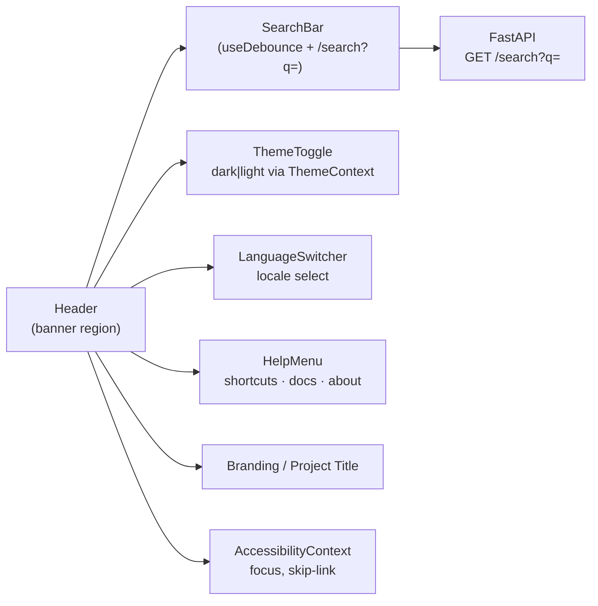
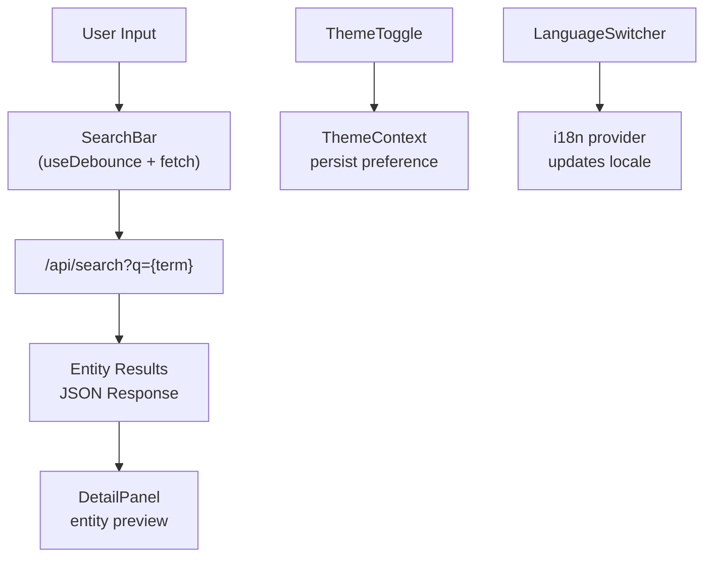

<div align="center">

# 🧭 Kansas Frontier Matrix — **Header Component**  
`web/src/components/Header/`

**Global Navigation · Search Bar · Theme Toggle · Branding**

[](../../../../../.github/workflows/ci.yml)
[](../../../../../.github/workflows/codeql.yml)
[](../../../../../docs/)
[](../../../../../docs/design/reviews/accessibility/)
[](../../../../../LICENSE)

</div>

---

```yaml
---
title: "KFM • Header Component (web/src/components/Header/)"
version: "v1.4.0"
last_updated: "2025-10-14"
owners: ["@kfm-web", "@kfm-ui"]
tags: ["react","navigation","header","search","theme","accessibility","mcp"]
license: "MIT"
semantic_alignment:
  - WCAG 2.1 AA
  - WAI-ARIA 1.2
  - CIDOC CRM (UI hierarchy)
---
````

---

## 🧭 Overview

The **Header Component** defines the **global navigation and branding interface** of the Kansas Frontier Matrix web application.
It acts as the user’s control hub — providing quick access to search, theme toggling, language selection, and modal menus (Help, About, Settings).

Built under **MCP-DL v6.2** principles, the Header embodies:

* **Unified State Management** via `ThemeContext` & `AccessibilityContext`
* **Accessibility-First Design** (ARIA roles, keyboard shortcuts, focus order)
* **Reproducibility & Documentation** through typed props and predictable UI contracts

This component appears across all routes and ensures consistent behavior, responsiveness, and performance across screen sizes.

---

## 🧱 Directory Structure

```text
web/src/components/Header/
├── Header.tsx             # Primary component and layout container
├── SearchBar.tsx          # Entity search (autocomplete)
├── ThemeToggle.tsx        # Dark/light mode toggle
├── LanguageSwitcher.tsx   # Locale & i18n switcher
├── HelpMenu.tsx           # Shortcut help + documentation links
├── styles.scss            # Header styles and theme tokens
└── __tests__/             # Jest + RTL tests for interaction, a11y, responsiveness
```

---

## ⚙️ Component Architecture



---

## 🔍 Core Features

| Feature               | Description                                          | Data / Context Source  |
| :-------------------- | :--------------------------------------------------- | :--------------------- |
| **Search Bar**        | Autocomplete for entities (people, places, events)   | `/api/search`          |
| **Theme Toggle**      | Light/Dark mode persistence via `localStorage`       | `ThemeContext`         |
| **Language Switcher** | Adjusts locale + date formatting                     | i18n library           |
| **Help Menu**         | Lists keyboard shortcuts and documentation links     | Static Config          |
| **Branding**          | Displays title, logo, and version                    | `package.json`         |
| **Accessibility**     | `role="banner"` landmark + skip link + focus outline | `AccessibilityContext` |

---

## 💬 Example Implementation

```tsx
import React from "react";
import { useTheme } from "../../context/ThemeContext";
import { SearchBar } from "./SearchBar";
import { ThemeToggle } from "./ThemeToggle";
import { LanguageSwitcher } from "./LanguageSwitcher";
import "./styles.scss";

export const Header: React.FC = () => {
  const { theme } = useTheme();

  return (
    <header role="banner" className={`kfm-header ${theme}`}>
      <a href="#main" className="skip-link">Skip to Content</a>
      <div className="logo">
        
        <h1>Kansas Frontier Matrix</h1>
      </div>
      <SearchBar placeholder="Search events, places, or people..." />
      <div className="controls">
        <LanguageSwitcher />
        <ThemeToggle />
      </div>
    </header>
  );
};
```

> The Header orchestrates navigation, state synchronization, and accessibility — ensuring a smooth, responsive UX.

---

## 🧠 Data Flow



---

## ⚙️ Search Functionality

The SearchBar integrates with the backend `/api/search` endpoint to query entities across the knowledge graph.

```ts
const { query, setQuery } = useState("");
const results = useFetch(`/api/search?q=${query}`);
```

Returned entities conform to:

```ts
interface SearchResult {
  id: string;
  label: string;
  type: "Person" | "Place" | "Event" | "Document";
  summary?: string;
}
```

Each result is rendered with an icon per type and links directly to the `DetailPanel`.

---

## 🎨 Styling & Layout

| Property                   | Description                                                            |
| :------------------------- | :--------------------------------------------------------------------- |
| **Layout**                 | Flexbox grid: logo → search → controls                                 |
| **Theme Control**          | Colors from `--kfm-color-bg`, `--kfm-color-accent`, `--kfm-color-text` |
| **Responsive Breakpoints** | `<768px`: hamburger menu · `<1024px`: text hides, icon persists        |
| **Transitions**            | Framer Motion animations (fade-in toggle, slide-down search results)   |
| **Focus Styling**          | Visible outlines via SCSS tokens (from `variables.scss`)               |

Example:

```scss
.kfm-header {
  display: flex;
  justify-content: space-between;
  align-items: center;
  background-color: var(--kfm-color-bg);
  color: var(--kfm-color-text);
  padding: 0.5rem 1rem;
  transition: background 0.3s ease;
}
```

---

## ♿ Accessibility (WCAG 2.1 AA)

* **Landmark Role:** `<header role="banner">`
* **Skip Navigation:** “Skip to Content” link visible on keyboard focus
* **Keyboard Navigation:** `/` focuses search, `T` toggles theme, `Alt+H` opens Help
* **ARIA Attributes:** `aria-label` for search input, `aria-pressed` for toggle buttons
* **Responsive A11y:** Collapsible menus maintain focus cycle via focus trap

Accessibility verified via **axe-core** and **Lighthouse** (score ≥ 95).

---

## 🧪 Testing

| Test                  | Purpose                                | Tool        |
| :-------------------- | :------------------------------------- | :---------- |
| **Search API Mock**   | Validates debounce + request timing    | Jest + MSW  |
| **Theme Persistence** | Confirms theme saved & restored        | RTL         |
| **Focus Management**  | Tests Tab order, skip links, shortcuts | axe-core    |
| **Responsive Layout** | Verifies render at breakpoints         | Cypress E2E |
| **Help Menu Trigger** | Ensures keyboard opens modal           | RTL         |

**Coverage Target:** ≥ **90%** lines / branches.

---

## 🧾 Provenance & Integrity

| Artifact         | Description                                               |
| :--------------- | :-------------------------------------------------------- |
| **Inputs**       | `/api/search`, `ThemeContext`, `AccessibilityContext`     |
| **Outputs**      | Global navigation bar & modal controls                    |
| **Dependencies** | React 18+, Framer Motion, TailwindCSS, Axios              |
| **Integrity**    | CI enforces lint, type-check, a11y audits, snapshot tests |

---

## 🧠 MCP Compliance Checklist

| MCP Principle       | Implementation                                   |
| :------------------ | :----------------------------------------------- |
| Documentation-first | README + inline TSDoc before code merge          |
| Reproducibility     | Deterministic layout & context states            |
| Accessibility       | Full WCAG 2.1 AA compliance in CI                |
| Provenance          | Context + API lineage documented                 |
| Auditability        | Logs, coverage, and snapshots stored in pipeline |

---

## 🔗 Related Documentation

* **AppShell Component** — `web/src/components/AppShell/README.md`
* **Web Frontend Components** — `web/src/components/README.md`
* **Context — Theme & Accessibility** — `web/src/context/README.md`
* **Web UI Architecture** — `web/ARCHITECTURE.md`

---

## 📜 License

Released under the **MIT License**.
© 2025 Kansas Frontier Matrix — designed and documented under **MCP-DL v6.2** for accessible, reproducible, and human-centered interfaces.

> *“The Header is Kansas Frontier Matrix’s compass — orienting users in time, data, and discovery.”*

```
```
