<div align="center">

# 🧭 Kansas Frontier Matrix — **Header Component**  
`web/src/components/Header/`

**Global Navigation · Search Bar · Theme Toggle · Branding**

[](../../../../../.github/workflows/ci.yml)
[](../../../../../.github/workflows/codeql.yml)
[](../../../../../docs/)
[](../../../../../docs/design/reviews/accessibility/)
[](../../../../../LICENSE)

</div>

---

## 🧭 Overview

The **Header** is KFM’s **global navigation and identity bar**. It provides fast access to **search**, **theme controls**, **language**, and **help/settings** modals—wired into global contexts for a deterministic, accessible experience.

**Design tenets (MCP-DL v6.2)**

- **Unified state:** `ThemeContext`, `AccessibilityContext`  
- **A11y-first:** ARIA roles/labels, skip-links, keyboard shortcuts  
- **Reproducible UI contracts:** typed props, predictable behavior, CI-validated

---

## 🧱 Directory Structure

```text
web/src/components/Header/
├── Header.tsx             # Main layout (logo · search · controls)
├── SearchBar.tsx          # Autocomplete across entities (debounced)
├── ThemeToggle.tsx        # Light/Dark + reduced motion & contrast hints
├── LanguageSwitcher.tsx   # Locale switch (dates, numbers)
├── HelpMenu.tsx           # Keyboard shortcuts · docs · about
├── styles.scss            # Tokens, layout, focus rings, responsive rules
└── __tests__/             # RTL/Jest tests (a11y, responsive, persistence)
```

---

## 🧩 Architecture

```mermaid
flowchart LR
  H["Header<br/>(role=banner)"] --> S["SearchBar<br/>(/search?q=, useDebounce)"]
  H --> T["ThemeToggle<br/>ThemeContext · localStorage"]
  H --> L["LanguageSwitcher<br/>i18n provider"]
  H --> M["HelpMenu<br/>shortcuts · docs · about"]
  H --> LOGO["Branding · Project Title · Version"]
  S --> API["FastAPI<br/>GET /search?q="]
  H --> ACC["AccessibilityContext<br/>skip-link · focus mgmt"]
%% END OF MERMAID
```



---

## 🔍 Core Features

| Feature               | Description                                              | Source / Context          |
| :-------------------- | :------------------------------------------------------- | :------------------------ |
| **Global Search**     | Autocomplete entities (Person/Place/Event/Document)      | `GET /search?q=`          |
| **Theme Toggle**      | Light/Dark persisted; honors reduced-motion & contrast   | `ThemeContext`            |
| **Language Switcher** | Switches locale (dates, numbers, UI strings)             | i18n provider             |
| **Help Menu**         | Keyboard shortcuts + docs/about links                    | Static config / routing   |
| **Branding**          | KFM logo, title, semantic version                        | `package.json` metadata   |
| **A11y Essentials**   | `role="banner"`, skip-link, robust focus order           | `AccessibilityContext`    |

---

## 💬 Reference Implementation (concise)

```tsx
import React from "react";
import { SearchBar } from "./SearchBar";
import { ThemeToggle } from "./ThemeToggle";
import { LanguageSwitcher } from "./LanguageSwitcher";
import { useTheme } from "../../context/ThemeContext";
import "./styles.scss";

export const Header: React.FC = () => {
  const { theme } = useTheme();

  return (
    <header role="banner" className={`kfm-header ${theme}`} data-testid="kfm-header">
      <a href="#main" className="skip-link">Skip to Content</a>

      <div className="logo">
        
        <h1 className="title">Kansas Frontier Matrix</h1>
        <span className="version" aria-label="Application version">v1</span>
      </div>

      <SearchBar placeholder="Search events, places, or people…" />

      <nav aria-label="Global controls" className="controls">
        <LanguageSwitcher />
        <ThemeToggle />
      </nav>
    </header>
  );
};
```

> The header guarantees **landmark semantics**, a **visible skip-link**, and **stable focus order**.

---

## 🧠 Data Flow


---

## 🔎 Search Model (types)

```ts
export interface SearchResult {
  id: string;
  label: string;
  type: "Person" | "Place" | "Event" | "Document";
  summary?: string;
  bbox?: [number, number, number, number]; // optional map focus
}
```

Results render with type icons and route to the **DetailPanel**, optionally focusing the map to `bbox`.

---

## 🎨 Styling & Layout

| Aspect                    | Notes                                                                 |
| :------------------------ | :-------------------------------------------------------------------- |
| **Layout**                | Flex grid: **logo → search → controls**                               |
| **Tokens**                | `--kfm-color-bg/text/accent`, `--kfm-radius`, `--kfm-shadow`          |
| **Breakpoints**           | `<768px` compacts search; `<1024px` trims title to icon-only          |
| **Transitions**           | Subtle fades/slides; auto-disabled on reduced-motion                  |
| **Focus**                 | High-contrast ring via tokens; skip-link visible on focus             |

```scss
.kfm-header {
  display:flex; align-items:center; gap:1rem; padding:.5rem 1rem;
  background:var(--kfm-color-bg); color:var(--kfm-color-text);
  border-bottom:1px solid color-mix(in oklab, var(--kfm-color-text), transparent 85%);
}
.skip-link { position:absolute; left:-9999px; }
.skip-link:focus { left:1rem; top:1rem; background:var(--kfm-color-accent); color:#000; padding:.25rem .5rem; }
```

---

## ♿ Accessibility (WCAG 2.1 AA)

- Landmark: `<header role="banner">` with skip-to-content link.  
- Keyboard: `/` focuses search; `T` toggles theme; `Alt+H` opens Help.  
- ARIA: `aria-label` on inputs; `aria-pressed` for toggle buttons.  
- Motion: honors `prefers-reduced-motion`; disables animated search panel.  
- Contrast: tokens validated for AA; focus rings are always visible.

A11y audited in CI with **axe-core** and **Lighthouse**.

---

## 🧪 Testing

| Test                       | Purpose                                         | Tooling          |
| :------------------------- | :---------------------------------------------- | :--------------- |
| Debounced search           | Verifies correct request cadence & rendering    | Jest + MSW + RTL |
| Theme persistence          | Saves/restores preference across reloads        | RTL + JSDOM      |
| Skip-link & focus order    | Ensures landmark and tab sequence               | axe-core + RTL   |
| Responsive breakpoints     | Layout at mobile/tablet/desktop                 | Cypress E2E      |
| Help menu shortcut         | Keyboard opens menu and traps focus             | RTL + userEvent  |

**Coverage target:** ≥ **90%** lines/branches.

---

## 🧾 Provenance & Integrity

| Artifact         | Description                                        |
| :--------------- | :------------------------------------------------- |
| **Inputs**       | `/api/search`, Theme/Accessibility contexts        |
| **Outputs**      | Global nav bar, search results, modal triggers     |
| **Dependencies** | React 18+, Axios/Fetch, TailwindCSS, Framer Motion |
| **Integrity**    | CI enforces lint, type-check, a11y & snapshot tests|

---

## 🧠 MCP Compliance Checklist

| Principle           | Implementation                                      |
| :------------------ | :-------------------------------------------------- |
| Documentation-first | README + TSDoc for props / handlers                 |
| Reproducibility     | Deterministic contexts + debounced search pipeline  |
| Accessibility       | WCAG 2.1 AA verified in CI                          |
| Provenance          | API & context lineage documented                    |
| Open Standards      | WAI-ARIA 1.2 · CSS Custom Properties                |

---

## 🔗 Related Documentation

- **AppShell** — `web/src/components/AppShell/README.md`  
- **Components Overview** — `web/src/components/README.md`  
- **Contexts (Theme/A11y)** — `web/src/context/README.md`  
- **Web UI Architecture** — `web/ARCHITECTURE.md`

---

## 🧾 Versioning & Metadata

| Field | Value |
| :---- | :---- |
| **Version** | `v1.5.0` |
| **Codename** | *Compass & Search Upgrade* |
| **Last Updated** | 2025-10-17 |
| **Maintainers** | @kfm-web · @kfm-ui |
| **License** | MIT (code) · CC-BY 4.0 (docs) |
| **Alignment** | WCAG 2.1 AA · WAI-ARIA 1.2 · CIDOC CRM (UI hierarchy) |
| **Maturity** | Stable / Production |

---

## 📜 License

Released under the **MIT License**.  
© 2025 Kansas Frontier Matrix — documented and delivered under **MCP-DL v6.2** for accessible, reproducible, human-centered interfaces.

> *“The Header is the compass—orienting users in time, data, and discovery.”*
