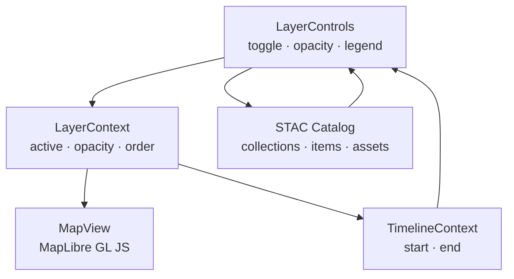
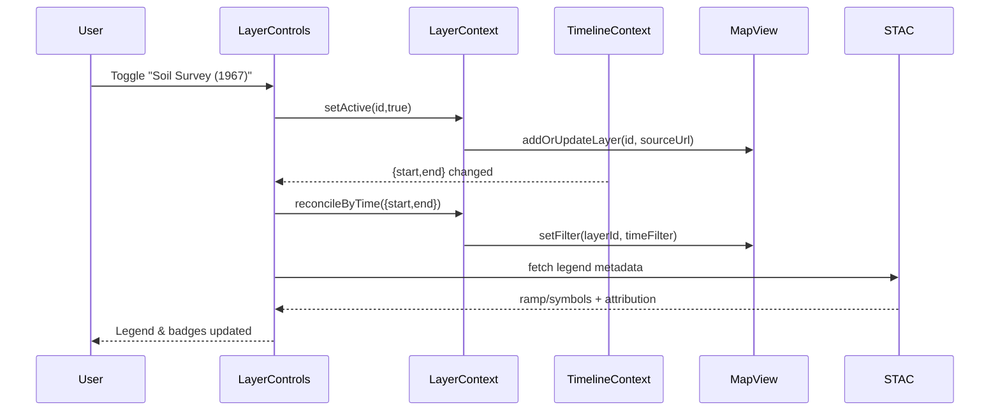

<div align="center">

# 🗺️ Kansas Frontier Matrix — **LayerControls Component**  
`web/src/components/LayerControls/`

**Map Layers · STAC Integration · Legends · Opacity Control**

[](../../../../../.github/workflows/ci.yml)
[](../../../../../.github/workflows/stac-validate.yml)
[](../../../../../docs/)
[](../../../../../docs/design/reviews/accessibility/)
[](../../../../../LICENSE)

</div>

---

## 🧭 Overview

**LayerControls** is the **geospatial layer management UI** for KFM.  
It surfaces **STAC-indexed** raster (COG) and vector (GeoJSON) datasets as toggleable items with **opacity control**, **legends**, **metadata**, and **timeline-aware visibility**.  
Changes propagate through **LayerContext** and **TimelineContext** to **MapView** for deterministic, reproducible rendering (MCP-DL v6.2).

---

## 🧱 Directory Structure

```text
web/src/components/LayerControls/
├── LayerControls.tsx   # Panel shell: search, groups, persistence
├── LayerItem.tsx       # Row: toggle · opacity · metadata badges
├── Legend.tsx          # STAC-driven legends (ramps & symbols)
├── styles.scss         # Tokens, focus states, responsive layout
└── __tests__/          # Jest + RTL (toggle, opacity, legend, a11y)
```

---

## 🗺️ Architecture



**Flow:** STAC metadata → UI list; user actions → LayerContext; MapView applies changes; TimelineContext gates visibility by time window.

---

## 🧩 Core Features

| Feature               | Description                                                          | Data / API                |
| :-------------------- | :------------------------------------------------------------------- | :------------------------ |
| **Layer Toggling**    | Enable/disable raster & vector overlays                              | STAC items/assets         |
| **Opacity Slider**    | 0–100% blending for comparative analysis                             | MapLibre paint properties |
| **Dynamic Legends**   | Render color ramps/symbol sets from STAC metadata                    | STAC `assets.roles`       |
| **Metadata Badges**   | Title · license · date range · keywords (theme tags)                 | STAC `properties`         |
| **Timeline Sync**     | Auto-hides layers outside `{start,end}`                              | TimelineContext           |
| **Search & Groups**   | Filter by keyword; group by `kfm:theme` (treaty, hydrology, hazards) | STAC keywords/properties  |
| **Persistence**       | Namespaced `localStorage` for active list + opacity                  | LayerContext              |
| **Accessibility**     | Keyboard operable; ARIA labels; visible focus ring                   | WCAG 2.1 AA               |

---

## 💬 Reference Usage

```tsx
import React from "react";
import { LayerControls } from "./LayerControls";
import "./styles.scss";

export function Sidebar() {
  return (
    <aside className="layer-sidebar" role="complementary" aria-label="Map Layer Controls">
      <h2>Map Layers</h2>
      <LayerControls />
    </aside>
  );
}
```

**Layer row example**

```tsx
<LayerItem
  id="usgs_topo_1894"
  title="USGS Historic Topographic Map (1894)"
  opacity={0.8}
  active
  year={1894}
  legend="/legends/usgs_topo_1894.png"
  onToggle={() => toggleLayer("usgs_topo_1894")}
  onOpacityChange={(v) => setLayerOpacity("usgs_topo_1894", v)}
/>
```

---

## 🧮 TypeScript Interfaces

```ts
export interface LayerItemProps {
  id: string;
  title: string;
  opacity: number;                        // 0..1
  active: boolean;
  year?: number | [number, number];       // single year or inclusive interval
  legend?: string;                        // legend image or JSON ramp
  license?: string;
  onToggle: () => void;
  onOpacityChange: (opacity: number) => void;
}

export interface MapLayer {
  id: string;
  type: "raster" | "vector";
  title: string;
  url: string;                             // COG/GeoJSON/tiles
  opacity?: number;
  time?: { start?: string; end?: string }; // ISO-8601 (OWL-Time aligned)
  legend?: { href?: string; type?: string; title?: string };
  license?: string;
  keywords?: string[];                     // themes: treaty, hydrology, etc.
}
```

---

## 🎨 UI / UX Design

- **Layout:** Accordion groups by theme; collapsible legends inline.  
- **Controls:**
  - Toggle: `<input type="checkbox" role="switch" aria-label="Toggle layer">`
  - Opacity: `<input type="range" min="0" max="100" step="1" aria-label="Opacity">`
- **Styling:** Tailwind + SCSS tokens; Framer Motion for expand/collapse.  
- **Themes:** Light/Dark via ThemeContext (`--kfm-color-accent`, `--kfm-color-text`).

---

## 🧠 Data Flow (timeline-aware)



---

## ♿ Accessibility (WCAG 2.1 AA)

- Keyboard **Tab/Shift+Tab**, **Space/Enter** toggle; sliders expose `aria-valuenow`.  
- `role="switch"` with `aria-checked` for toggles; descriptive `aria-label` per row.  
- Persistent **visible focus**; reduced motion honored (`prefers-reduced-motion: reduce`).  
- CI runs **axe-core** & Lighthouse audits.

---

## 🧪 Testing

| Case                   | Expectation                                               | Tooling               |
| :--------------------- | :-------------------------------------------------------- | :-------------------- |
| Toggle on/off          | MapLibre layers add/remove in correct order               | Jest + RTL            |
| Opacity changes        | Paint properties update smoothly (debounced)              | Jest DOM              |
| Legend rendering       | STAC ramps/symbols load; labels & units present           | MSW + Jest            |
| Timeline gating        | Layers hidden outside active range                        | RTL + mocked context  |
| A11y audit             | No critical issues (roles/labels/contrast)                | axe-core              |

**Coverage target:** ≥ **90%**.

---

## 🛠 Performance Notes

- **Batch** MapLibre ops per frame: sources → layers → filters (avoid thrash).  
- **Debounce** slider input with `requestAnimationFrame`.  
- **Lazy-load** large legend assets via `IntersectionObserver`.  
- **Cache** parsed STAC in memory; persist UI state in `localStorage`.

---

## 🧾 Provenance & Integrity

| Artifact   | Description                                                                 |
| :--------- | :-------------------------------------------------------------------------- |
| Inputs     | STAC catalog, LayerContext/TimelineContext states, MapLibre instance       |
| Outputs    | Declarative UI → synchronized map overlays (COG/GeoJSON)                   |
| Dependencies | React 18+, MapLibre GL JS, TailwindCSS, (optional) Framer Motion        |
| Integrity  | CI validates STAC schema, functional tests, and a11y audits (axe-core)     |

---

## 🔗 Related Documentation

- **MapView** — `web/src/components/MapView/README.md`  
- **TimelineView** — `web/src/components/TimelineView/README.md`  
- **Sidebar** — `web/src/components/Sidebar/README.md`  
- **Contexts (Layer & Timeline)** — `web/src/context/README.md`  
- **STAC Overview** — `data/stac/README.md`

---

## 🧾 Versioning & Metadata

| Field | Value |
| :---- | :---- |
| **Version** | `v1.6.0` |
| **Codename** | *Legend Sync & Timeline Gate Upgrade* |
| **Last Updated** | 2025-10-17 |
| **Maintainers** | @kfm-web · @kfm-gis |
| **License** | MIT (code) · CC-BY 4.0 (docs) |
| **Alignment** | STAC 1.0 · GeoJSON 1.0 · OWL-Time · WCAG 2.1 AA |
| **Maturity** | Stable / Production |

---

## 📜 License

Released under the **MIT License**.  
© 2025 Kansas Frontier Matrix — documented & delivered under **MCP-DL v6.2** for clarity, reproducibility, and accessible geospatial UX.

> *“Every map layer is a chapter — LayerControls let users choose which stories to see.”*
