<div align="center">

# 🗺️ Kansas Frontier Matrix — **LayerControls Component**  
`web/src/components/LayerControls/`

**Map Layers · STAC Integration · Legends · Opacity Control**

[](../../../../../.github/workflows/ci.yml)
[](../../../../../.github/workflows/stac-validate.yml)
[](../../../../../docs/)
[](../../../../../docs/design/reviews/accessibility/)
[](../../../../../LICENSE)

</div>

---

```yaml
---
title: "KFM • LayerControls Component (web/src/components/LayerControls/)"
version: "v1.5.0"
last_updated: "2025-10-14"
owners: ["@kfm-web", "@kfm-gis"]
tags: ["react","maplibre","stac","layers","legend","opacity","timeline","accessibility","mcp"]
license: "MIT"
semantic_alignment:
  - STAC 1.0
  - GeoJSON 1.0
  - OWL-Time (temporal filtering semantics)
  - WCAG 2.1 AA
---
````

---

## 🧭 Overview

The **LayerControls** component provides the **geospatial layer management UI** for the Kansas Frontier Matrix (KFM) map.
Users can **toggle visibility**, **adjust opacity**, and view **dynamic legends** for raster/vector layers sourced from the **STAC catalog** (`data/stac/catalog.json`).
LayerControls integrates directly with **LayerContext**, **TimelineContext**, and the **MapLibre** map instance to keep the map rendering synchronized with user choices and the current **time window**.

---

## 🧱 Directory Structure

```text
web/src/components/LayerControls/
├── LayerControls.tsx   # Main control panel (sections, search, groups)
├── LayerItem.tsx       # Single layer row: toggle + opacity + metadata
├── Legend.tsx          # STAC-driven color ramps, symbol sets, scales
├── styles.scss         # Theming + responsive layout + focus styles
└── __tests__/          # Jest + RTL tests (toggle, opacity, legends, a11y)
```

---

## ⚙️ Component Architecture

```mermaid
flowchart TD
  LYR["LayerControls<br/>toggle · opacity · legend"] --> CTX["LayerContext<br/>active layers + state"]
  LYR --> MAP["MapView<br/>(MapLibre GL JS)"]
  LYR --> STAC["STAC Catalog<br/>(data/stac/catalog.json)"]
  CTX --> MAP
  CTX --> TL["TimelineContext<br/>visible time range"]
  TL --> LYR
  STAC --> LYR
%% END OF MERMAID
```



> **Flow:** STAC metadata populates the control panel; user actions update **LayerContext**, which updates **MapView** and respects **TimelineContext** for temporal filtering.

---

## 🧩 Core Features

| Feature               | Description                                                          | Data Source              |
| :-------------------- | :------------------------------------------------------------------- | :----------------------- |
| **Layer Toggling**    | Enable/disable raster/vector overlays                                | STAC Items               |
| **Opacity Slider**    | Blend overlays (0–100%) for multi-layer analysis                     | MapLibre Layer API       |
| **Dynamic Legends**   | Renders color ramps & symbols from STAC metadata                     | STAC `assets`/`links`    |
| **Layer Metadata**    | Dataset title, description, time span, license                       | `data/stac/catalog.json` |
| **Timeline Sync**     | Auto-hides layers outside active time window                         | `TimelineContext`        |
| **Search & Grouping** | Filter layers by keyword and STAC tags (e.g., `treaty`, `hydrology`) | STAC `keywords`          |
| **Persistence**       | Saves active/opacity to `localStorage` (namespaced)                  | `LayerContext`           |
| **Accessibility**     | Keyboard focusable controls, ARIA labels, large click targets        | WCAG 2.1 AA              |

---

## 💬 Example Usage

```tsx
import React from "react";
import { LayerControls } from "./LayerControls";
import "./styles.scss";

export function Sidebar() {
  return (
    <aside className="layer-sidebar" role="complementary" aria-label="Map Layer Controls">
      <h2>Map Layers</h2>
      <LayerControls />
    </aside>
  );
}
```

**Example Layer Item**

```tsx
<LayerItem
  id="usgs_topo_1894"
  title="USGS Historic Topographic Map (1894)"
  opacity={0.8}
  active={true}
  year={1894}
  legend="/legends/usgs_topo_1894.png"
  onToggle={() => toggleLayer("usgs_topo_1894")}
  onOpacityChange={(val) => setLayerOpacity("usgs_topo_1894", val)}
/>
```

---

## 🧮 TypeScript Interfaces

```ts
export interface LayerItemProps {
  id: string;
  title: string;
  opacity: number;          // 0.0 .. 1.0
  active: boolean;
  year?: number | [number, number]; // single year or interval
  legend?: string;          // URL/asset for ramp/symbols
  license?: string;
  onToggle: () => void;
  onOpacityChange: (opacity: number) => void;
}

export interface MapLayer {
  id: string;
  type: "raster" | "vector";
  title: string;
  url: string;              // COG/GeoJSON endpoint or tile URL
  opacity?: number;
  time?: { start?: string; end?: string }; // ISO-8601, OWL-Time aligned
  legend?: { href?: string; type?: string; title?: string };
  license?: string;
  keywords?: string[];
}
```

---

## 🎨 UI / UX Design

* **Layout:** Vertical accordion with collapsible legends; sections grouped by **theme** (`treaty`, `hydrology`, `hazards`, `topography`, etc.)
* **Controls:**

  * Toggle: `<input type="checkbox" role="switch" aria-label="Toggle layer">`
  * Opacity: `<input type="range" min="0" max="100" step="1" aria-label="Opacity">`
  * Legend: auto-rendered from STAC ramp or symbol assets
* **Styling:** Tailwind + SCSS tokens (`styles.scss`) and **Framer Motion** for expand/collapse
* **Themes:** Colors adapt via `ThemeContext` tokens (light/dark); accent = `--kfm-color-accent`

---

## 🧠 Data Flow


---

## 🧪 Testing

| Test Case               | Description                                             | Tool                  |
| :---------------------- | :------------------------------------------------------ | :-------------------- |
| **Layer Toggle**        | Enabling/disabling updates MapLibre sources & layers    | Jest + RTL            |
| **Opacity Adjustment**  | Slider changes update layer paint properties            | Jest DOM              |
| **Legend Rendering**    | Loads STAC legend assets and renders ramp/symbols       | MSW + Jest            |
| **Timeline Sync**       | Hides layers outside `TimelineContext` range            | Mock TimelineContext  |
| **Accessibility Audit** | Validates ARIA roles, focus order, and keyboard toggles | axe-core / Lighthouse |

> **Coverage target:** ≥ **90%** lines & branches.

---

## ♿ Accessibility (WCAG 2.1 AA)

* All controls are **keyboard operable** (Tab/Shift+Tab, Space/Enter)
* **ARIA**:

  * `role="switch"` on toggles with `aria-checked`
  * `aria-valuenow` on range sliders; descriptive `aria-label` per layer
* **Focus**: High-contrast outline, persistent visible focus ring
* **Reduced Motion**: Legend animations disable with `prefers-reduced-motion: reduce`

---

## 🛠 Performance Notes

* Batch MapLibre updates (e.g., group multiple opacity changes in one frame)
* Debounce slider input (`requestAnimationFrame`) to reduce paint thrash
* Lazy-load heavy legends (large PNG ramps) with intersection observers
* Cache parsed STAC metadata in memory; persist user choices in `localStorage`

---

## 🧾 Provenance & Integrity

| Artifact         | Description                                                                  |
| :--------------- | :--------------------------------------------------------------------------- |
| **Inputs**       | STAC catalog metadata, MapLibre instance, `LayerContext` & `TimelineContext` |
| **Outputs**      | Declarative UI state → raster/vector overlays on the map                     |
| **Dependencies** | React 18+, MapLibre GL JS, Framer Motion, TailwindCSS                        |
| **Integrity**    | CI validates STAC schema, functional tests, a11y audits (axe-core)           |

---

## 🧠 MCP Compliance Checklist

| MCP Principle       | Implementation                                       |
| :------------------ | :--------------------------------------------------- |
| Documentation-first | README + TSDoc annotations                           |
| Reproducibility     | STAC-driven configs → deterministic rendering        |
| Open Standards      | STAC 1.0 · GeoJSON · CSS Custom Properties           |
| Provenance          | Layer metadata (title, license, time) surfaced in UI |
| Accessibility       | WCAG 2.1 AA validated in CI                          |

---

## 🔗 Related Documentation

* **MapView Component** — `web/src/components/MapView/README.md`
* **TimelineView Component** — `web/src/components/TimelineView/README.md`
* **Sidebar Component** — `web/src/components/Sidebar/README.md`
* **Context — Layer & Timeline** — `web/src/context/README.md`
* **STAC Catalog Overview** — `data/stac/README.md`

---

## 📜 License

Released under the **MIT License**.
© 2025 Kansas Frontier Matrix — designed and documented under **MCP-DL v6.2** for transparent, reproducible, and geospatially accurate visualization.

> *“Every map layer is a chapter — LayerControls let users choose which stories to see.”*

```
```
